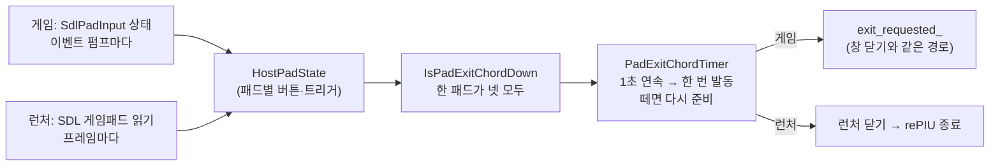

# 설계: 게임패드 종료 조합 LT+RT+L3+R3 1초 (issue #52)

관련: issue #34(게임패드 입력, `HostPadState`), issue #48(스팀덱 설치)

## 목표와 결정

키보드도 창 닫기 버튼도 없는 스팀덱에서 게임과 런처를 끝낼 방법을 둔다. 사용자 결정(2026-10-10):

| 질문 | 결정 |
|---|---|
| 발동 | 한 패드에서 LT+RT+L3+R3을 **1초** 동안 함께 누르고 있으면 |
| 런처 | 런처에서도 같은 조합으로 런처를 닫아 rePIU를 끝냄 |
| CLEAR 충돌 | R3은 기본으로 `CLEAR`(`F3, Pad1_RightStick`)에 묶여 있어 조합 중 게임에 CLEAR가 들어간다. 그대로 둔다 |

## 구조

* **입력 계층(플랫폼 공용, `repiu/input/pad_exit_chord`)**: `IsPadExitChordDown(state)`는 어느 한 패드가
  두 트리거(절반 이상, #34의 기준)와 두 스틱 클릭을 모두 누르고 있으면 참이다. 패드 둘에 나눠 누른 것은
  세지 않는다. `PadExitChordTimer::Update(down, now_ms)`는 연속 1초가 되는 순간 한 번 참을 돌려주고,
  조합을 뗄 때까지 다시 발동하지 않는다. 트리거 기준값 16384를 이 계층의 상수
  `kHostPadTriggerThreshold`로 옮겨 게임과 런처가 같은 값을 쓴다.
* **게임(엔진)**: 이벤트 펌프가 끝날 때마다 `SdlPadInput`의 상태로 타이머를 갱신한다. 누르고 있는 동안은
  이벤트가 없으므로 이벤트가 아니라 펌프마다 본다. 발동하면 `[repiu-pad] exit chord held for 1 s` 로그를
  남기고 창 닫기와 같은 `exit_requested_`를 세운다. 포커스를 잃으면 #34대로 패드 상태가 비므로 타이머도
  풀린다.
* **런처**: ImGui가 이미 게임패드를 열지만 그 상태는 ImGui 안에 있다. 런처는 프레임마다
  `SDL_GetGamepads`로 연결된 패드를 (처음 보면 열어 두고) 읽어 같은 `HostPadState`를 채우고 타이머를
  갱신한다. 발동하면 Quit과 같이 창을 닫는다.

## 바꾸지 않는 것

* 기본 입력 배치와 CLEAR 바인딩, 키보드 입력, 창 닫기·Alt+F4 경로.
* 조합 중 각 버튼은 평소처럼 게임 입력으로도 흐른다(R3 → CLEAR).

## 검증

* `host_pad_input` probe에 조합 판정(한 패드 넷 모두 / 둘에 나눔 / 하나 빠짐)과 타이머(1초 전·후, 한 번만,
  떼면 다시 준비)를 더한다.
* 실제 패드: 게임 중 1초 유지 → 런처로 복귀, 1초 전에 떼면 계속, 런처에서 1초 유지 → 종료.

---

# Design: the gamepad exit chord, LT+RT+L3+R3 for one second (issue #52)

Related: issue #34 (gamepad input, `HostPadState`), issue #48 (Steam Deck install).

**Goal and decisions.** A Steam Deck has no keyboard or close button to end the game or the launcher. The
user decided (2026-10-10): holding LT+RT+L3+R3 together on one pad for **one second** quits; the same chord
closes the launcher, ending rePIU; R3 is bound to `CLEAR` by default (`F3, Pad1_RightStick`), so the game sees
CLEAR during the chord, which is left as is.

**Structure** (diagram above). In the platform-neutral input layer (`repiu/input/pad_exit_chord`),
`IsPadExitChordDown(state)` is true when any one pad holds both triggers (past half, #34's rule) and both stick
clicks; the four split across two pads do not count. `PadExitChordTimer::Update(down, now_ms)` returns true once,
at the moment the hold reaches one second, and not again until the chord is released. The trigger threshold
16384 moves into this layer as `kHostPadTriggerThreshold`, so the game and the launcher share it. The game
updates the timer from `SdlPadInput`'s state at the end of every event pump — a held chord produces no events,
so it is checked per pump, not per event — and when it fires logs `[repiu-pad] exit chord held for 1 s` and sets
the same `exit_requested_` closing the window does; losing focus empties the pad state as #34 does, which
releases the timer. ImGui opens the launcher's gamepads but keeps their state to itself, so the launcher reads
the connected pads each frame through `SDL_GetGamepads` (opening one the first time it is seen), fills the same
`HostPadState`, updates the timer, and closes like Quit when it fires.

**Unchanged.** The default layout and the CLEAR binding, keyboard input, and the window-close/Alt+F4 path; during
the chord each button still reaches the game as usual (R3 → CLEAR).

**Verification.** The `host_pad_input` probe gains the chord test (four on one pad, split across two, one
missing) and the timer test (before and after one second, once only, re-armed after release). A real pad: hold
one second in a game → back to the launcher, release earlier → play goes on, hold one second in the launcher →
it quits.
