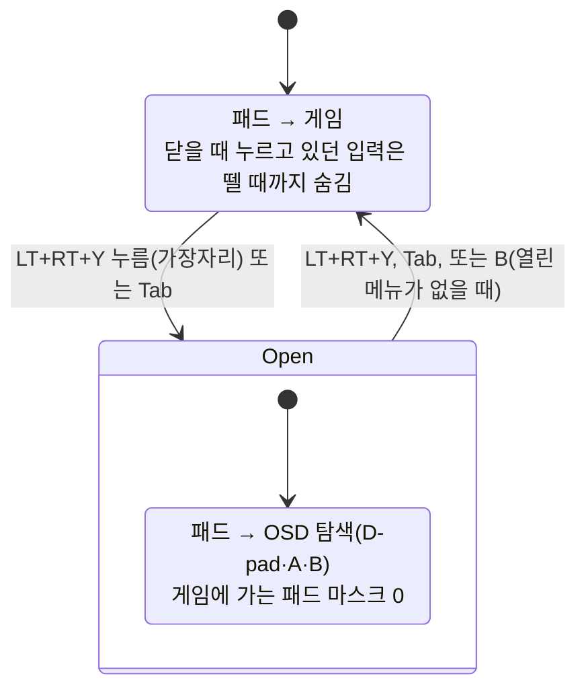

# 설계: 게임패드로 OSD 열기와 조작 (issue #55)

관련: Task 761(OSD), issue #34(게임패드 입력), issue #52(종료 조합), issue #45(OSD 표시 옵션)

## 목표와 결정

키보드 없는 스팀덱에서 OSD를 열고 조작한다. 사용자 결정(2026-10-10): **LT+RT+Y**로 열고 닫으며, 열려
있는 동안 **패드로 OSD를 조작**하고 패드 입력은 게임에 보내지 않는다.

## 동작

* **조합 판정(입력 계층, `repiu/input/pad_osd_chord`)**: `IsPadOsdChordDown(state)`는 한 패드가 두 트리거와
  Y를 함께 누르고 있으면 참이다. `PadChordEdge::Update(down)`은 눌리는 순간 한 번 참이다. 유지 시간은 없다.
  종료 조합(LT+RT+L3+R3)과 버튼이 겹치지 않는다.
* **게임 입력 관문(입력 계층, `PadGameGate`)**: 바인딩이 계산한 패드 마스크를 게임에 보내기 전에 거른다.
  막혀 있는 동안은 0이고, 막힘이 풀릴 때 눌려 있던 비트는 그 버튼을 뗄 때까지 숨긴다. 순수 코드라 probe로
  확인한다.
* **엔진**: `SdlPadInput`이 관문을 거친 마스크를 게시하고 `SetGameInputSuppressed(bool)`의 변화를
  돌려준다. 백엔드는 이벤트 펌프 끝마다 (1) OSD 조합의 가장자리면 OSD를 토글하고 (2) 막힘을 OSD가 열려
  있는지에 맞춘다. 막힘이 바뀌어 생긴 마스크 변화는 이벤트로 생긴 변화와 같은 경로(키보드가 같은 입력을
  누르고 있으면 release를 미룸)로 타임라인 edge가 된다. Tab으로 연 OSD도 같은 규칙을 따른다.
* **OSD**: ImGui에 `NavEnableGamepad`를 켠다. ImGui SDL3 백엔드는 프레임마다 게임패드를 직접 읽으므로
  OSD가 그려지는 동안만 탐색이 동작한다. 열릴 때 OSD 창에 포커스를 준다. 직전 프레임에 열린 메뉴(콤보)가
  없을 때 B를 누르면 닫는다(메뉴가 열려 있으면 B는 메뉴만 닫는다). 안내 줄에 패드 조작을 적는다.
* 키보드 입력은 바뀌지 않는다: OSD가 열려 있어도 게임으로 흐른다(Task 761). ImGui의 키보드 탐색은 켜지
  않는다.

## 바꾸지 않는 것

* 기본 입력 배치(LT·RT·Y는 기본으로 비어 있음), 종료 조합, 런처.
* Tab 동작과 OSD 항목, 키보드가 게임으로 흐르는 규칙.

## 검증

* `host_pad_input` probe: OSD 조합 판정(한 패드 / 나눔 / 빠짐), 가장자리(한 번만, 떼고 다시), 관문(막힘 중
  0, 풀릴 때 눌린 비트 숨김, 뗀 뒤 다시 누르면 보임).
* 실제 패드: 게임 중 LT+RT+Y로 열기, D-pad·A로 항목 바꾸기, 그동안 게임에 패드 입력 없음(로그), B로 닫기와
  닫은 B가 게임에 가지 않음, 다시 LT+RT+Y로 닫기.

---

# Design: opening and driving the OSD with a gamepad (issue #55)

Related: Task 761 (the OSD), issue #34 (gamepad input), issue #52 (the exit chord), issue #45 (the OSD's
display options).

**Goal and decisions.** Open and drive the OSD on a Steam Deck with no keyboard. The user decided
(2026-10-10): **LT+RT+Y** opens and closes it, and while it is open **the pad drives the OSD** and pad input does
not reach the game.

**Behaviour** (state diagram above). In the input layer, `repiu/input/pad_osd_chord`'s
`IsPadOsdChordDown(state)` is true when one pad holds both triggers and Y; `PadChordEdge::Update(down)` is true
once, as it goes down; there is no hold time, and no button is shared with the exit chord (LT+RT+L3+R3).
`PadGameGate`, also in the input layer, filters the pad mask the bindings compute before the game sees it: zero
while suppressed, and when suppression lifts, the bits held at that moment stay hidden until their buttons are
released; it is pure code the probe checks. In the engine, `SdlPadInput` publishes the gated mask and returns
the change from `SetGameInputSuppressed(bool)`; at the end of every event pump the backend (1) toggles the OSD on
the chord's edge and (2) keeps suppression equal to whether the OSD is open, turning the resulting mask change
into timeline edges by the same path as an event's (a release held back while the keyboard holds the same
input). An OSD opened by Tab follows the same rule. The OSD turns on ImGui's `NavEnableGamepad`; ImGui's SDL3
backend reads gamepads itself each frame, so navigation works only while the OSD draws; the OSD window takes
focus when it opens; B closes it when no menu (combo) was open on the previous frame, and otherwise only closes
the menu; the hint line names the pad controls. Keyboard input is unchanged — it reaches the game while the OSD
is open (Task 761) — and ImGui's keyboard navigation stays off.

**Unchanged.** The default layout (LT, RT and Y are unbound by default), the exit chord, the launcher, Tab, the
OSD's items, and keyboard input reaching the game.

**Verification.** The `host_pad_input` probe: the OSD chord (one pad, split, missing), the edge (once, again after
release), and the gate (zero while suppressed, held bits hidden on release, shown again after a new press). A
real pad: open with LT+RT+Y in a game, change items with the D-pad and A, no pad input reaching the game meanwhile
(log), close with B without that B reaching the game, and close with LT+RT+Y again.
