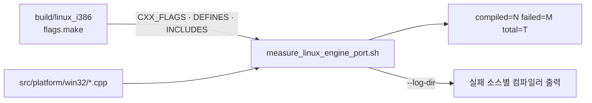
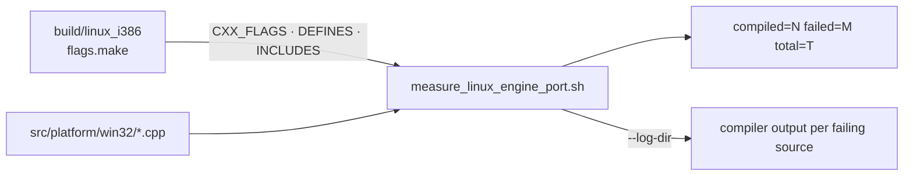

# Linux 이식 진척 측정 / Measuring the Linux port

설계: [20260822-503](../design/20260822-503-linux-execution-engine.md) ·
작업 로그: [20260822-503](../work-logs/20260822-503-linux-execution-engine.md) ·
구조 요약: [ARCHITECTURE.md](../../ARCHITECTURE.md)

이 문서는 **반복 수행하는 절차**만 담습니다. 특정 실행의 증거는 작업 로그에 있습니다.

## 1. 이 측정이 무엇인가

`src/platform/win32`의 모든 소스를 Linux i386 툴체인으로 **문법 검사만** 돌려 성공 개수를
셉니다. Task 503d의 모든 하위 단계가 이 숫자를 기록하고, 숫자를 움직이지 못한 단계는 그
이유를 적습니다.

링크는 하지 않습니다. 링크는 다른 질문 — **어떤 심볼이 존재하는가** — 이고, 이 소스들은
아직 `if(WIN32)` 목록에 있어 대부분 링크할 오브젝트가 없습니다.



## 2. 절차

빌드 트리가 없으면 먼저 만듭니다. 측정이 쓰는 플래그를 스크립트가 아니라 **구성된 트리에서**
읽기 때문입니다 — include 경로 목록을 스크립트에 베껴 두면 `CMakeLists.txt`가 바뀌는 순간
낡습니다.

```bash
scripts/build_linux_i386.sh --headless --target repiu_core_probe
scripts/measure_linux_engine_port.sh
```

마지막 줄이 결과입니다.

```
compiled=80 failed=0 total=80
```

실패가 있으면 소스마다 한 줄씩 먼저 나옵니다.

```
FAIL src/platform/win32/telemetry/live_telemetry_snapshot.cpp (1 errors)
```

## 3. 옵션

| 옵션 | 용도 |
|---|---|
| `--errors` | 실패한 소스마다 첫 오류 다섯 줄을 함께 출력 |
| `--log-dir DIR` | 실패한 소스의 컴파일러 출력을 파일로 보존 |
| `--build-dir DIR` | 플래그를 읽을 빌드 트리 (기본 `build/linux_i386`) |
| `--source-dir DIR` | 측정 대상 (기본 `src/platform/win32`) |

## 4. 오류 개수 하나를 믿지 마십시오

출력의 괄호 안 숫자는 `error:` 줄의 개수입니다. **fatal error는 다르게 읽어야 합니다.**
헤더 하나가 없으면 컴파일러가 거기서 멈추므로, 그 뒤에 무엇이 있는지는 아무 말도 하지
않습니다.

이 함정이 Task 503에서 두 번 나왔습니다.

* **3d-15**: 트램폴린의 실패가 84개로 보고돼 있었지만, 파일의 2,000줄이 `#if defined(_WIN32)`
  하나에 묶여 아예 평가되지 않고 있었습니다. 그 울타리를 연 사본으로 재니 97이었고, 숨어
  있던 것은 열세 개뿐이었습니다.
* **3d-16**: `live_telemetry_snapshot.cpp`(2,291줄)는 `<psapi.h>` 한 줄에서 멈췄습니다. 그 줄만
  울타리에 넣은 사본으로 재니 오류 17개가 네 곳에 몰려 있었습니다.

**파일 크기도 오류 개수도 남은 작업량의 지표가 아닙니다.** 벽 뒤를 재는 방법은 하나입니다 —
막고 있는 것을 임시로 치운 **사본**을 만들어 다시 재는 것입니다. 저장소는 건드리지
마십시오.

## 5. 언제 돌리는가

* 하위 단계를 시작하기 전 — 기준선을 잡고 작업 로그의 마지막 숫자와 대조합니다.
* 하위 단계를 끝낸 뒤 — 작업 로그의 검증 표에 넣습니다.
* 분모가 바뀌면 그 이유를 적습니다. 소스를 더한 단계는 분모를 올립니다(3d-16이 79에서 80).

---

# Measuring the Linux port

Design: [20260822-503](../design/20260822-503-linux-execution-engine.md) ·
Work log: [20260822-503](../work-logs/20260822-503-linux-execution-engine.md) ·
Structure: [ARCHITECTURE.md](../../ARCHITECTURE.md)

This document holds only the **repeatable procedure**. Evidence from any particular run is in the
work log.

## 1. What is measured

Every source under `src/platform/win32` is compiled by the Linux i386 toolchain — **syntax only** —
and the script reports how many succeed. Every sub-stage of Task 503d records this number, and a
sub-stage that does not move it has to say why.

Nothing is linked. Linking asks a different question — **which symbols exist** — and these sources
are still in the `if(WIN32)` list, so most of them have no object to link against.



## 2. Procedure

Create the build tree first if there is none, because the measurement reads its flags **from the
configured tree** rather than from the script — a list of include directories copied into a script
goes stale the first time `CMakeLists.txt` changes.

```bash
scripts/build_linux_i386.sh --headless --target repiu_core_probe
scripts/measure_linux_engine_port.sh
```

The last line is the result.

```
compiled=80 failed=0 total=80
```

Failures print one line each before it.

```
FAIL src/platform/win32/telemetry/live_telemetry_snapshot.cpp (1 errors)
```

## 3. Options

| Option | Use |
|---|---|
| `--errors` | print the first five errors of each failing source |
| `--log-dir DIR` | keep the compiler output of each failure |
| `--build-dir DIR` | build tree to read flags from (default `build/linux_i386`) |
| `--source-dir DIR` | what to measure (default `src/platform/win32`) |

## 4. Do not trust a single error count

The number in parentheses counts `error:` lines. **A fatal error reads differently**: a missing
header stops the compiler there, so it says nothing at all about what stands behind it.

Task 503 walked into this twice.

* **3d-15**: the trampoline's failures were reported as 84, but 2,000 lines of the file sat inside
  one `#if defined(_WIN32)` that was never evaluated. Measured on a copy with that fence opened it
  was 97, and only thirteen had been hidden.
* **3d-16**: `live_telemetry_snapshot.cpp`, at 2,291 lines, stopped at the single line
  `#include <psapi.h>`. A copy with that one line fenced reported seventeen errors gathered in four
  places.

**Neither file size nor error count measures the work remaining.** There is one way to see behind a
wall: measure a **copy** with the obstruction temporarily removed. Do not edit the repository to
find out.

## 5. When to run it

* Before starting a sub-stage, to take a baseline and check it against the last number in the work
  log.
* After finishing one, for the work log's verification table.
* When the denominator changes, say why. A sub-stage that adds a source raises it — 3d-16 took it
  from 79 to 80.
