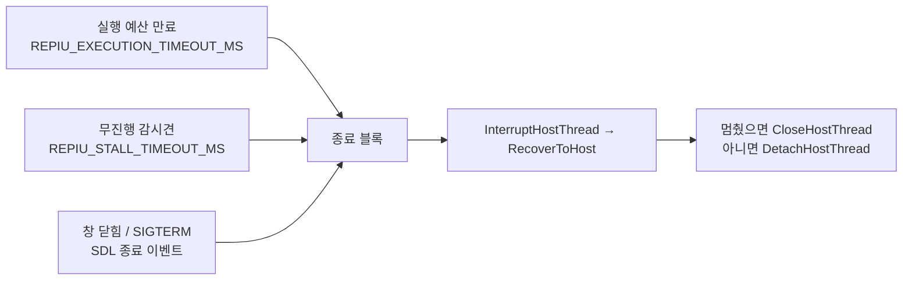

# Linux 종료 확인 절차 / Checking that a Linux run stops

설계: [20260827-507](../design/20260827-507-linux-shutdown-recovery.md) ·
[20260828-508](../design/20260828-508-refused-recovery-teardown.md) ·
작업 로그: [20260827-507](../work-logs/20260827-507-linux-shutdown-recovery.md) ·
[20260828-508](../work-logs/20260828-508-refused-recovery-teardown.md) ·
frontier: [linux-port-frontier](../analysis/linux-port-frontier.md)

이 문서는 **반복 수행하는 절차**만 담습니다. 특정 실행의 측정값은 작업 로그에 있습니다.

## 1. 무엇을 확인하는가

종료를 요청받은 실행이 **스스로 끝나는지**를 봅니다. 요청은 세 가지 경로로 들어오고, 셋 다
같은 블록에서 처리되므로 각각을 따로 확인해야 합니다.



**SIGTERM은 프로세스를 직접 죽이지 않습니다.** SDL이 SIGINT·SIGTERM을 자기 핸들러로 받아
종료 이벤트로 바꾸므로, TERM은 위 그림의 세 번째 입구로 들어옵니다. 즉 TERM 시험은 시그널
시험이 아니라 **종료 경로 시험**입니다.

## 2. 절차

저장소 루트에서 실행합니다. 로더가 `roms`와 `build/runtime_mounts`를 상대 경로로 찾습니다.

### 2.1 예산 만료

```bash
REPIU_STALL_TIMEOUT_MS=0 REPIU_EXECUTION_TIMEOUT_MS=20000 \
    ./build/linux_i386/repiu pumpit1 &
pid=$!
time wait "$pid"; echo "exit=$?"
kill -0 "$pid" 2>/dev/null && echo "STILL ALIVE" || echo "gone"
```

### 2.2 SIGTERM

```bash
REPIU_STALL_TIMEOUT_MS=0 ./build/linux_i386/repiu pumpit1 &
pid=$!
sleep 30
kill -TERM "$pid"
time wait "$pid"; echo "exit=$?"
kill -0 "$pid" 2>/dev/null && echo "STILL ALIVE" || echo "gone"
```

### 2.3 감시견

`REPIU_STALL_TIMEOUT_MS`를 켜고 무진행 상태를 만들어야 하므로, 위 둘을 통과했다면 이것은
같은 블록의 세 번째 입구일 뿐입니다. 별도로 확인할 때는 `REPIU_EXECUTION_TIMEOUT_MS` 없이
짧은 정지 시한만 주고 같은 방식으로 봅니다.

### 2.4 회수가 거절되는 실행을 만들려면

위 세 절차는 종료가 **접수되는지**를 봅니다. 종료 블록에는 갈래가 하나 더 있고, 그것은
**게스트 스레드를 회수하지 못한 채 내려가는 갈래**입니다. 이 갈래만 다른 코드를 지나므로
따로 만들어 봐야 하고, Task 508이 고친 것이 바로 여기입니다.

**예산이 짧으면 이 갈래에 닿지 않습니다.** 20초 예산에서는 게스트가 자산 디코드 중이고 EIP가
게스트 이미지나 AOT 캐시 안이라 회수가 거의 항상 성공합니다. 렌더 루프에 들어간 뒤라야
게스트가 프레임의 상당 부분을 호스트 코드 안에서 보내고, 그때 40회 시도가 전부 거절됩니다.

| 예산 | 측정한 회수 거절 비율 |
|---|---:|
| 20초 | 0 / 5 |
| 60초 | **6 / 6** |

```bash
bash scripts/task508_refused_recovery_repro.sh 3 60000 task508
```

마지막 줄의 요약(`runs= refused= sigtrap=`)이 몇 번 이 갈래에 닿았는지 셉니다. `refused=0`이면
**아직 이 갈래를 시험한 것이 아닙니다** — 예산을 늘리거나 반복하십시오.

## 3. 판정

| 봐야 할 것 | 이유 |
|---|---|
| **`wait`가 돌아오는가** | 이것이 완료 조건입니다 |
| **`kill -0`이 실패하는가** | 프로세스가 실제로 사라졌는지 |
| 로그의 마지막 메시지 | 회수했는지, 거절됐는지, 답이 없었는지 |

**종료 코드 하나로 판정하지 마십시오.** 회수에 성공한 실행과 게스트 스레드를 두고 내려간
실행은 둘 다 끝나지만 서로 다른 일이 일어난 것이고, 그 차이는 메시지에만 있습니다.

| 메시지 | 뜻 |
|---|---|
| `hijacked guest thread for clean teardown` | 게스트 스레드가 회수 진입점으로 빠져나왔습니다 |
| `guest thread was not in recoverable code` | 인터럽트는 됐지만 게스트가 회수 가능한 코드 밖이었습니다 |
| `guest thread not stopped (…)` | 인터럽트가 거절·미전달·무응답 — 괄호 안이 어느 쪽인지 말합니다 |

뒤의 둘은 **실패가 아니라 다른 결과**입니다. 로더는 기다리지 않고 내려가고, 게스트 스레드는
프로세스가 끝날 때 함께 사라집니다.

## 4. 걸리기 쉬운 것

* **감시견을 끄지 않으면 무엇을 시험한 것인지 말할 수 없습니다.** `REPIU_STALL_TIMEOUT_MS=0`
  없이 예산 만료를 시험하면 감시견이 먼저 끝냈을 수 있습니다.
* **인자 없이 실행하면 런처가 뜹니다.** 런처 경로는 선택을 자식 프로세스로 넘기므로 PID가
  둘이 되고, 어느 쪽에 TERM을 보냈는지가 결과를 바꿉니다. 롬셋 ID를 인자로 주십시오.
* **`--headless`로 구성한 트리로는 이 확인을 할 수 없습니다.** 창이 없으면 SDL 종료 이벤트
  경로도 없습니다.
* **`exit=133`이 보이면 회귀입니다.** Task 508 이전에는 회수를 거절당한 실행이 여섯 번 중 두
  번 SIGTRAP의 커널 기본 처분으로 끝났습니다. 508 이후 이 갈래는 코어 덤프 없이 예산 만료
  코드로 끝나야 하므로, 다시 133이 나오면 종료 블록이 게스트 스레드가 아직 필요로 하는 폴트
  핸들러를 떼고 있는 것입니다.

---

# Checking that a Linux run stops

Design: [20260827-507](../design/20260827-507-linux-shutdown-recovery.md) ·
[20260828-508](../design/20260828-508-refused-recovery-teardown.md) ·
Work log: [20260827-507](../work-logs/20260827-507-linux-shutdown-recovery.md) ·
[20260828-508](../work-logs/20260828-508-refused-recovery-teardown.md) ·
Frontier: [linux-port-frontier](../analysis/linux-port-frontier.md)

This document holds only the **repeatable procedure**; the measurements from a particular run are in
the work log.

## 1. What is being checked

Whether a run asked to stop **stops by itself**. The request arrives by three routes, all handled in
the same block, so each is checked separately.

**SIGTERM does not kill the process directly.** SDL takes SIGINT and SIGTERM with handlers of its own
and turns them into a quit event, so TERM arrives through the third entrance above. The TERM test is
therefore a test of the shutdown path rather than of signal handling.

## 2. Procedure

Run from the repository root; the loader resolves `roms` and `build/runtime_mounts` relatively.

### 2.1 Budget expiry

```bash
REPIU_STALL_TIMEOUT_MS=0 REPIU_EXECUTION_TIMEOUT_MS=20000 \
    ./build/linux_i386/repiu pumpit1 &
pid=$!
time wait "$pid"; echo "exit=$?"
kill -0 "$pid" 2>/dev/null && echo "STILL ALIVE" || echo "gone"
```

### 2.2 SIGTERM

```bash
REPIU_STALL_TIMEOUT_MS=0 ./build/linux_i386/repiu pumpit1 &
pid=$!
sleep 30
kill -TERM "$pid"
time wait "$pid"; echo "exit=$?"
kill -0 "$pid" 2>/dev/null && echo "STILL ALIVE" || echo "gone"
```

### 2.3 The watchdog

This is the same block's third entrance, so once the two above pass it adds little. To check it on
its own, give a short stall timeout with no execution budget and read it the same way.

### 2.4 Producing a run whose recovery is refused

The three procedures above check whether a stop request is **accepted**. The shutdown block has one
more arm: **going down without having recovered the guest thread.** Only that arm runs different
code, so it has to be produced deliberately -- and it is what Task 508 changed.

**A short budget never reaches it.** With a 20-second budget the guest is still decoding assets, its
EIP is inside the guest image or the AOT cache, and recovery nearly always succeeds. Only after the
render loop is entered does the guest spend much of a frame inside host code, and then all forty
attempts are refused.

| Budget | Measured refusal rate |
|---|---:|
| 20 s | 0 / 5 |
| 60 s | **6 / 6** |

```bash
bash scripts/task508_refused_recovery_repro.sh 3 60000 task508
```

The summary line (`runs= refused= sigtrap=`) counts how often the arm was reached. `refused=0` means
**this arm has not been tested yet** -- raise the budget or repeat.

## 3. Reading the result

| What to look at | Why |
|---|---|
| **Does `wait` return** | this is the completion criterion |
| **Does `kill -0` fail** | whether the process is actually gone |
| The last message in the log | recovered, refused, or unanswered |

**Do not judge from an exit code alone.** A run that recovered its guest thread and a run that went
down leaving it behind both end, but different things happened, and the difference is only in the
message.

| Message | Meaning |
|---|---|
| `hijacked guest thread for clean teardown` | the guest thread left through the recovery entry |
| `guest thread was not in recoverable code` | the interrupt worked, but the guest was outside recoverable code |
| `guest thread not stopped (…)` | refused, not delivered, or no answer — the parenthesis says which |

The last two are **different outcomes rather than failures**: the loader goes down without waiting,
and the guest thread ends with the process.

## 4. What trips this up

* **Without disabling the watchdog there is no saying what was tested.** A budget-expiry test run
  without `REPIU_STALL_TIMEOUT_MS=0` may have been ended by the watchdog first.
* **With no argument the launcher opens.** That path hands the selection to a child process, so there
  are two PIDs and which one received TERM changes the result. Pass the ROM set id.
* **A tree configured with `--headless` cannot run this check** — with no window there is no SDL quit
  event either.
* **`exit=133` is a regression.** Before Task 508, two of six runs whose recovery was refused ended
  in SIGTRAP's default kernel disposition. Since 508 this arm ends with the budget-expiry code and no
  core dump, so a 133 appearing again means the shutdown block is once more removing a fault handler
  the guest thread still needs.
