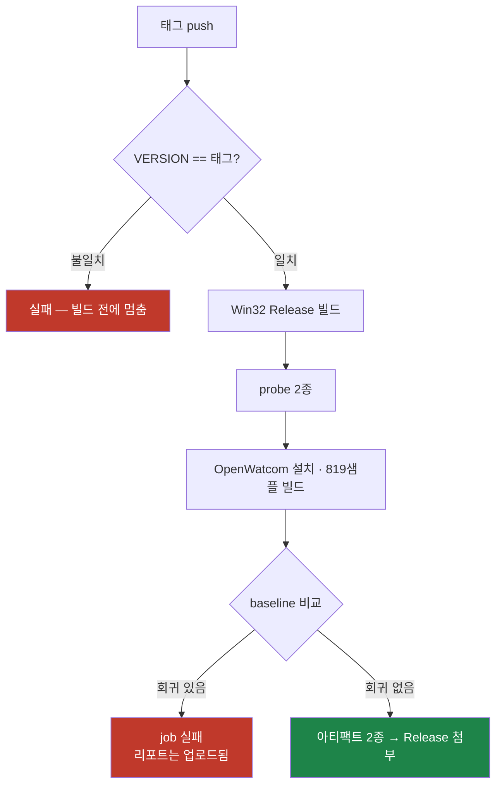

# 릴리스 절차와 CI / Release procedure and CI

설계: [20260806-434](../design/20260806-434-github-actions-release-ci.md) ·
구조 요약: [ARCHITECTURE.md](../../ARCHITECTURE.md)

이 문서는 **반복 수행하는 절차**만 담습니다. 특정 실행의 증거는 작업 로그에 있습니다.

## 1. 릴리스 절차

AGENTS.md의 머지·태그 규칙을 따른 뒤, 태그를 원격에 올리면 CI가 나머지를 합니다.

```powershell
# 1) 머지와 태그는 로컬에서 (AGENTS.md Git 규칙)
git tag -a v0.0.136 -m "..."

# 2) 태그 push가 release.yml을 깨웁니다
git push origin main
git push origin v0.0.136
```

워크플로가 하는 일은 순서대로 다음과 같습니다.



**아티팩트 두 개**가 Release에 붙습니다.

| 파일 | 내용 |
|---|---|
| `rePIU-v<version>-win32.zip` | 실행 파일 6종(SDL3 정적 링크, DLL 불필요), `VERSION`, `README.md`, `THIRD_PARTY_NOTICES.md` |
| `openwatcom-samples-v<version>.zip` | `index.html`, `summary.json`, `regressions.json` |

## 2. 로컬에서 같은 패키지 만들기

워크플로는 아래 스크립트를 그대로 부릅니다. 로컬에서 동일한 산출물을 만들 수 있습니다.

```powershell
scripts\build_win32_x86.ps1 -Configuration Release
scripts\build_openwatcom_samples.ps1 -Configuration Release -SkipHostBuild
scripts\test_openwatcom_samples.ps1 -Configuration Release -CompareBaseline
scripts\package_release.ps1 -Configuration Release
```

샘플 스위트를 돌리지 않고 바이너리만 묶으려면 `-AllowMissingSampleReport`를 주십시오.
그 경우 리포트 zip은 만들어지지 않습니다.

## 3. CI가 검증하지 **않는** 것

측정 결과를 읽을 때 이 경계를 먼저 확인하십시오.

| 항목 | CI | 이유 |
|---|---|---|
| 빌드(Release) | ✅ | — |
| `repiu_glide_issue_probe` | ✅ | 인자 불필요 |
| `repiu_aot_probe --timer-safe-point` | ✅ | 이미지 불필요 |
| OpenWatcom 819샘플 | ✅ | 샘플이 OpenWatcom 배포판에 포함됨 |
| **`repiu_aot_probe <PIU.EXE>` 전체 단정** | ❌ | `argv[1]`에 DOS4GW 이미지 필요. CI가 만들 수 있는 이미지로는 캐시 방출이 실패 |
| **pumpit1·pumpit3 실행** | ❌ | `roms/`·`MASTER/`가 저작물이라 CI에 없음 |
| **프레임·성능 수치** | ❌ | 공유 러너의 타이밍은 인용 불가 |

즉 **CI 통과가 게임이 도는 것을 뜻하지 않습니다.** 실행 검증은 여전히 로컬 수작업입니다.

## 3.1 샘플별 시간 상한

각 샘플은 **기본 10초** 안에 끝나야 하며, 넘기면 하네스가 프로세스를 kill하고 **실패로
집계**합니다. 리포트에는 `fail (harness timeout)`으로 표시됩니다.

```powershell
scripts\test_openwatcom_samples.ps1 -Configuration Release -SampleTimeoutSeconds 10
```

**로더의 timeout과 다릅니다.** 로더의 1,000 ms는 *게스트 실행* 예산이고, 이쪽은
*프로세스가 돌아오지 않는 것*에 대한 상한입니다. 표준 입력을 읽는 샘플
(`cplbexam\iostream\istream\get.cpp` 등)은 예전에 무한 대기했고, 실제로 한 실행이
**39.4분 동안 CPU 1.0초**로 멈춰 있었습니다. 지금은 stdin을 빈 파일로 redirect하고
시간 상한을 걸어 두 겹으로 막습니다.

상한을 바꾸면 **판정이 바뀝니다.** 경계에 걸친 샘플의 결과가 달라지므로, 값을 바꿔
기록한 baseline은 다른 값으로 돌린 실행과 비교하지 마십시오.

## 4. baseline 재기록 — 언제, 어떻게

`-CompareBaseline`은 회귀가 있으면 job을 실패시킵니다. 실패했을 때 **먼저 두 경고를
확인하십시오.**

```text
WARNING: Baseline pass criterion differs from the current one. baseline=... current=...
WARNING: Baseline build configuration differs from this run. baseline=... current=Release
```

둘 중 하나라도 떴다면 **그 회귀는 코드 회귀가 아니라 측정 정정일 수 있습니다.** 통과
판정은 timeout을 실패로 세는데(Task 429), Debug는 plan build에서 Release 대비 11.34배
느립니다(Task 330). 구성이 다르면 timeout 경계의 샘플이 다르게 판정됩니다.

**현재 상태(2026-08-06):** `tests/baselines/openwatcom_samples.json`은 **Debug**에서
**옛 판정 기준**으로 기록된 값(`RunPassed` 535)입니다. 따라서 첫 CI 실행은 두 경고를
모두 내고 회귀를 보고할 가능성이 높습니다. 이것은 의도된 상태이며, 그 리포트로
위양성을 확인한 뒤 재기록하는 순서입니다.

재기록은 **사람이 판단하고 로컬에서** 합니다. CI는 절대 baseline을 갱신하지 않습니다.

```powershell
# 아티팩트의 regressions.json으로 목록을 확인한 뒤
scripts\test_openwatcom_samples.ps1 -Configuration Release -UpdateBaseline
```

갱신 후 baseline에 `RunCriterion`과 `Configuration`이 최상위에 기록됐는지 확인하고
커밋하십시오. 다음 실행에서 두 경고가 사라지면 기준선이 제자리에 놓인 것입니다.

**커밋 대상은 JSON 두 개뿐입니다** — `tests/baselines/openwatcom_samples.json`과
`tests/history/openwatcom_samples/<timestamp>-<version>.json`. HTML은 더 이상 history에
쓰지 않습니다(설계 §6.1). 사람이 읽을 리포트는 이번 실행의
`build/openwatcom_sample_report/index.html`과 릴리스 워크플로가 올린
`openwatcom-samples-v<version>.zip`에 있습니다.

## 5. 러너 이미지

`windows-2022`로 고정돼 있습니다. `build_win32_x86.ps1`이 설치된 Visual Studio major
버전으로 생성기를 고르므로 이미지가 바뀌면 릴리스 산출물의 툴체인이 조용히 바뀝니다.
이미지를 올릴 때는 **의도적으로** 두 워크플로를 함께 고치고, 그 실행의 시간과 결과를
작업 로그에 남기십시오.

---

# Release procedure and CI

Design: [20260806-434](../design/20260806-434-github-actions-release-ci.md) ·
Structure: [ARCHITECTURE.md](../../ARCHITECTURE.md)

This guide holds **repeatable procedure only**; evidence from any particular run lives in the
work logs.

## 1. Releasing

Follow AGENTS.md's merge and tag rules, then push the tag; `release.yml` does the rest. It
gates the tag against `VERSION`, builds Win32 Release, runs the two probes, installs OpenWatcom
and builds the 819 samples, compares against the baseline, and attaches two archives:
`rePIU-v<version>-win32.zip` with six statically linked executables and the notices, and
`openwatcom-samples-v<version>.zip` with the report.

```powershell
git tag -a v0.0.136 -m "..."
git push origin main
git push origin v0.0.136
```

## 2. Reproducing the package locally

The workflow calls exactly these:

```powershell
scripts\build_win32_x86.ps1 -Configuration Release
scripts\build_openwatcom_samples.ps1 -Configuration Release -SkipHostBuild
scripts\test_openwatcom_samples.ps1 -Configuration Release -CompareBaseline
scripts\package_release.ps1 -Configuration Release
```

Pass `-AllowMissingSampleReport` to package binaries without having run the suite; the report
archive is then not produced.

## 3. What CI does **not** verify

CI covers the Release build, `repiu_glide_issue_probe`, `repiu_aot_probe --timer-safe-point`,
and the 819 OpenWatcom samples — the last of which is possible because the samples ship inside
the OpenWatcom distribution. It cannot cover `repiu_aot_probe`'s full assertion set, which
needs a DOS4GW image as `argv[1]` and fails cache emission on every image CI can build; nor
pumpit1 and pumpit3 execution, since `roms/` and `MASTER/` are copyrighted and absent; nor any
frame or performance figure, since shared-runner timings are not quotable. **A green CI run
does not mean the game runs** — execution verification remains a local, manual step.

## 3.1 The per-sample time bound

Every sample must finish within **10 seconds by default**; past that the harness kills the
process and **scores it as a failure**, shown as `fail (harness timeout)` in the report.

```powershell
scripts\test_openwatcom_samples.ps1 -Configuration Release -SampleTimeoutSeconds 10
```

**This is not the loader's timeout.** The loader's 1,000 ms is a *guest execution* budget;
this one bounds *a process that never returns*. Samples that read standard input — such as
`cplbexam\iostream\istream\get.cpp` — used to wait forever, and one run was measured stuck for
**39.4 minutes on 1.0 second of CPU**. Standard input is now redirected from an empty file and
the time bound backs it up.

Changing the bound **changes verdicts** for samples near it, so never compare a baseline
recorded at one value against a run at another.

## 4. Re-recording the baseline

`-CompareBaseline` fails the job on regressions. **Check the two warnings first**: one for a
differing pass criterion, one for a differing build configuration. Either means the reported
regressions may be measurement corrections rather than code regressions, because the criterion
counts a timeout as a failure (Task 429) and Debug is 11.34x slower than Release at plan
building (Task 330), so samples near the timeout boundary are judged differently.

**As of 2026-08-06** the baseline was recorded on **Debug** under the **old criterion**
(`RunPassed` 535), so the first CI run is expected to raise both warnings and report
regressions. That is the intended state: its report is what the re-recording decision is made
from.

Re-recording is **a human judgement made locally** — CI never updates the baseline.

```powershell
scripts\test_openwatcom_samples.ps1 -Configuration Release -UpdateBaseline
```

Afterwards confirm that `RunCriterion` and `Configuration` appear at the top level of the
baseline and commit it. When the next run raises neither warning, the bar is back in place.

**Only two JSON files are committed** — `tests/baselines/openwatcom_samples.json` and
`tests/history/openwatcom_samples/<timestamp>-<version>.json`. The history no longer takes an
HTML snapshot (design §6.1); the readable report lives at
`build/openwatcom_sample_report/index.html` for the current run and in the workflow's
`openwatcom-samples-v<version>.zip`.

## 5. Runner image

Pinned to `windows-2022`, because `build_win32_x86.ps1` chooses its generator from the
installed Visual Studio major version and a floating image would silently change the toolchain
behind a release artifact. Move it **deliberately**, in both workflows at once, and record that
run's timing and outcome in a work log.
