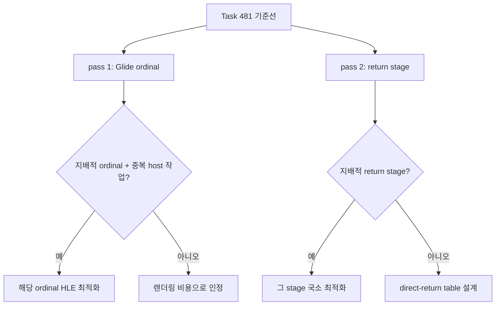

# Return stage / Glide ordinal 귀속 측정 가이드 / Measuring the Return-Stage and Glide-Ordinal Axes

Task 481 이후 남은 두 개의 큰 bucket — return handler와 Glide gate — 를 각각 내부
단계로 분해하는 반복 절차입니다. 설계는
[20260814-482](../design/20260814-482-post-return-bottleneck-attribution.md),
구현 결과는 [Task 482 작업 로그](../work-logs/20260822-482-post-return-bottleneck-attribution.md),
현재 순위는 [현재 실행 frontier](../analysis/current-execution-frontier.md)에 있습니다.

**이 계측은 귀속 전용입니다.** 게스트 레지스터, 게스트 메모리, cache layout, 해석된
target, patch 결정을 바꾸지 않습니다. 대신 계측이 켜진 실행의 FPS는 **성능 근거로
쓰지 않습니다.**

## 1. 언제 쓰는가

* return handler가 `guest-run`의 큰 몫을 계속 차지할 때, 그 안의 어느 단계인지 가를 때
* Glide gate bucket에서 어떤 ordinal이 지배적인지 가를 때
* 다음 구현으로 ordinal HLE 최적화, return stage 축소, direct-return table 중 무엇을
  고를지 근거가 필요할 때

## 2. 두 pass를 분리하는 이유

두 계측을 한 실행에서 켜면 서로의 outer bucket에 자기 비용을 얹습니다. return stage는
return마다 RDTSC를 여섯 번 더 읽고, Glide ordinal은 gate마다 타임스탬프를 더 남깁니다.
따라서 **같은 장면을 두 번 돌리고 각 pass의 coverage를 자기 outer bucket에 대해서만**
읽습니다.



## 3. 실행

Release 빌드를 쓰고, vsync는 끄고, EEPROM은 **매 실행 격리**합니다. vsync가 켜져 있으면
CPU가 아니라 디스플레이 대기를 재게 되고(Task 440), EEPROM을 격리하지 않으면 영속 상태가
실행 간에 새어 비교가 무효가 됩니다(Task 403).

### pass 1 — Glide ordinal

```
set REPIU_EXECUTION_BACKEND=dynamic
set REPIU_EXECUTION_TIME_PROFILE=1
set REPIU_GLIDE_ORDINAL_TIME_PROFILE=1
set REPIU_EEPROM_PATH=<실행별 사본>
build\win32_x86_debug\Release\repiu.exe pumpit8 > pass1.txt 2>&1
```

### pass 2 — return stage

```
set REPIU_EXECUTION_BACKEND=dynamic
set REPIU_EXECUTION_TIME_PROFILE=1
set REPIU_AOT_RETURN_STAGE_PROFILE=1
set REPIU_EEPROM_PATH=<실행별 사본>
build\win32_x86_debug\Release\repiu.exe pumpit8 > pass2.txt 2>&1
```

`REPIU_AOT_RETURN_STAGE_PROFILE`은 opt-in입니다. 값을 주지 않거나 비우면 OFF이고,
`1|on|true`만 켭니다. OFF일 때 return 경로는 분기 하나만 지나며 RDTSC를 읽지 않습니다.

**`REPIU_AOT_RESIDENCY_SAMPLE`은 같이 켜지 마십시오.** Task 478의 residency 표본은
`continuation` stage **안에서** 돌기 때문에, 켜면 그 단계 비용이 계측 자신의 비용으로
부풀어 오릅니다.

## 4. 읽을 줄

### pass 2 (return stage)

```
Win32 AOT return stage profile enabled/returns/outer/max-outer/covered/coverage/residual: ...
Win32 AOT return stage cycles entry/read/resolve/patch/continuation: ...
Win32 AOT return stage counts entry/read/resolve/patch/continuation: ...
Win32 AOT return stage max entry/read/resolve/patch/continuation: ...
Win32 AOT return stage clamped residual/sample: ...
Win32 AOT return stage site: index=.. guest=.. miss_offset=.. observations=.. distinct=.. bypasses=.. megamorphic=..
```

* **returns / outer** — 계측한 return 횟수와 그 창의 총 cycle입니다. DBT adapter가 outer
  창을 열고 VEH 경로는 직접 진입할 때만 자기 창을 엽니다. 한 return이 두 번 세지지
  않습니다.
* **다섯 stage** — `entry`(진입·site 조회·RET opcode 검증·frame marshalling),
  `read`(게스트 스택 target 읽기와 call/return bookkeeping), `resolve`(target 분류와
  `ResolveAotTransferTarget`), `patch`(inline-cache miss 판정과 Task 481 정책, 필요 시
  패치), `continuation`(ESP/EIP/EFLAGS 갱신, 카운터, frame writeback)입니다. 서로
  겹치지 않습니다.
* **covered / coverage / residual** — `covered`는 다섯 stage의 합, `coverage`는 outer 대비
  비율, `residual`은 **같은 창**에서 설명되지 않은 몫입니다. residual이 크면 stage 경계가
  실제 비용을 놓치고 있다는 뜻이므로, 단계 최적화 결론을 내리기 전에 경계부터 고쳐야
  합니다.
* **clamped residual/sample** — `residual`은 stage 합이 자기 창보다 큰 표본,
  `sample`은 끝 타임스탬프가 시작보다 앞선 표본입니다. 스레드 이동에서 나옵니다. 둘 다
  전체 대비 무시할 수준이어야 하며, 커지면 그 실행의 stage 비율은 인용하지 않습니다.
* **site 줄** — Task 481 정책이 관측한 site 중 **관측 수 상위 16개**입니다.
  `observations`는 miss 수, `distinct`는 서로 다른 guest target 수(상한 8),
  `bypasses`는 megamorphic 판정 이후 재패치를 생략한 횟수입니다.

### 오해하기 쉬운 두 가지

* **`entry`와 `continuation`의 count는 return 수의 약 2배입니다.** 두 단계는 DBT
  adapter와 resolver **양쪽**에 서로 겹치지 않는 구간으로 존재하므로 성공한 return마다
  표본이 두 번 남습니다. 단계당 평균을 낼 때는 count가 아니라 `returns`로 나누십시오.
  `read`·`resolve`·`patch`의 count는 return 수와 같고, `returns`와의 차이는 entry 검증에서
  걸러진 return 수입니다.
* **residual은 대부분 계측 자신입니다.** 단계마다 RDTSC 두 번과 기록이 붙으므로 return
  하나에 열두 번 읽습니다. 첫 검증 실행에서 residual은 return당 약 404 cycle이었고,
  이는 Task 481이 잰 비계측 return 단가(약 1,275 cycle)와 이번 outer 단가(약 1,650
  cycle)의 차이와 같은 크기입니다. **residual을 "아직 못 찾은 게스트 작업"으로 읽지
  마십시오.** coverage 75% 안팎이 이 방법의 상한입니다.

### direct-return table을 켠 실행

Task 499의 table이 켜져 있으면 return 대부분이 host에 도달하지 않으므로 **stage 비율이
그 실행에서는 의미를 잃습니다.** 대신 아래 줄로 적중과 충돌을 봅니다.

```
Win32 AOT direct-return table enabled/sites/entries/hits/share/inserts/overwrites/clears: ...
```

`overwrites`가 `inserts`에 근접하면 table이 작아 thrash하는 것이므로
`REPIU_AOT_DIRECT_RETURN_TABLE_BITS`를 올립니다. `clears`는 page retirement 횟수이며,
그때마다 재학습이 일어납니다.

### 함께 확인할 건전성 줄

```
Win32 AOT return patch policy observations/megamorphic/bypasses: ...
Win32 AOT return dispatch site index sites/lookups/scans/rebuilds: ...
Win32 AOT-DBT return fallback reason site/state/opcode/source/zero/hle/quarantine/non-guest/translate/unknown: ...
```

`scans`는 0, return fallback은 전 항목 0이어야 합니다. 하나라도 0이 아니면 그 실행은
Task 479~481의 기준선과 다른 상태이므로 stage 비율을 비교에 쓰지 않습니다.

## 5. 판정 규칙

Task 478이 세운 규칙을 그대로 씁니다. 실행마다 장면이 다르면 stage 비율도 같이
움직이므로, **같은 구간을 3회 재현**하고 다음이 모두 성립할 때만 비교합니다.

* 프레임당 patch 수와 primitive 수가 기준 대비 **3% 이내**
* cycle당 swap과 cycle당 primitive가 **같은 방향**
* `scans=0`, return fallback 0, patch 성공률 100%

계측이 켜진 실행의 겉보기 FPS는 어느 경우에도 근거로 쓰지 않습니다.

## 6. 다음 결정

* 특정 Glide ordinal이 지배하고 중복 host 작업이 확인되면 → 그 ordinal의 HLE 경로 최적화
* `resolve` 또는 `read`가 지배하면 → 그 stage 국소 축소
* 비용이 여러 stage에 고르게 퍼져 있으면 → generated megamorphic **direct-return table**을
  별도 설계 (생성·retirement 정확성 경계 포함)

---

# Measuring the Return-Stage and Glide-Ordinal Axes

A repeatable procedure for decomposing the two large buckets that remained after Task 481 —
the return handler and the Glide gate. The design is
[20260814-482](../design/20260814-482-post-return-bottleneck-attribution.md), the
implementation result is the
[Task 482 work log](../work-logs/20260822-482-post-return-bottleneck-attribution.md), and the
current ranking is in the
[current execution frontier](../analysis/current-execution-frontier.md).

**This instrumentation is attribution only.** It changes no guest register, guest memory,
cache layout, resolved target, or patch decision. In exchange, the FPS of an instrumented run
is **never performance evidence**.

## 1. When to use it

* To split the return handler into stages while it still holds a large share of `guest-run`
* To find which Glide ordinal dominates the gate bucket
* To choose the next implementation among ordinal HLE work, a return-stage reduction, and a
  direct-return table

## 2. Why the passes are separate

Enabling both instruments in one run charges each one's cost to the other's outer bucket: the
return stages add six RDTSC reads per return, and the Glide ordinal pass adds timestamps per
gate. Run the same scene twice and read each pass's coverage only against its own outer bucket.

## 3. Running

Use a Release build, turn vsync off, and isolate the EEPROM per run. With vsync on the
measurement captures display waiting rather than CPU (Task 440), and without EEPROM isolation
persistent state leaks between runs and invalidates the comparison (Task 403).

Pass 1 sets `REPIU_GLIDE_ORDINAL_TIME_PROFILE=1`; pass 2 sets
`REPIU_AOT_RETURN_STAGE_PROFILE=1`. Both also set `REPIU_EXECUTION_TIME_PROFILE=1` so the outer
buckets are present. `REPIU_AOT_RETURN_STAGE_PROFILE` is opt-in: unset and empty mean off, and
only `1|on|true` enables it. While off, the return path passes one branch and reads no
timestamp.

Do not enable `REPIU_AOT_RESIDENCY_SAMPLE` during pass 2. The Task 478 residency sampler runs
*inside* the `continuation` stage, so enabling it inflates that stage with the cost of another
instrument.

## 4. Lines to read

The pass-2 lines are `Win32 AOT return stage profile`, `... stage cycles`, `... stage counts`,
`... stage max`, `... stage clamped`, and one `Win32 AOT return stage site:` line per ranked
site.

* **returns / outer** — how many returns were measured and the total cycles of those windows.
  The DBT adapter opens the outer window, and the VEH path opens its own only when it arrives
  directly, so no return is counted twice.
* **The five stages** — `entry` (entry accounting, dispatch-site lookup, RET opcode validation,
  frame marshalling), `read` (guest stack target read and call/return bookkeeping), `resolve`
  (target classification and `ResolveAotTransferTarget`), `patch` (inline-cache miss test, the
  Task 481 policy, and the optional patch), and `continuation` (ESP/EIP/EFLAGS, counters, frame
  writeback). They are mutually exclusive.
* **covered / coverage / residual** — `covered` is the stage sum, `coverage` its share of the
  outer window, and `residual` what the same window did not explain. A large residual means the
  stage boundaries are missing real cost, so fix the boundaries before concluding anything about
  a stage.
* **clamped residual/sample** — a sample whose stage sum exceeded its own window, and a sample
  whose end timestamp preceded its start, which a migrated thread produces. Both must stay
  negligible; if they grow, do not cite that run's stage shares.
* **site lines** — the sixteen Task 481 policy sites with the most observations, with the miss
  count, the distinct guest target count (capped at eight), and the bypasses recorded after the
  megamorphic verdict.

Two things read wrong at first glance. **The `entry` and `continuation` counts are about twice
the return count**, because both stages exist as disjoint regions in the DBT adapter *and* the
resolver, so a successful return leaves two samples; divide those two by `returns`, not by their
own counts. The `read`, `resolve`, and `patch` counts equal the return count, and their gap
against `returns` is the number of returns rejected during entry validation. **And the residual
is mostly the instrument itself**: each stage adds two RDTSC reads plus bookkeeping, twelve per
return. The first validation run measured about 404 cycles of residual per return, the same size
as the gap between Task 481's uninstrumented 1,275 cycles per return and this run's 1,650-cycle
outer window. Do not read the residual as guest work still to be found; coverage near 75% is this
method's ceiling.

Check the health lines beside them: the return dispatch site index must report `scans` of zero
and every return fallback reason must be zero, or the run is not in the Task 479-481 baseline
state and its stage shares are not comparable.

## 5. Judging

Use the Task 478 rule. Reproduce the same section three times and compare only when per-frame
patch and primitive counts agree within 3%, swaps per cycle and primitives per cycle move in
the same direction, and `scans`, return fallbacks, and patch failures are all zero. The
apparent FPS of an instrumented run is never evidence.

## 6. Choosing what comes next

A dominant Glide ordinal with proven redundant host work leads to optimizing that ordinal's HLE
path; a dominant `resolve` or `read` stage leads to reducing that stage; and cost spread evenly
across stages leads to designing a generated megamorphic direct-return table, including its
generation and retirement correctness boundaries.
