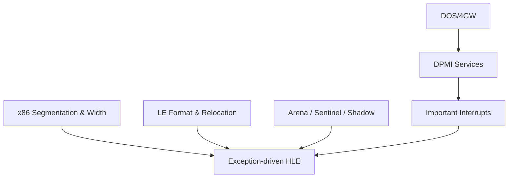

# rePIU 기술 지식 기반 색인

이 디렉터리는 프로젝트를 이해하는 데 필요한 일반 기술 지식을 정리합니다. PIU 바이너리에서 직접 확인한 사실은 `docs/analysis/`에 기록합니다. 외부 자료에서 얻은 정의와 규약에는 원문 링크를 함께 둡니다.

## 문서

* [DOS/4GW와 DPMI](dos4gw-and-dpmi.md)
* [x86 segmentation과 16/32비트 처리](x86-segmentation-and-bit-width.md)
* [Arena, sentinel, shadow memory 용어](memory-terms.md)
* [주요 DOS/DPMI interrupt](important-interrupts.md)
* [LE 실행 형식과 fixup/relocation](le-format-and-relocation.md)
* [HLE와 예외 기반 직접 실행](hle-and-exception-driven-execution.md)

# rePIU Technical Knowledge Base Index

* [CHD와 ISO9660 / CHD and ISO9660](chd-and-iso9660.md)

This directory documents generally applicable technical background needed to understand the project. Facts confirmed specifically from the PIU binary belong in `docs/analysis/`. Definitions and contracts derived from external material include source links.
