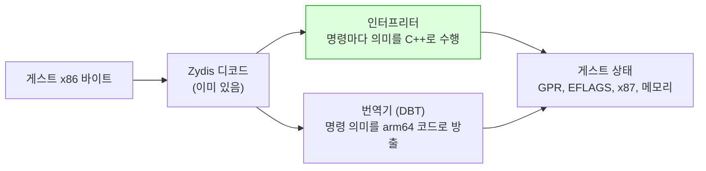

# AArch64와 Android 호스트 제약 / AArch64 and Android host constraints

## 한국어

### 왜 이 프로젝트에 필요한가

rePIU는 원본 32비트 x86 코드를 호스트에서 실행합니다. i386 호스트는 그 바이트를 그대로, x86-64
호스트는 대부분을 그대로 실행하고 일부만 다시 씁니다([32비트 encoding을 long mode에서 실행할
때](x86-32bit-encodings-in-long-mode.md)). AArch64는 다른 ISA이므로 **그대로 실행할 수 있는 바이트가
없습니다.** 이 문서는 arm64와 Android로 갈 때 x86 호스트와 다르게 작동하는 것들을 모아 둡니다.
프로젝트 고유의 측정과 상태는 [Android arm64 이식 frontier](../analysis/android-arm64-port-frontier.md)에
있습니다.

### ISA 차이 가운데 이 프로젝트에 닿는 것

| 항목 | x86 호스트 | AArch64 | rePIU에 미치는 것 |
|---|---|---|---|
| 게스트 바이트 실행 | 가능 (i386 그대로, x64 대부분) | **불가** | 인터프리터 또는 x86 → arm64 번역기가 필요 |
| 80비트 부동소수점 | x87이 하드웨어에 있음 | **없음.** `long double`은 소프트웨어 binary128 | x87 스택과 80비트 메모리 피연산자를 소프트웨어로 표현해야 함 |
| 플래그 레지스터 | EFLAGS (CF, PF, AF, ZF, SF, OF) | NZCV 넷. PF와 AF는 없음 | 인터프리터가 PF와 AF를 계산해야 하고, 번역기는 지연 평가가 보통 |
| 메모리 순서 | 강함 (TSO에 가까움) | **약함.** 스레드 사이 순서는 barrier가 정함 | 게스트 스레드와 호스트 스레드의 rendezvous에 명시적 barrier |
| 명령 캐시 일관성 | 데이터 쓰기가 곧 명령 fetch에 보임 | **보이지 않음.** 코드를 쓴 뒤 `DC CVAU`, `IC IVAU`, `DSB`, `ISB` 순서가 필요 | 코드 캐시를 만드는 경로마다 `__builtin___clear_cache` 호출이 **필수**가 됨. x86에서는 무동작에 가까웠던 `FlushInstructionCacheRange`가 실제 일을 함 |
| 정렬되지 않은 접근 | 허용 | 일반 load/store는 허용, atomic과 exclusive는 정렬 필요 | 게스트의 비정렬 접근을 인터프리터가 일반 명령으로 처리하면 문제 없음 |
| 사이클 카운터 | `rdtsc` | `CNTVCT_EL0` (사용자 모드에서 읽기 가능) 또는 `clock_gettime` | 귀속 측정의 단위가 바뀜 |
| 호출 규약 | cdecl/stdcall, SysV AMD64 | AAPCS64: X0~X7 인자, X19~X28 callee-saved, SP 16바이트 정렬 | 어셈블리 thunk는 전부 새로 씀 |
| 페이지 크기 | 4 KB | 4 KB 또는 **16 KB** (Android 15 이후 기기) | 페이지 보호로 self-modifying code를 감지하는 방식이 16 KB에서는 4배 거칠어짐 |

출처: [Arm Architecture Reference Manual for A-profile](https://developer.arm.com/documentation/ddi0487/latest),
[Procedure Call Standard for the Arm 64-bit Architecture (AAPCS64)](https://github.com/ARM-software/abi-aa/blob/main/aapcs64/aapcs64.rst).

### 80비트 부동소수점의 선택지

| 방식 | 정확성 | 속도 | 라이선스 |
|---|---|---|---|
| 소프트웨어 80비트 (예: [Berkeley SoftFloat 3](http://www.jhauser.us/arithmetic/SoftFloat.html), `extF80`) | x87과 같은 결과를 낼 수 있음. 제어 워드의 정밀도 필드(PC)도 표현 가능 | 느림. 연산당 수십 명령 | BSD-3, 프로젝트 정책에 맞음 |
| `double` | 64비트 이상의 정밀도를 게스트가 관측하면 값이 어긋남 | 빠름 (하드웨어) | 없음 |
| `long double` (binary128) 뒤 80비트로 반올림 | 이중 반올림으로 x87과 다른 결과가 날 수 있음 | 느림 (소프트웨어 binary128) | 없음 |

x87의 상태 구조는 [x87 상태와 tag word](x87-state-and-tag-words.md)에 있습니다.

### Android가 Linux 데스크톱과 다른 것

| 항목 | Linux 데스크톱 | Android | 출처 |
|---|---|---|---|
| libc | glibc | **bionic.** `pthread_timedjoin_np` 같은 GNU 확장은 있는지 헤더로 확인해야 하고, 여러 함수에 `__INTRODUCED_IN(API)`가 붙음 | [NDK stable APIs](https://developer.android.com/ndk/guides/stable_apis) |
| 그래픽 API | 데스크톱 OpenGL (compat 포함) | **OpenGL ES만** (2.0/3.x), Vulkan. 고정 기능 파이프라인과 GLSL 110은 없음 | [NDK graphics](https://developer.android.com/ndk/guides/graphics) |
| 파일 접근 | 임의 경로 | **scoped storage.** 사용자 파일은 Storage Access Framework로 고르고, 앱은 자기 전용 디렉터리만 자유롭게 씀 | [SAF](https://developer.android.com/training/data-storage/shared/documents-files) |
| 프로세스 모델 | `fork`, `posix_spawn`으로 자식 GUI 프로세스 | 앱은 Activity 안에서 살고, GUI 자식 프로세스를 다시 띄우는 개념이 없음 | Android 앱 기본 사항 |
| 표준 출력과 오류 | 터미널 | 버려짐. **logcat**(`__android_log_write`)으로 보내야 보임 | [NDK logging](https://developer.android.com/ndk/reference/group/logging) |
| 수명주기 | 프로세스가 끝날 때까지 실행 | onPause/onResume, 화면 회전, 백그라운드 종료 | SDL의 `SDLActivity`가 이벤트로 전달 |
| Signal 핸들러 | 자기 것만 | ART가 `libsigchain`으로 SIGSEGV 등을 먼저 받고 앱 핸들러에 연쇄함 | AOSP `libsigchain` |
| 페이지 크기 | 4 KB | 4 KB 또는 16 KB. NDK r28부터 16 KB 정렬 기본, Play는 2027-02-01부터 API 35 이상 대상 앱에 요구 | [16 KB page sizes](https://developer.android.com/guide/practices/page-sizes) |
| 낮은 주소의 `mmap` | `mmap_min_addr` 보통 65536 | 보통 32768. 그러나 zygote와 ART가 미리 매핑한 구간이 있음 | [kernel vm sysctl](https://www.kernel.org/doc/Documentation/sysctl/vm.txt) |
| 실행 가능 익명 메모리 | 허용 | 앱 도메인(`untrusted_app`)에 `execmem`이 허용되는 것이 일반적이지만 기기 정책을 확인해야 함 | AOSP sepolicy |
| 빌드 | CMake 직접 | Gradle의 externalNativeBuild가 NDK의 `android.toolchain.cmake`로 CMake를 부름. ABI는 `arm64-v8a` | [NDK CMake](https://developer.android.com/ndk/guides/cmake), [ABIs](https://developer.android.com/ndk/guides/abis) |

SDL3는 Android를 공식 지원하며, 자바 쪽 `SDLActivity`와 Gradle 템플릿을 소스에 동봉합니다. 최소
API 21입니다([SDL3 README-android](https://github.com/libsdl-org/SDL/blob/main/docs/README-android.md)).

### x86이 아닌 호스트에서 게스트를 실행하는 두 방식

인터프리터는 플랫폼 중립 C++이므로 x86 호스트에서도 돌고, 그래서 기존 backend와 나란히 놓고
대조할 수 있습니다. 번역기는 빠르지만 대조 기준이 없으면 버그를 타깃 기기에서 잡아야 합니다.
동적 재컴파일 일반은 [동적 재컴파일(dynarec)과 예외 기반 AOT 디스패치](dynamic-recompilation-and-aot-dispatch.md)에,
코드 캐시 일관성은 [Self-modifying code와 code-cache 일관성](self-modifying-code-and-cache-coherency.md)에
있습니다.

---

## English

### Why this project needs it

rePIU executes the original 32-bit x86 code on the host. An i386 host runs those bytes as they are,
and an x86-64 host runs most of them as they are and rewrites a few ([running 32-bit encodings in
long mode](x86-32bit-encodings-in-long-mode.md)). AArch64 is a different ISA, so **no byte can be run
as it is.** This document collects what behaves differently from an x86 host when moving to arm64 and
Android. The project's own measurements and status are in the
[Android arm64 port frontier](../analysis/android-arm64-port-frontier.md).

### ISA differences that reach this project

| Item | x86 host | AArch64 | Effect on rePIU |
|---|---|---|---|
| Executing guest bytes | possible (i386 verbatim, x64 mostly) | **impossible** | An interpreter or an x86-to-arm64 translator is required |
| 80-bit floating point | x87 in hardware | **none.** `long double` is software binary128 | The x87 stack and 80-bit memory operands need a software representation |
| Flags register | EFLAGS (CF, PF, AF, ZF, SF, OF) | NZCV, four flags. No PF, no AF | An interpreter computes PF and AF; a translator usually evaluates them lazily |
| Memory ordering | strong (close to TSO) | **weak.** Cross-thread order is set by barriers | Explicit barriers in the guest-thread/host-thread rendezvous |
| Instruction-cache coherency | a data write is visible to instruction fetch | **not visible.** After writing code: `DC CVAU`, `IC IVAU`, `DSB`, `ISB` in order | `__builtin___clear_cache` becomes **mandatory** on every code-cache path. `FlushInstructionCacheRange`, near no-op on x86, does real work |
| Unaligned access | allowed | ordinary loads and stores allowed; atomics and exclusives need alignment | Fine when the interpreter handles guest unaligned access with ordinary instructions |
| Cycle counter | `rdtsc` | `CNTVCT_EL0` (readable from user mode) or `clock_gettime` | The unit of attribution measurements changes |
| Calling convention | cdecl/stdcall, SysV AMD64 | AAPCS64: X0 to X7 arguments, X19 to X28 callee-saved, SP 16-byte aligned | All assembly thunks are written anew |
| Page size | 4 KB | 4 KB or **16 KB** (devices from Android 15) | Page-protection-based self-modifying-code detection gets four times coarser at 16 KB |

Sources: [Arm Architecture Reference Manual for A-profile](https://developer.arm.com/documentation/ddi0487/latest),
[Procedure Call Standard for the Arm 64-bit Architecture (AAPCS64)](https://github.com/ARM-software/abi-aa/blob/main/aapcs64/aapcs64.rst).

### Options for 80-bit floating point

| Approach | Accuracy | Speed | License |
|---|---|---|---|
| Software 80-bit (for example [Berkeley SoftFloat 3](http://www.jhauser.us/arithmetic/SoftFloat.html), `extF80`) | Can match x87 exactly, including the control word's precision field (PC) | slow, tens of instructions per operation | BSD-3, within project policy |
| `double` | Diverges wherever the guest observes more than 64 bits of precision | fast (hardware) | none |
| `long double` (binary128) then rounding to 80 bits | Double rounding can differ from x87 | slow (software binary128) | none |

The x87 state layout is in [x87 state and tag words](x87-state-and-tag-words.md).

### How Android differs from desktop Linux

| Item | Desktop Linux | Android | Source |
|---|---|---|---|
| libc | glibc | **bionic.** GNU extensions such as `pthread_timedjoin_np` must be checked in the headers, and many functions carry `__INTRODUCED_IN(API)` | [NDK stable APIs](https://developer.android.com/ndk/guides/stable_apis) |
| Graphics API | desktop OpenGL (compat included) | **OpenGL ES only** (2.0/3.x), and Vulkan. No fixed-function pipeline, no GLSL 110 | [NDK graphics](https://developer.android.com/ndk/guides/graphics) |
| File access | any path | **scoped storage.** User files are picked through the Storage Access Framework; the app writes freely only in its own directories | [SAF](https://developer.android.com/training/data-storage/shared/documents-files) |
| Process model | `fork`, `posix_spawn` for a GUI child | The app lives inside an Activity; there is no notion of relaunching a GUI child process | Android app fundamentals |
| stdout and stderr | a terminal | discarded. Must go to **logcat** (`__android_log_write`) to be seen | [NDK logging](https://developer.android.com/ndk/reference/group/logging) |
| Lifecycle | runs until the process ends | onPause/onResume, rotation, background kill | SDL's `SDLActivity` delivers them as events |
| Signal handlers | one's own only | ART receives SIGSEGV and others first through `libsigchain` and chains to the app's handler | AOSP `libsigchain` |
| Page size | 4 KB | 4 KB or 16 KB. NDK r28 aligns to 16 KB by default; Play requires it from 2027-02-01 for apps targeting API 35+ | [16 KB page sizes](https://developer.android.com/guide/practices/page-sizes) |
| Low-address `mmap` | `mmap_min_addr` usually 65536 | usually 32768, but the zygote and ART pre-map regions | [kernel vm sysctl](https://www.kernel.org/doc/Documentation/sysctl/vm.txt) |
| Executable anonymous memory | allowed | `execmem` is normally allowed in the app domain (`untrusted_app`), but device policy must be checked | AOSP sepolicy |
| Build | CMake directly | Gradle's externalNativeBuild invokes CMake with the NDK's `android.toolchain.cmake`. The ABI is `arm64-v8a` | [NDK CMake](https://developer.android.com/ndk/guides/cmake), [ABIs](https://developer.android.com/ndk/guides/abis) |

SDL3 supports Android officially and bundles the Java-side `SDLActivity` and a Gradle template in its
source. The minimum API is 21 ([SDL3 README-android](https://github.com/libsdl-org/SDL/blob/main/docs/README-android.md)).

### Two ways to run the guest on a non-x86 host

An interpreter is platform-neutral C++, so it also runs on an x86 host, which is what allows it to be
compared side by side with the existing backends. A translator is fast, but without a reference its
bugs must be caught on the target device. Dynamic recompilation in general is in
[dynamic recompilation (dynarec) vs exception-driven AOT dispatch](dynamic-recompilation-and-aot-dispatch.md),
and code-cache coherency in
[self-modifying code and code-cache coherency](self-modifying-code-and-cache-coherency.md).
