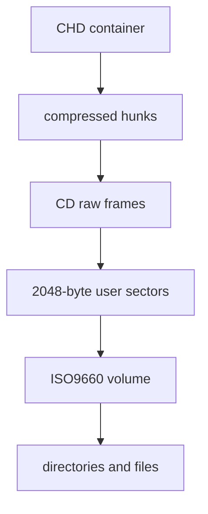

# CHD와 ISO9660 / CHD and ISO9660

CHD(Compressed Hunks of Data)는 MAME이 사용하는 block-oriented compressed image format입니다. CHD 자체는 내부 file system을 해석하지 않으며 logical disk 또는 CD sector를 hunk 단위로 제공합니다. v5 header 구조와 read API는 [MAME CHD header](https://github.com/mamedev/mame/blob/master/src/lib/util/chd.h)와 [libchdr API](https://github.com/rtissera/libchdr/blob/v0.3.0/include/libchdr/chd.h)를 참고합니다.

ISO9660은 CD-ROM volume과 directory record를 정의합니다. sector 16의 primary volume descriptor는 type 1과 identifier `CD001`을 가지며 root directory record를 포함합니다. 원 규격은 [ECMA-119](https://ecma-international.org/publications-and-standards/standards/ecma-119/)입니다.

CHD decoder가 sector를 제공하고 ISO9660 reader가 file tree를 해석합니다. CD Mode2 raw frame은 2,352-byte sector data와 선택적인 96-byte subcode를 포함하며 Form1 user payload는 2,048 bytes입니다.

## English

CHD is MAME's block-oriented compressed image container; it does not interpret the contained file system. ISO9660 defines CD-ROM volumes and directories. A CHD decoder exposes sectors, and an ISO9660 reader turns those sectors into files. The authoritative references are MAME's CHD source, libchdr's API, and ECMA-119.
