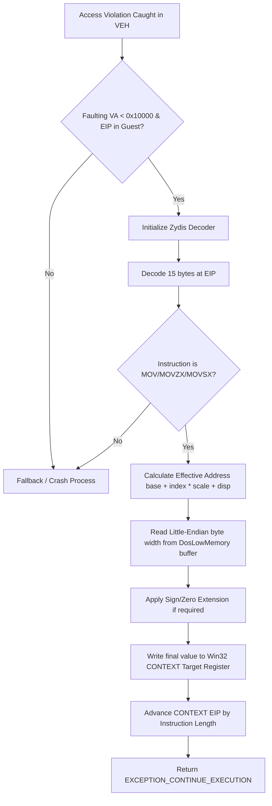

# DOS/4GW 저지대 메모리 모델 (DOS/4GW Low-Memory Model Accessibility)

이 문서는 DOS/4GW 보호 모드 환경에서 하위 1MB(특히 Real Mode 인터럽트 벡터 테이블 및 BIOS 데이터 영역) 메모리 영역의 접근 특성과, 현대 Win32 호스트에서 이를 High Level Emulation(HLE)으로 지원하기 위한 관용적 읽기 구현의 본질을 설명한다.

This document describes the memory accessibility characteristics of the lower 1MB region (specifically the Real Mode Interrupt Vector Table and BIOS Data Area) under the DOS/4GW protected-mode environment, and the implementation details of fault-time low-memory read emulation on modern Win32 hosts.

---

## 1. DOS/4GW에서의 하위 1MB 메모리 접근성 (Lower 1MB Accessibility in DOS/4GW)

DOS/4GW와 같은 32비트 보호 모드 DOS 익스텐더(Protected-Mode DOS Extender) 환경에서는 하위 1MB 영역(특히 `0x00000` ~ `0xFFFFF`)의 가상 메모리 공간이 게스트 프로세스에 그대로 매핑되거나 읽기/쓰기가 허용된다.

In 32-bit protected-mode DOS extender environments such as DOS/4GW, the lower 1MB virtual memory address space (specifically `0x00000` to `0xFFFFF`) is typically mapped into the guest address space and remains readable/writable.

* **인터럽트 벡터 테이블 (IVT, Interrupt Vector Table)**: `0x0000` ~ `0x03FF` 영역에 위치하며, 리얼 모드 인터럽트 핸들러들의 세그먼트:오프셋 주소가 기록된다. 게스트 바이너리는 특정 인터럽트가 설정되어 있는지 감시하기 위해 이 영역을 직접 읽을 수 있다.
* **BIOS 데이터 영역 (BDA, BIOS Data Area)**: `0x0400` ~ `0x04FF` 영역에 위치하며, 시스템 타이머 틱 카운터(`0x046C`), 시리얼/패러럴 포트 기기 베이스 주소, 키보드 버퍼 상태 등 시스템 하드웨어 사양과 런타임 정보가 누적된다.
* **널 포인터 역참조 관용 (Null-Pointer Dereference Tolerance)**: 많은 레거시 DOS C/C++ 프로그램은 `stricmp(str, NULL)` 이나 미초기화 문자열 포인터로 인해 `0` 번지 근처를 역참조(Read)할 때 즉시 크래시되지 않고, 그 영역에 기록된 쓰레기 값(또는 IVT의 실제 바이트)을 무해하게 읽어 처리하는 관용적인 로직을 담고 있다.

* **Interrupt Vector Table (IVT)**: Located at `0x0000` to `0x03FF`, containing segment:offset addresses of Real Mode interrupt handlers. Guest binaries may read this range directly to check if specific handler vectors are set.
* **BIOS Data Area (BDA)**: Located at `0x0400` to `0x04FF`, tracking runtime system states such as the 18.2Hz system timer tick count (`0x046C`), COM/LPT base addresses, and keyboard buffers.
* **Null-Pointer Dereference Tolerance**: Many legacy DOS C/C++ programs contain logic that implicitly dereferences near-null addresses (e.g. `stricmp(str, NULL)` or uninitialized texture slot lookups). Real DOS environments do not crash on near-null reads, but return whatever junk bytes (or IVT vectors) reside there.

---

## 2. 현대 OS에서의 제약 및 HLE 격차 (OS Constraints & HLE Gap)

현대 OS(Windows 10/11, Linux 등)는 보안 위협(Null Page Dereference 공격 기법 등)을 원천 차단하기 위해 유저 모드 프로세스가 하위 64KB(`0x00000` ~ `0x0FFFF`) 가상 주소 대역을 매핑하거나 커밋하는 것을 운영체제 커널 수준에서 절대 허용하지 않는다.

Modern operating systems (such as Windows 10/11 or Linux) strictly prohibit user-mode processes from committing or mapping virtual memory in the lowest 64KB range (`0x00000` to `0x0FFFF`) to prevent security vulnerabilities like null-page dereference exploits.

* **현상**: 게스트 바이너리가 하위 64KB 가상 주소를 참조하는 `MOV REG, [ADDR]` 명령어를 수행할 때, Win32 호스트에서는 즉시 `Access Violation` 예외(`0xC0000005`)를 발생시키며 비정상 강제 종료된다.
* **HLE 격차 해결책**: 유일한 솔루션은 유저 모드에서 예외 필터(Vectored Exception Handler)를 연동하여, `0xC0000005` 예외가 발생했을 때 장애 주소(Faulting VA)가 `< 0x10000` (64KB 미만) 영역이면서 예외를 일으킨 EIP가 게스트 코드 대역인 경우를 포착하고, 해당 예외 시점의 명령어를 가상으로 에뮬레이션하여 다음 실행 흐름으로 복구(Continue Execution)시키는 것이다.

* **Symptom**: When a guest binary executes a `MOV REG, [ADDR]` instruction targeting an address under 64KB, the Win32 host immediately raises an Access Violation exception (`0xC0000005`) and terminates the process.
* **HLE Resolution**: The only robust way is to register a Vectored Exception Handler (VEH). When a `0xC0000005` exception is caught, if the faulting virtual address is under `0x10000` (64KB) and the EIP resides inside the guest binary, the emulator decodes the faulting instruction, computes the target destination register, injects the correct data from an emulated `DosLowMemory` buffer, and resumes execution.

---

## 3. Zydis 기반 HLE 저지대 Read 에뮬레이터 설계 (Zydis-based Low-Memory Read Emulator Design)

게스트 코드는 8-bit (`MOV AL`), 16-bit (`MOV AX`), 32-bit (`MOV EAX`) 로드 명령어뿐 아니라, 부호 확장 로드(`MOVSX`), 제로 확장 로드(`MOVZX`) 등 다양한 형식을 사용하여 저지대를 참조한다. 하드코딩된 opcode 비교만으로는 이를 모두 처리할 수 없으므로, Zydis 디코더 라이브러리를 활용해 일반화된 분석을 수행한다.

Guest code can read the lower memory area using various forms of load instructions, including 8/16/32-bit loads (`MOV`), sign-extended loads (`MOVSX`), and zero-extended loads (`MOVZX`). To support all variations without writing a sprawling opcode-lookup matrix, the HLE layer utilizes the Zydis decoding library for generalized instruction emulation.

### 에뮬레이션 흐름 (Emulation Flow)

1. **지연 로딩 및 디코딩**: 예외 필터가 트리거되면 EIP 지점의 바이너리 코드 최대 15바이트를 읽어 Zydis 디코더(`ZydisDecoderDecodeFull`)에 넘겨 명령어 구조(Mnemonic)와 피연산자(Operands)를 분석한다.
2. **실효 주소 계산**: 메모리 피연산자(`operands[1].mem`)의 `base`, `index`, `scale`, `displacement` 세부 스펙을 파싱하고, 현재 CPU 레지스터 컨텍스트(`win32_context`) 값들을 대입하여 최종 접근하려 했던 `calculated_address`를 복원해 낸다.
3. **가상 버퍼 읽기**: 실효 주소가 `0x10000` 미만인 경우, 에뮬레이터 내에 별도 할당되어 관리되는 64KB 크기의 `DosLowMemory` 버퍼(예: BDA 틱 및 IVT가 동적 모사되는 가상메모리 영역)에서 대상 바이트 크기(`operands[1].size / 8`)만큼 안전하게 little-endian 데이터를 추출한다.
4. **부호/제로 확장 및 레지스터 쓰기**: 로드할 목적지 레지스터 번호를 획득하여 대상 레지스터 크기(AL, AX, EAX 등)에 맞춰 값을 대입하며, `MOVSX`일 경우 부호 확장을 가미한다.
5. **EIP 전진**: 처리가 완료되면 예외 컨텍스트의 `Eip` 값을 에뮬레이트한 명령어의 바이트 길이만큼 증가시킨 뒤, `EXCEPTION_CONTINUE_EXECUTION`을 리턴하여 프로그램이 다음 행으로 부드럽게 넘어가도록 제어권을 인계한다.
6. **무한 루프 방지**: 동일 EIP에서 연속해서 예외가 발생할 경우(에뮬레이션 불일치 등) 카운트(최대 5회)를 누적하여 runaway 상태에 빠지기 전에 터미널 예외로 폴링되게 차단한다.

1. **Instruction Decoding**: Upon a catch, up to 15 bytes starting at EIP are processed via `ZydisDecoderDecodeFull` to resolve the mnemonic and operands.
2. **Effective Address Calculation**: Specifiers for `base`, `index`, `scale`, and `displacement` in the memory operand (`operands[1].mem`) are parsed and evaluated against current register values to reconstruct the `calculated_address`.
3. **Low-Memory Buffer Access**: If the address is under `0x10000`, the data is read from the emulated 64KB `DosLowMemory` buffer using the exact byte width specified by the instruction (`operands[1].size / 8`).
4. **Register Update & Extension**: The target destination register is resolved and written with the read value. Sign-extension is applied if the instruction is `MOVSX`.
5. **EIP Advancement**: EIP is advanced by the instruction length. Returning `EXCEPTION_CONTINUE_EXECUTION` resumes execution at the subsequent instruction.
6. **Runaway Prevention**: If the same EIP triggers access violations repeatedly (e.g. 5+ times), the handler aborts emulation to prevent infinite loops.

---

## 4. 관련 참조 표준 및 권고 (References)

* **Intel® 64 and IA-32 Architectures Software Developer's Manual**: Volume 1 (Basic Architecture), Volume 2 (Instruction Set Reference).
  [Intel SDM Manuals](https://www.intel.com/content/www/us/en/developer/articles/technical/intel-sdm.html)
* **Zydis: Fast and lightweight x86/x86-64 decoder library**:
  [Zydis GitHub Repository](https://github.com/zyantific/zydis)
* **Microsoft Learn: Vectored Exception Handling**:
  [MSDN Vectored Exception Handling](https://learn.microsoft.com/en-us/windows/win32/debug/vectored-exception-handling)
