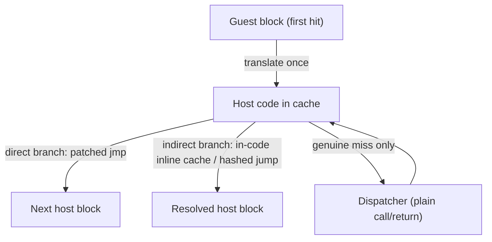
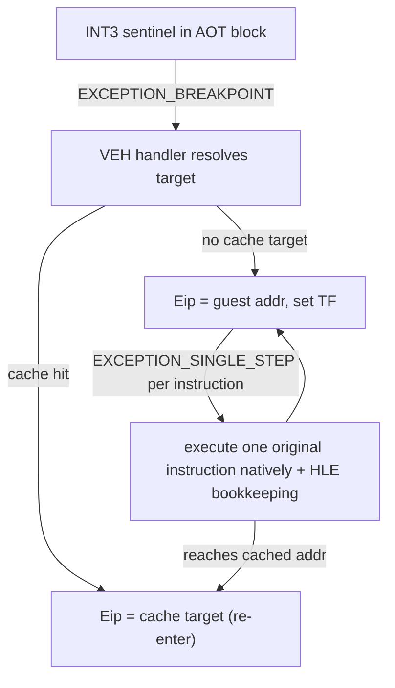

# 동적 재컴파일(dynarec)과 rePIU의 예외 기반 AOT 디스패치
# Dynamic Recompilation (dynarec) vs rePIU's Exception-Driven AOT Dispatch

이 문서는 일반적인 동적 재컴파일(dynarec) 구조와 rePIU의 `aot-dynamic` 백엔드를
비교해, 무엇이 같고 무엇이 근본적으로 다른지 정리한다. 실행 경로 구현 세부는
[HLE와 예외 기반 직접 실행](hle-and-exception-driven-execution.md), 자기수정코드
처리는 [자기수정코드와 캐시 일관성](self-modifying-code-and-cache-coherency.md)을
함께 본다. 프로젝트 코드 관측은 `docs/analysis/aot-*.md` 계열에 누적된다.

This note compares a conventional dynamic recompiler (dynarec) with rePIU's
`aot-dynamic` backend: what is shared and what is fundamentally different.

## 1. 일반적인 dynarec의 구조 (What a conventional dynarec does)

동적 재컴파일기(DOSBox `dynrec`/`dynamic_x86`, QEMU TCG, 콘솔 에뮬레이터의
JIT 등)는 게스트 명령을 실행 중에 호스트 명령으로 번역해 **코드 캐시**에 담고,
같은 게스트 주소를 다시 실행할 때 번역본을 재사용한다.

핵심 성질은 **핫패스에서 생성된 호스트 코드를 벗어나지 않는다**는 점이다.

* **블록 체이닝(chaining/linking):** 한 블록의 끝을 다음 블록의 호스트 코드로
  직접 `jmp`하도록 패치한다. 디스패처로 돌아가지 않는다.
* **간접 분기:** 코드 안의 인라인 캐시 또는 해시 점프 테이블로 해소하며, 여전히
  생성된 코드 안에 머문다. 디스패처 루프는 **진짜 캐시 미스**일 때만 진입한다.
* **게스트 상태:** 블록 내부에서는 게스트 레지스터/플래그를 호스트 레지스터에
  담고, 블록 경계에서만 게스트 상태 구조체로 spill 한다.
* **CPU 예외 없음:** 전달(transfer)은 전부 평범한 `jmp`/`call`이다.
* **SMC 탐지:** 페이지 보호 fault나 dirty/checksum 검사로 처리하되 드물게 발생.

## 2. rePIU가 공유하는 재료 (Ingredients rePIU shares)

`aot-dynamic`도 표준 dynarec의 자료구조를 대부분 갖는다(`aot-execution-backend`,
`aot-code-cache-emission`, `runtime-aot-dynamic-translation`).

* **코드 캐시 + 지연 변환:** 정적 AOT 이미지(게임이 거의 즉시 벗어남) + 런타임에
  처음 도달한 블록을 변환하는 동적 translator(`RequestAotDynamicTranslation`).
* **직접 분기 체이닝:** direct/fallthrough fixup을 캐시 내부 주소로 해결한다
  (PIU에서 8,956개 전부 내부 해결, 재디코딩 실패 0).
* **간접 분기 인라인 캐시:** `RequestAotInlineCachePatch`, indirect inline-cache
  sites.
* **SMC 대응:** 페이지 write-watch → retire → quarantine, generation 관리.

여기까지만 보면 일반 dynarec과 구분되지 않는다.

## 3. 결정적 차이 — 디스패치와 폴백이 CPU 예외다 (The decisive difference)

일반 dynarec이 절대 하지 않는 두 가지를 rePIU는 **설계상** 한다.

1. **경계 = `INT3` sentinel.** emitter는 반환·간접 분기·HLE 경계·`LOOP/JECXZ`를
   호스트 코드 내 점프가 아니라 **브레이크포인트 sentinel**로 방출한다("converts
   all returns into dispatcher sentinels"). sentinel에 닿으면 Windows
   `EXCEPTION_BREAKPOINT`가 발생하고, VEH 핸들러(`HandleAotReentry`,
   `HandleAotIndirectTransfer`, `HandleAotReturnTransfer` 등)가 target을 해결한 뒤
   `EIP`를 캐시 주소로 재설정한다. 즉 **비직접 전달마다 커널 예외 왕복**이다.
2. **폴백 = 원본 코드 단일스텝.** 미변환·미해결 코드는 인터프리터 루프가 아니라,
   **원본 게스트 명령을 하드웨어 트랩 플래그(TF)로 한 명령씩 실제 CPU가 실행**하고
   매 명령마다 `EXCEPTION_SINGLE_STEP`을 받아 처리한다(HLE 경계·진행 계측 반영).

| 상황 | 일반 dynarec | rePIU aot-dynamic |
|---|---|---|
| 직접 분기 | host `jmp` (체이닝) | host `jmp` (체이닝) — **동일** |
| 반환·간접·HLE 경계 | 코드 내 점프/인라인 캐시 | `INT3` → **VEH 예외** → 해결 |
| 미변환/미해결 코드 | 인터프리터 디코드-디스패치 | **원본 코드 TF 단일스텝**, 예외/명령 |
| 게스트 상태 | 블록 내 호스트 레지스터 | 명령 경계마다 게스트 상태 유지 |

## 4. 성능 함의 (Performance implications)

커널 예외 왕복 1회는 host `jmp` 대비 수백~수천 배 비싸다. 따라서 실행이 캐시 체인
안에 오래 머물지 못하고 경계에서 자주 예외로 튕겨 나오면, dynarec의 이점이 상쇄되고
오히려 순손실이 될 수 있다. Task 262 측정에서 `aot-dynamic`은 legacy 대비 progress
기준 14.6배 느렸고, 두 백엔드 모두 단일스텝이 dispatch의 99.9%였으며 경계 이탈이
초당 약 1,400회였다 — AOT 캐시가 실행을 붙잡아두지 못하고 계속 예외 경로로 이탈하는
상태다. 어느 사유(반환/간접/직접/조건/기타)에 이탈이 몰리는지는 Task 262에서 추가한
사유별 경계 카운터로 측정한다(`docs/design/20260722-262-*`).

## 5. 왜 이 설계인가 (Why this design)

이는 의도된 트레이드오프다. AGENTS.md의 최우선 원칙은 **원본 게임 로직 보존, 원본
실행 파일 코드 수정 최소화, 최적화보다 정확성**이다.

* 원본 바이트를 TF로 그대로 실행하는 단일스텝 폴백은 **가장 충실한 실행 경로**다 —
  재컴파일된 번역본이 아니라 진짜 원본 명령이 돌기 때문이다.
* `INT3` sentinel 경계는 HLE(DOS/DPMI/Glide) 진입을 자연스럽게 가로채는 지점이 되어
  HLE 계층 통합을 단순화한다.

전통적 dynarec은 모든 블록을 완전히 재컴파일하고 절대 단일스텝하지 않아 훨씬 빠르지만,
리버스 엔지니어링·번역 정확성 부담이 크다. rePIU는 정확성과 단순성을 위해 처리량을
내주는 쪽을 택했고, 성능이 문제될 때 예외 왕복을 줄이는 방향으로 개선한다.

## 참조 (References)

* Microsoft, Structured Exception Handling —
  https://learn.microsoft.com/en-us/windows/win32/debug/structured-exception-handling
* DOSBox `dynrec`/`dynamic_x86` recompiler cores (dynamic recompilation 개요) —
  https://www.dosbox.com/
* F. Bellec, "QEMU, a Fast and Portable Dynamic Translator", USENIX ATC 2005
  (block chaining과 TCG 기반 동적 번역) —
  https://www.usenix.org/legacy/event/usenix05/tech/freenix/full_papers/bellard/bellard.pdf
* Intel SDM Vol. 3, §17.3 — EFLAGS.TF 단일스텝 디버깅 예외.

---

**English summary.** rePIU's `aot-dynamic` shares the standard dynarec toolkit —
a code cache, lazy on-demand translation, direct-branch chaining, indirect
inline caches, and page-watch SMC handling. The fundamental difference is the
dispatch and fallback mechanism. A conventional dynarec never leaves generated
host code on the hot path: blocks are chained with plain jumps and indirect
branches resolve through in-code inline caches, entering the dispatcher only on a
true miss. rePIU instead emits returns, indirect branches, and HLE boundaries as
`INT3` sentinels, so each non-direct transfer is a Windows exception round-trip
through a VEH handler; and its fallback is not an interpreter loop but
single-stepping the *original* guest instructions under the hardware trap flag,
one `EXCEPTION_SINGLE_STEP` per instruction. Kernel exception round-trips cost
orders of magnitude more than a jump, so when execution repeatedly exits the
cache at boundaries (Task 262: ~1,400 exits/s, single-stepping 99.9% of
dispatches, 14.6x slower than legacy) the AOT path becomes a net loss. The design
is a deliberate trade — running the true original bytes under a trap flag is the
most faithful fallback and the sentinel boundaries integrate cleanly with the HLE
layer — favouring accuracy and simplicity over throughput, per the project
principles.
