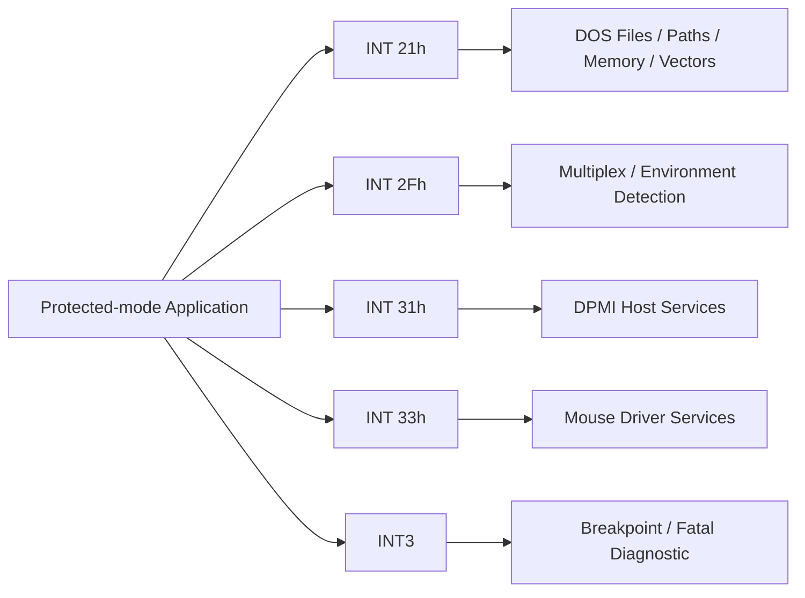

# 주요 DOS/DPMI interrupt

interrupt 세부 함수는 역사적으로 Ralf Brown’s Interrupt List가 가장 널리 쓰이는 색인 중 하나다. 원본 배포와 설명은 [CMU의 RBIL 페이지](https://www.cs.cmu.edu/~ralf/files.html)에서 확인할 수 있다. DPMI 함수는 [DPMI 1.0 사양](https://www.delorie.com/djgpp/doc/dpmi/)을 우선한다.

## INT 21h: DOS service

rePIU에서 중요한 `AH` 함수:

* `19h`: current drive 조회
* `25h`: interrupt vector 설정
* `30h`: DOS version 조회
* `35h`: interrupt vector 조회
* `3Dh`: file open
* `3Eh`: file close
* `3Fh`: file read
* `42h`: file seek
* `44h`: IOCTL
* `47h`: current directory 조회
* `4Ah`: memory block resize

대부분 성공/실패는 Carry Flag와 `AX` error/result로 전달된다. path 함수의 pointer는 guest segment semantics를 고려해야 한다.

## INT 2Fh

DOS multiplex interrupt다. 여러 resident component와 protected-mode 환경 검출에 사용된다. `AX=1686h`는 protected-mode 관련 검출 흐름에서 관찰되었으며, 정확한 반환은 호출 계약에 맞춰야 한다.

## INT 31h

DPMI service interrupt다. descriptor, memory, real-mode simulation, vector, version/capability 함수가 포함된다. `AX=0400h`는 DPMI version 조회다.

## INT 33h

mouse driver service다. `AX=0000h`는 reset/presence query로 사용된다. mouse가 없다고 보고할지 최소 가상 장치를 제공할지는 게임의 후속 분기에 따라 결정한다.

## INT3 (`0xCC`)

`INT3`는 debugger breakpoint exception을 발생시키는 1-byte instruction이다. Intel SDM Volume 2의 `INT n/INTO/INT3/INT1` 항목을 참고한다. 응용 프로그램은 assert/fatal path에 이를 사용할 수 있으므로 무조건 skip하면 안 된다.

# Important DOS/DPMI Interrupts

Use the [DPMI 1.0 specification](https://www.delorie.com/djgpp/doc/dpmi/) for DPMI contracts and [Ralf Brown’s Interrupt List distribution page](https://www.cs.cmu.edu/~ralf/files.html) as a broad historical DOS interrupt index.

Important families are DOS services on `INT 21h`, multiplex/protected-mode detection on `INT 2Fh`, DPMI on `INT 31h`, mouse services on `INT 33h`, and the one-byte breakpoint instruction `INT3`. `INT3` may indicate an application fatal path and must not be blindly skipped.

MSCDEX uses `INT 2Fh AX=1500h` for installation/drive-count queries and `AX=1510h` to send a device-driver request. See the [RBIL INT 2Fh index](https://fd.lod.bz/rbil/zint/index_2f.html) and [RBIL AX=1510h entry](https://fd.lod.bz/rbil/interrup/io_disk/2f1510.html).
