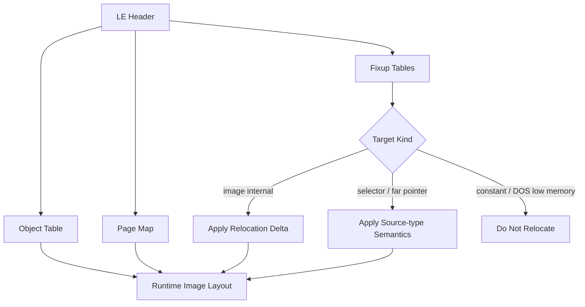

# LE 실행 형식과 fixup/relocation

LE(Linear Executable)는 OS/2 및 DOS extender 생태계에서 사용된 segmented/object-based executable format이다. header는 object table, page map, entry point, stack object, fixup page/record table 등의 위치를 제공한다. Microsoft의 오래된 executable-format 자료는 [Microsoft PE/COFF specification 다운로드 페이지](https://learn.microsoft.com/en-us/windows/win32/debug/pe-format)에서 PE 중심으로 제공되므로, LE field 자체는 Open Watcom 도구의 parser와 원본 format 문서를 함께 대조해야 한다.

## Object와 page

LE image는 하나의 flat file blob을 그대로 load하는 대신 object별 virtual size와 page mapping을 가진다. loader는 page data를 object-relative 위치에 복사하고 zero-fill 영역을 보완한다.

## Fixup

fixup record는 source 위치에 어떤 target object/offset 또는 selector/pointer를 기록할지 설명한다. relocated host base에 이미지를 놓으면 internal linear pointer에 relocation delta를 반영해야 한다. 반면 DOS low-memory offset, port number, interrupt number 같은 값은 relocation 대상이 아니다.

## 16:16과 32-bit pointer

fixup source type에 따라 selector, 16:16 far pointer, 32-bit offset/linear pointer의 byte width와 의미가 다르다. 단순히 모든 4바이트 값을 base-adjust하면 데이터 상수와 외부 address contract를 손상시킨다.

## Cross-page fixup과 부호 있는 source offset (중요)

각 fixup record의 `source_offset`은 그 record가 속한 페이지 시작 기준 **부호 있는
16비트** 오프셋이다. fixup의 32비트(또는 far) 타겟이 페이지 경계를 걸치면, 링커는
그 fixup을 타겟이 **시작하는** 페이지에 기록한다. 타겟이 이전 페이지에서 시작해
현재 페이지로 넘치는 경우 `source_offset`이 **음수**(예: `0xFFFF` = `-1`,
`0xFFFE` = `-2`)로 기록되어 "타겟이 이 페이지 시작보다 N바이트 앞에서 시작한다"를
뜻한다. 따라서 적용 위치는 반드시
`object_page_base + static_cast<int16_t>(source_offset)`로 계산해야 한다.

`source_offset`을 **부호 없는 값으로 처리하면**(예: `0xFFFF`를 그대로 더함) 쓰기가
`0x10000`바이트 높은 곳에 적용되어, 한 object-page 뒤의 **무관한 명령/데이터를
손상**시킨다. rePIU에서 이 버그가 게스트 명령 `mov edx,[esp+0x154]`(guest
`0x03021FFD`, 페이지 경계에 걸침)를 `mov edx,[esp+0x11A8A]`로 바꿔, asset 준비
루프가 잘못된 목적지 포인터를 만들어 파일명 복사에서 crash했다(Task 226,
근인 `0xDD1523B1`). 관련 코드: `ApplyLeInternalRelocations`
(`src/exe/executable_headers.cpp`), `FindSourceObjectForPage`
(`src/runtime/runtime_memory.cpp`).

# LE Format and Fixup/Relocation

LE is an object/page-oriented executable format used in OS/2 and DOS-extender ecosystems. Its header references object, page, entry, stack, and fixup tables. The [Microsoft executable-format documentation](https://learn.microsoft.com/en-us/windows/win32/debug/pe-format) is primarily PE/COFF-oriented, so LE fields must also be cross-checked against Open Watcom tooling and historical LE references.

Fixups describe source and target semantics. Internal image pointers need relocation adjustment when the host base changes; DOS low-memory offsets, interrupt numbers, ports, and ordinary constants do not.

**Cross-page fixups and the signed source offset (important).** Each fixup record's
`source_offset` is a **signed** 16-bit offset from the start of the page the record
belongs to. When a fixup's 32-bit (or far) target straddles a page boundary, the linker
records it in the page where the target *begins*; if the target starts in the previous
page and spills into the current one, `source_offset` is **negative** (e.g. `0xFFFF` =
`-1`), meaning "the target starts N bytes before this page." The write site must therefore
be computed as `object_page_base + static_cast<int16_t>(source_offset)`. Treating
`source_offset` as unsigned lands the write `0x10000` bytes too high, corrupting an
unrelated instruction or datum one object page later. In rePIU this bug rewrote the guest
instruction `mov edx,[esp+0x154]` (guest `0x03021FFD`, straddling a page boundary) into
`mov edx,[esp+0x11A8A]`, so an asset-prep loop built a wild destination pointer and
crashed the filename copy (Task 226; the `0xDD1523B1` root cause). Relevant code:
`ApplyLeInternalRelocations` (`src/exe/executable_headers.cpp`) and
`FindSourceObjectForPage` (`src/runtime/runtime_memory.cpp`).
