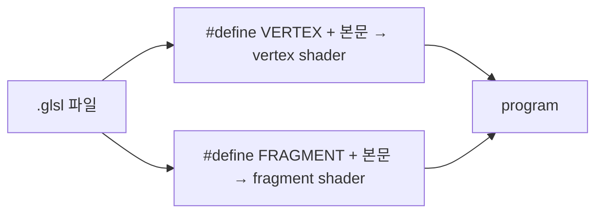

# libretro GLSL 후처리 shader 형식 / The libretro GLSL post-processing shader format

관련: [Task 768 설계](../design/20261004-768-post-process-shaders.md) ·
[후처리 shader 가이드](../guides/post-process-shaders.md)

## 한국어

### 1. 무엇인가

libretro(RetroArch)의 GL 드라이버가 쓰는 shader 형식으로, 에뮬레이터 화면 후처리 자료가
가장 많이 쌓인 형식입니다. 공식 설명은
[libretro docs: GLSL shaders](https://docs.libretro.com/development/shader/glsl-shaders/)에
있습니다. rePIU는 그중 **단일 pass `.glsl`** 부분집합을 읽습니다.

### 2. 한 파일, 두 단계

한 파일이 vertex와 fragment를 모두 담고, 호스트가 같은 텍스트를 두 번 컴파일하면서 맨 앞에
`#define VERTEX` 또는 `#define FRAGMENT`를 넣습니다. GLSL은 `#version`이 첫 문장이어야 하므로
파일이 `#version`으로 시작하면 그 줄 뒤에 넣습니다.



### 3. 호스트가 주는 값

| 이름 | 의미 |
|---|---|
| `VertexCoord`, `TexCoord`, `COLOR` | 꼭짓점 위치, 텍스처 좌표, 색 attribute |
| `MVPMatrix` | 위치를 clip 공간으로 보내는 행렬 |
| `Texture` | 입력 이미지 sampler |
| `InputSize` | 입력 이미지 중 실제 내용의 크기 |
| `TextureSize` | 입력 텍스처의 크기 (2의 거듭제곱으로 키운 텍스처를 쓰는 드라이버에서 `InputSize`와 다를 수 있음) |
| `OutputSize` | 출력 viewport 크기 |
| `FrameCount`, `FrameDirection` | 프레임 번호, 되감기 방향 |

`InputSize`/`TextureSize`는 원래 **에뮬레이터 코어의 원래 해상도**입니다. 그래서 주사선 shader는
`TexCoord.y * TextureSize.y`의 소수부로 "원래 화면의 몇 번째 줄 안의 어디인가"를 구합니다.
rePIU는 게임이 창 배율대로 고해상도로 그리므로, 실제 텍스처 크기가 아니라 게임의 논리
해상도를 이 두 값으로 줍니다(설계 4절).

### 4. `#pragma parameter`

```glsl
#pragma parameter NAME "설명" 기본값 최소 최대 [단계]
#ifdef PARAMETER_UNIFORM
uniform float NAME;
#else
#define NAME 기본값
#endif
```

호스트가 `PARAMETER_UNIFORM`을 정의하면 매개변수는 uniform이 되어 UI에서 조절되고, 정의하지 않으면
상수가 됩니다. GLSL 컴파일러는 모르는 `#pragma`를 무시합니다.

### 5. 정수 배율에서의 주사선 함정

창 배율이 정수 n이면 원래 한 줄이 출력 n줄이 되고, 출력 픽셀 중심은 그 줄 안의
`(i + 0.5) / n` 위치에 놓입니다. **n = 2이면 두 중심(0.25, 0.75)이 줄 가운데(0.5)를 기준으로
대칭**이므로, 줄 가운데에 대칭인 밝기 곡선(사인, 가우시안)은 두 행에 같은 값을 주고 주사선이
보이지 않습니다. 해결은 곡선을 비대칭으로 두거나(줄의 뒤쪽 절반을 틈으로) 빔 중심을 출력 반
픽셀만큼 옮기는 것입니다. rePIU의 내장 `scanline`은 앞의 방법을, `crt`는 뒤의 방법을 씁니다
(Task 768 로그에서 실제 GL로 확인).

### 6. rePIU가 지원하지 않는 것

다단계 preset(`.glslp`), `PrevTexture`·`PassPrev` 같은 이전 프레임·이전 pass 입력, LUT 텍스처,
Slang(`.slang`, Vulkan 계열) 형식.

## English

### 1. What it is

The shader format of libretro's (RetroArch's) GL driver, the format with the largest body of emulator
post-processing material. The official description is
[libretro docs: GLSL shaders](https://docs.libretro.com/development/shader/glsl-shaders/). rePIU reads
its **single-pass `.glsl`** subset.

### 2. One file, two stages

One file holds both the vertex and fragment stages. The host compiles the same text twice, prefixing
`#define VERTEX` or `#define FRAGMENT`; because GLSL requires `#version` to come first, the define goes
after that line when the file starts with one.

### 3. What the host supplies

Attributes `VertexCoord`, `TexCoord`, `COLOR`; uniforms `MVPMatrix`, `Texture`, `InputSize` (the size of
the real content in the input), `TextureSize` (the input texture's size, which may differ from
`InputSize` on drivers that pad to powers of two), `OutputSize` (the output viewport),
`FrameCount` and `FrameDirection`. `InputSize`/`TextureSize` are meant to be **the emulated core's
native resolution**, which is why a scanline shader takes the fraction of `TexCoord.y * TextureSize.y`
as "where inside which original line". rePIU's game draws at a high resolution matching the window
scale, so it reports the game's logical resolution in both rather than the real texture size (design
section 4).

### 4. `#pragma parameter`

`#pragma parameter NAME "description" initial minimum maximum [step]`, paired with an
`#ifdef PARAMETER_UNIFORM` block that declares a uniform or falls back to a constant. A host that
defines `PARAMETER_UNIFORM` gets UI-adjustable uniforms; GLSL compilers ignore unknown pragmas.

### 5. The scanline trap at integer scales

At an integer scale n, one original line becomes n output rows whose pixel centres sit at
`(i + 0.5) / n` within the line. **At n = 2 the two centres (0.25 and 0.75) are symmetric about the
line's middle**, so any brightness profile symmetric about the middle (sine, Gaussian) gives both rows
the same value and no scanline shows. The fixes are an asymmetric profile (the back half of the line as
the gap) or shifting the beam centre by half an output pixel. rePIU's built-in `scanline` uses the
first and `crt` the second, confirmed in a real GL context in the Task 768 log.

### 6. What rePIU does not support

Multi-pass presets (`.glslp`), previous-frame and previous-pass inputs such as `PrevTexture` and
`PassPrev`, LUT textures, and the Slang (`.slang`, Vulkan-family) format.
