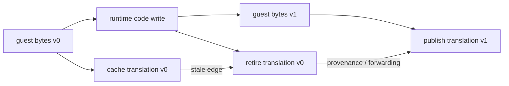

# Self-modifying code와 code-cache 일관성

## 정의

Self-modifying code(SMC)는 실행 중인 프로그램이 나중에 instruction fetch 대상이 될
memory byte를 직접 바꾸는 코드입니다. 동적 linker의 lazy import stub, JIT compiler,
runtime patch, debugger breakpoint가 대표적인 예입니다. 변경 자체가 예외 상황이라는
뜻은 아니며, CPU와 운영체제가 요구하는 동기화 규칙을 지켜야 합니다.

AOT 또는 dynamic binary translation은 guest instruction을 별도 code cache에
복사하거나 변환합니다. 이때 guest byte만 수정되고 이미 발행된 cache byte가
그대로라면 두 instruction stream이 갈라집니다. 따라서 translator는 write 감지,
stale translation 무효화, 새 translation publication, 오래된 edge 처리 정책을
가져야 합니다.

## 주요 용어

* **generation**: 동일한 guest address에서 관찰한 code byte 세대입니다.
* **retirement/invalidation**: 오래된 translation을 새 guest lookup 대상으로 더 이상
  선택하지 않는 전환입니다.
* **provenance**: 오래된 cache 주소가 어느 guest instruction에서 파생됐는지에 대한
  역방향 정보입니다. stale direct edge가 도달했을 때 안전한 복구에 필요합니다.
* **quarantine**: 안전한 재번역을 보장하지 못하는 page를 빠른 cache 실행에서 빼고
  해석 또는 single-step 같은 보수적 backend로 보내는 정책입니다.
* **publication**: 새 cache byte와 metadata가 다른 실행 경로에 보이기 시작하는
  시점입니다. partial patch를 번역하지 않도록 경계를 명확히 해야 합니다.

## CPU와 Windows의 cache 일관성

Intel은 self-modifying/cross-modifying code의 동기화 절차를 Intel® 64 and IA-32
Software Developer's Manual에서 설명합니다. 최신 원문은
[Intel SDM 문서 페이지](https://www.intel.com/content/www/us/en/developer/articles/technical/intel-sdm.html)에서
확인할 수 있습니다. Intel의
[Speculative Code Store Bypass 안내](https://www.intel.com/content/www/us/en/developer/articles/technical/software-security-guidance/advisory-guidance/speculative-code-store-bypass.html)도
SMC와 writable/executable 전환의 보안 의미를 설명합니다.

Windows에서 executable memory의 보호를 바꿀 때는
[`VirtualProtect`](https://learn.microsoft.com/en-us/windows/win32/api/memoryapi/nf-memoryapi-virtualprotect)를
사용할 수 있습니다. Microsoft 문서는 실행할 code를 쓰거나 바꾼 뒤 caller가
[`FlushInstructionCache`](https://learn.microsoft.com/en-us/windows/win32/api/processthreadsapi/nf-processthreadsapi-flushinstructioncache)로
instruction-cache 일관성을 보장해야 한다고 명시합니다.

## W^X와 write-watch

W^X(write xor execute)는 같은 memory page를 writable과 executable로 동시에 두지
않는 정책입니다. code cache를 RX→RW→RX로 전환하면 수정 중인 byte를 실행하는
위험을 줄일 수 있습니다. 다만 실행 중인 guest page의 native store를 page fault로
관찰하기 위해 한 instruction 동안 page를 RWX로 허용하는 write-watch는 code-cache
W^X와 별개의 trade-off입니다. 문서에서는 “code cache가 RWX가 아니다”와 “모든
guest page가 항상 W^X다”를 혼동하면 안 됩니다.

Trap Flag는 다음 instruction 뒤 debug exception을 발생시켜 임시 write permission을
복원하는 경계로 사용할 수 있습니다. REP/string instruction은 한 instruction에서
여러 address 또는 page를 쓸 수 있으므로 단일 element 폭만 계산해서는 일반적으로
충분하지 않습니다.

## rePIU 적용

rePIU는 원본 guest code를 수정하지 않도록 막지 않습니다. 원본 프로그램이 수행한
code write를 그대로 허용하되, translated instruction과 겹치면 기존 cache
generation을 retire합니다. 다음 안전한 진입에서 live byte를 새 generation으로
번역하고, 불확실한 경우 해당 page만 legacy quarantine합니다. 이는 원본 게임
로직을 보존하면서 translator의 파생 상태만 일관되게 만드는 정책입니다.

# Self-Modifying Code and Code-Cache Coherency

Self-modifying code changes memory bytes that may later be fetched as
instructions. Lazy import stubs, JIT compilers, runtime patches, and debugger
breakpoints are common examples. The write is not inherently an error, but it
must follow the CPU and operating-system synchronization contract.

AOT and dynamic binary translators keep a second instruction stream in a code
cache. If guest bytes change while the emitted cache remains unchanged, execution
can continue through stale semantics. A coherent translator therefore detects
writes, retires stale translations, publishes a generation from completed live
bytes, and defines how old direct and cached edges recover.

A generation identifies one observed code-byte version for a guest address.
Retirement removes an old translation from active lookup. Provenance maps stale
cache addresses back to guest instructions. Quarantine routes an unsafe page to a
conservative backend. Publication is the point at which new bytes and metadata
become executable and must not expose a partial patch.

Intel documents self- and cross-modifying-code synchronization in the
[Intel SDM](https://www.intel.com/content/www/us/en/developer/articles/technical/intel-sdm.html),
with additional W^X security context in its
[Speculative Code Store Bypass guidance](https://www.intel.com/content/www/us/en/developer/articles/technical/software-security-guidance/advisory-guidance/speculative-code-store-bypass.html).
On Windows,
[`VirtualProtect`](https://learn.microsoft.com/en-us/windows/win32/api/memoryapi/nf-memoryapi-virtualprotect)
changes page protection, and code modification must be followed by
[`FlushInstructionCache`](https://learn.microsoft.com/en-us/windows/win32/api/processthreadsapi/nf-processthreadsapi-flushinstructioncache)
as required by the Microsoft contract.

W^X keeps a page from being writable and executable at the same time. An RX→RW→RX
code-cache publication follows that policy, while a guest-page write-watch that
temporarily permits one native store as RWX is a separate trade-off. Trap Flag can
restore protection after one instruction, but REP/string instructions may write
multiple addresses or pages and require broader handling than a single operand
element width.

rePIU permits original guest code writes, retires translations that overlap them,
publishes a new generation at a safe entry boundary, and quarantines only the
affected page when safe retranslation cannot be guaranteed. The guest logic is
preserved; only translator-derived state is refreshed.
