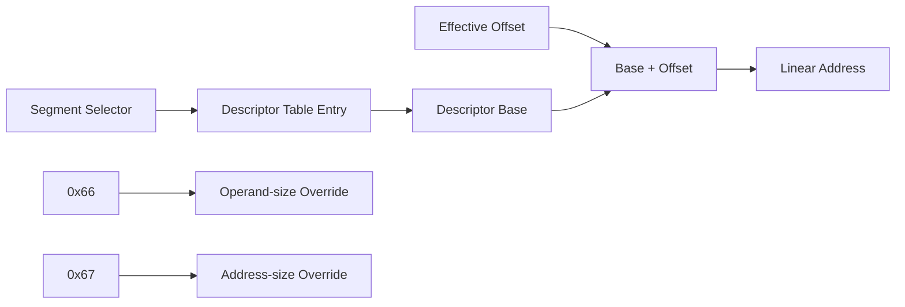

# x86 segmentation과 16/32비트 처리

## 논리 주소와 선형 주소

x86 memory operand는 일반적으로 `segment:offset` 논리 주소다. protected mode에서는 selector가 descriptor table entry를 선택하고, descriptor base와 offset을 더해 선형 주소를 만든다. 세부 동작은 Intel의 [Intel 64 and IA-32 Architectures Software Developer’s Manual](https://www.intel.com/content/www/us/en/developer/articles/technical/intel-sdm.html), 특히 Volume 3의 protected-mode memory management에 정의되어 있다.

따라서 `mov edx,[esi]`에서 `ESI=0`이어도 의미는 host pointer 0이 아니라 기본 segment인 `DS:0`이다. DS base가 0인지, 별도 base인지에 따라 선형 주소가 달라진다.

## 16비트와 32비트

세 가지 폭을 구분해야 한다.

* operand size: register/산술 값의 폭 (`AX` 대 `EAX`)
* address size: effective address 계산에 쓰는 register와 encoding
* segment descriptor의 default size: prefix가 없을 때의 기본 operand/address size

`0x66`은 operand-size override, `0x67`은 address-size override다. 예를 들어 32-bit code에서 `66 C7`은 보통 16-bit immediate store이고 `C7`은 32-bit store다. 정확한 opcode 의미는 Intel SDM Volume 2 instruction reference를 따른다.

16-bit DOS interrupt API는 32-bit protected-mode 프로그램에서도 흔히 `AH`, `AX`, `BX`, `CX`, `DX`의 low word를 contract로 사용한다. host handler는 상위 16비트를 보존해야 하는지 각 함수 규약에 따라 결정해야 한다.

## 32-bit ADD flags

`ADD r32, r/m32`는 결과뿐 아니라 `CF`, `PF`, `AF`, `ZF`, `SF`, `OF`를 갱신한다. `CF`는 unsigned carry, `OF`는 signed overflow, `AF`는 bit 3에서 bit 4로의 carry, `ZF`는 zero result, `SF`는 result 최상위 bit, `PF`는 result low byte의 even parity를 나타낸다. HLE가 ADD를 대신 실행하면 분기 결과를 보존하기 위해 이 flags를 함께 복원해야 한다. 정확한 정의는 Intel SDM Volume 2의 `ADD` 항목을 따른다.

## OR read-modify-write와 flags

`OR r/m32, imm8`은 destination을 읽고 sign-extended immediate와 OR한 뒤 같은 destination에 기록한다. `CF`와 `OF`는 0이 되고 `PF`, `ZF`, `SF`는 결과로 결정되며 `AF`는 undefined다. HLE에서는 undefined 값을 새로 추측하기보다 기존 `AF`를 보존하는 제한적 정책을 사용할 수 있다. 정확한 명령 규약은 Intel SDM Volume 2의 `OR` 항목을 따른다.

## CMP와 8-bit register encoding

`CMP r/m8, r8`은 destination에서 source를 뺀 것처럼 flags를 갱신하지만 결과를 저장하지 않는다. `CF/PF/AF/ZF/SF/OF`는 byte subtraction 결과로 결정된다. ModRM의 3-bit byte-register field는 legacy encoding에서 `0..3`이 `AL/CL/DL/BL`, `4..7`이 `AH/CH/DH/BH`를 뜻하므로 32-bit register decoder를 그대로 사용할 수 없다. 정확한 규약은 Intel SDM Volume 2의 `CMP`와 ModRM encoding을 따른다.

# x86 Segmentation and 16/32-Bit Behavior

x86 memory operands use a segment and offset. In protected mode, a selector chooses a descriptor whose base contributes to the linear address. Consequently, `ESI=0` in `mov edx,[esi]` means `DS:0`, not automatically host pointer zero.

Operand size, address size, and the segment default size are separate concepts. `0x66` overrides operand size and `0x67` overrides address size. Refer to Intel’s [architecture manuals](https://www.intel.com/content/www/us/en/developer/articles/technical/intel-sdm.html) for the normative rules.
