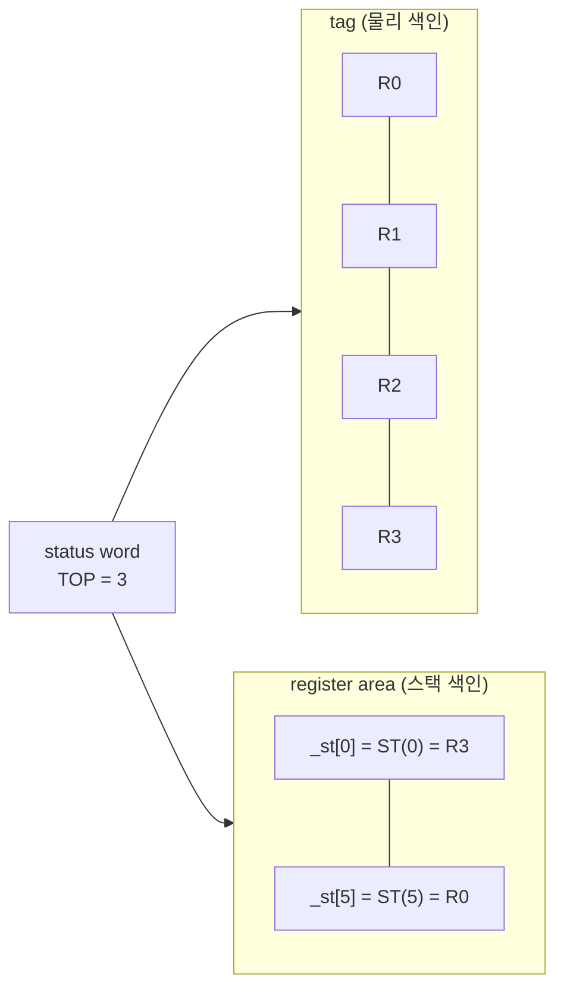

# x87 상태와 tag word / x87 state and tag words

## 요약

x87 FPU 상태를 저장하는 두 형식 FSAVE와 FXSAVE는 레지스터 **내용**을 같은
순서로 담지만 **tag**를 다른 폭으로 담는다. 두 형식 사이를 오가는 코드는
tag를 단순 복사할 수 없고, 한쪽 방향에서는 레지스터 내용을 분류해야 한다.

## 레지스터 두 가지 색인

x87 레지스터는 두 이름을 가진다.

* 물리 레지스터 `R0`..`R7` — 하드웨어 슬롯
* 스택 위치 `ST(0)`..`ST(7)` — `ST(i) = R[(TOP + i) mod 8]`

`TOP`은 status word 비트 11..13에 있다. `FLD`는 `TOP`을 1 줄인 뒤 새
`ST(0)`에 쓰고, `FSTP`는 쓰고 나서 `TOP`을 1 늘린다.

**FSAVE와 FXSAVE 모두 레지스터 내용을 `ST(0)`부터 순서대로 저장하고,
tag는 물리 색인으로 저장한다.** 따라서 물리 레지스터 `j`의 내용은 저장
이미지의 `j`번째가 아니라 `(j - TOP) mod 8`번째에 있다.

## 두 형식의 tag

| | FSAVE tag word | FXSAVE `ftw` |
|---|---|---|
| 폭 | 16 bit, 레지스터당 2 bit | 8 bit, 레지스터당 1 bit |
| 값 | `00` valid, `01` zero, `10` special, `11` empty | `1` 사용 중, `0` 비어 있음 |
| 색인 | 물리 `R0`..`R7` | 물리 `R0`..`R7` |

* `valid` — 정규화된 유한값
* `zero` — 부호 있는 0
* `special` — 무한대, NaN, 비정규, unnormal
* `empty` — 값이 들어 있지 않음

Windows의 `FLOATING_SAVE_AREA::TagWord`는 FSAVE 형식이고, glibc의
x86-64 `struct _libc_fpstate::ftw`는 FXSAVE 축약 형식이다. 32-bit glibc의
`_libc_fpstate::tag`는 FSAVE 형식이라 Windows 필드와 1:1로 맞는다.

## 변환 규칙

### 축약 → 전체 (FXSAVE → FSAVE)

물리 레지스터 `j`마다:

* `ftw` 비트 `j`가 0이면 `11`(empty). **내용을 보지 않는다.**
* 비트가 1이면 `_st[(j - TOP) mod 8]`의 80-bit 값을 분류한다.
  * 지수(부호 비트 제외)가 `0x7FFF`면 `10`(special)
  * 지수가 `0`이면 significand가 0일 때 `01`(zero), 아니면 `10`(special)
  * 그 외에는 significand 최상위 비트가 서면 `00`(valid), 아니면
    `10`(special)

이 규칙은 Linux 커널의 `twd_fxsr_to_i387`과 같다.

### 전체 → 축약 (FSAVE → FXSAVE)

물리 레지스터 `j`의 tag가 `11`이 아니면 `ftw` 비트 `j`를 세운다. 회전은
필요 없다. 커널의 `twd_i387_to_fxsr`과 같다.

### 왜 한쪽만 내용을 보는가

`empty`와 `zero`는 저장된 80-bit 값이 똑같다. 내용만으로는 구분할 수
없으므로, 축약 tag를 먼저 읽지 않으면 `empty`를 복원할 방법이 없다.

## 이것이 왜 조용히 틀리는가

축약 tag에 잘못 `1`을 세우면 하드웨어는 그 레지스터가 값을 담고 있다고
믿는다. 다음 `FLD`는 `TOP`을 줄여 그 레지스터를 가리키고, 비어 있지 않은
레지스터에 쓰는 것이므로 **x87 stack overflow**가 된다. 기본 상태에서
invalid-operation 예외는 마스킹돼 있으므로 예외는 오르지 않고, 목적지에
QNaN indefinite가 들어가며 status word에 `IE`와 `C1`이 선다. 이후 모든
부동소수 연산이 NaN을 전파한다.

즉 증상은 예외가 아니라 **모든 계산 결과가 NaN이 되는 것**이고, 최초
원인 지점에서 멀리 떨어진 곳에서 관측된다.

POSIX signal handler는 이 경로를 자주 지난다. 커널은 signal frame에 FPU
상태를 저장하고 `sigreturn`에서 되돌리므로, handler가 frame의 `ftw`를
고치면 그대로 `FXRSTOR`된다.

## 출처

* Intel® 64 and IA-32 Architectures Software Developer's Manual,
  Volume 1, "x87 FPU Tag Word" 및 Volume 2, `FXSAVE` / `FSAVE` /
  `FLD` 항목 — <https://www.intel.com/sdm>
* Linux `arch/x86/kernel/fpu/regset.c`, `twd_fxsr_to_i387` 및
  `twd_i387_to_fxsr`
* glibc `sysdeps/unix/sysv/linux/x86/sys/ucontext.h`,
  `struct _libc_fpstate`

관련 문서: [posix-signal-handler-state-sharing](posix-signal-handler-state-sharing.md) ·
[x86-32bit-encodings-in-long-mode](x86-32bit-encodings-in-long-mode.md)

---

# x87 state and tag words

## Summary

FSAVE and FXSAVE, the two x87 save formats, hold register **contents** in the
same order but hold the **tag** at different widths. Code that moves between
them cannot copy the tag; in one direction it has to classify the register
contents.

## Two ways to name a register

An x87 register has two names: the physical slot `R0`..`R7`, and the stack
position `ST(0)`..`ST(7)`, where `ST(i) = R[(TOP + i) mod 8]` and `TOP` lives
in status-word bits 11..13. `FLD` decrements `TOP` and writes the new `ST(0)`;
`FSTP` writes and then increments `TOP`.

**Both FSAVE and FXSAVE store the register contents starting from `ST(0)` and
index the tag by the physical register.** The contents of physical register
`j` are therefore at image slot `(j - TOP) mod 8`, not slot `j`.

## The two tag formats

| | FSAVE tag word | FXSAVE `ftw` |
|---|---|---|
| Width | 16 bits, 2 per register | 8 bits, 1 per register |
| Values | `00` valid, `01` zero, `10` special, `11` empty | `1` in use, `0` empty |
| Index | physical `R0`..`R7` | physical `R0`..`R7` |

`valid` is a normalized finite value, `zero` is a signed zero, `special`
covers infinities, NaNs, denormals and unnormals, and `empty` means the
register holds nothing.

Windows' `FLOATING_SAVE_AREA::TagWord` is the FSAVE form; glibc's x86-64
`struct _libc_fpstate::ftw` is the FXSAVE abridged form. On 32-bit glibc,
`_libc_fpstate::tag` is the FSAVE form and maps one-to-one onto the Windows
field.

## Conversion rules

### Abridged to full (FXSAVE to FSAVE)

For each physical register `j`: if `ftw` bit `j` is clear the tag is `11`
(empty) and **the contents are not examined**; otherwise classify the 80-bit
value at `_st[(j - TOP) mod 8]` — exponent (sign masked off) of `0x7FFF` is
`10` (special); exponent of `0` is `01` (zero) when the significand is zero
and `10` otherwise; anything else is `00` (valid) when the significand's top
bit is set and `10` otherwise. This is the Linux kernel's `twd_fxsr_to_i387`.

### Full to abridged (FSAVE to FXSAVE)

Set `ftw` bit `j` whenever the tag of physical register `j` is not `11`. No
rotation is needed. This is the kernel's `twd_i387_to_fxsr`.

### Why only one direction inspects contents

An empty register and a register holding zero contain the same 80 bits.
Contents alone cannot tell them apart, so `empty` is unrecoverable unless the
abridged tag is read first.

## Why getting this wrong fails silently

An abridged tag bit wrongly set tells the hardware the register holds a value.
The next `FLD` decrements `TOP` onto that register and so writes a register
that is not empty, which is an **x87 stack overflow**. The invalid-operation
exception is masked by default, so nothing is raised: the destination receives
the QNaN indefinite and the status word gets `IE` and `C1`. Every later
floating-point operation then propagates a NaN.

The symptom is therefore not a fault but **every result becoming a NaN**,
observed far from where it started.

POSIX signal handlers pass through this conversion often. The kernel saves FPU
state into the signal frame and restores it on `sigreturn`, so an `ftw` a
handler edits in the frame is what `FXRSTOR` loads.

## Sources

* Intel® 64 and IA-32 Architectures Software Developer's Manual, Volume 1,
  "x87 FPU Tag Word", and Volume 2, the `FXSAVE`, `FSAVE` and `FLD` entries —
  <https://www.intel.com/sdm>
* Linux `arch/x86/kernel/fpu/regset.c`, `twd_fxsr_to_i387` and
  `twd_i387_to_fxsr`
* glibc `sysdeps/unix/sysv/linux/x86/sys/ucontext.h`, `struct _libc_fpstate`

Related: [posix-signal-handler-state-sharing](posix-signal-handler-state-sharing.md) ·
[x86-32bit-encodings-in-long-mode](x86-32bit-encodings-in-long-mode.md)
