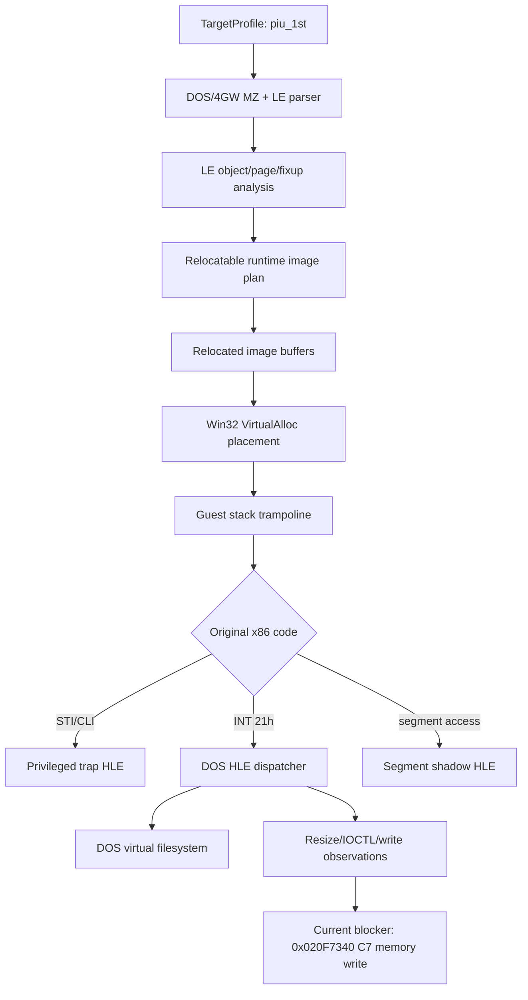
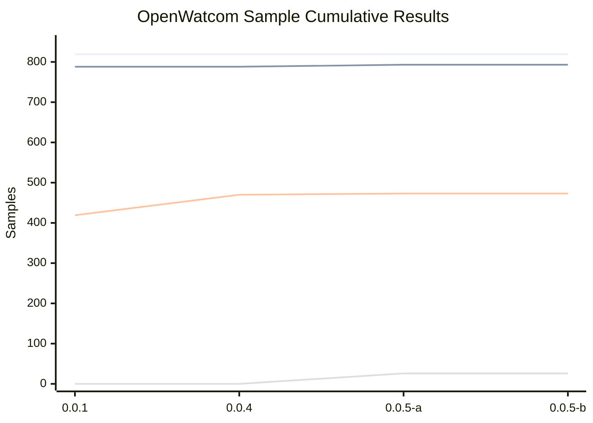
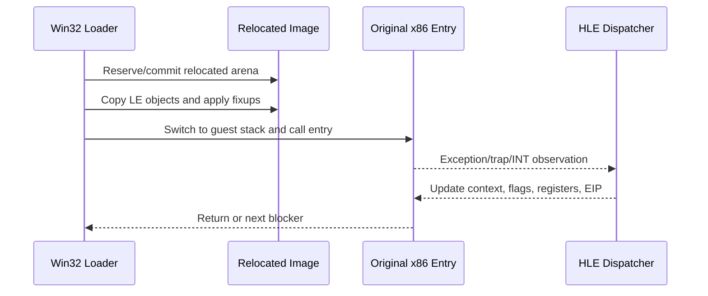

# Preserving DOS4GW Execution: Work in Progress 1

범위: [`40fc5a6`](https://github.com/nworkers/rePIU/commit/40fc5a69a781b62e18f66e1f8fbe3173c6232d7f)부터 [`e06f13c`](https://github.com/nworkers/rePIU/commit/e06f13c2297a02df4ec7a2febf1115a86d8faa8d)까지

## 주요 변경 사항

이번 진행의 핵심은 원본 DOS/4G 게임 로직을 C++로 다시 쓰지 않고, 원본 32-bit x86 코드를 Win32 프로세스 안에서 직접 실행하기 위한 기반을 단계적으로 쌓은 것이다. 처음에는 `PIU.EXE`를 실행하지 않는 분석 도구로 MZ/LE 구조를 읽었고, 이후 LE object mapping, fixup decoding, internal relocation dry-run, relocated image buffer, Win32 process memory placement, guest stack 전환, 그리고 관측 기반 HLE trap 처리로 확장했다.



초기 커밋들은 프로젝트 원칙과 아키텍처 문서를 먼저 세우고, `piu_1st` target profile과 HLE profile을 정적으로 등록했다. 이어서 `Dos4gwExecutableLoader`가 MZ header, LE header, object table, page table, fixup page table, fixup record table을 읽고, relocation source type을 분류하게 되었다. 이 단계의 대표 커밋은 [`364ddbc`](https://github.com/nworkers/rePIU/commit/364ddbc82ba98c20219eb89051ff2b6c465ec682), [`d872740`](https://github.com/nworkers/rePIU/commit/d8727403eb9d8fe27d957bb1861d690efb53c613), [`6904572`](https://github.com/nworkers/rePIU/commit/69045722f7a23b516a707aecb0f3af86ea374a30), [`3b7bc41`](https://github.com/nworkers/rePIU/commit/3b7bc41743cfbaba0faad4ce73be9caae0f30400)이다.

중간 단계에서는 Win32 x86 host에서 원본 코드가 기대하는 주소를 직접 예약하려 했지만, 낮은 주소 영역은 이미 점유된 경우가 많았다. 그래서 fixed low-address 실행만 고집하지 않고, 원본 LE object를 안전한 relocated base에 배치한 뒤 fixup을 다시 적용하는 방향으로 전환했다. 이 흐름은 [`3e59c49`](https://github.com/nworkers/rePIU/commit/3e59c490c18cd7d9da0caeea960dff128709601a), [`afcbc71`](https://github.com/nworkers/rePIU/commit/afcbc7117278abe5a52d085cdffeb1051fde8f3c), [`21948d5`](https://github.com/nworkers/rePIU/commit/21948d56491dd6d9e5b2da66b309e59924b211ec), [`831b8ae`](https://github.com/nworkers/rePIU/commit/831b8ae3bd5174c3df490f0e5f05b50ae133a8d3), [`38be1eb`](https://github.com/nworkers/rePIU/commit/38be1ebe0734cf644496e9030f5329e445753a45)에서 이어졌다.

실행 단계에서는 `repiu_loader_win32`가 relocated image를 Win32 process memory에 올리고, guest stack으로 전환한 뒤 원본 entry로 진입한다. 예외와 trap은 끝이 아니라 관측 지점으로 취급한다. `STI` privileged instruction을 첫 HLE trap으로 처리하고, 이후 `INT 21h AH=0x30`, 관측된 `AH=0xFF`, segment register load/store, segment override memory load, DOS filesystem HLE를 순차적으로 연결했다. 대표 커밋은 [`58db6f2`](https://github.com/nworkers/rePIU/commit/58db6f2d827570f894158590302df3ad0bcc0929), [`baa89f4`](https://github.com/nworkers/rePIU/commit/baa89f4e3e4bae8f98529cbd2b18103ed32bcd94), [`72ab28b`](https://github.com/nworkers/rePIU/commit/72ab28b51402d0a94cb81f310e2b6449cce6bc35), [`0e7a80b`](https://github.com/nworkers/rePIU/commit/0e7a80baf8399777272f8caace1e6078f941c049), [`ed3ccc2`](https://github.com/nworkers/rePIU/commit/ed3ccc211f4f19802c0bb3f9eed3308bcc6b0283), [`a8cf592`](https://github.com/nworkers/rePIU/commit/a8cf592cba9d00ed6767a8ac7167235befad9119), [`5270ee9`](https://github.com/nworkers/rePIU/commit/5270ee906dfe12e05c27fa7bb676782afbff5e82)이다.

마지막 커밋 기준 `piu_1st`는 DOS current directory 변경, 파일 열기, IOCTL, console write, resize 관측을 통과해 `stage.cfg` 열기 시도까지 도달했다. 파일은 현재 자산 경로에서 없기 때문에 DOS error `0x0002`로 실패 처리되고, 이후 일반 메모리 write에서 다음 blocker가 드러난 상태다.

```text
Win32 minimal execution exception caught: true
Win32 minimal execution exception code: 0xC0000005
Win32 minimal execution exception address: 0x020F7340
Win32 handled DOS interrupt count: 88
Win32 last handled DOS interrupt AH: 0x4A
Win32 handled DOS chdir count: 1
Win32 last DOS chdir guest path: \datas\bga
Win32 last DOS chdir virtual path: \DATAS\BGA
Win32 handled DOS open count: 2
Win32 last DOS open guest path: stage.cfg
Win32 last DOS open virtual path: \DATAS\BGA\STAGE.CFG
Win32 last DOS open result: failure
Win32 last DOS open error: 0x0002
Win32 handled DOS IOCTL count: 2
Win32 handled DOS resize count: 40
Win32 last DOS resize selector: 0x0024
Win32 last DOS resize paragraphs: 0x4AE1
Win32 last DOS resize result: success
Relocated exception bytes: ... [C7] 01 FF FF FF FF ...
Current execution blocker: unhandled or unclassified instruction/memory access at exception point
```

OpenWatcom sample test는 DOS/4GW console sample 호환성의 회귀 지표로 추가했다. 최신 기준선은 `819`개 sample 중 빌드 통과 `793`, 빌드 제외 `26`, 실행 대상 `793`, 실행 통과 `473`이다. 전체 통과율은 `57.8%`, 빌드 통과율은 `96.8%`, 실행 통과율은 `59.6%`다.

| 기록 파일 | 버전 | 전체 | 빌드 통과 | 빌드 제외 | 실행 대상 | 실행 통과 | 전체 통과율 |
| --- | --- | ---: | ---: | ---: | ---: | ---: | ---: |
| `20260709-171446-0.0.1.json` | 0.0.1 | 819 | 788 | 0 | 788 | 419 | 51.2% |
| `20260709-203015-0.0.4.json` | 0.0.4 | 819 | 788 | 0 | 788 | 470 | 57.4% |
| `20260709-235727-0.0.5.json` | 0.0.5 | 819 | 793 | 26 | 793 | 473 | 57.8% |
| `20260710-000038-0.0.5.json` | 0.0.5 | 819 | 793 | 26 | 793 | 473 | 57.8% |



현재 검증은 `scripts/test_all.ps1`로 수행했다. 일반 샌드박스 실행에서는 CMake가 `build/win32_x86_debug/_deps/spdlog-subbuild`의 stamp 파일 timestamp를 복원하지 못해 실패했지만, 동일 명령을 권한 상승으로 재실행했을 때 Win32 x86 host 빌드, `dos4gw_hello` 실행, `piu_1st` 관측 지점 확인이 모두 통과했다.

## 사용된 기술 스택

첫 번째 축은 DOS/4GW와 Linear Executable(LE) 분석이다. LE는 MZ header 뒤의 protected-mode executable format으로, DOS extender가 32-bit protected-mode 코드를 실행할 때 사용했다. 이 프로젝트에서는 LE object table과 page table을 읽어 원본 코드/데이터 object를 구성하고, fixup record를 해석해 relocated base에 맞는 내부 포인터 값을 다시 쓴다. 참고: [Linear Executable 개요](https://en.wikipedia.org/wiki/Linear_Executable).

두 번째 축은 Win32 x86 직접 실행이다. 원본 코드를 에뮬레이터 안에서 다시 구현하지 않고, 32-bit host process 안에 executable memory를 만들고 원본 entry로 점프한다. `VirtualAlloc`은 process virtual address space를 reserve/commit할 수 있으며, 이 프로젝트는 fixed low address가 막히면 relocated base 후보를 찾고 그 위치에 object buffer를 배치한다. 참고: [Microsoft VirtualAlloc](https://learn.microsoft.com/en-us/windows/win32/api/memoryapi/nf-memoryapi-virtualalloc).



세 번째 축은 DOS `INT 21h` HLE다. DOS API는 `INT 21h`와 `AH` subfunction 조합으로 파일, 디렉터리, 콘솔, 메모리 서비스를 제공한다. 이번 범위에서 중요한 관측 서비스는 `AH=0x30` DOS version query, `AH=0x3B` chdir, `AH=0x3D` open, `AH=0x40` write, `AH=0x44` IOCTL, `AH=0x4A` memory resize다. 프로젝트 구현은 모든 DOS를 한 번에 흉내 내지 않고, `piu_1st`와 sample이 실제로 밟은 서비스만 최소 의미로 연결한다. 참고: [DOS API INT 21h 목록](https://en.wikipedia.org/wiki/DOS_API).

네 번째 축은 segment register shadow와 privileged instruction trap이다. Win32 user mode에서 `STI` 같은 privileged instruction은 그대로 실행할 수 없고, guest의 `DS/ES/FS` 의미도 host segment register와 1:1로 대응하지 않는다. 그래서 exception context를 관측하고, 필요한 경우 guest segment selector를 별도 shadow state로 유지하면서 memory access 의미를 HLE로 보정한다. 이 접근은 원본 실행 흐름을 보존하면서 OS/CPU privilege 경계만 host 쪽에서 대체한다.

다섯 번째 축은 OpenWatcom sample 기반 회귀 테스트다. OpenWatcom은 DOS/4GW console runtime과 잘 맞는 C/C++ sample을 제공하지만, 라이선스 조건 때문에 sample source와 EXE를 저장소에 vendoring하지 않았다. 대신 로컬 설치물에서 빌드하고, Git에는 테스트 스크립트, baseline, history JSON만 저장한다. 참고: [OpenWatcom v2 저장소](https://github.com/open-watcom/open-watcom-v2), [OpenWatcom license](https://github.com/open-watcom/open-watcom-v2/blob/master/license.txt).

---

# Preserving DOS4GW Execution: Work in Progress 1

Range: [`40fc5a6`](https://github.com/nworkers/rePIU/commit/40fc5a69a781b62e18f66e1f8fbe3173c6232d7f) through [`e06f13c`](https://github.com/nworkers/rePIU/commit/e06f13c2297a02df4ec7a2febf1115a86d8faa8d)

## Major Changes

The core of this progress is a step-by-step foundation for running the original 32-bit x86 DOS/4G code inside a Win32 process without rewriting the game logic in C++. The work started with a non-executing analyzer for `PIU.EXE`, then grew into LE object mapping, fixup decoding, internal relocation dry-runs, relocated image buffers, Win32 process memory placement, guest stack switching, and observation-driven HLE trap handling.


The early commits established the project rules and architecture documents first, then registered the `piu_1st` target profile and HLE profile statically. After that, `Dos4gwExecutableLoader` learned to read the MZ header, LE header, object table, page table, fixup page table, and fixup record table, then classify relocation source types. Representative commits include [`364ddbc`](https://github.com/nworkers/rePIU/commit/364ddbc82ba98c20219eb89051ff2b6c465ec682), [`d872740`](https://github.com/nworkers/rePIU/commit/d8727403eb9d8fe27d957bb1861d690efb53c613), [`6904572`](https://github.com/nworkers/rePIU/commit/69045722f7a23b516a707aecb0f3af86ea374a30), and [`3b7bc41`](https://github.com/nworkers/rePIU/commit/3b7bc41743cfbaba0faad4ce73be9caae0f30400).

In the middle phase, the Win32 x86 host tried to reserve the original low address range expected by the original code, but that range is often already occupied. Instead of relying only on fixed low-address execution, the loader moved toward placing original LE objects at a safe relocated base and reapplying fixups for that base. This direction spans [`3e59c49`](https://github.com/nworkers/rePIU/commit/3e59c490c18cd7d9da0caeea960dff128709601a), [`afcbc71`](https://github.com/nworkers/rePIU/commit/afcbc7117278abe5a52d085cdffeb1051fde8f3c), [`21948d5`](https://github.com/nworkers/rePIU/commit/21948d56491dd6d9e5b2da66b309e59924b211ec), [`831b8ae`](https://github.com/nworkers/rePIU/commit/831b8ae3bd5174c3df490f0e5f05b50ae133a8d3), and [`38be1eb`](https://github.com/nworkers/rePIU/commit/38be1ebe0734cf644496e9030f5329e445753a45).

In the execution phase, `repiu_loader_win32` places the relocated image into Win32 process memory, switches to the guest stack, and enters the original entry point. Exceptions and traps are treated as observation points rather than dead ends. The loader handles `STI` as the first HLE trap, then gradually connects `INT 21h AH=0x30`, the observed `AH=0xFF`, segment register load/store, segment override memory loads, and DOS filesystem HLE. Representative commits include [`58db6f2`](https://github.com/nworkers/rePIU/commit/58db6f2d827570f894158590302df3ad0bcc0929), [`baa89f4`](https://github.com/nworkers/rePIU/commit/baa89f4e3e4bae8f98529cbd2b18103ed32bcd94), [`72ab28b`](https://github.com/nworkers/rePIU/commit/72ab28b51402d0a94cb81f310e2b6449cce6bc35), [`0e7a80b`](https://github.com/nworkers/rePIU/commit/0e7a80baf8399777272f8caace1e6078f941c049), [`ed3ccc2`](https://github.com/nworkers/rePIU/commit/ed3ccc211f4f19802c0bb3f9eed3308bcc6b0283), [`a8cf592`](https://github.com/nworkers/rePIU/commit/a8cf592cba9d00ed6767a8ac7167235befad9119), and [`5270ee9`](https://github.com/nworkers/rePIU/commit/5270ee906dfe12e05c27fa7bb676782afbff5e82).

As of the latest commit, `piu_1st` reaches a `stage.cfg` open attempt after passing DOS current-directory change, file open, IOCTL, console write, and resize observations. The file currently does not exist at the asset path, so the DOS open is reported as error `0x0002`; after that, the next blocker is a normal memory write.

```text
Win32 minimal execution exception caught: true
Win32 minimal execution exception code: 0xC0000005
Win32 minimal execution exception address: 0x020F7340
Win32 handled DOS interrupt count: 88
Win32 last handled DOS interrupt AH: 0x4A
Win32 handled DOS chdir count: 1
Win32 last DOS chdir guest path: \datas\bga
Win32 last DOS chdir virtual path: \DATAS\BGA
Win32 handled DOS open count: 2
Win32 last DOS open guest path: stage.cfg
Win32 last DOS open virtual path: \DATAS\BGA\STAGE.CFG
Win32 last DOS open result: failure
Win32 last DOS open error: 0x0002
Win32 handled DOS IOCTL count: 2
Win32 handled DOS resize count: 40
Win32 last DOS resize selector: 0x0024
Win32 last DOS resize paragraphs: 0x4AE1
Win32 last DOS resize result: success
Relocated exception bytes: ... [C7] 01 FF FF FF FF ...
Current execution blocker: unhandled or unclassified instruction/memory access at exception point
```

The OpenWatcom sample test was added as a regression metric for DOS/4GW console sample compatibility. The latest baseline covers `819` samples: `793` build passes, `26` explicit build skips, `793` run-eligible samples, and `473` run passes. The overall pass rate is `57.8%`, the build pass rate is `96.8%`, and the run pass rate is `59.6%`.

| History file | Version | Total | Build passed | Build skipped | Run eligible | Run passed | Overall pass rate |
| --- | --- | ---: | ---: | ---: | ---: | ---: | ---: |
| `20260709-171446-0.0.1.json` | 0.0.1 | 819 | 788 | 0 | 788 | 419 | 51.2% |
| `20260709-203015-0.0.4.json` | 0.0.4 | 819 | 788 | 0 | 788 | 470 | 57.4% |
| `20260709-235727-0.0.5.json` | 0.0.5 | 819 | 793 | 26 | 793 | 473 | 57.8% |
| `20260710-000038-0.0.5.json` | 0.0.5 | 819 | 793 | 26 | 793 | 473 | 57.8% |


Current verification used `scripts/test_all.ps1`. The normal sandbox run failed because CMake could not restore a timestamp under `build/win32_x86_debug/_deps/spdlog-subbuild`, but rerunning the same command with elevated permissions passed the Win32 x86 host build, `dos4gw_hello` execution, and the `piu_1st` observation check.

## Technology Stack Used

The first axis is DOS/4GW and Linear Executable analysis. LE is a protected-mode executable format following an MZ header, used by DOS extenders to run 32-bit protected-mode code. This project reads the LE object and page tables to reconstruct original code/data objects, then decodes fixup records and writes relocated internal pointer values for the selected relocated base. Reference: [Linear Executable overview](https://en.wikipedia.org/wiki/Linear_Executable).

The second axis is direct Win32 x86 execution. Instead of reimplementing original code inside an emulator, the loader creates executable memory inside a 32-bit host process and jumps to the original entry. `VirtualAlloc` can reserve and commit process virtual address space; this project probes relocated base candidates when the fixed low address range is blocked, then places object buffers there. Reference: [Microsoft VirtualAlloc](https://learn.microsoft.com/en-us/windows/win32/api/memoryapi/nf-memoryapi-virtualalloc).


The third axis is DOS `INT 21h` HLE. The DOS API uses `INT 21h` plus an `AH` subfunction for file, directory, console, and memory services. Important observed services in this range include `AH=0x30` DOS version query, `AH=0x3B` chdir, `AH=0x3D` open, `AH=0x40` write, `AH=0x44` IOCTL, and `AH=0x4A` memory resize. The implementation does not emulate all of DOS at once; it connects only the services actually reached by `piu_1st` and the samples, with minimal semantics. Reference: [DOS API INT 21h list](https://en.wikipedia.org/wiki/DOS_API).

The fourth axis is segment-register shadowing and privileged-instruction traps. Win32 user mode cannot execute privileged instructions such as `STI` directly, and guest `DS/ES/FS` semantics do not map one-to-one to host segment registers. The loader observes exception contexts and, when needed, keeps guest segment selectors in separate shadow state while correcting memory access behavior through HLE. This preserves the original execution flow while replacing only the OS/CPU privilege boundary.

The fifth axis is OpenWatcom sample-based regression testing. OpenWatcom provides C/C++ samples that are useful for DOS/4GW console runtime coverage, but sample sources and EXEs are not vendored into the repository because of license conditions. Instead, local installed samples are built outside Git, while test scripts, baselines, and history JSON are tracked. References: [OpenWatcom v2 repository](https://github.com/open-watcom/open-watcom-v2), [OpenWatcom license](https://github.com/open-watcom/open-watcom-v2/blob/master/license.txt).
