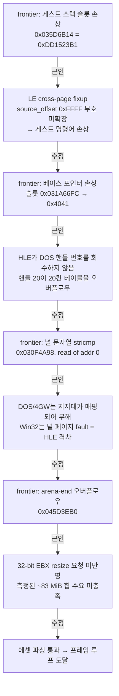
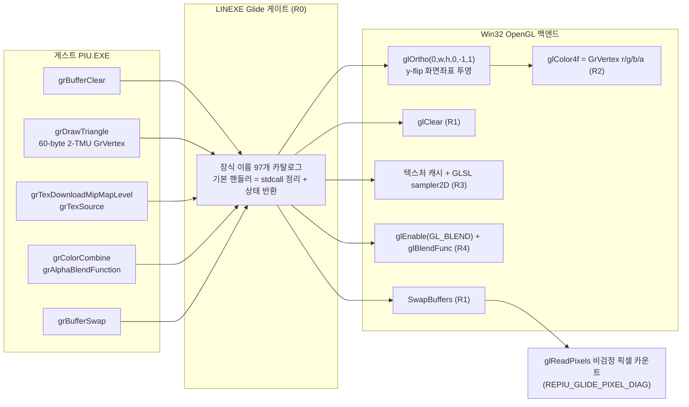
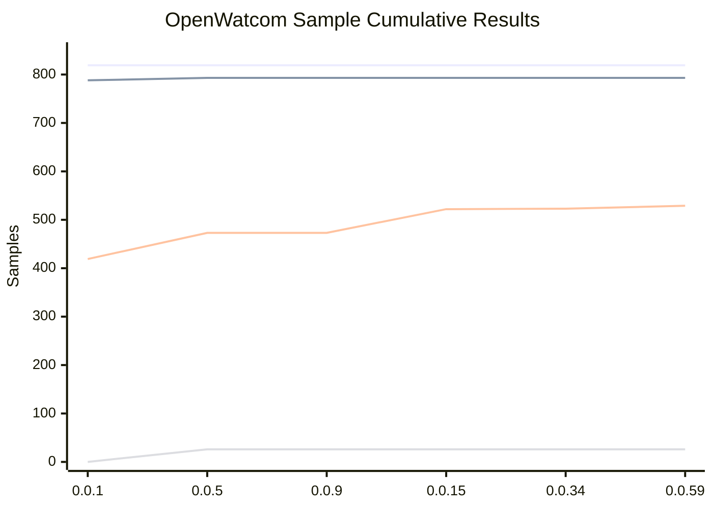
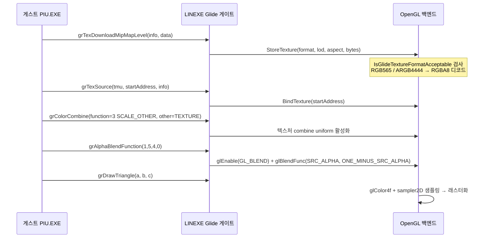
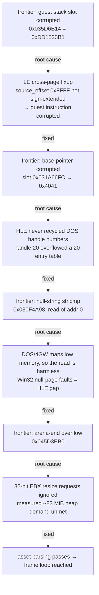
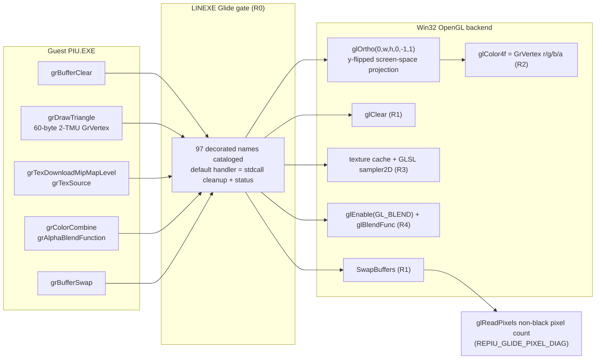
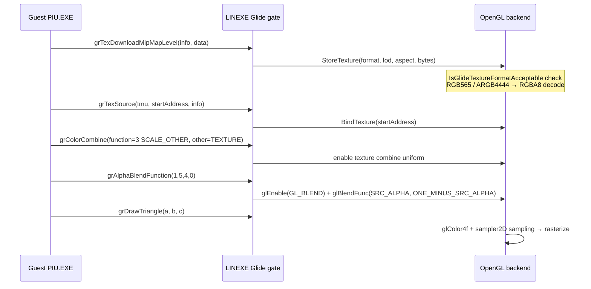

# Glide Render Pipeline: From Black Screen to First Pixels — Work in Progress 3

범위: [`c96fef2`](https://github.com/nworkers/rePIU/commit/c96fef20d4eee6c31d234d1700394e17a005305d)부터 [`9718bf8`](https://github.com/nworkers/rePIU/commit/9718bf85fa167229edf86cf72af25bcb53dfb2dc)까지 (v0.0.35 → v0.0.77)

지난 포스트의 주제는 "얼마나 빨리 실행되는가"였다. Native AOT 동적 번역기를 도입해 single-step trap 오버헤드를 줄이는 작업이었다.

이번 범위의 주제는 "얼마나 멀리 실행되는가"다. 실행이 빨라진 덕분에 이전에는 시간 안에 도달하지 못하던 지점까지 진행할 수 있게 되었고, 그러자 그때까지 가려져 있던 결함들이 차례로 드러났다. 이 결함들을 하나씩 제거한 결과 `PIU.EXE`는 부팅과 에셋 파싱을 지나 프레임 루프에 정착했고, 마침내 창에 실제 픽셀을 그리기 시작했다.

## 주요 변경 사항

### 1. 게스트 상태를 조용히 망가뜨리던 결함 제거

이번 범위의 전반부는 frontier(다음 크래시 지점)를 하나씩 추적하는 방식으로 진행했다. 각 frontier는 처음에는 게스트 코드의 버그처럼 보였지만, 근인은 예외 없이 HLE 계층이 원본 DOS/LE 환경의 계약을 정확히 재현하지 못한 데 있었다.



* **LE cross-page fixup 부호확장** ([`c4c2aad`](https://github.com/nworkers/rePIU/commit/c4c2aad4291bbc1b01ecb8f2b8b9c2c5d82b57a0), v0.0.52). fixup record의 `source_offset` 값 `0xFFFF`는 페이지 경계를 걸친 fixup을 뜻하는 `-1`인데, 이를 부호 확장 없이 사용해 게스트 명령어 자체를 덮어썼다. `int16_t` 부호확장으로 수정했다. 이 근인을 잡기까지 watchpoint 조사가 여러 차례 실패했고, 결정적 관측 기법은 trap 백엔드의 full 단일스텝이었다.
* **DOS 파일 핸들 재활용** ([`c1ffbc0`](https://github.com/nworkers/rePIU/commit/c1ffbc01afe1c8c496ee02820ca182e8a4261755), v0.0.54). HLE의 `OpenDosFile`이 핸들 번호를 단조 증가시키고 `CloseDosFile`에서 회수하지 않았다. 게임이 파일을 16번 순차로 열고 닫으면(동시 열림은 1~2개뿐) 16번째 open이 핸들 20을 받는다. 그런데 게스트 Watcom clib의 핸들 플래그 테이블은 정확히 20칸이고, `table[20]`의 주소가 곧 그 테이블의 베이스 포인터 슬롯이다. 게스트가 `table[20]`에 쓰는 순간 베이스 포인터가 `0x4041`로 손상됐다. 실제 DOS는 가장 낮은 free 핸들을 반환하고 close 시 회수하므로 핸들 번호가 5~6을 벗어나지 않는다. lowest-free 할당으로 수정했다.
* **DOS/4GW 저지대 read 허용** ([`e55644e`](https://github.com/nworkers/rePIU/commit/e55644e0f5e706de2e9f3b0c1fd69f3f42a7ac42), v0.0.58). 빈 텍스처 descriptor를 파싱하다 주소 0을 읽는 경로가 있다. DOS/4GW에서는 저지대가 매핑되어 있어 무해하지만 Win32에서는 널 페이지 fault다. 데이터 버그가 아니라 HLE 격차로 재분류하고 읽기를 에뮬레이트했다.
* **arena 사이징** ([`b2c817f`](https://github.com/nworkers/rePIU/commit/b2c817fd35b6f875c42ba24adf577d0c376945af), v0.0.47). 32-bit EBX resize 요청을 존중하고, 게임의 측정된 약 83 MiB 힙 수요에 맞춰 arena를 잡아 arena-end 오버플로우를 제거했다.

이 축에서 반복된 교훈은 분명하다. "게스트가 이상하게 동작한다"는 관측은 거의 항상 HLE가 원본 환경의 계약을 어겼다는 신호였고, 게스트 코드를 고치려는 시도는 매번 회귀로 돌아왔다.

### 2. 실행 인프라 견고화

* **AOT return inline cache 확장** ([`fd2f906`](https://github.com/nworkers/rePIU/commit/fd2f906cb7ab9791e8ce5bfd3b4f0b00e9414431), v0.0.46). Glide 진입 이후 디코드가 멈추는 현상을 라이브 텔레메트리로 추적한 결과 return-target thrashing이었다. 단일 엔트리 캐시를 4-엔트리 체인으로 넓혀 해소했다.
* **execution_trampoline 모듈 분해** ([`d1673e2`](https://github.com/nworkers/rePIU/commit/d1673e24451824e53ab6206bfa978100e5b15415), v0.0.60). 하나의 거대 파일에 누적되던 실행 트램펄린을 책임별 하위 시스템 모듈로 분리했다. AGENTS.md의 "독립적으로 이름 붙일 수 있는 하위 시스템은 전용 파일로 추출한다" 규칙을 뒤늦게 적용한 정리 작업이다.
* **AOT/Glide 게이트 누수** ([`b1d80ad`](https://github.com/nworkers/rePIU/commit/b1d80ad44f702e1824044d278a355ad51111b00b), v0.0.66). zero-EIP 크래시의 근인은 미처리 게이트의 stdcall 스택 누수였다. 스택 스캔 복구를 도입해 수정한 뒤 `aot-dynamic`이 180초를 생존하며 메인 렌더 프레임 루프에 진입했다.

### 3. Glide ABI 정합

* **grTexMinAddress / grTexMaxAddress stdcall 복원** ([`74482d8`](https://github.com/nworkers/rePIU/commit/74482d859e8488a8fba935fad7b790c60fa3c9ba), v0.0.62). `fxTMInit(gc, tmu)`가 `EAX`(gc)=0으로 크래시했다. 처음에는 "Mesa 컨텍스트가 할당되지 않았다"고 판단해 동적 널 레지스터 패칭을 설계했으나, 이는 오진이었다. gc는 게임이 `malloc(0x1C88)`로 정상 할당한다. 실제 근인은 `fxTMInit`이 gc를 `[esp]`에 보관한 뒤 두 게이트를 **stdcall(피호출자가 인자 pop)** 로 전제하고 `mov eax,[esp]`로 복원한다는 점이었다. 직전 작업이 이 게이트를 cdecl로 바꿔 인자 2개가 스택에 남았고, 복원 시 gc 대신 leftover `0`을 읽었다. xref로 `fxTMInit`이 두 thunk의 유일한 호출자임을 확인하고 stdcall을 복원했다.

이 사건은 "에러 메시지가 사라졌다"가 진전의 증거가 아닐 수 있음을 보여준다. cdecl 변경은 `fxTMInit`을 더 일찍 크래시시켜 이후 `fxTMGetTMBlock` 에러에 도달하지 못하게 만든 회귀였을 뿐이다.

### 4. Glide 렌더 파이프라인 R0~R4 — 검은 화면에서 첫 픽셀로

600초 완주 관측으로 검은 화면의 근인이 확정됐다. 창은 dummy가 아닌 실제 WGL 창인데, 렌더 경로 3계층이 전부 ABI만 보존하는 no-op이었다. 이 인벤토리를 바탕으로 R0~R5 단계 계획을 세우고 R4까지 구현했다.



* **R0 게이트 안전망 + R1 프레임 제시** ([`ef89335`](https://github.com/nworkers/rePIU/commit/ef893351dda8aac4167e626418b722f9d800c8e9), v0.0.69). `PIU.EXE`가 참조하는 장식 Glide 이름은 97개인데 시그니처 카탈로그에는 44개만 등록되어 있었다. 미등록 이름은 호출 즉시 `signature-mismatch` 거부 → 미처리 게이트 크래시로 이어진다. 97개 전체를 카탈로그화하고 기본 핸들러(stdcall 정리 + 상태 반환)를 도입해 이 위험을 원천 차단했다. 그리고 `_GRBUFFERCLEAR@12`와 `_GRBUFFERSWAP@4`를 실제 `glClear`/`SwapBuffers`에 연결했다.

  이 시점의 프로파일링에서 중요한 사실이 드러났다. 게임은 60fps 프레임 루프에 안정적으로 정착했지만 `grDrawTriangle` 계열 호출이 **단 한 번도 없었다.** 게임이 죽은 것이 아니라, 메인 로직이 비-Glide 하위 시스템(I/O, EEPROM, 사운드)의 상태를 기다리며 그리기를 건너뛰고 빈 프레임만 스왑하고 있었던 것이다.

* **화면 공간 직교 투영** ([`4c92428`](https://github.com/nworkers/rePIU/commit/4c92428272041ba7e7ce6215f780de32fea20c3a), v0.0.73). draw 호출이 나오기 시작한 뒤에도 창은 여전히 검정이었다. 런타임 정점 캡처로 게임이 640×480 **화면 픽셀 좌표**를 넘긴다는 것을 확인했는데, 백엔드가 `glOrtho`를 설정하지 않아 `ftransform()`이 단위 투영행렬을 적용했고, 픽셀 좌표(x≈288, y≈330)가 NDC `[-1,1]` 밖으로 나가 **모든 삼각형이 클리핑**됐다. 관측된 `grSstWinOpen origin=1`(GR_ORIGIN_UPPER_LEFT)에 맞춰 y가 뒤집힌 `glOrtho(0, w, h, 0, -1, 1)`를 도입했다. 비검정 픽셀이 0에서 18,176으로 바뀌었다.
* **R2 정점 색상 + R3 텍스처 경로** ([`ad7631c`](https://github.com/nworkers/rePIU/commit/ad7631c31b95bc37b687b2114e9abaf80944e6eb), v0.0.74). 확정된 60바이트 2-TMU `GrVertex`의 색 필드를 `glColor4f`로 반영했다(흰색 고정 제거). 이어서 콘텐츠 draw가 `grColorCombine` function 3 = SCALE_OTHER = TEXTURE로 텍스처를 출력함을 확인하고, 플랫폼 공용 디코드 모듈(`src/hle/glide_texture_decode.{h,cpp}`), 백엔드 텍스처 캐시, GLSL `sampler2D` 샘플링을 구현했다.
* **R4 알파 블렌딩** ([`4b713ca`](https://github.com/nworkers/rePIU/commit/4b713ca80d2e4184ace8b6c24024bd6f90da2868), v0.0.75). R3에서 투명 텍스처가 불투명 검정으로 렌더됐다. 관측된 블렌드 함수는 2종 — `(4,0,4,0)` = ONE,ZERO(불투명)와 `(1,5,4,0)` = SRC_ALPHA/ONE_MINUS_SRC_ALPHA(표준 투명) — 이었다. `SetAlphaBlend`를 일반화해 Glide blend factor를 GL factor로 매핑했다.

**헤드리스 검증 기법.** 이 세션은 desktop/window-station 격리 때문에 GL 창 스크린샷을 찍을 수 없다. 그래서 `BufferSwap`에 env-gated(`REPIU_GLIDE_PIXEL_DIAG`) `glReadPixels` 비검정 픽셀 카운트 진단을 넣어 래스터화를 직접 측정했다. 투영 수정 전이라면 100% 클리핑으로 비검정이 0이어야 하므로, 이 카운트의 변화는 지오메트리가 실제로 래스터화된다는 결정적 증거가 된다.

### 5. 주변 장치 HLE와 진단 인프라

* **93C46 EEPROM HLE 상태 기계와 타이머 인터럽트 주입** ([`391e198`](https://github.com/nworkers/rePIU/commit/391e1980ec4663ce00f00a0ee73a5873540df6f7), v0.0.70). 게임이 기다리던 하드웨어 조건 중 하나를 채웠다.
* **간접 LINEXE 호출과 INT 8 경계 처리** ([`d218b43`](https://github.com/nworkers/rePIU/commit/d218b43d6c07ae7873d3cbda025cf724d1ecd37f)).
* **텍스처 BMP 덤프와 포맷 검증** ([`5864bff`](https://github.com/nworkers/rePIU/commit/5864bfff27d7f062744dbd103a4eb8f582173119)). `REPIU_DUMP_TEXTURE_BMP=1`이면 `grTexDownloadMipMapLevel` 시점에 디코딩된 RGBA8을 32비트 BGRA BMP로 `build/texture_dumps/`에 저장한다. 100초 구동에서 1×1 텍스처 2장(`tex_0x0_fmt10_1x1_1.bmp`, `tex_0x8_fmt12_1x1_2.bmp`)이 정확히 덤프됐다. 함께 `IsGlideTextureFormatAcceptable`을 추가해 지원하지 않는 포맷을 디코딩 전에 거부한다.
* **JAMMA I/O 키보드 매핑** ([`9718bf8`](https://github.com/nworkers/rePIU/commit/9718bf85fa167229edf86cf72af25bcb53dfb2dc), v0.0.77). MAME `xtom3d.cpp` 사양에 맞춘 active-low 비트마스크로 P1 패드(`0x02A8`), 시스템(`0x02A9`), P2 패드(`0x02AA`)를 매핑하고 `GetAsyncKeyState`로 폴링한다. `HandlePortIoInstruction`을 동적 바이트 읽기 루프로 리팩터링해 8/16/32-bit `IN` 폭에 모두 대응한다.

### 실행 로그 — 현재 진행 지점

진단 라인의 형식은 `glide_opengl_backend.cpp`의 `BufferSwap`에서 출력하는 다음과 같다.

```text
[repiu-live-debug] Glide swap #<n> non-black pixels=<count>/307200 avg-rgb=<r>,<g>,<b>
```

투영 수정(v0.0.73) 구동에서 기록된 카운트 추이는 다음과 같다. 투영 수정 전이라면 전 삼각형이 클리핑되어 계속 0이어야 하므로, 이 변화가 래스터화의 결정적 증거다.

| swap | 비검정 픽셀 | 시점 |
| ---: | ---: | --- |
| #1 | 0 / 307,200 | 삼각형 제출 이전, 검정 clear |
| #2 | 18,176 / 307,200 | 첫 삼각형 직후 |
| #3, #4 | 24,704 / 307,200 | 안정 |

이후 R3 텍스처 경로와 R4 알파 블렌딩을 거친 현재(v0.0.75) 상태는 `aot-dynamic` `pumpit1` 135초 구동에서 콘텐츠 swap이 안정적으로 **17,280 / 307,200 비검정, avg-rgb 255,255,0**을 유지한다. 같은 구동에서 거부 게이트 0건, 미처리 게이트 0건, GL 오류 0건, 크래시 없음이 확인됐다.

R2(24,704)보다 R3/R4(17,280)의 비검정 픽셀이 적은 것은 회귀가 아니라 충실도 개선이다. R2는 텍스처가 투명한 자리까지 정점 색으로 칠했고, R3부터는 게임이 의도한 대로 투명 텍셀을 투명하게 처리한다. 현재 화면은 검은 배경 위 노랑 계열의 attract 화면이다.

### 현재 blocker

렌더 파이프라인이 살아났지만 아직 게임 화면이라 부를 단계는 아니다. 확인된 남은 과제는 다음과 같다.

* **콘텐츠 텍스처가 1×1이다.** 307,200 픽셀 중 17,280만 비검정이고 평균 색이 단색(255,255,0)인 것은 게임이 아직 실제 아트 에셋을 참조하는 텍스처 경로에 도달하지 못했다는 뜻이다. `largeLod=0, aspect=3`은 8바이트 간격과 함께 1×1임을 확증한다.
* **LFB(선형 프레임버퍼) 경로 미구현.** 장식 이름 97개 중 LFB 계열 7개는 R0 기본 핸들러로 안전하게 흡수될 뿐 실제 동작은 없다.
* **R5 충실도 미구현.** 뎁스, 컬링, 밉맵, 필터링 등.
* **JAMMA I/O 반영 이후 재관측 필요.** v0.0.77에서 입력 경로가 막 연결됐으므로, 게임 상태 기계가 attract를 넘어 어디까지 진행하는지 다시 측정해야 한다.

### Sample test 결과

OpenWatcom sample suite는 DOS/4GW console sample 호환성의 회귀 지표다. 이번 범위에서 baseline을 v0.0.59 시점으로 갱신했다([`fa97643`](https://github.com/nworkers/rePIU/commit/fa97643f8a09a48ee6afe6553cd9f9713df2bb28)). 전체 819개 중 빌드 통과 793, 빌드 제외 26, 실행 대상 793, 실행 통과 529다. 실행 통과율은 `66.7%`, 전체 통과율은 `64.6%`다.

| 기록 파일 | 버전 | 전체 | 빌드 통과 | 빌드 제외 | 실행 대상 | 실행 통과 | 실행 통과율 | 전체 통과율 |
| --- | --- | ---: | ---: | ---: | ---: | ---: | ---: | ---: |
| `20260709-171446-0.0.1.json` | 0.0.1 | 819 | 788 | 0 | 788 | 419 | 53.2% | 51.2% |
| `20260709-235727-0.0.5.json` | 0.0.5 | 819 | 793 | 26 | 793 | 473 | 59.6% | 57.8% |
| `20260710-145454-0.0.9.json` | 0.0.9 | 819 | 793 | 26 | 793 | 473 | 59.6% | 57.8% |
| `20260711-041509-0.0.15.json` | 0.0.15 | 819 | 793 | 26 | 793 | 522 | 65.8% | 63.7% |
| `20260712-191219-0.0.34.json` | 0.0.34 | 819 | 793 | 26 | 793 | 523 | 66.0% | 63.9% |
| `20260718-003902-0.0.59.json` | 0.0.59 | 819 | 793 | 26 | 793 | 529 | 66.7% | 64.6% |



지난 포스트 시점(v0.0.34, 523)과 비교해 실행 통과는 6건 늘었다. 이번 범위의 작업 대부분이 `PIU.EXE` 고유의 실행 경로(Glide, 텍스처, JAMMA I/O)에 집중되었기 때문에 console sample 지표의 변화 폭은 작다. 이 지표는 성장 곡선이 아니라 회귀 감시용으로 읽는 것이 맞다.

## 사용된 기술 스택

**LE cross-page fixup.** LE 실행 파일의 fixup record는 relocation source offset을 16비트로 담는데, 값이 페이지 크기를 넘거나 음수이면 그 fixup이 페이지 경계를 걸쳐 있다는 뜻이다. `0xFFFF`는 `-1`, 즉 이전 페이지의 마지막 바이트에서 시작해 다음 페이지로 이어지는 4바이트 relocation이다. 이를 부호 있는 값으로 읽지 않으면 엉뚱한 위치에 패치가 적용되고, 그 위치가 코드라면 게스트 명령어가 손상된다. LE의 field 정의는 단일 권위 사양이 흩어져 있어 [Open Watcom 링커의 loader 구현](https://github.com/open-watcom/open-watcom-v2/blob/master/bld/wl/c/load16m.c)과 대조해 확인했다. 프로젝트 내 정리는 `docs/kb/le-format-and-relocation.md`에 있다.

**3dfx Glide API와 GrVertex 레이아웃.** Glide는 Voodoo 하드웨어의 얇은 추상화 계층으로, 정점을 화면 픽셀 좌표로 직접 넘긴다(변환 파이프라인이 없다). 이번에 확정한 레이아웃은 2-TMU 구성의 60바이트 `GrVertex`이며, dword 3/4/5/7이 각각 r/g/b/a([0..255])다. 이 "화면 좌표를 그대로 넘긴다"는 특성이 곧 `glOrtho` 부재가 100% 클리핑으로 이어진 이유다.



**Glide color/alpha combine.** `grColorCombine`과 `grAlphaCombine`의 function 코드가 프래그먼트 색의 출처를 결정한다. function 1 = LOCAL은 iterated 정점 색을, function 3 = SCALE_OTHER는 other 소스(=TEXTURE)를 출력한다. 초기화 시점과 콘텐츠 draw 시점의 combine 설정이 다르다는 것을 관측으로 분리해낸 것이 R3의 출발점이었다. 사양은 [Glide Programming Guide 2.4](https://www.bitsavers.org/components/3dfx/Glide_Programming_Guide_2.4_199707.pdf)와 [Glide Reference Manual 2.4](https://www.bitsavers.org/components/3dfx/Glide_Reference_Manual_2.4_199707.pdf)를 참조했다.

**93C46 EEPROM.** 3-wire 직렬 EEPROM(1024비트, 16비트 워드 64개)으로, CS/CLK/DI/DO 4선에 비트 단위 명령(READ/WRITE/EWEN/EWDS)을 흘려보낸다. 아케이드 기판에서 설정과 계수기를 보존하는 용도다. HLE는 이 비트 프로토콜을 상태 기계로 재현하고 내용을 `eeprom.dat`에 유지한다.

**JAMMA I/O와 MAME 사양 교차 검증.** JAMMA 하네스의 입력은 active-low다(눌리지 않은 상태가 1). 포트 매핑은 MAME의 [`xtom3d.cpp`](https://github.com/mamedev/mame/blob/master/src/mame/misc/xtom3d.cpp) 드라이버 사양과 대조해 `0x02A8`(P1 패드), `0x02A9`(시스템: coin/service/test), `0x02AA`(P2 패드)로 확정했다. MAME 소스는 이 프로젝트에 통합하지 않는다(AGENTS.md의 "DOSBox 소스를 통합하지 않는다"와 같은 원칙이며, 라이선스 정책상으로도 그렇다). 하드웨어 사양을 교차 검증하는 참고 자료로만 사용한다.

**Win32 window station 격리와 헤드리스 검증.** 자동화 세션은 대화형 데스크톱과 분리된 window station에서 실행되므로 GL 창의 스크린샷을 캡처할 수 없다. 이 제약을 우회하기 위해 렌더 결과를 픽셀 통계로 환원하는 진단(`glReadPixels` 비검정 픽셀 카운트 + 평균 RGB)을 도입했다. "비검정 픽셀이 0에서 18,176으로 변했다"는 관측은 스크린샷 없이도 클리핑 해소를 증명하는 결정적 증거다. 진단은 모두 환경변수로 게이트되어 기본 실행 경로에는 영향을 주지 않는다.

---

# Glide Render Pipeline: From Black Screen to First Pixels — Work in Progress 3

Range: [`c96fef2`](https://github.com/nworkers/rePIU/commit/c96fef20d4eee6c31d234d1700394e17a005305d) through [`9718bf8`](https://github.com/nworkers/rePIU/commit/9718bf85fa167229edf86cf72af25bcb53dfb2dc) (v0.0.35 → v0.0.77)

The previous post was about *how fast* execution runs — introducing a native AOT dynamic translator to cut single-step trap overhead.

This range is about *how far* execution runs. Because execution got faster, it began reaching points it had never reached within the time budget before, and defects that had been hidden behind that ceiling surfaced one after another. Removing them let `PIU.EXE` pass boot and asset parsing, settle into a frame loop, and finally put real pixels on the window.

## Major Changes

### 1. Removing defects that silently corrupted guest state

The first half of this range proceeded by chasing one frontier (the next crash point) at a time. Each frontier initially looked like a bug in the guest code, but without exception the root cause was the HLE layer failing to reproduce a contract of the original DOS/LE environment.



* **LE cross-page fixup sign extension** ([`c4c2aad`](https://github.com/nworkers/rePIU/commit/c4c2aad4291bbc1b01ecb8f2b8b9c2c5d82b57a0), v0.0.52). A fixup record's `source_offset` value of `0xFFFF` means `-1`, denoting a fixup that straddles a page boundary; using it unsigned patched the wrong location and overwrote a guest instruction. Fixed with `int16_t` sign extension. Several watchpoint investigations failed before this; the decisive observation technique turned out to be full single-stepping on the trap backend.
* **DOS file handle recycling** ([`c1ffbc0`](https://github.com/nworkers/rePIU/commit/c1ffbc01afe1c8c496ee02820ca182e8a4261755), v0.0.54). `OpenDosFile` incremented handle numbers monotonically and `CloseDosFile` never reclaimed them. Opening and closing 16 files in sequence (never more than two open at once) made the 16th open return handle 20 — but the guest Watcom clib's handle-flag table has exactly 20 entries, and the address of `table[20]` *is* that table's base-pointer slot. Writing `table[20]` corrupted the base to `0x4041`. Real DOS returns the lowest free handle and reclaims it on close, so numbers never leave the 5–6 range. Fixed with lowest-free allocation.
* **DOS/4GW low-memory read tolerance** ([`e55644e`](https://github.com/nworkers/rePIU/commit/e55644e0f5e706de2e9f3b0c1fd69f3f42a7ac42), v0.0.58). Parsing an empty texture descriptor reads address 0. Under DOS/4GW low memory is mapped and this is harmless; on Win32 it is a null-page fault. Reclassified from data bug to HLE gap and emulated the read.
* **Arena sizing** ([`b2c817f`](https://github.com/nworkers/rePIU/commit/b2c817fd35b6f875c42ba24adf577d0c376945af), v0.0.47). Honored 32-bit EBX resize requests and sized the arena to the game's measured ~83 MiB heap demand, eliminating the arena-end overflow.

The recurring lesson is clear: an observation that "the guest is behaving strangely" was almost always a signal that the HLE had broken a contract of the original environment, and every attempt to work around it on the guest side came back as a regression.

### 2. Hardening the execution infrastructure

* **AOT return inline cache widening** ([`fd2f906`](https://github.com/nworkers/rePIU/commit/fd2f906cb7ab9791e8ce5bfd3b4f0b00e9414431), v0.0.46). Live telemetry traced a post-Glide decode freeze to return-target thrashing. Widening the single-entry cache to a four-entry chain resolved it.
* **execution_trampoline decomposition** ([`d1673e2`](https://github.com/nworkers/rePIU/commit/d1673e24451824e53ab6206bfa978100e5b15415), v0.0.60). Split the accumulating monolithic execution trampoline into per-responsibility subsystem modules — a belated application of the AGENTS.md rule that independently nameable subsystems get their own files.
* **AOT/Glide gate leak** ([`b1d80ad`](https://github.com/nworkers/rePIU/commit/b1d80ad44f702e1824044d278a355ad51111b00b), v0.0.66). The root cause of zero-EIP crashes was an unhandled gate leaking its stdcall frame. After adding stack-scan recovery, `aot-dynamic` survived 180 seconds and entered the main render frame loop.

### 3. Glide ABI alignment

* **Restoring stdcall for grTexMinAddress / grTexMaxAddress** ([`74482d8`](https://github.com/nworkers/rePIU/commit/74482d859e8488a8fba935fad7b790c60fa3c9ba), v0.0.62). `fxTMInit(gc, tmu)` crashed with `EAX` (gc) = 0. The first diagnosis — an unallocated Mesa context, to be repaired by dynamic null-register patching — was wrong. The game allocates gc itself via `malloc(0x1C88)`. The real cause: `fxTMInit` stores gc at `[esp]`, calls both gates assuming **stdcall (callee pops the argument)**, then reloads gc with `mov eax,[esp]`. A prior change had switched those gates to cdecl, leaving two arguments on the stack, so the reload read a leftover `0` instead of gc. An xref confirmed `fxTMInit` is the sole caller of both thunks, and stdcall was restored.

This episode is a reminder that "the error message went away" is not evidence of progress. The cdecl change merely made `fxTMInit` crash *earlier*, so execution never reached the later `fxTMGetTMBlock` error.

### 4. Glide render pipeline R0–R4: from black screen to first pixels

A full 600-second run pinned the black screen's root cause. The window is a real WGL window, not a dummy — but all three layers of the render path were ABI-preserving no-ops. That inventory produced a phased R0–R5 plan, of which R0 through R4 are now implemented.



* **R0 gate safety net + R1 frame presentation** ([`ef89335`](https://github.com/nworkers/rePIU/commit/ef893351dda8aac4167e626418b722f9d800c8e9), v0.0.69). `PIU.EXE` references 97 decorated Glide names, but only 44 were in the signature catalog; an unregistered name is rejected as `signature-mismatch` on call, which leads to an unhandled-gate crash. Cataloging all 97 with a default handler (stdcall cleanup plus a status return) eliminated that class of risk, and `_GRBUFFERCLEAR@12` / `_GRBUFFERSWAP@4` were wired to real `glClear` / `SwapBuffers`.

  Profiling at this point revealed something important: the game had settled into a stable 60 FPS frame loop but issued **zero** `grDrawTriangle`-family calls. The game was not dead — its main logic was skipping rendering and swapping empty frames while waiting on a non-Glide subsystem (I/O, EEPROM, sound).

* **Screen-space orthographic projection** ([`4c92428`](https://github.com/nworkers/rePIU/commit/4c92428272041ba7e7ce6215f780de32fea20c3a), v0.0.73). Even once draw calls appeared, the window stayed black. Runtime vertex capture confirmed the game passes 640×480 **screen-pixel coordinates**, but the backend set no `glOrtho`, so `ftransform()` applied an identity projection and pixel coordinates (x≈288, y≈330) landed outside NDC `[-1,1]` — **every triangle was clipped.** Added a y-flipped `glOrtho(0, w, h, 0, -1, 1)` matching the observed `grSstWinOpen origin=1` (GR_ORIGIN_UPPER_LEFT). Non-black pixels went from 0 to 18,176.
* **R2 vertex color + R3 texture path** ([`ad7631c`](https://github.com/nworkers/rePIU/commit/ad7631c31b95bc37b687b2114e9abaf80944e6eb), v0.0.74). Wired the confirmed 60-byte 2-TMU `GrVertex` color fields through `glColor4f` (removing the hardcoded white). Then confirmed that content draws emit texture color via `grColorCombine` function 3 = SCALE_OTHER = TEXTURE, and implemented a platform-neutral decode module (`src/hle/glide_texture_decode.{h,cpp}`), a backend texture cache, and GLSL `sampler2D` sampling.
* **R4 alpha blending** ([`4b713ca`](https://github.com/nworkers/rePIU/commit/4b713ca80d2e4184ace8b6c24024bd6f90da2868), v0.0.75). R3 rendered transparent textures as opaque black. Two blend functions were observed — `(4,0,4,0)` = ONE,ZERO (opaque) and `(1,5,4,0)` = SRC_ALPHA/ONE_MINUS_SRC_ALPHA (standard transparency). Generalized `SetAlphaBlend` to map Glide blend factors onto GL factors.

**Headless verification technique.** This session cannot screenshot the GL window because of desktop/window-station isolation. Instead, an env-gated (`REPIU_GLIDE_PIXEL_DIAG`) `glReadPixels` non-black-pixel count in `BufferSwap` measures rasterization directly. Before the projection fix everything was clipped, so the count had to be 0 — which makes any change in that count decisive evidence that geometry now rasterizes.

### 5. Peripheral HLE and diagnostic infrastructure

* **93C46 EEPROM HLE state machine and timer interrupt injection** ([`391e198`](https://github.com/nworkers/rePIU/commit/391e1980ec4663ce00f00a0ee73a5873540df6f7), v0.0.70) — satisfying one of the hardware conditions the game was waiting on.
* **Indirect LINEXE calls and INT 8 boundaries** ([`d218b43`](https://github.com/nworkers/rePIU/commit/d218b43d6c07ae7873d3cbda025cf724d1ecd37f)).
* **Texture BMP dumping and format validation** ([`5864bff`](https://github.com/nworkers/rePIU/commit/5864bfff27d7f062744dbd103a4eb8f582173119)). With `REPIU_DUMP_TEXTURE_BMP=1`, decoded RGBA8 is written as 32-bit BGRA BMP to `build/texture_dumps/` at `grTexDownloadMipMapLevel` time. A 100-second run dumped exactly two 1×1 textures (`tex_0x0_fmt10_1x1_1.bmp`, `tex_0x8_fmt12_1x1_2.bmp`). Alongside it, `IsGlideTextureFormatAcceptable` rejects unsupported formats before any decode.
* **JAMMA I/O keyboard mapping** ([`9718bf8`](https://github.com/nworkers/rePIU/commit/9718bf85fa167229edf86cf72af25bcb53dfb2dc), v0.0.77). Active-low bitmasks matching the MAME `xtom3d.cpp` specification map P1 pad (`0x02A8`), system (`0x02A9`: coin/service/test), and P2 pad (`0x02AA`), polled via `GetAsyncKeyState`. `HandlePortIoInstruction` was refactored into a dynamic byte-read loop so 8-, 16-, and 32-bit `IN` widths all work.

### Execution log — current progress point

The diagnostic line emitted by `BufferSwap` in `glide_opengl_backend.cpp` has this form:

```text
[repiu-live-debug] Glide swap #<n> non-black pixels=<count>/307200 avg-rgb=<r>,<g>,<b>
```

The counts recorded during the projection-fix run (v0.0.73):

| swap | Non-black pixels | Point in time |
| ---: | ---: | --- |
| #1 | 0 / 307,200 | Before any triangle, black clear |
| #2 | 18,176 / 307,200 | Immediately after the first triangle |
| #3, #4 | 24,704 / 307,200 | Stable |

Before the projection fix every triangle was clipped, so this count would have stayed at 0 — which is what makes the progression decisive evidence of rasterization.

After the R3 texture path and R4 alpha blending, the current state (v0.0.75) holds a stable **17,280 / 307,200 non-black at avg-rgb 255,255,0** across content swaps in a 135-second `aot-dynamic` `pumpit1` run, with zero rejected gates, zero unhandled gates, zero GL errors, and no crash.

The drop from R2 (24,704) to R3/R4 (17,280) is a fidelity improvement, not a regression: R2 painted vertex color even where the texture is transparent, while R3 onward treats transparent texels as the game intends. The current screen is a yellow-on-black attract screen.

### Current blockers

The render pipeline is alive, but this is not yet a game screen. The confirmed remaining work:

* **Content textures are 1×1.** Only 17,280 of 307,200 pixels are non-black and the average color is a flat 255,255,0 — meaning the game has not yet reached the texture path that references real art assets. `largeLod=0, aspect=3` together with the 8-byte spacing confirms 1×1.
* **The LFB (linear frame buffer) path is unimplemented.** The seven LFB-family names among the 97 are safely absorbed by the R0 default handler but do nothing.
* **R5 fidelity is unimplemented** — depth, culling, mipmapping, filtering.
* **Re-observation is needed after JAMMA I/O.** The input path landed only in v0.0.77, so how far the game state machine advances past attract must be measured again.

### Sample test results

The OpenWatcom sample suite is the regression indicator for DOS/4GW console sample compatibility. The baseline was refreshed at v0.0.59 in this range ([`fa97643`](https://github.com/nworkers/rePIU/commit/fa97643f8a09a48ee6afe6553cd9f9713df2bb28)): of 819 samples, 793 build, 26 are excluded from the build, 793 are run-eligible, and 529 pass. The run pass rate is `66.7%` and the overall pass rate is `64.6%`.

| Report file | Version | Total | Build passed | Build skipped | Run eligible | Run passed | Run rate | Overall rate |
| --- | --- | ---: | ---: | ---: | ---: | ---: | ---: | ---: |
| `20260709-171446-0.0.1.json` | 0.0.1 | 819 | 788 | 0 | 788 | 419 | 53.2% | 51.2% |
| `20260709-235727-0.0.5.json` | 0.0.5 | 819 | 793 | 26 | 793 | 473 | 59.6% | 57.8% |
| `20260710-145454-0.0.9.json` | 0.0.9 | 819 | 793 | 26 | 793 | 473 | 59.6% | 57.8% |
| `20260711-041509-0.0.15.json` | 0.0.15 | 819 | 793 | 26 | 793 | 522 | 65.8% | 63.7% |
| `20260712-191219-0.0.34.json` | 0.0.34 | 819 | 793 | 26 | 793 | 523 | 66.0% | 63.9% |
| `20260718-003902-0.0.59.json` | 0.0.59 | 819 | 793 | 26 | 793 | 529 | 66.7% | 64.6% |


Compared with the previous post's point (v0.0.34, 523), run passes are up by six. Most work in this range targeted execution paths specific to `PIU.EXE` — Glide, textures, JAMMA I/O — so the console-sample metric moves little. This indicator is best read as regression surveillance, not as a growth curve.

## Technology Stack Used

**LE cross-page fixups.** An LE executable's fixup records store the relocation source offset in 16 bits; a value beyond the page size or negative means the fixup straddles a page boundary. `0xFFFF` is `-1`: a four-byte relocation starting at the last byte of the previous page and continuing into the next. Reading it as unsigned applies the patch at the wrong address, and if that address holds code, a guest instruction is corrupted. LE field definitions are scattered across historical sources, so they were cross-checked against the [Open Watcom linker's loader implementation](https://github.com/open-watcom/open-watcom-v2/blob/master/bld/wl/c/load16m.c). The project's own notes live in `docs/kb/le-format-and-relocation.md`.

**The 3dfx Glide API and GrVertex layout.** Glide is a thin abstraction over Voodoo hardware: vertices are handed over already in screen pixel coordinates, with no transform pipeline. The layout confirmed here is a 60-byte `GrVertex` in a 2-TMU configuration, with dwords 3/4/5/7 holding r/g/b/a in `[0..255]`. That "screen coordinates passed through directly" property is exactly why a missing `glOrtho` produced 100% clipping.



**Glide color/alpha combine.** The function codes passed to `grColorCombine` and `grAlphaCombine` decide where fragment color comes from: function 1 = LOCAL emits the iterated vertex color, function 3 = SCALE_OTHER emits the other source (the texture). Separating the combine configuration used at initialization from the one used for content draws was the starting point for R3. Specifications from the [Glide Programming Guide 2.4](https://www.bitsavers.org/components/3dfx/Glide_Programming_Guide_2.4_199707.pdf) and the [Glide Reference Manual 2.4](https://www.bitsavers.org/components/3dfx/Glide_Reference_Manual_2.4_199707.pdf).

**93C46 EEPROM.** A 3-wire serial EEPROM (1024 bits as 64 sixteen-bit words) driven bit-by-bit over CS/CLK/DI/DO with READ/WRITE/EWEN/EWDS commands. Arcade boards use it to persist settings and counters. The HLE reproduces that bit protocol as a state machine and persists the contents to `eeprom.dat`.

**JAMMA I/O and cross-checking against MAME.** JAMMA harness inputs are active-low (unpressed reads as 1). Port assignments were confirmed against MAME's [`xtom3d.cpp`](https://github.com/mamedev/mame/blob/master/src/mame/misc/xtom3d.cpp) driver specification: `0x02A8` (P1 pad), `0x02A9` (system: coin/service/test), `0x02AA` (P2 pad). MAME source is not integrated into this project — the same principle as AGENTS.md's "do not integrate DOSBox source," and the licensing policy points the same way. It serves only as a reference for cross-checking hardware specifications.

**Win32 window-station isolation and headless verification.** Automated sessions run on a window station separated from the interactive desktop, so a GL window cannot be screenshotted. To work around this, render results are reduced to pixel statistics (`glReadPixels` non-black count plus average RGB). The observation that non-black pixels moved from 0 to 18,176 proves the clipping was resolved without any screenshot. All such diagnostics are environment-variable gated and do not affect the default execution path.
