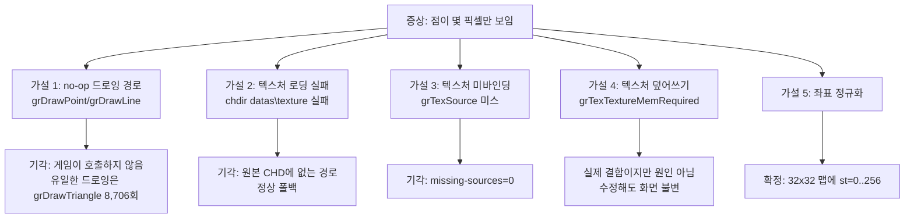
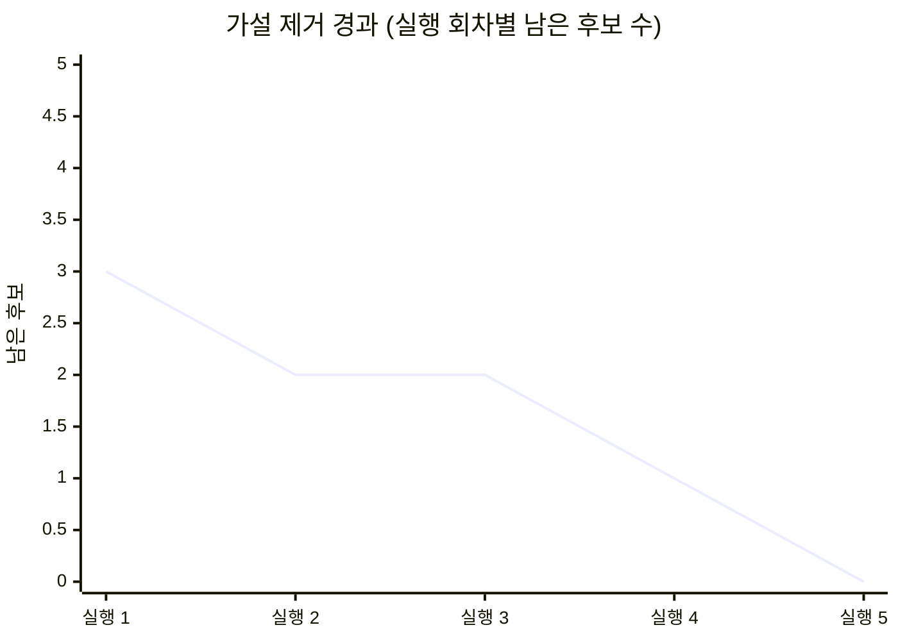
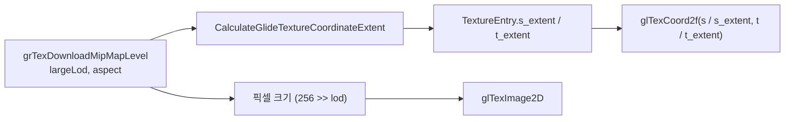
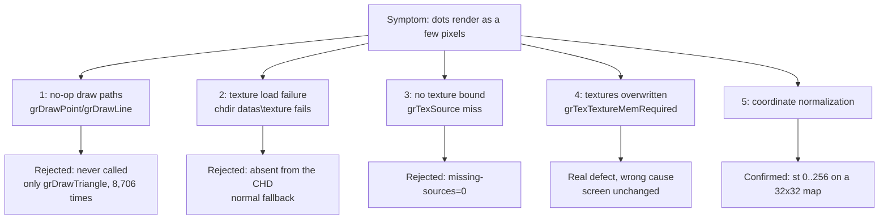
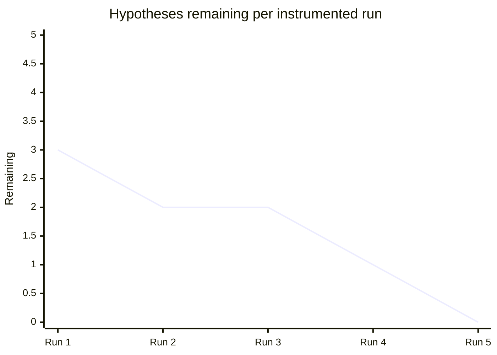

# Hunting the Missing Difficulty Dots: Four Wrong Answers and Two Real Bugs

범위: [`71f4ce2`](https://github.com/nworkers/rePIU/commit/71f4ce2)부터 [`62f05de`](https://github.com/nworkers/rePIU/commit/62f05de)까지

## 주요 변경 사항

MUSIC SELECT 화면의 난이도 표시 점이 실제 기판에서는 크고 선명한 붉은 원인데, rePIU에서는 몇 픽셀짜리 파란 점으로 그려졌다. 나머지 화면 — 폰트, 배경, 4개의 원판 — 은 모두 정상이었다. 이 한 가지 증상을 추적하는 데 실행 로그 다섯 번과 잘못된 결론 두 번이 필요했고, 결과적으로 서로 무관한 결함 세 개를 고쳤다.

핵심 결론부터 적으면 이렇다. **Glide의 텍스처 좌표는 텍셀 단위가 아니다.** 좌표 공간은 LOD와 무관하게 긴 축이 항상 256이고, 짧은 축만 aspect ratio가 줄인다. 그래서 32×32 스프라이트도 `s`, `t`가 `0..256`으로 온다. 텍스처의 픽셀 크기로 정규화하면 긴 변이 256인 맵에서는 값이 우연히 같아 정상 동작하고, 그보다 작은 맵에서만 `256/크기` 배 초과가 되어 잘려 나간다.



### 계측이 답을 주지 못한 세 번

증상만으로는 원인을 셋으로 나눌 수 있었다. 게임이 그 quad를 아예 제출하지 않거나, 제출하지만 텍스처가 바인딩되지 않아 untextured로 그려지거나, 다 정상인데 픽셀 단계에서 사라지거나. 각각 고칠 곳이 완전히 다르므로 판정 규칙을 먼저 등록하고 계측을 붙였다.

첫 계측(`REPIU_GLIDE_DRAW_CENSUS`)은 48px 이하 quad를 세고 40개를 표본으로 남겼다. 결과는 명확했다.

```text
[repiu-draw-census] after 7000 draws: small=1422 small-untextured=0 stored-textures=26 missing-sources=0
```

작은 quad는 1,422개 제출됐고, 그중 텍스처가 없는 것은 **0개**, `grTexSource` 미스도 **0회**였다. 앞의 두 가설이 함께 죽었다. 그런데 표본 40개는 전부 화면 상단의 제목 텍스트(`bbox=15x31`, y=19~30)였다. 실행 초반 draw만 잡는 구조라 MUSIC SELECT에 도달하지 못한 것이다.

두 번째 계측은 표본을 주기적으로(500개마다) 수집하도록 바꾸고, 텍스처 다운로드 시 알파 통계를 추가했다. 32×32 점 스프라이트를 BMP로 덤프해 눈으로 확인한 결과 **디코드는 완벽했다** — 검은 테두리의 원, 알파 채널도 깨끗한 원형 마스크(불투명 208 / 투명 816 텍셀). 세 번째 가설군 중 "디코드 불량"도 죽었다.

세 번째 계측은 서브-256 텍스처를 바인딩한 draw를 겨냥했다. 이번엔 페이드 애니메이션 패널(64×256, 상수색이 `F9→C6`로 감소)이 표본 예산을 가져갔다. 네 번째로 8px 이하 quad를 직접 겨냥했더니 **0건**이었다. 게임은 그렇게 작은 quad를 제출하지 않는다. 즉 점 quad는 정상 크기이고 픽셀 단계에서 사라진다는 뜻이었다.

### 필터를 포기한 시점

네 번의 실패에는 공통점이 있었다. **무엇이 대상을 구별하는지 모르는 상태에서 필터를 설계했다는 것이다.** 크기로도, 텍스처 크기로도, 초소형 여부로도 점은 걸러지지 않았다.

그래서 필터링을 버리고 `REPIU_GLIDE_FRAME_DUMP`를 만들었다. 지정한 swap 간격마다 **그 프레임의 모든 draw**를 남긴다. 한 프레임에 draw가 35~100개뿐이므로 통째로 봐도 부담이 없다. 결과는 즉시 나왔다.

```text
[repiu-frame-dump] draw bbox=40.00x40.00 xy=(209.31,286.81)(249.31,286.81)(209.31,246.81)
    st=(0.00,0.00)(256.00,0.00)(0.00,256.00) textured=1 tex=0x00062000 texdim=32x32
    const=0xFE6565FE combine=3/1/1/1 blend=1/5
```

한 프레임에서 32×32 텍스처를 쓰는 draw가 46개(= 점 23개), 64×64를 쓰는 draw가 8개(= 화살표 4개). 화면에서 이상하게 보이던 바로 그 두 요소였다.

`bbox=40x40`은 정상 크기다. 문제는 `st=(0,0)~(256,256)`이다. **32×32 텍스처에 좌표를 0~256으로 준다.** 우리는 32로 나누고 있었으므로 8배 초과 → CLAMP 설정 때문에 quad의 1/8만 스프라이트가 덮이고 나머지는 가장자리 텍셀(투명)로 채워진다. 40px quad에서 5px. 화면과 정확히 일치했다.

### 한 번 기각했던 가설을 되살리다

부끄러운 기록을 남긴다. 이 좌표 가설은 조사 중반에 이미 제기했고, **한 번 기각했다.** 근거는 이 표본이었다.

```text
bbox=64.0x255.9  st=(0,0)(64,0)(0,256)  texdim=64x256
```

64×256 텍스처에 s가 0~64, t가 0~256. "좌표는 텍스처 자체 텍셀 공간이므로 우리 정규화가 맞다"고 판단했다. 그런데 64×256은 aspect가 `1x4`라서 extent가 `(64, 256)`이고, 픽셀 크기도 `(64, 256)`이다. **두 규칙이 같은 답을 내는 사례**였다. 판별력이 없는 증거로 가설을 기각한 것이 이번 조사에서 가장 큰 지연 요인이었다.

구분 가능한 표본은 긴 변이 256보다 작은 맵뿐이다. 32×32가 나오고서야 갈렸다.

### 두 번째 결함: GrColor_t 형식

같은 로그 줄에 답이 하나 더 있었다. `const=0xFE6565FE`를 ARGB로 읽으면 R=0x65, B=0xFE → **파랑**이다. 실제 기판의 점은 **빨강**이다.

`grSstWinOpen` 인자를 확인했다.

```text
Win32 Glide call trace: ordinal=118 name=_GRSSTWINOPEN@28 count=1
    first_stack=0x030592A7 0x00000000 0x00000007 0x00000000 0x00000001 0x00000001 0x00000002 0x00000001
```

네 번째 인자가 `cformat=1 = GR_COLORFORMAT_ABGR`이다. `GrColor_t`의 바이트 배치는 `grSstWinOpen`이 정하는데 우리는 항상 ARGB로 읽고 있었다. ABGR로 읽으면 `0xFE6565FE`는 R=0xFE → 빨강이다.

이 결함이 그동안 드러나지 않은 이유가 재미있다. 게임이 설정하는 상수색은 `0xFFFFFFFF`, `0xB2FFFFFF`, `0x98000000`처럼 **거의 전부 무채색**이다. 무채색은 R과 B를 바꿔도 같은 색이다. 색이 있는 상수를 쓰는 유일한 요소가 하필 이미 망가져 있던 난이도 점이었다.

### 세 번째 결함: 우리 출력이 게스트 동작으로 되먹임

점과는 무관했지만 조사 중 발견한 결함이 하나 더 있다. 계측을 붙이자 이상한 값이 보였다.

```text
[repiu-tex-args] memrequired evenOdd=3 smallLod=0 largeLod=0 aspect=0 format=0 data=0x00000000 -> bytes=8192
```

모든 필드가 0인데, 게스트 메모리의 원시 바이트는 정상이었다.

```text
raw=05 00 00 00 | 05 00 00 00 | 03 00 00 00 | 0A 00 00 00 | 00 00 00 00
    smallLod=5    largeLod=5    aspect=3      format=10
```

`grTexTextureMemRequired`가 **게스트 구조체를 읽는 코드 자체가 없었다.** 포인터는 가독성 검사에만 쓰이고, 기본 생성된 빈 구조체가 그대로 계산에 들어갔다. 그 결과 어떤 텍스처든 8192바이트를 답했다(LOD 0 + aspect 8×1 + 1바이트/텍셀 = 256×32×1).

문제는 이 함수가 단순 질의가 아니라는 점이다. 게임은 반환값으로 **자기 TMU 주소 공간을 배치한다.** 그래서 실제 128KB인 256×256 맵을 8KB 간격으로 쌓고 있었다. 네 번의 계측에서 계속 관측하고 "게임의 성질"이라고 생각했던 `0x2000` 균일 간격은, 사실 **우리 출력의 되먹임**이었다. 프로젝트 지식 문서가 이미 경고해 둔 순환 논리에 그대로 빠져 있었다.

### 최종 상태

세 결함을 모두 고쳤다.

| 결함 | 위치 | 커밋 |
|---|---|---|
| `grHints` 미구현 | `linexe_glide_boundary.cpp` | [`71f4ce2`](https://github.com/nworkers/rePIU/commit/71f4ce2) |
| `GrTexInfo` 미독 | `grTexTextureMemRequired` | [`659053d`](https://github.com/nworkers/rePIU/commit/659053d) |
| 좌표 정규화 + `GrColor_t` 형식 | `glide_opengl_backend.cpp`, `glide_hle.cpp` | [`62f05de`](https://github.com/nworkers/rePIU/commit/62f05de) |

`grHints`는 별개 항목이었다. 로그의 유일한 미구현 Glide API(호출 298회)였고, hint type별 상태 기록으로 구현했다. `GrVertex` 레이아웃은 ABI로 고정돼 있어 STWHINT가 구조체를 직접 읽는 렌더러의 결과를 바꾸지 않으므로, 상태 기록이 이 backend에서는 stub이 아니라 완결된 구현이다. `GR_HINT_FPUPRECISION`만 기록만 하고 x87 제어 워드는 바꾸지 않았다 — 호스트가 게스트의 부동소수 연산을 대신 수행하지 않으므로, 제어 워드를 바꾸면 게스트 결과가 달라진다.

계측용 커밋들도 남겼다. [`c086911`](https://github.com/nworkers/rePIU/commit/c086911)(주기 표본 + 알파 통계), [`d99f849`](https://github.com/nworkers/rePIU/commit/d99f849)(원시 텍스처 인자), [`31285a6`](https://github.com/nworkers/rePIU/commit/31285a6)(초소형 quad 표본), [`e26e06f`](https://github.com/nworkers/rePIU/commit/e26e06f)(원시 `GrTexInfo` 바이트), [`dfa9f8f`](https://github.com/nworkers/rePIU/commit/dfa9f8f)(프레임 덤프), [`05b25e7`](https://github.com/nworkers/rePIU/commit/05b25e7)(전체 다운로드 로그). 전부 환경 변수로 켜는 기본 OFF 계측이며 렌더링 경로는 바꾸지 않는다.

### 검증

```text
plan_build_bench_all=true
arena_view_all=true
coherence_all=true
glide_issue_probe=pass
aot_probe_exit=0
```

빌드는 Debug와 Release 두 구성 모두 통과했고, `repiu_aot_probe` 전 그룹과 `repiu_glide_issue_probe`가 통과했다. 화면에서는 난이도 점이 실제 기판 캡처와 동일하게 크고 붉은 원으로 표시되고, 256×256 텍스처를 쓰는 요소(폰트·배경·원판)는 변화가 없다.



### 교훈

**판별력 없는 증거로 가설을 기각하지 말 것.** 64×256 표본은 두 규칙이 같은 답을 내는 사례였는데 그것으로 기각했다. 어떤 증거가 두 가설을 구분할 수 있는지 먼저 따졌어야 했다.

**대상을 모르면 필터를 만들지 말 것.** 네 번의 필터가 모두 빗나갔고, 전량 덤프는 한 번에 성공했다. 데이터가 작을 때는 필터링보다 전량 관측이 빠르다.

**우리 출력이 게스트 입력이 되는 지점을 의심할 것.** `grTexTextureMemRequired`의 반환값은 게스트의 메모리 배치를 결정한다. 그런 지점에서 관측된 "게임의 동작"은 우리 자신의 버그일 수 있다.

**무채색만 보고 색이 정상이라 판단하지 말 것.** 화면 전체가 정상으로 보였던 이유는 게임이 쓰는 상수색이 거의 전부 회색이었기 때문이다.

## 사용된 기술 스택

### Glide 2.x 텍스처 좌표 공간

Glide의 `GrVertex.tmuvtx[].sow/tow`는 `s/w`, `t/w`이며, 여기서 `s`, `t`는 **텍셀 좌표가 아니다.** 좌표 공간은 다음과 같이 aspect ratio만으로 결정된다.

```
s_extent = 256 >> max(aspect - 3, 0)
t_extent = 256 >> max(3 - aspect, 0)
```

`GrLOD_t`는 여기에 관여하지 않는다. LOD는 텍스처의 **픽셀 크기**를 정할 뿐이다(긴 변 = `256 >> lod`).

| 텍스처 | LOD | aspect | 픽셀 크기 | 좌표 extent |
|---|---:|---:|---|---|
| 폰트 아틀라스 | `GR_LOD_256` | `1x1` | 256×256 | 256 × 256 |
| 난이도 점 | `GR_LOD_32` | `1x1` | **32×32** | **256 × 256** |
| 메시지 바 | `GR_LOD_256` | `4x1` | 256×64 | 256 × 64 |
| 페이드 패널 | `GR_LOD_256` | `1x4` | 64×256 | 64 × 256 |

구현에서는 텍스처를 저장할 때 aspect로부터 extent를 함께 계산해 보관하고, 드로잉에서 그것으로 정규화한다.



### GrColorFormat_t

`grConstantColorValue`, `grBufferClear`, `grFogColorValue`, `grChromakeyValue`가 받는 `GrColor_t`의 바이트 배치는 `grSstWinOpen`의 네 번째 인자가 결정한다.

| 값 | 형식 | 바이트 (MSB→LSB) |
|---:|---|---|
| 0 | `GR_COLORFORMAT_ARGB` | A R G B |
| 1 | `GR_COLORFORMAT_ABGR` | A B G R |
| 2 | `GR_COLORFORMAT_RGBA` | R G B A |
| 3 | `GR_COLORFORMAT_BGRA` | B G R A |

PIU는 `ABGR`을 선택한다. 텍스처 포맷(`GrTextureFormat_t`)과는 완전히 별개의 축이라는 점이 중요하다 — 텍스처는 정상인데 상수색만 뒤집히는 상태가 성립한다.

### grHints

Glide 2.x의 `grHints(GrHint_t type, FxU32 mask)`는 렌더링 상태가 아니라 **드라이버 최적화 선언**이다.

| type | 의미 |
|---|---|
| `GR_HINT_STWHINT`(0) | 어떤 w·s/t 값이 TMU마다 다른지 선언 |
| `GR_HINT_FIFOCHECKHINT`(1) | Glide가 명령 FIFO를 확인하는 빈도 |
| `GR_HINT_FPUPRECISION`(2) | Glide 내부 연산의 x87 정밀도 |
| `GR_HINT_ALLOW_MIPMAP_DITHER`(3) | mipmap dithering 허용 여부 |

`GrVertex` 레이아웃은 ABI로 고정돼 있으므로, STWHINT는 하드웨어에 어떤 필드를 전송할지를 정할 뿐 구조체 안의 필드 위치를 바꾸지 않는다. 구조체를 직접 읽는 소프트웨어 렌더러에게는 어떤 값이 와도 결과가 같다.

### 관측 도구

이번 조사에서 만든 계측은 전부 환경 변수 opt-in이다.

| 변수 | 목적 |
|---|---|
| `REPIU_GLIDE_DRAW_CENSUS` | draw를 크기·텍스처로 분류하고 표본 기록 |
| `REPIU_GLIDE_TEX_CENSUS` | 텍스처 다운로드 인자와 `GrTexInfo` 원시 바이트 |
| `REPIU_DUMP_TEXTURE_BMP` | 디코드된 텍스처를 BMP로 덤프 + 알파 통계 |
| `REPIU_GLIDE_FRAME_DUMP` | 지정 간격마다 한 프레임의 모든 draw |

### 참고

* [3Dfx Glide 2.4 Reference Manual](https://www.bitsavers.org/components/3dfx/Glide_Reference_Manual_2.4_199707.pdf)
* [3Dfx Glide 2.4 Programming Guide](https://www.bitsavers.org/components/3dfx/Glide_Programming_Guide_2.4_199707.pdf)
* [3Dfx Glide 2.0 API Reference](https://www.gamers.org/dEngine/xf3D/glide/glideref.htm)

---

# Hunting the Missing Difficulty Dots: Four Wrong Answers and Two Real Bugs

Range: [`71f4ce2`](https://github.com/nworkers/rePIU/commit/71f4ce2) through [`62f05de`](https://github.com/nworkers/rePIU/commit/62f05de)

## Major Changes

On the MUSIC SELECT screen, the difficulty dots are large crisp red circles on original hardware and a few blue pixels in rePIU. Everything else on that screen — the font, the background, the four discs — looked right. Tracking down that single symptom took five instrumented runs and two wrong conclusions, and ended up fixing three unrelated defects.

The headline finding: **Glide texture coordinates are not in texel units.** The coordinate space spans 256 along a texture's longer axis whatever its LOD, with the shorter axis scaled by the aspect ratio. A 32×32 sprite is therefore addressed with `s` and `t` running `0..256`. Normalizing by the texture's pixel size happens to be correct whenever the longer edge is already 256, and overshoots by `256 / size` for anything smaller.



### Three rounds of instrumentation that missed

The symptom admits three causes: the game never submits those quads, it submits them with no texture bound so they draw untextured, or everything is right and the pixels vanish later. Each needs a different fix, so the reading rules were pre-registered before the instrumentation went in.

The first census counted quads of 48 pixels or less and sampled forty of them:

```text
[repiu-draw-census] after 7000 draws: small=1422 small-untextured=0 stored-textures=26 missing-sources=0
```

1,422 small quads, **zero** of them untextured, **zero** `grTexSource` misses. Two hypotheses died together. But all forty samples were title text at the top of the screen, because a first-N sample is consumed before the select screen ever appears.

The second round sampled periodically and added alpha statistics to texture downloads. Dumping the 32×32 dot sprite to a BMP showed a **perfect decode** — a black-outlined circle with a clean circular alpha mask, 208 opaque against 816 transparent texels. The decode-fault hypothesis died too.

The third round targeted draws bound to sub-256 textures, and a fading panel (64×256, constant color stepping `F9→C6`) ate the budget. The fourth targeted quads of 8 pixels or less and matched **nothing at all**: the game never submits any. So the dot quads were full size and their pixels were disappearing later.

### Abandoning filters

All four failures shared a cause: **each filter was designed without knowing what distinguishes the target.** Size did not isolate the dots, texture size did not, and neither did being tiny.

So filtering was dropped for `REPIU_GLIDE_FRAME_DUMP`, which logs every draw of whole frames at a chosen swap interval. A frame holds only 35–100 draws, so reading all of them costs nothing. The answer appeared immediately:

```text
[repiu-frame-dump] draw bbox=40.00x40.00 xy=(209.31,286.81)(249.31,286.81)(209.31,246.81)
    st=(0.00,0.00)(256.00,0.00)(0.00,256.00) textured=1 tex=0x00062000 texdim=32x32
    const=0xFE6565FE combine=3/1/1/1 blend=1/5
```

One frame contained 46 draws bound to a 32×32 texture (23 dots) and 8 bound to a 64×64 one (4 arrows) — exactly the two elements that looked wrong.

The `40x40` bounding box is the right size. The problem is `st=(0,0)~(256,256)`: **the game addresses a 32×32 texture with coordinates running to 256.** Dividing by 32 overshoots eightfold, and with clamping the sprite covers an eighth of the quad while the rest samples the transparent edge texel. Five pixels of forty — precisely what the screen showed.

### Reviving a hypothesis that had been rejected

An embarrassing record is worth keeping. This coordinate hypothesis was raised mid-investigation and **rejected**, on the strength of this sample:

```text
bbox=64.0x255.9  st=(0,0)(64,0)(0,256)  texdim=64x256
```

A 64×256 texture with `s` spanning 0..64 and `t` spanning 0..256 looked like proof that coordinates are texel-space. But 64×256 has aspect `1x4`, so its extent is `(64, 256)` — identical to its pixel size. **The sample could not distinguish the two rules at all.** Rejecting a hypothesis on evidence with no discriminating power was the single largest delay here. Only a map whose longer edge is under 256 can settle it, and the 32×32 sample did so at once.

### The second defect: GrColor_t format

The same log line held another answer. Read as ARGB, `0xFE6565FE` is R=0x65, B=0xFE — **blue**. The dots on original hardware are **red**.

The `grSstWinOpen` arguments settle it:

```text
Win32 Glide call trace: ordinal=118 name=_GRSSTWINOPEN@28 count=1
    first_stack=0x030592A7 0x00000000 0x00000007 0x00000000 0x00000001 0x00000001 0x00000002 0x00000001
```

The fourth argument is `cformat=1 = GR_COLORFORMAT_ABGR`. `GrColor_t` byte order is chosen there, and the renderer read every value as ARGB. Under ABGR, `0xFE6565FE` is R=0xFE: red.

Why this hid so long is the interesting part. Almost every constant the game sets is achromatic — `0xFFFFFFFF`, `0xB2FFFFFF`, `0x98000000` — and greys are unchanged by swapping red and blue. The one element using a chromatic constant was the already-broken dot.

### The third defect: our output feeding back as guest input

Unrelated to the dots, the instrumentation exposed one more defect:

```text
[repiu-tex-args] memrequired evenOdd=3 smallLod=0 largeLod=0 aspect=0 format=0 data=0x00000000 -> bytes=8192
```

Every field decoded as zero while the raw bytes in guest memory were correct:

```text
raw=05 00 00 00 | 05 00 00 00 | 03 00 00 00 | 0A 00 00 00 | 00 00 00 00
    smallLod=5    largeLod=5    aspect=3      format=10
```

`grTexTextureMemRequired` **never read the guest structure.** The pointer served only the readability check while a default-constructed value went into the calculation, so every texture answered 8192 bytes (LOD 0, aspect 8×1, one byte per texel = 256×32×1).

That matters because the function is not a passive query: the guest lays out its own TMU address space from the answer, so it was packing 128KB maps 8KB apart. The uniform `0x2000` texture spacing observed across four runs and taken for a property of the game was **a function of our own output** — precisely the circular trap the project's knowledge base already warned about.

### Final state

| Defect | Location | Commit |
|---|---|---|
| `grHints` unimplemented | `linexe_glide_boundary.cpp` | [`71f4ce2`](https://github.com/nworkers/rePIU/commit/71f4ce2) |
| `GrTexInfo` never read | `grTexTextureMemRequired` | [`659053d`](https://github.com/nworkers/rePIU/commit/659053d) |
| Coordinate normalization + `GrColor_t` | `glide_opengl_backend.cpp`, `glide_hle.cpp` | [`62f05de`](https://github.com/nworkers/rePIU/commit/62f05de) |

`grHints` was a separate item: the only unimplemented Glide API in the log at 298 calls, now implemented as per-type state recording. Because the `GrVertex` layout is fixed by the ABI, STWHINT cannot change the output of a renderer that reads the structure directly, so recording is a complete implementation rather than a stub. `GR_HINT_FPUPRECISION` is recorded but not applied: the host does not execute the guest's floating point, and changing the x87 control word would alter guest results.

The instrumentation commits are [`c086911`](https://github.com/nworkers/rePIU/commit/c086911), [`d99f849`](https://github.com/nworkers/rePIU/commit/d99f849), [`31285a6`](https://github.com/nworkers/rePIU/commit/31285a6), [`e26e06f`](https://github.com/nworkers/rePIU/commit/e26e06f), [`dfa9f8f`](https://github.com/nworkers/rePIU/commit/dfa9f8f), and [`05b25e7`](https://github.com/nworkers/rePIU/commit/05b25e7) — all environment-gated, off by default, and none of them change the rendering path.

### Verification

```text
plan_build_bench_all=true
arena_view_all=true
coherence_all=true
glide_issue_probe=pass
aot_probe_exit=0
```

Debug and Release builds pass, as do every `repiu_aot_probe` group and `repiu_glide_issue_probe`. On screen the dots now match the original hardware capture as large red circles, and everything drawn from 256×256 textures is unchanged.



### Lessons

**Do not reject a hypothesis on evidence that cannot discriminate.** The 64×256 sample gives the same answer under both rules, and it was used to reject the correct explanation.

**Do not build a filter for something you cannot yet describe.** Four filters missed; dumping everything worked on the first try. When the data is small, complete observation beats selection.

**Suspect the places where your output becomes the guest's input.** `grTexTextureMemRequired` determines how the guest lays out memory, so "observed game behavior" there can be your own bug reflected back.

**Achromatic evidence proves nothing about color.** The screen looked correct because nearly every color constant the game sets is grey.

## Technology Stack Used

### Glide 2.x texture coordinate space

`GrVertex.tmuvtx[].sow/tow` carry `s/w` and `t/w`, where `s` and `t` are **not** texel coordinates. The space is set by the aspect ratio alone:

```
s_extent = 256 >> max(aspect - 3, 0)
t_extent = 256 >> max(3 - aspect, 0)
```

`GrLOD_t` plays no part in it; the LOD sets the texture's pixel size (longer edge = `256 >> lod`).

| Texture | LOD | aspect | Pixel size | Coordinate extent |
|---|---:|---:|---|---|
| Font atlas | `GR_LOD_256` | `1x1` | 256×256 | 256 × 256 |
| Difficulty dot | `GR_LOD_32` | `1x1` | **32×32** | **256 × 256** |
| Message bar | `GR_LOD_256` | `4x1` | 256×64 | 256 × 64 |
| Fading panel | `GR_LOD_256` | `1x4` | 64×256 | 64 × 256 |

The implementation computes the extent from the aspect at download time, stores it with the texture, and normalizes by it when drawing.


### GrColorFormat_t

The byte order of the `GrColor_t` taken by `grConstantColorValue`, `grBufferClear`, `grFogColorValue`, and `grChromakeyValue` is chosen by the fourth argument to `grSstWinOpen`.

| Value | Format | Bytes (MSB→LSB) |
|---:|---|---|
| 0 | `GR_COLORFORMAT_ARGB` | A R G B |
| 1 | `GR_COLORFORMAT_ABGR` | A B G R |
| 2 | `GR_COLORFORMAT_RGBA` | R G B A |
| 3 | `GR_COLORFORMAT_BGRA` | B G R A |

PIU selects `ABGR`. This axis is entirely independent of `GrTextureFormat_t`, so textures can be correct while constant colors are inverted.

### grHints

`grHints(GrHint_t type, FxU32 mask)` declares driver optimizations rather than rendering state.

| type | Meaning |
|---|---|
| `GR_HINT_STWHINT`(0) | Which w and s/t values are unique per TMU |
| `GR_HINT_FIFOCHECKHINT`(1) | How often Glide polls the command FIFO |
| `GR_HINT_FPUPRECISION`(2) | The x87 precision Glide may use internally |
| `GR_HINT_ALLOW_MIPMAP_DITHER`(3) | Whether mipmap dithering is allowed |

Because the `GrVertex` layout is fixed by the ABI, STWHINT changes what the driver sends to hardware, not where fields live, so a renderer reading the structure directly produces identical output for any value.

### Observation tooling

Everything built for this investigation is opt-in through the environment.

| Variable | Purpose |
|---|---|
| `REPIU_GLIDE_DRAW_CENSUS` | Bucket draws by size and texture, sample them |
| `REPIU_GLIDE_TEX_CENSUS` | Texture download arguments and raw `GrTexInfo` bytes |
| `REPIU_DUMP_TEXTURE_BMP` | Dump decoded textures as BMP plus alpha statistics |
| `REPIU_GLIDE_FRAME_DUMP` | Every draw of whole frames at a chosen interval |

### References

* [3Dfx Glide 2.4 Reference Manual](https://www.bitsavers.org/components/3dfx/Glide_Reference_Manual_2.4_199707.pdf)
* [3Dfx Glide 2.4 Programming Guide](https://www.bitsavers.org/components/3dfx/Glide_Programming_Guide_2.4_199707.pdf)
* [3Dfx Glide 2.0 API Reference](https://www.gamers.org/dEngine/xf3D/glide/glideref.htm)
