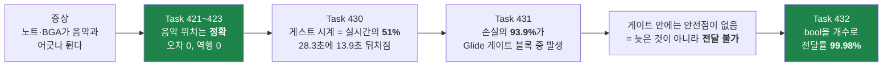
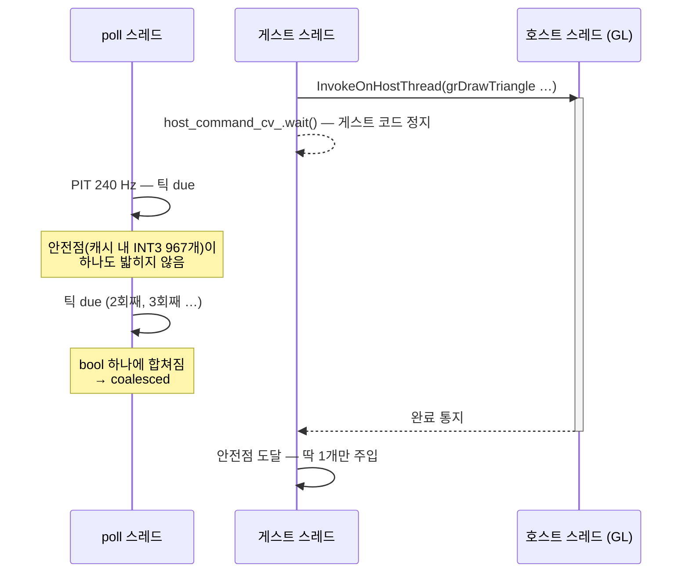
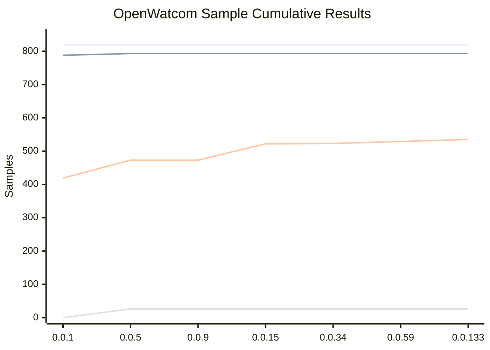
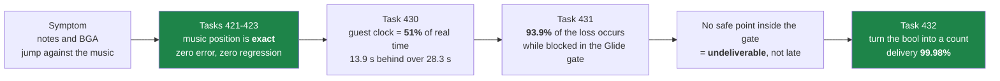
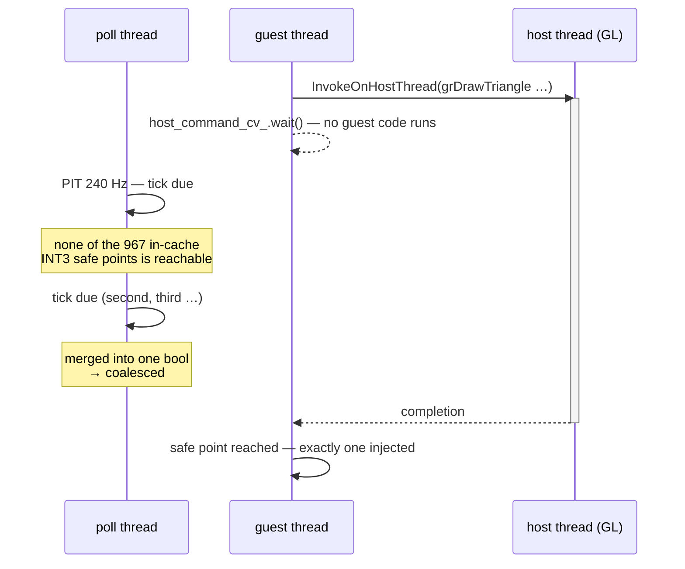
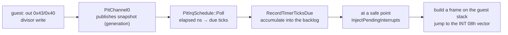

# The Clock That Ran at Half Speed: From a Note-Jumping Report to a One-Line Default

범위: [`7583fde`](https://github.com/nworkers/rePIU/commit/7583fde)(v0.0.132)부터
[`e341c8f`](https://github.com/nworkers/rePIU/commit/e341c8f)(v0.0.134)까지

## 주요 변경 사항

사용자가 보고한 증상은 한 줄이었습니다. **"노트와 BGA가 음악과 어긋나서 튄다."**

이 한 줄이 지목할 수 있는 층은 셋입니다. 음악이 잘못 흐르거나, 게스트의 시간이 잘못
흐르거나, 렌더가 늦거나. 네 개의 Task가 이 셋을 차례로 갈랐고, 도중에 **우리가 여러
Task에 걸쳐 "게임이 멈춘다"고 불러 온 현상이 사실은 우리 계측 도구였다**는 것이
밝혀졌습니다. 그리고 최종 수정은 **이미 저장소 안에 있었습니다** — 새로 만든 기구는
없고, 환경 변수 하나의 기본값을 뒤집었습니다.



### 1. 음악은 무죄였고, 기대값 자체가 틀려 있었다

가장 먼저 의심한 것은 CD 오디오 위치 보고입니다. 게임은 `MSCDEX`에게 "지금 몇 번째
섹터를 재생 중이냐"를 물어 노트 타이밍을 맞추므로, 그 답이 흔들리면 정확히 이 증상이
됩니다.

계측을 설계할 때 한 가지를 먼저 정했습니다. **표본을 오디오 worker가 아니라 poll
스레드에서 뜨는 것입니다.** 굶주린 worker는 자기 굶주림을 보고할 수 없기 때문입니다.
그리고 위치가 파생되는 모든 값 — worker 반복 횟수, underrun — 을 같은 행에 실었습니다.

결과는 명확했습니다. gameplay 구간의 같은 generation 연속 표본 **1,440개**에서:

| 지표 | 값 |
|---|---|
| 평균 `delta_lba` | **8.21** |
| 기대값 | **8.21** |
| 범위 | 7~9 (이상치 0) |
| 역행 | **0** |

그런데 이 표에는 함정이 하나 있었습니다. **설계와 가이드에 적어 둔 기대값이 "100 ms당
7~8"이었습니다.** `GetTickCount`의 분해능 때문에 실제 표본 간격은 **109.5 ms**이고,
CD-DA가 초당 75 섹터이므로 정확한 기대값은 `75 × 0.1095 = 8.21`입니다. 관측값 8.21은
**정확히 맞는 값인데, 잘못 적어 둔 기준으로는 "약간 빠름"으로 읽힐 뻔했습니다.**

명령 trace는 별개의 결함을 하나 잡았습니다. 게스트가 `stop`을 16 ms마다 부르는 구간이
있었는데, 우리 `Stop()`이 매번 `paused`를 `was_playing`으로부터 재계산해 **두 번째
Stop이 첫 Stop이 세운 pause를 지우고** 있었습니다. 멱등화 후 `paused`는 1로 유지되고
`generation`은 62에서 5로 줄었습니다.

### 2. "정지"의 정체 — 게임이 아니라 우리 감시였습니다

이 조사에서 가장 큰 소득은 예정에 없던 것이었습니다.

여러 Task에 걸쳐 "게임이 플레이 직전에 멈춘다"고 기록해 왔습니다. 게스트 코드를 직접
읽어 그 지점을 특정했습니다.

```text
0x0302C588:  call 0x0303F3F4        ; return [0x0328FA18]
0x0302C58D:  cmp  eax, 100
0x0302C590:  jl   0x0302C588        ; 100틱까지 대기
```

그 카운터를 올리는 곳은 **INT 8 타이머 ISR**입니다.

```text
0x0303F1A3:  call [0x0328FA08]      ; 이전 핸들러 체인
0x0303F1A9:  inc  [0x0328FA18]      ; 게임이 기다리는 카운터
0x0303F1AF:  inc  [0x0328FA14]
```

**게임은 멈춘 것이 아니라 정상적으로 100틱(약 1.4초)을 기다리고 있었습니다.** 그리고
그 대기 동안에는 예외도, single step도, AOT 경계도 발생하지 않습니다. 우리
`PollThreadUntilExit`의 **1초 무진행 감시**(`live_telemetry_snapshot.cpp`,
`quiet_timeout_milliseconds = 1000`)에게는 그것이 곧 "죽은 실행"이었습니다.

`REPIU_EXECUTION_TIMEOUT_MS=0`은 `INFINITE`로 해석되어 그 감시를 끕니다. 같은 빌드로
A/B를 돌렸습니다.

| 조건 | 실행 시간 | 프레임 | 도달 지점 |
|---|---:|---:|---|
| 감시 켬 | 9.5초 | 363 | 곡 선택 |
| **감시 끔** | **174초** | **8,023** | **gameplay** (`b15.mcf`, `b14~16.ski`, `rage.con`) |

**정정 두 개를 함께 남겼습니다.** 여러 Task에서 "정지 지점"으로 불러 온
`0x030F2786`은 사실 `STI`(`fb c3` = `STI; RET`)이며, 대기 중 가장 자주 트랩되는 특권
명령일 뿐입니다. 그리고 single-step hotspot census에 이 루프가 나오지 않은 이유는,
그 census가 single-step 경계만 담는데 루프는 AOT 캐시 안에서 돌기 때문입니다. 루프를
찾은 것은 예외와 무관한 5 ms 표본, guest position census였습니다.

### 3. 누적 한 줄로는 아무것도 판정할 수 없습니다

감시를 끄고 얻은 174초 실행의 종료 요약에 새 후보가 있었습니다.

```text
timer tick delivery due/injected/coalesced/dropped: 41531/39830/1677/24
```

**1,677회 coalesced** — 여러 due 틱을 한 번으로 합쳐 전달했다는 뜻입니다. 게스트
시간이 느리게 흐르다 몰아서 따라잡으면 정확히 "튀는" 증상이 됩니다.

그런데 이 한 줄은 판정에 쓸 수 없습니다. `1,677 / 41,531 = 4.04%`는 **174초 전체
평균**이라, 그 손실이 부팅에 몰렸는지 attract에 몰렸는지 gameplay에 있는지 말하지
않습니다. 게다가 기존 trace를 재집계해 보니 게스트 메인 루프는 **7,200 polls /
119.968 s = 60.0160 Hz**(오차 0.03%)로 실시간에 붙어 있었습니다. 4% 손실이 균등하다면
57.6 Hz여야 하므로, 누적 수치와 루프 주파수가 서로 충돌합니다.

그래서 Task 430은 **틱 손실을 시간축에 올렸습니다.** CD 위치 census 표본에
`timer_ticks_due`·`timer_ticks_injected` 델타와 파생 열 `tick_lag_ms`를 추가했습니다.
동작은 바뀌지 않습니다 — 이미 유지되던 카운터를 원자 읽기 2회로 읽을 뿐입니다.

계측이 도는지만 보려던 스모크가 곧바로 답의 절반을 줬습니다.

| 구간 | due | injected | 전달률 |
|---|---:|---:|---:|
| 0~30초 | 6,671 | 1,670 | **25.0%** |
| 30~35초 | 1,179 | 989 | 83.9% |
| 35~40초 | 1,208 | 1,191 | **98.6%** |
| 40~45초 | 1,105 | 531 | 48.1% |
| 전체 | 10,163 | 4,382 | 43.1% |

**전달률이 25%에서 98.6%까지 요동치고, 누적 평균 43.1%는 그 어느 구간의 값도
아닙니다.** 종료 요약 한 줄로 이 축을 판단하던 것이 왜 위험했는지가 그대로 보입니다.

설계 판단 하나도 측정으로 확인됐습니다. `tick_lag_ms`에 240 Hz를 상수로 박지 않았는데,
스모크 첫 1초의 `ticks_due`는 표본당 1~2로 **약 18.2 Hz**였습니다. 게스트가 아직 PIT
divisor를 바꾸기 전의 DOS 기본 BIOS 틱 주파수입니다. 240을 상수로 썼다면 부팅 구간
지연이 13배 과대 계산됐을 것입니다.

**판정은 사용자 실행으로 했습니다.** 증상이 실제로 보인 47초 실행(pumpit1, census 427
표본)의 본곡 구간입니다.

| 지표 | 값 | 사전 등록 기준 |
|---|---|---|
| 음악 | LBA 20,553 → 22,678 = **74.97 LBA/s** | 정확(오차 0.04%) |
| `injected/due` | **약 51%** | ≤ 96% → **확정** |
| `tick_lag_ms` | 8,810 → **22,666** (**+13,856 ms**) | 단조 증가·> 1,000 ms → **확정** |

**28.3초 동안 음악은 28.3초 흘렀는데 게스트 시계는 14.5초만 흘렀습니다.**

시계열이 아니면 보이지 않았을 구조도 같이 나왔습니다. 같은 실행에서 프리뷰 구간은
전달률 **약 100%** 이고 `tick_lag_ms`가 오히려 **감소**(9,006 → 8,793)하는데, 본곡
구간만 **51%** 입니다. 누적 51.7% 한 줄은 두 구간 중 어느 것도 설명하지 않습니다.

여기서 제 예상이 틀렸다는 것도 기록해 둡니다. 측정 전에 "게스트 루프가 60.016 Hz로
안정적이므로 이 후보는 기각될 것"이라고 적었는데, 그 60 Hz는 **다른 실행(pumpit3,
전달률 95.9%)의 값**이었습니다. 서로 다른 실행의 수치를 한 결론에 묶은 것이
오류입니다. **판정표를 측정 전에 고정해 둔 덕분에 예상과 무관하게 데이터가
판정했습니다.**

### 4. 세는 것에서 귀속하는 것으로

"틱이 사라진다"까지는 알았지만, 그것만으로는 고칠 곳을 모릅니다. 주입이 **거부**되는
것인지 **도달하지 못하는** 것인지가 갈리지 않습니다.

Task 431은 그 갈림을 세는 대신 **귀속**했습니다. 틱이 due로 잡히는 그 순간 게스트
스레드가 Glide 게이트 안에 있었는지를 기록합니다.



사용자 실행(pumpit1, 33초, census 297표본)의 본곡 구간 판정입니다.

| 지표 | 값 | 사전 등록 기준 |
|---|---|---|
| 음악 | **74.98 LBA/s** | 정확(오차 0.03%) |
| 전달률 | **50.6%** | Task 430의 51%와 일치 |
| **`coalesced_in_gate / coalesced`** | **2,544 / 2,710 = 93.9%** | ≥ 80% → **확정** |
| `tick_lag_ms` | 3,898 → **15,263**(+11,365 ms) | 게스트 시계 = 실시간의 **50.1%** |

**결정적인 것은 `deferred = 0`입니다.** 주입이 `IF=0`이나 비게스트 EIP 때문에 미뤄진
적이 **한 번도 없습니다.** 즉 틱은 거부당한 것이 아니라, `InjectPendingInterrupts`에
**도달할 기회 자체가 없었습니다.** 게이트 안에서는 게스트 코드가 한 줄도 실행되지
않으므로 안전점을 밟을 수 없고, 그동안 due는 240 Hz로 계속 쌓입니다. **그 틱들은 늦은
것이 아니라 전달 불가능했습니다.**

검산 둘도 성립했습니다. `safe_point_traps / injected`가 2,765 대 2,781로 **0.99** —
"기회 = 안전점"이라는 전제를 확인합니다. 그리고 본곡 구간 trap이 초당 **121.4회**(240
아님)로, 기회가 실제로 모자란다는 것과 모순이 없습니다.

**검증 중에 제 계측의 결함도 하나 잡혔습니다.** 첫 스모크에서 `in_gate > (due −
injected)`인 행이 404행 중 47행 나왔습니다. 카운터 버그가 아니라 **제가 고른 분모가
틀렸습니다** — 구간별로 `due − injected`는 그 구간의 coalesced와 같지 않습니다. 이번
구간의 주입이 **직전 구간에 armed된 틱**을 소비할 수 있으므로 뺄셈이 분모를
과소평가합니다. `ticks_coalesced`를 별도 열로 싣고 분모를 그것으로 바꾸자 위반 행은
0이 됐습니다.

> **교훈:** 파생 비율은 분자와 분모를 같은 정의로 **함께** 실어야 합니다. 한쪽만 싣고
> 나머지를 독자가 빼서 만들게 하면, 그 뺄셈이 성립하는지는 아무도 검산하지 않습니다.

### 5. 고칠 것은 이미 코드에 있었습니다

손실이 게이트 창에 집중돼 있다는 것을 알았으므로, 저는 **게이트 경계에서 밀린 틱을
배출하는 새 기구**를 만들 준비를 했습니다. 직접 디스패치 thunk가 게스트 ESP를 프레임
으로 돌려주지 않는다는 것, 즉 에뮬레이터에서 가장 뜨거운 경로를 뜯어야 한다는 것까지
확인했습니다.

그러고 나서야 환경 변수 하나를 켜 봤습니다.

`REPIU_TIMER_TICK_BACKLOG`는 **Task 366이 이미 만들어 두고 opt-in으로 남겨 둔**
bounded backlog입니다. 하는 일은 정확히 하나 — 전달을 나르던 `bool`을 **개수**로
바꿉니다.

```cpp
    if (!backlog_enabled)
    {
        // Stage one accounting for the shipping behaviour: arming delivery
        // publishes a single boolean, so one owed tick becomes the pending
        // injection and the rest are gone.
        const std::uint32_t retained = already_pending ? 0U : 1U;
        counters->coalesced_total.fetch_add(due - retained, …);
        …
        return;
    }

    // Stage two: keep the owed ticks, bounded.
    const std::uint32_t room = kWin32TimerTickBacklogCapacity > backlog
        ? kWin32TimerTickBacklogCapacity - backlog : 0U;
    const std::uint32_t accepted = std::min(due, room);
```

주입 쪽은 아직 밀린 틱이 있으면 **전달을 armed 상태로 유지**해, 안전점 하나당 인터럽트
하나씩 배출합니다(게스트 스택에 몰아넣지 않습니다).

사용자가 `REPIU_TIMER_TICK_BACKLOG=1`로 gameplay를 하고 **증상 해소를 확인**했습니다.
같은 실행의 본곡 구간 64.53초·표본 591개입니다.

| 지표 | OFF | ON |
|---|---:|---:|
| 전달률 `injected/due` | 50.6% | **99.98%** |
| `coalesced` / `coalesced_in_gate` | 2,710 / 2,544 | **0 / 0** |
| `tick_lag_ms` 증가 | **+11,365 ms** | **−11 ms** |
| 음악 | 74.98 LBA/s | 75.00 LBA/s |
| 안전점 trap | 121.4/초 | **240.2/초** |
| `max_backlog` | 1 | **12** (상한 64) |

`traps/초 = 240.2`가 핵심입니다 — **틱당 정확히 1회**이고 과잉 trap이 없습니다.

**그렇다면 Task 366은 왜 이것을 opt-in으로 남겼을까요?** 366은 같은 스위치로 프레임
**−16.4%** 를 재고 "속도를 기대하고 켜지 말 것"이라고 적었습니다. 그런데 366은 그
비용의 **기전까지 스스로 특정**해 두었습니다 — *비싼 것은 주입이 아니라 safe point가
상시 armed로 유지되는 것*이고, 그것은 **backlog가 상한에 고착될 때만** 일어납니다.

| | 366 당시 | 현재 |
|---|---|---|
| `max_backlog` | **64 (상한 고착)** | **12** |
| 상한 초과 폐기 | 1,029~1,076 | 27~64 |
| safe-point trap | **+20.1%** | **틱당 1회**(과잉 없음) |

그 사이 Tasks 414(tick당 포트 읽기 200→2)·415·417(세대 실패 0)·419(프레임 +27.7%)가
실행 속도를 올려 backlog가 게이트 사이에 비워집니다. **366의 결론은 그 시점의 기록으로
유지하고, 두 문서 머리말에 무효 범위를 적었습니다.** `REPIU_TIMER_TICK_BACKLOG=0`은
회귀 대조군으로 남깁니다.

기본값 전환의 대가는 프레임 **−1.6%**(2,042 대 2,076)로, 앞선 짝 A/B의 −1.2%와
일관되며 실행 간 편차와 구분되지 않습니다. **근거로 주장하는 것은 "비용 0"이 아니라
"−16.4%가 아니다"까지입니다.** 본곡 구간의 짝 프레임 측정은 미측정으로 남겼습니다 —
위 A/B는 전부 attract 구간이고, 게이트 점유가 가장 높은 구간의 대가는 별도로 재야
합니다.

### 이 범위의 다른 커밋

이 사슬과 독립적으로 두 가지가 같은 범위에 들어 있습니다.

* [`78366f8`](https://github.com/nworkers/rePIU/commit/78366f8) (v0.0.133) —
  실행 backend를 `legacy`와 `dynamic` 둘로 줄였습니다. `aot`와 `aot-dynamic`은 제거
  시점에 이미 pumpit3에서 이미지 생성에 실패하고 있었고, 옛 이름은 별칭 없이
  거부합니다.
* [`2038829`](https://github.com/nworkers/rePIU/commit/2038829) ·
  [`3b5073c`](https://github.com/nworkers/rePIU/commit/3b5073c) — OpenWatcom 샘플
  baseline을 v0.0.59에서 v0.0.133으로 갱신하고, 통과 판정에 **완주 요구**를
  추가했습니다.

### piu_1st 실행 로그 — 현재 진행 지점과 blocker

수정 전, 증상이 보인 사용자 실행(pumpit1, 33초)의 종료 요약입니다.

```text
timer tick delivery due/injected/coalesced/dropped/deferred: 7523/4024/3475/24/0
timer tick in-gate    due/coalesced/coalesced-share:          4872/3213/92%
AOT timer safe-point  trap/injected/deferred:                 4010/3988/22
```

세 줄이 함께 읽혀야 뜻이 나옵니다. `deferred = 0`이므로 거부는 없고, `coalesced` 3,475
중 3,213(92%)이 게이트 안에서 났으며, 안전점 trap 4,010은 33초에 걸쳐 초당 121회로
240 Hz의 절반입니다.

수정 후 같은 계측은 `coalesced = 0`, 전달률 99.98%, `max_backlog = 12`를 보고합니다.

**현재 진행 지점:** `REPIU_EXECUTION_TIMEOUT_MS=0`으로 감시를 끄면 piu_1st는 **174초·
8,023프레임으로 gameplay까지 진행**하며, 노트·BGA 점프 축은 닫혔습니다.

**현재 blocker 두 가지:**

1. **무진행 감시가 아직 그대로입니다.** 정상 실행을 1초 만에 죽이므로 프레임 기반
   측정이 전부 왜곡됩니다. 진행 판정에 HLE 활동(MSCDEX·DOS 서비스)을 포함시키거나 틱
   대기를 진행으로 인정해야 합니다. 그때까지 측정은 `REPIU_EXECUTION_TIMEOUT_MS=0`
   + 하니스 시간 제한으로 우회합니다.
2. **3D 모델이 깨져 보입니다.** 이 범위 직후
   [`6ab688a`](https://github.com/nworkers/rePIU/commit/6ab688a)(v0.0.135)에서 원인이
   Glide 정점 깊이(`ooz`)를 디코더가 읽지 않아 모든 정점이 `z=0`으로 나가던 것으로
   확인됐습니다. 다음 글의 주제입니다.

### sample test 결과

`scripts/test_openwatcom_samples.ps1`의 baseline을 **v0.0.59에서 v0.0.133으로**
갱신했습니다. 갱신 직전 비교에서 회귀 0건, 신규 통과 6건이었으므로 안전한 갱신입니다.

| 항목 | 0.0.59 | 0.0.133 |
|---|---:|---:|
| Total | 819 | 819 |
| BuildPassed / BuildSkipped | 793 / 26 | 793 / 26 |
| **RunPassed** | **529** | **535** |
| RunPassRate | 66.7% | 67.5% |
| OverallPassRate | 64.6% | 65.3% |

신규 통과 6건은 `b_keybrd.c`, `chainint.c`, `getdate.c`, `gettime.c`, `getvect.c`,
`setvect.c`로 **인터럽트·날짜·시각 계열**입니다. 이번 타이머 작업이 아니라 그 사이 74개
버전 동안 쌓인 INT 21h·INT 8 계열 작업의 결과입니다.



**한 가지 주의를 함께 적습니다.** 위 535는 **옛 판정 기준**으로 측정된 값입니다.
[`3b5073c`](https://github.com/nworkers/rePIU/commit/3b5073c)가 판정에 완주 요구를
추가했기 때문입니다.

```powershell
# 이전 — timeout도 통과로 집계됩니다
$runPassed = $run.ExitCode -eq 0 -and
             $run.Output -match "Win32 minimal execution exception caught: false"

# 이후
$runPassed = $run.ExitCode -eq 0 -and
             $run.Output -match "Win32 minimal execution exception caught: false" -and
             $run.Output -match "Win32 minimal execution returned: true" -and
             $run.Output -notmatch "minimal execution attempt timed out"
```

게스트가 멈춘 채 로더의 기본 1,000 ms timeout이 끝나면 예외는 잡히지 않고 프로세스는 0
으로 종료합니다. 옛 판정식은 그 둘만 봤으므로 **timeout이 통과가 됐습니다.** 검증
표본 8개 중 4개가 위양성이었습니다. **강화된 기준의 첫 실행은 회귀를 보고할 수
있으며, 그것은 코드 회귀가 아니라 측정 정정입니다.**

### 커밋

| 내용 | 커밋 |
|---|---|
| CD 위치 census · MSCDEX 명령 trace · `Stop()` 멱등화 · 감시 정체 규명 (Tasks 421~423) | [`7583fde`](https://github.com/nworkers/rePIU/commit/7583fde) |
| 실행 backend를 legacy/dynamic으로 통합 (Tasks 424~427) | [`78366f8`](https://github.com/nworkers/rePIU/commit/78366f8) |
| OpenWatcom 샘플 baseline 갱신 (Task 428) | [`2038829`](https://github.com/nworkers/rePIU/commit/2038829) |
| 샘플 통과 기준에 완주 요구 추가 (Task 429) | [`3b5073c`](https://github.com/nworkers/rePIU/commit/3b5073c) |
| 틱 시계열 · 게이트 귀속 · backlog 기본값 (Tasks 430~432) | [`e341c8f`](https://github.com/nworkers/rePIU/commit/e341c8f) |

### 교훈

**환경 변수 하나로 되는 것을 먼저 시도할 것.** 저는 새 배출 기구의 설계를 마치고,
가장 뜨거운 경로를 뜯어야 한다는 것까지 확인한 뒤에야 backlog A/B를 돌렸습니다.
순서가 정확히 거꾸로였습니다.

**원인과 결과를 뒤집어 읽으면 해법을 스스로 지웁니다.** 저는 "주입 기회가 초당
120회뿐이므로 backlog로는 고칠 수 없다"고 단정했습니다. 그 120회는 독립적인 상한이
아니라 **`bool`의 결과**였습니다. 개수를 보존하자 240회가 됐습니다.

**옛 측정의 유효 범위를 의심할 것.** Task 366의 −16.4%를 그대로 받아들였다면 이 축은
닫히지 않았습니다. 재검토가 가능했던 이유는 **366이 결론만이 아니라 비용의 기전까지
적어 두었기 때문**입니다. 결론만 적혀 있었다면 다시 시험할 대상이 없었습니다.

**누적 한 줄은 판정 근거가 아닙니다.** 같은 실행 안에서 전달률이 25%와 98.6%를
오갔고, 프리뷰 구간과 본곡 구간이 100%와 51%로 갈렸습니다. 어떤 평균도 그 구조를
설명하지 않습니다.

**판정표를 측정 전에 고정할 것.** 이번에도 제 예상(기각)이 틀렸고, 미리 써 둔 기준이
데이터에게 판정을 맡겼습니다.

**"멈췄다"를 의심할 것.** 여러 Task에 걸쳐 게임의 정지로 기록해 온 것이 우리 계측
도구의 1초 타임아웃이었습니다.

## 사용된 기술 스택

### 8254 PIT 채널 0과 INT 8

DOS 게임의 시간 기준은 Intel 8253/8254 Programmable Interval Timer의 채널 0입니다.
입력 클록은 약 1.193 MHz(우리 구현은 `kInputClockHz = 1193280`)이고, 채널 0의 16비트
divisor가 IRQ 0의 주기를 정합니다. IRQ 0은 실모드 `INT 08h`로 들어옵니다.

| divisor | 주파수 | 용도 |
|---:|---:|---|
| 65,536 (0) | **18.2065 Hz** | DOS/BIOS 기본값 |
| 4,972 | **240 Hz** | PIU가 재프로그램하는 값 |

`PIU.EXE`가 실제로 쓰는 값은 로그로 확인됩니다.

```text
[repiu-pit] channel=0 divisor=4972 frequency=240.000000Hz generation=2
```

게임은 부팅 직후 divisor를 낮춰 240 Hz로 올리고, 자기 `INT 08h` 핸들러에서 **이전
핸들러를 체인**한 뒤 자체 카운터를 증가시킵니다. §2에서 본 `inc [0x0328FA18]`이
그것입니다. 그래서 이 프로젝트에서 "게스트의 시간"은 곧 **우리가 INT 8을 몇 번
주입했는가**입니다.

우리 구현은 `PitChannel0`이 포트 `0x40`/`0x43` 쓰기를 관찰해
`generation + divisor` 원자 스냅샷을 발행하고, `PitIrqSchedule::Poll`이 경과 시간과
`1,193,280 / divisor` 비율로 due 틱 수를 계산합니다. BDA의 BIOS 틱 카운트
(`0x0000:0x046C`)는 게스트가 divisor를 바꾸든 말든 **기본 divisor 65,536 기준**으로
따로 갱신합니다 — 그 주소를 읽는 코드가 기대하는 것은 18.2 Hz이기 때문입니다.


`PitIrqSchedule`이 divisor generation을 들고 있는 것이 중요합니다. 게스트가 주기를
바꾸는 순간 epoch를 다시 잡지 않으면, 18.2 Hz로 흐르던 시간이 240 Hz 기준으로 재해석돼
수천 틱이 한꺼번에 due가 됩니다.

### 인터럽트 주입 안전점

원본 코드를 그대로 실행하면서 인터럽트를 넣으려면, **아무 지점에나 넣을 수는
없습니다.** 명령 중간이나 우리 HLE 경계 안에서 게스트 스택에 프레임을 쌓으면 상태가
깨집니다. 그래서 주입은 세 조건을 모두 만족하는 지점에서만 일어납니다.

1. EIP가 게스트 코드이거나 AOT 캐시 안일 것
2. `EFLAGS.IF`가 서 있을 것 (게스트가 인터럽트를 허용한 상태일 것)
3. INT 8 벡터가 설치돼 있을 것

동적 번역 backend에서는 캐시 안에 심어 둔 **`INT3` 안전점 967개**가 그 지점입니다.
armed 상태에서 게스트가 그중 하나를 밟으면 예외가 우리에게 오고, 거기서 프레임을
구성해 벡터로 점프합니다. 1과 2에서 걸린 경우는 `deferred`로 세는데, **이것은 손실이
아니라 지연**입니다 — pending이 살아 있으므로 다음 기회에 전달됩니다.

이번 조사에서 `deferred = 0`이 결정적이었던 이유가 여기 있습니다. 거부가 0이라는 것은
**남은 원인이 "기회 자체가 오지 않았다" 하나뿐**임을 뜻합니다.

### Glide 게이트와 스레드 rendezvous

OpenGL 컨텍스트는 호스트 스레드가 소유하므로, 게스트가 부른 Glide 함수는
`InvokeOnHostThread`로 호스트 스레드에 건네지고 게스트 스레드는 `host_command_cv_`에서
대기합니다. **이 창 안에서는 게스트 코드가 한 줄도 실행되지 않습니다.** 안전점은 게스트
코드가 밟아야 하는 것이므로, 게이트 시간이 길수록 주입 기회는 구조적으로 줄어듭니다.

이 게이트가 guest-run 시간의 **54~55%** 를 차지한다는 것은 Task 418이 이미 측정해
두었고, Task 431의 `due_in_gate/due` 56.5%가 그 값과 맞물립니다. 서로 다른 두 계측이
같은 그림을 그린 것이 이번 귀속의 교차 검산이었습니다.

### CD-DA 위치와 MSCDEX

CD 오디오는 초당 **75 섹터**(프레임) 재생이 규격이고, 위치는 LBA로 보고됩니다. 리듬
게임은 이 값을 노트 타이밍의 기준으로 삼으므로, HLE가 돌려주는 위치의 **정확도**가 곧
게임 판정의 정확도입니다.

우리는 실제 재생 진행을 호스트 오디오 백엔드에서 가져와 LBA로 환산해 MSCDEX
`IOCTL 12`(위치 질의)에 답합니다. §1의 `delta_lba` 검증은 이 환산이 시간축에서
드리프트하지 않는지를 보는 것입니다. `75 프레임/초 × 0.1095초 = 8.21`이라는 기대값이
바로 이 규격에서 나옵니다.

### 계측 방법론 — 사전 등록한 판정표

이번 범위에서 반복해 쓴 절차입니다.

1. 설계 문서에 **측정 전에** 판정 기준을 쓴다(예: `injected/due ≤ 96%`이면 확정).
2. 그 다음에 예상을 적는다. 예상은 판정에 관여하지 않는다.
3. 계측은 전부 환경 변수 opt-in으로 만들고 동작을 바꾸지 않는다.
4. 판정은 **증상이 실제로 보인 실행**에만 적용한다.

Task 430에서 제 예상이 틀렸을 때 이 절차가 값을 했습니다. 예상을 먼저 세우고 기준을
나중에 썼다면, 51%를 보고도 "루프는 60 Hz니까 괜찮다"로 읽었을 수 있습니다.

이번에 쓴 계측은 다음과 같습니다.

| 변수 | 목적 |
|---|---|
| `REPIU_CD_AUDIO_POSITION_CENSUS` | poll 스레드 위치 표본 + 틱 델타 + `tick_lag_ms` |
| `REPIU_MSCDEX_COMMAND_TRACE` | 명령·인자·**우리가 준 응답**·그 순간 위치 |
| `REPIU_TIMER_TICK_BACKLOG` | 밀린 틱 보존(**Task 432에서 기본 ON**, `=0`이 대조군) |
| `REPIU_EXECUTION_TIMEOUT_MS` | 무진행 감시(`0` = `INFINITE`, 감시 끔) |

### 참고

* [Intel 8254 Programmable Interval Timer 데이터시트](https://www.scs.stanford.edu/10wi-cs140/pintos/specs/8254.pdf)
* [OSDev Wiki — Programmable Interval Timer](https://wiki.osdev.org/Programmable_Interval_Timer)
* [Ralf Brown's Interrupt List — INT 08h / INT 1Ah](https://www.cs.cmu.edu/~ralf/files.html)
* [MSCDEX / CD-ROM device driver specification](https://www.phatcode.net/res/159/files/mscdex.txt)
* [Microsoft Learn — GetTickCount 분해능](https://learn.microsoft.com/en-us/windows/win32/api/sysinfoapi/nf-sysinfoapi-gettickcount)
* [3Dfx Glide 2.4 Programming Guide](https://www.bitsavers.org/components/3dfx/Glide_Programming_Guide_2.4_199707.pdf)

---

# The Clock That Ran at Half Speed: From a Note-Jumping Report to a One-Line Default

Range: [`7583fde`](https://github.com/nworkers/rePIU/commit/7583fde) (v0.0.132) through
[`e341c8f`](https://github.com/nworkers/rePIU/commit/e341c8f) (v0.0.134)

## Major Changes

The reported symptom was one line: **"the notes and the BGA lose sync with the music and
jump."**

Three layers could produce that — the music playing wrong, the guest's clock running wrong,
or the render lagging. Four tasks separated them in turn, and along the way it emerged that
**what several tasks had called "the game stalls" was our own instrument**. The final
fix was **already in the tree**: no new mechanism was built, only the default of one
environment variable was flipped.



### 1. The music was innocent, and the expectation itself was wrong

CD audio position reporting was the first suspect. The game asks `MSCDEX` which sector is
playing and times its notes from the answer, so a shaky answer produces exactly this symptom.

One decision came before the instrument: **sample on the poll thread, not in the audio
worker**, because a starved worker cannot report its own starvation. Every value the position
derives from — worker iterations, underruns — rides on the same row.

The result was unambiguous. Over **1,440** consecutive same-generation gameplay samples:

| Metric | Value |
|---|---|
| Mean `delta_lba` | **8.21** |
| Expected | **8.21** |
| Range | 7-9, no outliers |
| Regressions | **0** |

There is a trap in that table. **The design and the guide had recorded the expectation as
"7 to 8 per 100 ms."** `GetTickCount` resolution makes the real interval **109.5 ms**, and
CD-DA runs at 75 sectors per second, so the correct expectation is `75 × 0.1095 = 8.21`. The
observed 8.21 was **exactly right, and the wrong bar would have made it read as "slightly
fast."**

The command trace caught a separate defect. The guest calls `stop` every 16 ms in one window,
and our `Stop()` recomputed `paused` from `was_playing` on every call, so **the second Stop
cleared the pause the first had established.** After making it idempotent, `paused` holds at 1
and `generation` drops from 62 to 5.

### 2. The "stall" was our watchdog, not the game

The biggest result of this investigation was not on the plan.

Several tasks had recorded that "the game stalls right before gameplay." Reading the guest code
located the site:

```text
0x0302C588:  call 0x0303F3F4        ; returns [0x0328FA18]
0x0302C58D:  cmp  eax, 100
0x0302C590:  jl   0x0302C588        ; wait for 100 ticks
```

The counter is incremented by the **INT 8 timer ISR**:

```text
0x0303F1A3:  call [0x0328FA08]      ; chain to the previous handler
0x0303F1A9:  inc  [0x0328FA18]      ; the counter the game waits on
0x0303F1AF:  inc  [0x0328FA14]
```

**The game was not stalled — it was performing an ordinary 100-tick (~1.4 s) wait.** During
that wait nothing raises an exception, single-steps, or crosses an AOT boundary, and to our
`PollThreadUntilExit` **one-second no-progress watchdog** (`live_telemetry_snapshot.cpp`,
`quiet_timeout_milliseconds = 1000`) that is indistinguishable from a dead run.

`REPIU_EXECUTION_TIMEOUT_MS=0` maps to `INFINITE` and disables it. Same build, A/B:

| Condition | Wall time | Frames | Reached |
|---|---:|---:|---|
| Watchdog on | 9.5 s | 363 | song select |
| **Watchdog off** | **174 s** | **8,023** | **gameplay** (`b15.mcf`, `b14-16.ski`, `rage.con`) |

**Two corrections came with it.** `0x030F2786`, called the stall site across several tasks, is
`STI` (`fb c3` = `STI; RET`) — merely the privileged instruction trapped most often during the
wait. And the single-step hotspot census could never have shown this loop, because it holds
only single-step boundaries while the loop runs from the AOT cache; the guest position census,
sampling every 5 ms independently of exceptions, is what found it.

### 3. One cumulative line cannot decide anything

The 174-second run's exit summary carried the next candidate.

```text
timer tick delivery due/injected/coalesced/dropped: 41531/39830/1677/24
```

**1,677 coalesced** deliveries means several owed ticks were merged into one. Guest time
running slow and then catching up in bursts is exactly what "jumping" looks like.

But that line cannot decide the question. `1,677 / 41,531 = 4.04%` is the **average over 174
seconds** and says nothing about whether the loss sits in boot, in attract, or in gameplay.
Worse, re-aggregating the existing trace showed the guest's main loop pinned to real time at
**7,200 polls / 119.968 s = 60.0160 Hz** (0.03% error). Uniform 4% loss would put it at 57.6 Hz,
so the cumulative figure and the loop frequency contradict each other.

Task 430 therefore **put tick loss on a time axis**: `timer_ticks_due` and
`timer_ticks_injected` deltas on the CD position census sample, plus a derived `tick_lag_ms`
column. Behaviour is unchanged — two atomic reads of counters already maintained.

A smoke run meant only to prove the instrument works delivered half the answer immediately.

| Window | due | injected | Delivery |
|---|---:|---:|---:|
| 0-30 s | 6,671 | 1,670 | **25.0%** |
| 30-35 s | 1,179 | 989 | 83.9% |
| 35-40 s | 1,208 | 1,191 | **98.6%** |
| 40-45 s | 1,105 | 531 | 48.1% |
| Whole run | 10,163 | 4,382 | 43.1% |

**Delivery swings between 25% and 98.6%, and the run-long average of 43.1% describes none of
it** — which is precisely why judging this axis from a single exit line was unsafe.

One design choice was confirmed by measurement too. `tick_lag_ms` does not hard-code 240 Hz,
and the smoke's first second shows one to two `ticks_due` per sample — about **18.2 Hz**, the
DOS default BIOS rate before the guest reprograms the PIT divisor. A hard-coded 240 would have
overstated boot-phase lag thirteenfold.

**The verdict came from a user run** — 47 seconds of pumpit1, 427 samples, in which the symptom
was actually visible. Over the main track:

| Metric | Value | Pre-registered reading |
|---|---|---|
| Music | LBA 20,553 → 22,678 = **74.97 LBA/s** | exact, 0.04% error |
| `injected/due` | **about 51%** | ≤ 96% → **confirmed** |
| `tick_lag_ms` | 8,810 → **22,666** (**+13,856 ms**) | monotonic, > 1,000 ms → **confirmed** |

**The music ran 28.3 seconds while the guest clock ran 14.5.**

The time series also exposed structure no average could show: in the same run the preview
tracks deliver at about **100%** with `tick_lag_ms` actually *falling* (9,006 → 8,793), while
the main track sits at **51%**. The cumulative 51.7% describes neither.

I record that my expectation was wrong here. Before the measurement I wrote that the steady
60.016 Hz loop made me expect this candidate **rejected** — but that 60 Hz came from **a
different run** (pumpit3, 95.9% delivery). Binding figures from two runs into one conclusion is
the error. **Fixing the readings before measuring is what let the data decide regardless of the
guess.**

### 4. From counting to attributing

Knowing that ticks vanish does not say where to fix. It does not separate injections being
**refused** from injections never being **reached**.

Task 431 attributed rather than counted: it records whether the guest thread was inside the
Glide gate at the moment each tick came due.



The verdict, from a user run (pumpit1, 33 s, 297 samples), over the main track:

| Metric | Value | Pre-registered reading |
|---|---|---|
| Music | **74.98 LBA/s** | exact, 0.03% error |
| Delivery | **50.6%** | matches Task 430's 51% |
| **`coalesced_in_gate / coalesced`** | **2,544 / 2,710 = 93.9%** | ≥ 80% → **confirmed** |
| `tick_lag_ms` | 3,898 → **15,263** (+11,365 ms) | guest clock = **50.1%** of real time |

**The deciding quantity is `deferred = 0`.** No injection was ever held back by `IF=0` or a
non-guest EIP. The ticks were not refused — `InjectPendingInterrupts` was simply never
**reached**. Inside the gate not one line of guest code executes, so no safe point can be
stepped on, while ticks keep coming due at 240 Hz. **Those ticks were undeliverable, not
late.**

Both cross-checks hold. `safe_point_traps / injected` is 2,765 to 2,781, a ratio of **0.99**,
confirming that the opportunity really is the safe point; and main-track traps run at **121.4
per second** rather than near 240, consistent with opportunities genuinely being scarce.

**Verification also caught a defect in my own instrument.** The first smoke had
`in_gate > (due − injected)` in 47 of 404 rows. Not a counter bug — **the denominator I chose
was wrong.** Per interval, `due − injected` is not that interval's coalesced count, because an
injection here can consume a tick armed in the *previous* interval, so the subtraction
understates it. Carrying `ticks_coalesced` as its own column and dividing by that brought
violations to zero.

> **Lesson:** ship a derived ratio's numerator **and** denominator under the same definition.
> Ship one and let the reader subtract for the other, and nobody ever checks whether that
> subtraction is valid.

### 5. The fix was already in the code

Knowing the loss was concentrated in the gate window, I prepared to build **a new mechanism
that drains owed ticks at the gate boundary**. I got as far as establishing that the
direct-dispatch thunk never returns guest ESP through its frame — meaning the hottest path in
the emulator would have to be reworked.

Only then did I try flipping one environment variable.

`REPIU_TIMER_TICK_BACKLOG` is a bounded backlog **Task 366 had already built and left as an
opt-in**. It does exactly one thing: it turns the `bool` that carried delivery into a **count**.

```cpp
    if (!backlog_enabled)
    {
        // Stage one accounting for the shipping behaviour: arming delivery
        // publishes a single boolean, so one owed tick becomes the pending
        // injection and the rest are gone.
        const std::uint32_t retained = already_pending ? 0U : 1U;
        counters->coalesced_total.fetch_add(due - retained, …);
        …
        return;
    }

    // Stage two: keep the owed ticks, bounded.
    const std::uint32_t room = kWin32TimerTickBacklogCapacity > backlog
        ? kWin32TimerTickBacklogCapacity - backlog : 0U;
    const std::uint32_t accepted = std::min(due, room);
```

On the injection side, a still-owed tick **keeps delivery armed**, so the backlog drains one
interrupt per safe point rather than bursting into the guest stack.

The user played gameplay with `REPIU_TIMER_TICK_BACKLOG=1` and **confirmed the symptom is
gone**. From the same run's main track, 64.53 seconds over 591 samples:

| Metric | OFF | ON |
|---|---:|---:|
| Delivery `injected/due` | 50.6% | **99.98%** |
| `coalesced` / `coalesced_in_gate` | 2,710 / 2,544 | **0 / 0** |
| `tick_lag_ms` growth | **+11,365 ms** | **−11 ms** |
| Music | 74.98 LBA/s | 75.00 LBA/s |
| Safe-point traps | 121.4/s | **240.2/s** |
| `max_backlog` | 1 | **12** (cap 64) |

`traps/s = 240.2` is the key figure — **exactly one per owed tick**, with no excess trapping.

**So why did Task 366 leave this as an opt-in?** It measured **−16.4% frames** with the same
switch and wrote "do not enable this expecting speed." But 366 also **named the mechanism
itself**: *what is expensive is not the injection but the safe point being held armed
continuously* — which happens **only when the backlog pins at its cap.**

| | Task 366 | Now |
|---|---|---|
| `max_backlog` | **64 (pinned at cap)** | **12** |
| Dropped past the cap | 1,029-1,076 | 27-64 |
| Safe-point traps | **+20.1%** | **one per tick**, no excess |

In between, Tasks 414 (port reads per tick 200 → 2), 415, 417 (zero generation failures) and
419 (+27.7% frames) raised execution speed, so the backlog empties between gate calls.
**366's conclusion stays as the record of its moment, with a scope note at the head of both its
documents.** `REPIU_TIMER_TICK_BACKLOG=0` remains as the regression control.

The cost of the new default reads **−1.6% frames** (2,042 against 2,076), consistent with an
earlier −1.2% and indistinguishable from run-to-run variation. **The supported claim is not
"zero cost" but "not −16.4%."** A paired frame measurement over the main track is left
unmeasured — every A/B here was in the attract phase, and the gate-heavy window is where the
cost would show.

### Other commits in this range

Two independent items sit in the same range.

* [`78366f8`](https://github.com/nworkers/rePIU/commit/78366f8) (v0.0.133) — the execution
  backends were reduced to `legacy` and `dynamic`. `aot` and `aot-dynamic` were already
  failing to build the pumpit3 image at the time of removal, and the old names are rejected
  without aliases.
* [`2038829`](https://github.com/nworkers/rePIU/commit/2038829) ·
  [`3b5073c`](https://github.com/nworkers/rePIU/commit/3b5073c) — the OpenWatcom sample
  baseline moved from v0.0.59 to v0.0.133, and the pass criterion gained a **completion
  requirement**.

### piu_1st execution log — current position and blockers

Before the fix, from the user run where the symptom was visible (pumpit1, 33 s):

```text
timer tick delivery due/injected/coalesced/dropped/deferred: 7523/4024/3475/24/0
timer tick in-gate    due/coalesced/coalesced-share:          4872/3213/92%
AOT timer safe-point  trap/injected/deferred:                 4010/3988/22
```

The three lines only mean something together. `deferred = 0` says nothing was refused; 3,213 of
3,475 coalesced ticks (92%) happened inside the gate; and 4,010 safe-point traps over 33 seconds
is 121 per second, half of 240 Hz.

After the fix the same instrument reports `coalesced = 0`, 99.98% delivery, and
`max_backlog = 12`.

**Current position:** with the watchdog disabled via `REPIU_EXECUTION_TIMEOUT_MS=0`, piu_1st
runs **174 seconds and 8,023 frames into gameplay**, and the note/BGA jumping axis is closed.

**Two current blockers:**

1. **The no-progress watchdog is still unfixed.** It kills healthy runs after one second, which
   distorts every frame-based measurement. Progress needs to include HLE activity (MSCDEX, DOS
   services), or a tick wait needs to count as progress. Until then, measurements go through
   `REPIU_EXECUTION_TIMEOUT_MS=0` with the harness bounding the run.
2. **The 3D model renders corrupted.** Immediately after this range,
   [`6ab688a`](https://github.com/nworkers/rePIU/commit/6ab688a) (v0.0.135) traced it to Glide
   vertex depth: the decoder never read `ooz`, so every vertex left with `z = 0`. That is the
   next post.

### Sample test results

The `scripts/test_openwatcom_samples.ps1` baseline moved **from v0.0.59 to v0.0.133**. The
comparison immediately before the update showed zero regressions and six new passes, so the
update was safe.

| Metric | 0.0.59 | 0.0.133 |
|---|---:|---:|
| Total | 819 | 819 |
| BuildPassed / BuildSkipped | 793 / 26 | 793 / 26 |
| **RunPassed** | **529** | **535** |
| RunPassRate | 66.7% | 67.5% |
| OverallPassRate | 64.6% | 65.3% |

The six new passes are `b_keybrd.c`, `chainint.c`, `getdate.c`, `gettime.c`, `getvect.c` and
`setvect.c` — **the interrupt, date and time family**. They come not from this timer work but
from 74 versions of accumulated INT 21h and INT 8 work in between.


**One caveat belongs with that number.** The 535 was measured under the **old** criterion,
because [`3b5073c`](https://github.com/nworkers/rePIU/commit/3b5073c) added a completion
requirement afterwards.

```powershell
# Before — a timeout also counted as a pass
$runPassed = $run.ExitCode -eq 0 -and
             $run.Output -match "Win32 minimal execution exception caught: false"

# After
$runPassed = $run.ExitCode -eq 0 -and
             $run.Output -match "Win32 minimal execution exception caught: false" -and
             $run.Output -match "Win32 minimal execution returned: true" -and
             $run.Output -notmatch "minimal execution attempt timed out"
```

When the guest hangs and the loader's default 1,000 ms timeout expires, no exception is caught
and the process exits 0. The old expression looked at exactly those two things, so **a timeout
counted as a pass** — four of eight verification samples were false positives. **The first run
under the tightened criterion may report regressions, and those are measurement corrections,
not code regressions.**

### Commits

| Content | Commit |
|---|---|
| CD position census, MSCDEX command trace, idempotent `Stop()`, watchdog identified (Tasks 421-423) | [`7583fde`](https://github.com/nworkers/rePIU/commit/7583fde) |
| Execution backends consolidated to legacy/dynamic (Tasks 424-427) | [`78366f8`](https://github.com/nworkers/rePIU/commit/78366f8) |
| OpenWatcom sample baseline refresh (Task 428) | [`2038829`](https://github.com/nworkers/rePIU/commit/2038829) |
| Completion requirement in the sample pass criterion (Task 429) | [`3b5073c`](https://github.com/nworkers/rePIU/commit/3b5073c) |
| Tick time series, gate attribution, backlog default (Tasks 430-432) | [`e341c8f`](https://github.com/nworkers/rePIU/commit/e341c8f) |

### Lessons

**Try the thing that costs one environment variable first.** I finished designing a new drain
mechanism, and established that the hottest path would have to be reworked, before running the
backlog A/B. The order was exactly backwards.

**Inverting cause and effect deletes the solution.** I asserted that "the backlog cannot fix
this, because there are only 120 injection opportunities per second." Those 120 were not an
independent ceiling — they were a **consequence** of the boolean. Preserving the count made
them 240.

**Doubt an old measurement's scope.** Taking Task 366's −16.4% at face value would have kept
this axis shut. Re-testing was possible only because **366 recorded the mechanism behind the
cost and not just the verdict.** Had it written the conclusion alone, there would have been
nothing to re-test.

**A cumulative line is not evidence for a verdict.** Within one run, delivery swung between 25%
and 98.6%, and preview versus main track split 100% against 51%. No average explains that
structure.

**Fix the readings before measuring.** My expectation (rejection) was wrong again, and the
pre-registered bar handed the verdict to the data.

**Doubt "it stalled."** What several tasks had recorded as a game stall was our own
instrument's one-second timeout.

## Technology Stack Used

### The 8254 PIT channel 0 and INT 8

Time in a DOS game comes from channel 0 of the Intel 8253/8254 Programmable Interval Timer. The
input clock is about 1.193 MHz (our implementation uses `kInputClockHz = 1193280`), and channel
0's 16-bit divisor sets the IRQ 0 period. IRQ 0 arrives as real-mode `INT 08h`.

| Divisor | Frequency | Use |
|---:|---:|---|
| 65,536 (0) | **18.2065 Hz** | DOS/BIOS default |
| 4,972 | **240 Hz** | what PIU reprograms to |

The value `PIU.EXE` actually writes is visible in the log:

```text
[repiu-pit] channel=0 divisor=4972 frequency=240.000000Hz generation=2
```

Shortly after boot the game lowers the divisor to reach 240 Hz, and its own `INT 08h` handler
**chains to the previous handler** before incrementing its counters — the `inc [0x0328FA18]`
seen in section 2. "Guest time" in this project is therefore literally **how many times we
injected INT 8.**

Our implementation has `PitChannel0` observe writes to ports `0x40`/`0x43` and publish an atomic
`generation + divisor` snapshot, while `PitIrqSchedule::Poll` derives due ticks from elapsed
time at the ratio `1,193,280 / divisor`. The BDA BIOS tick count at `0x0000:0x046C` is updated
separately **at the default divisor of 65,536**, whatever the guest programs, because code
reading that address expects 18.2 Hz.



`PitIrqSchedule` carrying the divisor generation matters. Without re-epoching the moment the
guest changes the period, time that elapsed at 18.2 Hz would be reinterpreted at 240 Hz and
thousands of ticks would come due at once.

### Interrupt injection safe points

Executing the original code while injecting interrupts means **you cannot inject anywhere.**
Building a frame on the guest stack mid-instruction, or inside one of our HLE boundaries,
corrupts state. Injection therefore happens only where all three conditions hold:

1. EIP is guest code or inside the AOT cache
2. `EFLAGS.IF` is set — the guest is accepting interrupts
3. the INT 8 vector is installed

On the dynamic translation backend those points are the **967 `INT3` safe points** planted in
the cache. While armed, the guest stepping on one raises an exception to us, and we build the
frame and jump to the vector there. Cases blocked by conditions 1 and 2 are counted as
`deferred`, which is **a delay and not a loss** — the pending state survives and lands at the
next opportunity.

This is why `deferred = 0` was decisive: zero refusals leaves **exactly one remaining
explanation — the opportunity never came.**

### The Glide gate and thread rendezvous

The OpenGL context is owned by the host thread, so a Glide call made by the guest is handed to
that thread through `InvokeOnHostThread` while the guest thread waits on `host_command_cv_`.
**No guest code runs inside that window.** Safe points are things guest code steps on, so the
longer the gate, the structurally fewer the injection opportunities.

Task 418 had already measured that gate at **54-55%** of guest-run time, and Task 431's
`due_in_gate/due` of 56.5% lines up with it. Two independent instruments drawing the same
picture was this attribution's cross-check.

### CD-DA position and MSCDEX

CD audio plays **75 sectors (frames) per second** by specification, and position is reported as
an LBA. A rhythm game times its notes from that value, so the **accuracy** of the position our
HLE returns is the accuracy of the game's judgement.

We take real playback progress from the host audio backend, convert it to an LBA, and answer
MSCDEX `IOCTL 12` (position query) with it. Section 1's `delta_lba` check asks whether that
conversion drifts along the time axis. The expectation `75 frames/s × 0.1095 s = 8.21` comes
straight from the specification.

### Measurement methodology — pre-registered readings

The procedure used repeatedly across this range:

1. Write the readings into the design **before** measuring (for example, `injected/due ≤ 96%`
   confirms the candidate).
2. Write the expectation afterwards. The expectation takes no part in the verdict.
3. Make every instrument an environment-variable opt-in that does not change behaviour.
4. Apply the verdict only to **a run where the symptom was visible**.

That procedure paid off in Task 430, where my expectation was wrong. Had the bar been written
after the guess, 51% could have been read as "fine, the loop is still 60 Hz."

The instruments used here:

| Variable | Purpose |
|---|---|
| `REPIU_CD_AUDIO_POSITION_CENSUS` | poll-thread position samples, tick deltas, `tick_lag_ms` |
| `REPIU_MSCDEX_COMMAND_TRACE` | each command, its arguments, **the answer we returned**, and the position |
| `REPIU_TIMER_TICK_BACKLOG` | preserve owed ticks (**on by default since Task 432**; `=0` is the control) |
| `REPIU_EXECUTION_TIMEOUT_MS` | no-progress watchdog (`0` = `INFINITE`, disabled) |

### References

* [Intel 8254 Programmable Interval Timer datasheet](https://www.scs.stanford.edu/10wi-cs140/pintos/specs/8254.pdf)
* [OSDev Wiki — Programmable Interval Timer](https://wiki.osdev.org/Programmable_Interval_Timer)
* [Ralf Brown's Interrupt List — INT 08h / INT 1Ah](https://www.cs.cmu.edu/~ralf/files.html)
* [MSCDEX / CD-ROM device driver specification](https://www.phatcode.net/res/159/files/mscdex.txt)
* [Microsoft Learn — GetTickCount resolution](https://learn.microsoft.com/en-us/windows/win32/api/sysinfoapi/nf-sysinfoapi-gettickcount)
* [3Dfx Glide 2.4 Programming Guide](https://www.bitsavers.org/components/3dfx/Glide_Programming_Guide_2.4_199707.pdf)
