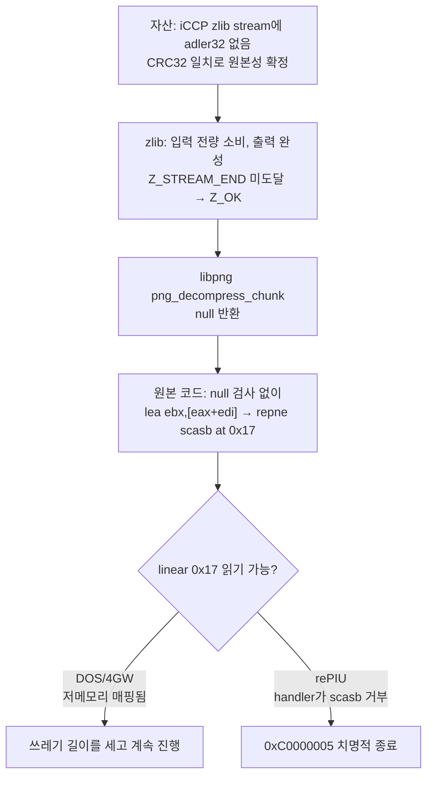
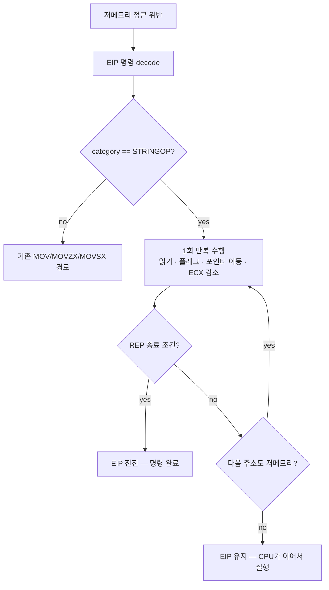
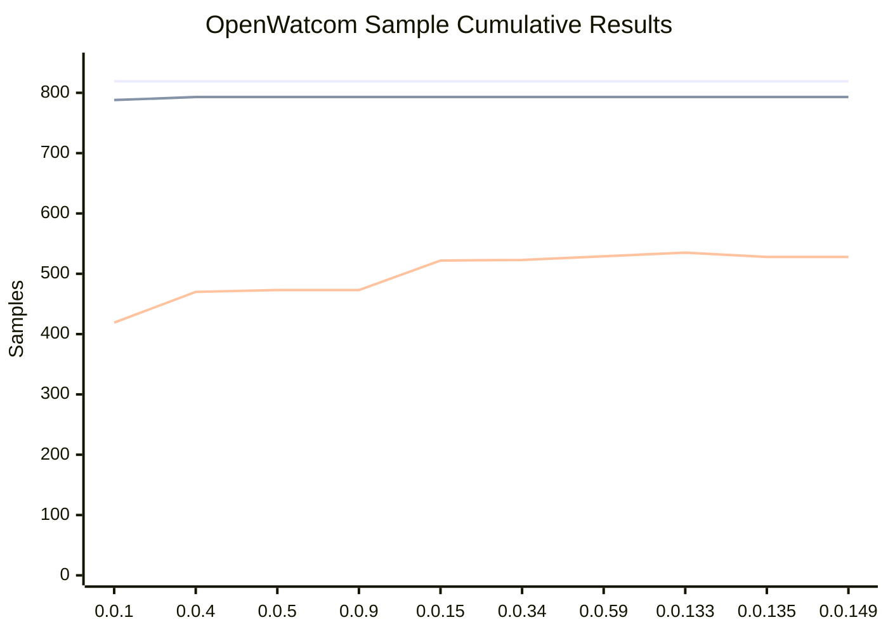
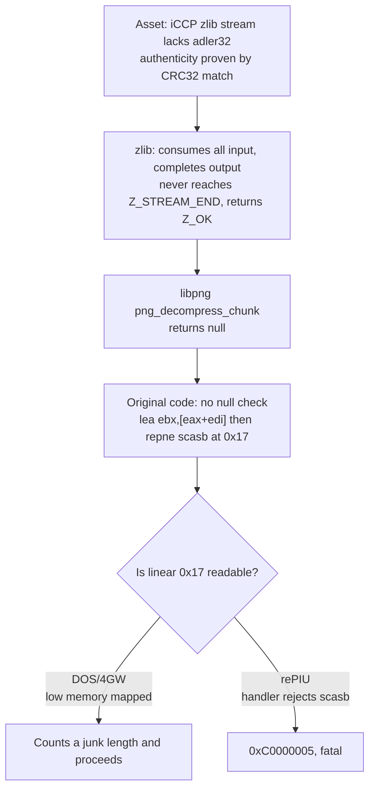
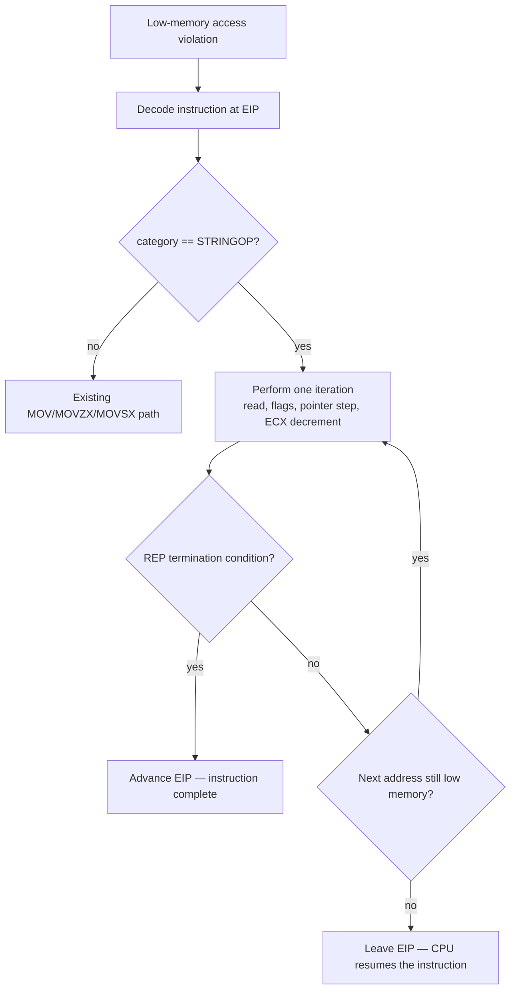

# The Four Bytes That Were Never There: A Colour Profile, a Missing Checksum, and the Wrong Suspect

범위: [`7f708b1`](https://github.com/nworkers/rePIU/commit/7f708b1ffb358e857d88b52dc95f796f24ff6614)부터 [`3e69b9c`](https://github.com/nworkers/rePIU/commit/3e69b9c)까지 (v0.0.149 → v0.0.150)

`pumpit8`(Pump It Up: The Rebirth)은 ROM·CHD 마운트, 실행 파일 로딩, JAMMA, 보안 칩 초기화를 모두 통과한 뒤 배경 애니메이션을 읽다가 약 97초 지점에서 `0xC0000005` 접근 위반으로 종료됐습니다.

모든 관측은 libpng와 zlib을 가리켰습니다. 그런데 최종적으로 고친 파일에는 PNG의 P자도 들어 있지 않습니다. libpng도, zlib도, 자산도 전부 "올바르게" 동작하고 있었고, 원본과 다르게 행동한 것은 **주소 공간** 하나였습니다.

이 글은 잘못된 용의자를 두 번 거쳐 진짜 원인에 도달한 기록입니다.

## 주요 변경 사항

### 1. 증상과 1차 단서 — inflate는 성공했는데 실패했다

죽는 지점은 libpng `1.0.6`의 `iCCP` chunk 처리 경로였습니다. `iCCP`는 PNG에 ICC 색 프로필을 심는 chunk이고, 프로필 본문은 zlib으로 압축돼 있습니다. 압축 해제 보조 함수가 끝난 직후의 `z_stream` 상태는 이랬습니다.

| 필드 | 값 | 해석 |
|---|---:|---|
| 반환 | `Z_OK (0)` | 오류 아님 |
| `avail_in` | `0` | 입력을 전부 소비 |
| `total_in` | `0xA20` (2,592) | 준 만큼 정확히 씀 |
| `total_out` | `0xC48` (3,144) | 출력 완성 |
| `avail_out` | `0x13B8` | 버퍼는 남아돌았음 |

출력 3,144바이트는 Windows의 `sRGB Color Space Profile.icm`과 일치했습니다. **프로필 본문은 완벽하게 복원됐는데** `Z_STREAM_END`가 아니라 `Z_OK`입니다.

libpng 1.0.6의 `png_decompress_chunk`는 `while (avail_in)`으로 돌다가 입력이 바닥나면 빠져나오고, `ret != Z_STREAM_END`이면 **null을 반환**합니다. 데이터를 다 만들어 놓고 "스트림이 안 끝났다"는 이유로 버립니다.

zlib datastream은 deflate 블록 뒤에 4바이트 adler32가 와야 끝납니다. 입력을 다 쓰고도 종단에 못 갔다는 것은 그 꼬리가 없다는 뜻입니다. 문제는 **어디서** 없어졌느냐였습니다.

### 2. 진단 도구 — 32바이트 창으로는 볼 수 없었다

원본 자산을 정적으로 확인하려는 시도는 막혔습니다. `BGA/083.DAT`는 `RES\0` 버전 3 컨테이너인데 16바이트 헤더 뒤 페이로드 390,039바이트가 전부 고엔트로피이고, 파일 어디에도 PNG signature도 `iCCP` 문자열도 없습니다. **PNG는 런타임에만 존재합니다.**

기존 실행 probe는 레지스터가 가리키는 메모리를 32바이트씩만 떠 줬습니다. 2,615바이트 chunk를 보기엔 부족해서 진단 기능부터 만들었습니다 ([`147ec90`](https://github.com/nworkers/rePIU/commit/147ec90)).

`REPIU_EXECUTION_PROBE_DUMP_*`는 probe가 처음 적중한 순간 지정한 게스트 메모리 구간을 파일로 기록합니다.

* 기준점은 레지스터 이름 또는 절대 주소이며, 선택적으로 **간접 역참조**로 구조체 안의 포인터를 따라갑니다.
* buffer는 실행 시작 전에 미리 할당합니다. 예외 처리기 안에서 heap lock을 다시 잡지 않기 위함입니다.
* 파일 기록은 게스트 스레드가 멈춘 뒤에 수행합니다. VEH 안에서는 파일 I/O를 하지 않습니다.
* 바이트는 telemetry snapshot을 거치지 않습니다. 폴링마다 KB 단위를 복사하지 않기 위함입니다.

절차는 `docs/guides/execution-probe-memory-dump.md`에 남겼습니다.

### 3. 정확히 네 바이트

추출한 chunk를 호스트의 독립 zlib 디코더로 검증했습니다.

```text
chunk 전체     : 2,615 (0xA37)
keyword       : 'Photoshop ICC profile'   prefix 23 (0x17)
compressed    : 2,592 (0xA20)   zlib head 78 9c   유효
inflate 출력   : 3,144 (0xC48)   'acsp'  선언 크기 0xC48   유효

adler32(출력)  : 0xF784F3FB
마지막 4바이트  : 4F 9F 7E 13      <- 체크섬이 아니다
```

부족한 양이 몇 바이트인지는 비트 정렬에 따라 1~4 사이 어디든 될 수 있습니다. 그래서 deflate 스트림이 정확히 어디서 끝나는지를 꼬리부터 한 바이트씩 잘라가며 측정했습니다.

```text
raw len 2590 -> inflated 3144
raw len 2589 -> inflated 0
raw len 2588 -> inflated 0
raw len 2587 -> inflated 0     ... 이하 전부 0
```

2,590바이트(= compressed 2,592 − zlib 헤더 2)에서 한 바이트만 빼도 아무것도 나오지 않습니다. deflate 블록이 **compressed 필드의 마지막 바이트에서 정확히 끝난다**는 뜻이고, adler32가 들어갈 자리가 아예 없습니다. 결손은 정확히 4바이트입니다.

### 4. 반전 — CRC가 맞았다

자연스러운 다음 가설은 "rePIU 어딘가에서 4바이트를 흘렸다"였습니다. 그런데 chunk의 길이 필드와 실제 데이터 길이가 **서로 일치**합니다. 데이터만 잘렸다면 libpng는 `0xA37`바이트 중 마지막 4바이트를 adler32로 읽고 불일치로 `Z_DATA_ERROR`를 냈을 것입니다. 관측은 `Z_OK`였으니 길이와 데이터가 함께 짧습니다.

png context `+0x0C`의 포인터를 간접 역참조해 1 MiB를 추출하니 PNG 스트림 본체가 나왔습니다.

| 게스트 주소 | chunk | length |
|---|---|---:|
| `0x04B20320` | `IHDR` | 13 |
| `0x04B20339` | `iCCP` | 2,615 |
| `0x04B20D7C` | `gAMA` | 4 |
| `0x04B20D8C` | `cHRM` | 32 |
| `0x04B20DB8` | `IDAT` | 23,935 |

IHDR은 256×256, bit depth 8, color type 6이고 모든 chunk 경계가 정확히 맞습니다. PNG 스트림 자신의 길이 필드가 `0xA37`이므로 길이 전달 오류도 아닙니다.

결정타는 CRC였습니다.

```text
chunk type     : 'iCCP'
계산한 CRC32    : 0x8FC1BA08
저장된 CRC32    : 0x8FC1BA08
                 일치
```

어느 단계에서든 4바이트가 유실됐다면 CRC는 깨집니다. **이 chunk는 작성된 그대로 메모리에 도달했습니다.** 파일 읽기도 4,096 + 385,536 + 407 = 390,039바이트로 완전했습니다(마지막 short read는 정상 EOF). rePIU의 파일 I/O, RES 복호화, PNG 전달은 결백하고, 자산이 원래 그렇게 만들어진 것입니다. 같은 1 MiB 창의 PNG signature 7건 중 `iCCP`를 가진 것은 이 하나뿐입니다.

### 5. 원본 기판은 왜 안 죽었나

자산이 원래 깨져 있었다면 원본에서도 libpng는 똑같이 null을 반환했을 것입니다. 그런데 이 게임은 오락실에서 잘 돌아갔습니다. 그렇다면 null을 받은 **다음**이 다릅니다. 원본 실행 파일의 호출 지점을 `repiu_aot_probe`로 정적 역어셈블했습니다.

```asm
0x010E5CFC  call 0x010E49F8        ; png_decompress_chunk -> NULL
0x010E5D01  mov  ebp, eax
0x010E5D03  lea  ebx, [eax+edi*1]  ; 0 + 0x17 = 0x17
0x010E5D06  mov  edi, ebx
0x010E5D08  sub  ecx, ecx
0x010E5D0A  dec  ecx               ; ecx = 0xFFFFFFFF
0x010E5D0B  xor  eax, eax          ; al = 0
0x010E5D0D  repne scasb            ; strlen(0x17)  <- 여기서 죽는다
0x010E5D0F  not  ecx
0x010E5D11  dec  ecx               ; ecx = 길이
0x010E5D20  call 0x010E9088        ; png_set_iCCP
```

`call`과 fault 사이에 **조건 분기가 하나도 없습니다.** libpng 1.0.6은 반환값을 검사하지 않고 곧바로 prefix `0x17`을 더해 역참조합니다. 원본 바이너리에 박힌 잠재 버그이며, rePIU의 분기 오역이 아닙니다.

`EAX=0`에 `EDI=0x17`이 더해졌으므로 이 명령이 요구하는 것은 **linear 주소 `0x17`부터 NUL이 나올 때까지 읽어라**입니다. DOS/4GW의 flat selector는 base가 0이라 `0x17`은 DOS 저메모리(인터럽트 벡터 테이블)이고 읽을 수 있습니다. rePIU에서는 게스트 주소가 곧 호스트 주소이고 Win32는 최하위 64 KiB를 영구 예약하므로 매핑할 수 없습니다.

### 6. 진짜 결함 위치와 대책

rePIU에는 저메모리 대행 기능이 이미 있었습니다. 64 KiB 미만 접근 위반을 VEH에서 받아 0으로 초기화된 저메모리 이미지에서 값을 돌려주는 `HandleGuestLowMemoryReadFault`입니다. 그런데 처리 대상이 세 개뿐이었습니다.

```cpp
if (instruction.mnemonic != ZYDIS_MNEMONIC_MOV &&
    instruction.mnemonic != ZYDIS_MNEMONIC_MOVZX &&
    instruction.mnemonic != ZYDIS_MNEMONIC_MOVSX)
{
    context->debug_emulate_stage = 4; // Wrong mnemonic
    return false;                     // <- scasb는 여기서 거부된다
}
```

전체 인과는 다음과 같습니다.



대책은 저메모리 대행 기능을 게스트가 실제로 쓰는 명령 집합까지 넓히는 것입니다 ([`3e69b9c`](https://github.com/nworkers/rePIU/commit/3e69b9c)). 특정 주소를 우회하거나 libpng 반환값을 조작하는 것이 아니라, 이미 있던 기능을 완성하는 작업입니다.

문제는 `REP` 계열이 `MOV`와 근본적으로 다르다는 점입니다. `MOV`는 "읽고 `EIP`를 다음으로 옮기면" 끝이지만 `repne scasb`는 반복 상태를 `ECX`/`EDI`에 들고 있습니다. 해법은 아키텍처가 이미 보장하는 성질에 있었습니다. **`REP` 계열은 반복 도중 인터럽트가 가능하도록 정의되어 있어 재개 가능합니다.**



핸들러는 루프 전체를 흉내 낼 필요가 없습니다. 반복이 끝났을 때만 `EIP`를 전진시키고, 남았으면 그대로 두면 됩니다. 다음 주소가 저메모리면 다시 fault가 나서 또 대행되고, 벗어났으면 CPU가 현재 `ECX`/`ESI`/`EDI` 상태에서 같은 명령을 이어서 실행합니다. 둘 다 올바르므로 **핸들러는 저메모리가 어디서 끝나는지 추적할 필요가 없습니다.**

정확성에서 신경 쓴 지점은 셋입니다.

* **폭은 mnemonic에서 얻습니다.** `66h` prefix는 mnemonic 자체를 바꾸므로(`SCASW` 대 `SCASD`) 이 매핑이 정확하고, 디코더의 operand width 보고 방식에 의존하지 않습니다.
* **category로 먼저 거릅니다.** SSE의 `cmpsd`가 문자열 `CMPSD`와 mnemonic을 공유하므로 `ZYDIS_CATEGORY_STRINGOP` 검사로 갈라냅니다.
* **플래그를 폭별로 계산합니다.** `repne`의 종료 판정이 `ZF`에 달려 있어 기존 8비트 전용 헬퍼를 폭 인자를 받도록 일반화했습니다.

추측으로 구현하는 대신 거부한 경계도 명시했습니다. `MOVS`는 이미 전담 핸들러가 있고, `STOS`는 쓰기라 별도 근거가 필요하며, 32비트가 아닌 address size, 저메모리 경계를 걸친 접근, 읽을 수 없는 `CMPS` 반대편, `ECX`가 이미 0인 `REP`는 모두 거부해 기존 진단이 원인을 그대로 보고하게 뒀습니다.

### 7. 실행 로그 — 현재 진행 지점과 blocker

수정 전 `pumpit8` 종료 지점입니다.

```text
[loader] Win32 minimal execution exception code: 0xC0000005
[loader] Win32 minimal execution exception EAX: 0x00000000
[loader] Win32 minimal execution exception EBX: 0x00000017
```

`EAX`가 null 반환, `EBX`가 거기에 prefix `0x17`을 더한 값입니다. 수정 후 같은 지점입니다.

```text
[loader] Win32 low-memory string service/iteration count: 2522/2522
[loader] Win32 last low-memory string EIP/address/mnemonic/iterations: 0x040E5D0D/0x00000017/711/1
[loader] Win32 last DOS open guest path: AUDIO\004.AUD
[loader] Win32 minimal execution message: minimal execution stopped by SDL exit request
```

mnemonic `711`은 `ZYDIS_MNEMONIC_SCASB`입니다.

| 항목 | 수정 전 | 수정 후 |
|---|---|---|
| 종료 | 약 97초에 `0xC0000005` | 예외 0건 |
| string 대행 / 반복 | — | 2,522 / 2,522 |
| 도달 지점 | `BGA/083.DAT` | `AUDIO/004.AUD` |
| 화면 | — | 약 6.9 FPS 렌더링 |

대행 횟수와 반복 수가 **정확히 같습니다.** 저메모리 이미지가 0으로 초기화돼 있어 `repne scasb`가 첫 바이트에서 `ZF=1`로 끝나고 길이 0을 만들기 때문이며, 설계 단계에서 예측한 그대로입니다. 원본이 IVT를 훑어 임의의 길이를 만들었을 동작과 같은 성격입니다.

실행은 접근 위반이 아니라 관측을 끝내려고 보낸 SDL 종료 요청으로 끝났습니다. `MOV` 경로 계수는 수정 전후 모두 0이라 기존 경로는 바뀌지 않았습니다.

**blocker 상태.** 이 지점만 닫혔습니다. 게임 완주가 가능하다는 뜻이 아니며, 148초 구간에서 예외 없이 렌더링하는 것까지만 확인했습니다.

### sample test 결과

819개 샘플을 빌드하고 baseline과 같은 Release 구성으로 suite를 재측정했습니다.

| 항목 | 0.0.133 (Debug) | 0.0.135 (Release, baseline) | **0.0.149 (Release, 이번 측정)** |
|---|---:|---:|---:|
| Total | 819 | 819 | 819 |
| BuildPassed / BuildSkipped | 793 / 26 | 793 / 26 | **793 / 26** |
| RunEligible | 793 | 793 | **793** |
| **RunPassed** | **535** | **528** | **528** |
| RunPassRate | — | — | **66.6%** |
| OverallPassRate | — | — | **64.5%** |

baseline 대조 결과는 **회귀 0건, 신규 통과 0건**으로 완전히 동일합니다.

```json
{
    "BaselineVersion":  "0.0.135",
    "NewPass":  [ ],
    "Regressions":  [ ]
}
```

이번 변경이 저메모리 접근 위반에서만 발화하는 VEH 경로에 한정된다는 예상과 일치합니다. 이 suite의 DOS 샘플들은 `repne scasb`로 저메모리를 읽는 경로에 도달하지 않으므로 대행 계수가 오르지 않고, 따라서 통과 수도 움직이지 않습니다. 다만 이는 **영향이 없음을 확인한 것**이지 이 경로가 검증됐다는 뜻은 아닙니다. 문자열 대행의 실제 검증은 `pumpit8` 실행 관측입니다.

0.0.133(535)과 0.0.135(528)의 차이는 구성이 Debug에서 Release로 바뀐 결과이며 회귀로 읽으면 오독입니다. 이번 0.0.149는 같은 Release 구성이라 528로 정확히 일치합니다.



### 빌드 검증

* `cmake --build build/win32_x86_debug --config Debug --target repiu`: 성공
* `cmake --build build/win32_x86_debug --config Debug --target repiu_aot_probe`: 성공
* `scripts/build_openwatcom_samples.ps1 -Configuration Release`: 성공 (819/819 빌드)
* `scripts/test_openwatcom_samples.ps1 -Configuration Release -CompareBaseline`: 성공 (회귀 0건)

## 사용된 기술 스택

### PNG chunk 구조와 CRC32

PNG 파일은 signature 8바이트 뒤로 chunk가 이어집니다. 각 chunk는 `length(4) + type(4) + data(length) + CRC(4)` 구조이고, CRC32는 **type과 data**에 대해 계산합니다(length는 제외).

이번 수사에서 CRC가 결정적이었던 이유가 여기 있습니다. 데이터가 4바이트 잘렸다면 CRC 입력이 달라지므로 저장된 값과 어긋납니다. CRC가 일치한다는 것은 chunk 전체가 작성 시점 그대로라는 증명입니다. 데이터 이동 경로를 의심할 때 그 데이터에 이미 붙어 있는 무결성 필드부터 확인하는 것이 빠릅니다.

`iCCP`의 compressed profile은 zlib datastream이어야 한다고 사양이 규정합니다 ([PNG 1.1 chunk specification](https://www.libpng.org/pub/png/spec/1.1/PNG-Chunks.html)).

### zlib datastream 종단과 adler32

zlib datastream은 `CMF/FLG` 2바이트 헤더, deflate 블록, 그리고 압축 해제 결과에 대한 **4바이트 adler32**로 끝납니다 ([RFC 1950](https://www.rfc-editor.org/rfc/rfc1950)). deflate 블록 자체의 형식은 [RFC 1951](https://www.rfc-editor.org/rfc/rfc1951)입니다.

`inflate()`는 마지막 블록을 다 풀어도 adler32 4바이트를 읽어 검증하기 전까지 `Z_STREAM_END`를 돌려주지 않습니다. 입력이 떨어지면 `Z_OK`로 돌아옵니다. 이번 사례의 `Z_OK` + `avail_in == 0` + 출력 완성 조합이 정확히 그 상태입니다.

주의할 점은 `total_in`만으로는 결손량을 알 수 없다는 것입니다. inflate는 비트 버퍼에 몇 바이트를 미리 당겨 놓을 수 있어서, 관측된 `total_in`이 논리적 소비 위치보다 앞설 수 있습니다. 그래서 꼬리를 한 바이트씩 잘라 최소 길이를 재는 방식으로 확정했습니다.

### x86 문자열 명령과 REP 재개 가능성

`scasb`는 `AL`과 `ES:[EDI]`의 1바이트를 비교해 플래그만 바꾸고 `EDI`를 `DF`에 따라 ±1 이동시킵니다. 읽기 전용이라 부수 효과는 `EDI`와 플래그뿐이고, 세그먼트는 항상 `ES`이며 prefix로 바꿀 수 없습니다.

`repne`는 매 반복마다 `ECX == 0`이면 종료, `ECX -= 1`, `scasb` 실행, `ZF == 1`이면 종료 순으로 돕니다. `ZF`를 각 `scasb` **이후에** 검사하므로 명령 진입 시점의 `ZF`는 무관합니다. 위 코드에서 직전 `xor eax, eax`가 `ZF=1`을 만들지만 루프는 정상적으로 돕니다.

`ECX = 0xFFFFFFFF`, `AL = 0`으로 놓고 `repne scasb` 뒤에 `not ecx; dec ecx`를 붙이는 것은 Watcom 컴파일러의 전형적인 `strlen` 관용구입니다. NUL이 index `n`에 있으면 루프는 `n+1`회 돌아 `ECX = 0xFFFFFFFF − (n+1)`이 되고, `NOT`하면 `n+1`, `DEC`하면 `n`이 됩니다.

구현을 떠받친 성질은 **재개 가능성**입니다. Intel SDM은 `REP` 계열이 반복 사이에서 인터럽트될 수 있고, 그 경우 상태가 `ECX`와 인덱스 레지스터에 보존되며 명령 포인터가 해당 명령을 계속 가리켜 재개된다고 규정합니다 ([Intel® 64 and IA-32 Architectures Software Developer's Manual](https://www.intel.com/content/www/us/en/developer/articles/technical/intel-sdm.html), Vol. 2 `REP`/`SCAS`). 덕분에 fault 핸들러가 1회 반복만 처리하고 `EIP`를 그대로 두는 전략이 아키텍처적으로 정당합니다.

### DOS/4GW 저메모리와 Win32 널 페이지

DOS/4GW는 보호 모드에서 base 0, limit 4 GB인 flat selector를 제공합니다. 그래서 게스트는 linear 0부터의 저메모리 — 인터럽트 벡터 테이블, BIOS 데이터 영역 — 를 그대로 읽을 수 있습니다. DOS 시대 코드가 저메모리를 직접 참조하는 것은 예외가 아니라 관행입니다.

rePIU는 게스트 주소를 호스트 주소로 그대로 씁니다(arena base `0x04000000`). Win32는 최하위 64 KiB를 영구 예약하므로 `0x17`에는 무엇도 매핑할 수 없습니다. 그래서 프로젝트는 접근 위반을 VEH에서 받아 0으로 초기화된 64 KiB 이미지에서 값을 돌려주는 방식으로 저메모리 읽기를 대행합니다. 이번 작업은 그 대행 범위를 문자열 명령까지 넓힌 것입니다.

이 격차는 처음이 아닙니다. v0.0.58에서도 빈 텍스처 descriptor를 파싱하다 주소 0을 읽는 경로가 같은 이유로 문제가 됐고, 그때 "데이터 버그가 아니라 HLE 격차"로 재분류한 판단이 이번에도 그대로 적용됩니다.

### Zydis 디코딩 시 주의점

fault 핸들러는 Zydis로 명령을 디코드합니다. 두 가지가 함정입니다.

* SSE의 `cmpsd`(compare scalar double)와 문자열 `CMPSD`가 `ZYDIS_MNEMONIC_CMPSD`를 공유합니다. `instruction.meta.category == ZYDIS_CATEGORY_STRINGOP`로 갈라내야 합니다.
* 폭을 `operand_width`에서 가져오면 바이트 형태의 보고 방식에 의존하게 됩니다. `66h` prefix가 mnemonic 자체를 바꾸므로 mnemonic에서 폭을 얻는 편이 정확합니다.

### 예외 처리기 안에서 할 수 있는 일과 없는 일

VEH 핸들러는 임의의 시점에 끼어들기 때문에 제약이 큽니다. 이번 진단 도구에서 지킨 규칙은 둘입니다. **할당하지 않습니다** — 예외가 heap lock을 잡은 상태에서 발생했다면 재진입으로 교착합니다. 그래서 dump buffer는 실행 시작 전에 미리 확보합니다. **파일 I/O를 하지 않습니다** — 기록은 게스트 스레드가 멈춘 뒤로 미룹니다.

읽기 범위 검사도 마찬가지 이유로 보수적입니다. 전체 폭이 유효 범위 안에 들어올 때만 복사하고, 걸치는 접근은 거부합니다.

---

# The Four Bytes That Were Never There: A Colour Profile, a Missing Checksum, and the Wrong Suspect

Range: [`7f708b1`](https://github.com/nworkers/rePIU/commit/7f708b1ffb358e857d88b52dc95f796f24ff6614) to [`3e69b9c`](https://github.com/nworkers/rePIU/commit/3e69b9c) (v0.0.149 → v0.0.150)

`pumpit8` (Pump It Up: The Rebirth) cleared ROM/CHD mounting, executable loading, JAMMA, and security-chip initialization, then terminated with a `0xC0000005` access violation about 97 seconds in while reading a background animation.

Every observation pointed at libpng and zlib. Yet the file finally changed contains no PNG code at all. libpng, zlib, and the asset were all behaving "correctly"; the only thing acting differently from the original was the **address space**.

This is the record of reaching the real cause after two wrong suspects.

## Major Changes

### 1. Symptom and first clue — inflate succeeded and failed

The termination sat in libpng `1.0.6`'s `iCCP` chunk path. `iCCP` embeds an ICC colour profile in a PNG, and the profile body is zlib-compressed. The `z_stream` state right after the decompression helper returned was:

| Field | Value | Reading |
|---|---:|---|
| return | `Z_OK (0)` | not an error |
| `avail_in` | `0` | input fully consumed |
| `total_in` | `0xA20` (2,592) | consumed exactly what it was given |
| `total_out` | `0xC48` (3,144) | output complete |
| `avail_out` | `0x13B8` | buffer had room to spare |

The 3,144-byte output matched Windows' `sRGB Color Space Profile.icm`. **The profile body was reconstructed perfectly**, yet the result was `Z_OK` rather than `Z_STREAM_END`.

libpng 1.0.6's `png_decompress_chunk` loops `while (avail_in)`, exits when input runs out, and **returns null** if `ret != Z_STREAM_END`. It builds the whole payload and then discards it because the stream never closed.

A zlib datastream ends with a 4-byte adler32 after the deflate blocks. Consuming all input without reaching termination means that tail is missing. The question was **where** it went missing.

### 2. The diagnostic — a 32-byte window could not show it

Inspecting the original asset statically was blocked. `BGA/083.DAT` is a `RES\0` version-3 container whose 390,039-byte payload after the 16-byte header is entirely high-entropy, with no PNG signature and no `iCCP` string anywhere in the file. **The PNG exists only at runtime.**

The existing execution probe captured only 32 bytes per register — far too little for a 2,615-byte chunk — so the diagnostic came first ([`147ec90`](https://github.com/nworkers/rePIU/commit/147ec90)).

`REPIU_EXECUTION_PROBE_DUMP_*` writes a chosen guest memory range to a file at the probe's first hit.

* The base is a register name or an absolute address, with optional **indirect dereference** to follow a pointer inside a structure.
* The buffer is reserved before execution starts, so the exception handler never re-enters the heap lock.
* The file is written after the guest thread stops; no file I/O happens inside the VEH.
* The bytes never travel through the telemetry snapshot, so polling does not copy kilobytes each iteration.

The procedure is recorded in `docs/guides/execution-probe-memory-dump.md`.

### 3. Exactly four bytes

The extracted chunk was validated with an independent host zlib decoder.

```text
whole chunk    : 2,615 (0xA37)
keyword        : 'Photoshop ICC profile'   prefix 23 (0x17)
compressed     : 2,592 (0xA20)   zlib head 78 9c   valid
inflate output : 3,144 (0xC48)   'acsp'  declared size 0xC48   valid

adler32(output): 0xF784F3FB
last four bytes: 4F 9F 7E 13      <- not a checksum
```

How many bytes are missing can be anywhere from one to four depending on bit alignment, so the exact end of the deflate stream was measured by trimming the tail one byte at a time.

```text
raw len 2590 -> inflated 3144
raw len 2589 -> inflated 0
raw len 2588 -> inflated 0
raw len 2587 -> inflated 0     ... zero for everything below
```

Removing even one byte from 2,590 (= compressed 2,592 − the 2-byte zlib header) yields nothing. The deflate blocks therefore **end exactly on the last byte of the compressed field**, leaving no room at all for the adler32. The shortfall is exactly four bytes.

### 4. The reversal — the CRC matched

The natural next hypothesis was that rePIU had dropped four bytes somewhere. But the chunk's length field and its actual data length **agree**. Had only the data been truncated, libpng would have read the last four of those `0xA37` bytes as the adler32 and failed with `Z_DATA_ERROR`. The observation was `Z_OK`, so length and data are short together.

Dereferencing the pointer at png context `+0x0C` and dumping 1 MiB produced the PNG stream body.

| Guest address | Chunk | Length |
|---|---|---:|
| `0x04B20320` | `IHDR` | 13 |
| `0x04B20339` | `iCCP` | 2,615 |
| `0x04B20D7C` | `gAMA` | 4 |
| `0x04B20D8C` | `cHRM` | 32 |
| `0x04B20DB8` | `IDAT` | 23,935 |

IHDR is 256×256, bit depth 8, colour type 6, and every chunk boundary lines up. The PNG stream's own length field reads `0xA37`, ruling out a length-propagation error.

The CRC settled it.

```text
chunk type    : 'iCCP'
computed CRC32: 0x8FC1BA08
stored CRC32  : 0x8FC1BA08
                match
```

A four-byte loss at any stage would break the CRC. **This chunk reached memory exactly as authored.** The file reads were complete too: 4,096 + 385,536 + 407 = 390,039 bytes, the final short read being ordinary EOF. rePIU's file I/O, RES decryption, and PNG delivery are all exonerated; the asset was authored this way. Of seven PNG signatures in the same 1 MiB window, only this one carries an `iCCP` chunk.

### 5. Why the original board survived

If the asset was always broken, libpng returned null on the original hardware too — yet the game ran fine in arcades. So what differs is what happens **after** the null. Static disassembly of the call site with `repiu_aot_probe`:

```asm
0x010E5CFC  call 0x010E49F8        ; png_decompress_chunk -> NULL
0x010E5D01  mov  ebp, eax
0x010E5D03  lea  ebx, [eax+edi*1]  ; 0 + 0x17 = 0x17
0x010E5D06  mov  edi, ebx
0x010E5D08  sub  ecx, ecx
0x010E5D0A  dec  ecx               ; ecx = 0xFFFFFFFF
0x010E5D0B  xor  eax, eax          ; al = 0
0x010E5D0D  repne scasb            ; strlen(0x17)  <- faults here
0x010E5D0F  not  ecx
0x010E5D11  dec  ecx               ; ecx = length
0x010E5D20  call 0x010E9088        ; png_set_iCCP
```

**No conditional branch separates the call from the fault.** libpng 1.0.6 adds the prefix `0x17` and dereferences without checking the return. That is a latent bug in the original binary, not a rePIU branch mistranslation.

With `EAX=0` plus `EDI=0x17`, the instruction asks to **read from linear address `0x17` until a NUL appears**. DOS/4GW's flat selector has base 0, so `0x17` is DOS low memory (the interrupt vector table) and readable. In rePIU a guest address is a host address, and Win32 permanently reserves the lowest 64 KiB, so nothing can be mapped at `0x17`.

### 6. The real defect and the fix

rePIU already had a low-memory servicing facility: `HandleGuestLowMemoryReadFault` catches access violations below 64 KiB in the VEH and returns values from a zero-initialized low-memory image. But it handled only three instructions.

```cpp
if (instruction.mnemonic != ZYDIS_MNEMONIC_MOV &&
    instruction.mnemonic != ZYDIS_MNEMONIC_MOVZX &&
    instruction.mnemonic != ZYDIS_MNEMONIC_MOVSX)
{
    context->debug_emulate_stage = 4; // Wrong mnemonic
    return false;                     // <- scasb is rejected here
}
```

The full chain:



The fix widens the low-memory facility to the instruction set the guest actually uses ([`3e69b9c`](https://github.com/nworkers/rePIU/commit/3e69b9c)). It bypasses no address and manipulates no libpng return value; it completes a facility that already existed.

The difficulty is that `REP` forms differ fundamentally from `MOV`. `MOV` is done once you read and step `EIP`; `repne scasb` carries repetition state in `ECX`/`EDI`. The solution rests on a property the architecture already guarantees: **`REP` forms are defined to be interruptible between iterations, and therefore restartable.**



The handler need not reproduce the loop. It advances `EIP` only when the repetition finished and otherwise leaves it alone: if the next address is still low memory it faults again and is serviced again; if it has left, the CPU resumes the same instruction from the current `ECX`/`ESI`/`EDI`. Both are correct, so **the handler never tracks where low memory ends.**

Three correctness details mattered.

* **Width comes from the mnemonic.** A `66h` prefix selects a different mnemonic outright (`SCASW` versus `SCASD`), making the mapping exact and independent of how the decoder reports operand width for byte forms.
* **Category gates first.** SSE's `cmpsd` shares its mnemonic with the string `CMPSD`, so `ZYDIS_CATEGORY_STRINGOP` separates them.
* **Flags are computed per width.** `repne` termination depends on `ZF`, so the existing 8-bit-only helper was generalized to take a width.

The declining boundaries are stated rather than guessed: `MOVS` already has a dedicated handler, `STOS` writes and needs its own justification, and a non-32-bit address size, a straddling access, an unreadable `CMPS` counterpart, and a `REP` with `ECX` already zero all decline so the existing diagnostics report the real cause.

### 7. Execution log — current progress point and blocker

The `pumpit8` termination before the fix:

```text
[loader] Win32 minimal execution exception code: 0xC0000005
[loader] Win32 minimal execution exception EAX: 0x00000000
[loader] Win32 minimal execution exception EBX: 0x00000017
```

`EAX` is the null return and `EBX` is that plus the prefix `0x17`. The same site after the fix:

```text
[loader] Win32 low-memory string service/iteration count: 2522/2522
[loader] Win32 last low-memory string EIP/address/mnemonic/iterations: 0x040E5D0D/0x00000017/711/1
[loader] Win32 last DOS open guest path: AUDIO\004.AUD
[loader] Win32 minimal execution message: minimal execution stopped by SDL exit request
```

Mnemonic `711` is `ZYDIS_MNEMONIC_SCASB`.

| Item | Before | After |
|---|---|---|
| Termination | `0xC0000005` at ~97 s | zero exceptions |
| String services / iterations | — | 2,522 / 2,522 |
| Reached | `BGA/083.DAT` | `AUDIO/004.AUD` |
| Display | — | rendering at ~6.9 FPS |

Services and iterations are **exactly equal**. The low-memory image is zero-initialized, so the `repne scasb` terminates on its first byte with `ZF=1` and yields a length of zero — precisely as the design predicted, and the same character as the original scanning the IVT for an arbitrary length.

The run ended on an SDL exit request issued to stop the observation, not on an access violation. The `MOV` path counter is zero both before and after, so that path is unchanged.

**Blocker status.** Only this site is closed. It does not mean the game can be completed; observation confirmed 148 seconds of exception-free rendering and no further.

### Sample test results

All 819 samples were built and the suite re-measured in the same Release configuration as the baseline.

| Item | 0.0.133 (Debug) | 0.0.135 (Release, baseline) | **0.0.149 (Release, this run)** |
|---|---:|---:|---:|
| Total | 819 | 819 | 819 |
| BuildPassed / BuildSkipped | 793 / 26 | 793 / 26 | **793 / 26** |
| RunEligible | 793 | 793 | **793** |
| **RunPassed** | **535** | **528** | **528** |
| RunPassRate | — | — | **66.6%** |
| OverallPassRate | — | — | **64.5%** |

The baseline comparison is **zero regressions and zero new passes** — exactly identical.

```json
{
    "BaselineVersion":  "0.0.135",
    "NewPass":  [ ],
    "Regressions":  [ ]
}
```

This matches the expectation that the change is confined to a VEH path firing only on low-memory access violations. The suite's DOS samples never reach a path that reads low memory through `repne scasb`, so the servicing counters stay at zero and the pass count does not move. Note that this **confirms the absence of impact** rather than validating the path; the actual validation of string servicing is the `pumpit8` execution observation.

The gap between 0.0.133 (535) and 0.0.135 (528) comes from the configuration moving from Debug to Release; reading it as a regression is a misreading. This 0.0.149 run is the same Release configuration and lands on 528 exactly.


### Build verification

* `cmake --build build/win32_x86_debug --config Debug --target repiu`: passed
* `cmake --build build/win32_x86_debug --config Debug --target repiu_aot_probe`: passed
* `scripts/build_openwatcom_samples.ps1 -Configuration Release`: passed (819/819 built)
* `scripts/test_openwatcom_samples.ps1 -Configuration Release -CompareBaseline`: passed (zero regressions)

## Technology Stack Used

### PNG chunk structure and CRC32

A PNG file is an 8-byte signature followed by chunks. Each chunk is `length(4) + type(4) + data(length) + CRC(4)`, and the CRC32 covers **the type and the data** — not the length.

That is why the CRC was decisive here. Truncating the data by four bytes changes the CRC input, so the stored value would disagree. A matching CRC proves the whole chunk is as authored. When a data-movement path is under suspicion, checking the integrity field already attached to that data is the fast route.

The specification requires an `iCCP` compressed profile to be a zlib datastream ([PNG 1.1 chunk specification](https://www.libpng.org/pub/png/spec/1.1/PNG-Chunks.html)).

### zlib datastream termination and adler32

A zlib datastream is a 2-byte `CMF/FLG` header, deflate blocks, and a **4-byte adler32** over the uncompressed result ([RFC 1950](https://www.rfc-editor.org/rfc/rfc1950)). The deflate block format itself is [RFC 1951](https://www.rfc-editor.org/rfc/rfc1951).

`inflate()` does not return `Z_STREAM_END` after unpacking the final block until it has read and verified those four bytes; when input runs out it returns `Z_OK`. The combination seen here — `Z_OK`, `avail_in == 0`, output complete — is exactly that state.

One caution: `total_in` alone cannot tell you the size of the shortfall. inflate may pull a few bytes ahead into its bit buffer, so the observed `total_in` can sit past the logical consumption point. Trimming the tail one byte at a time to find the minimum length is what settled it.

### x86 string instructions and REP restartability

`scasb` compares one byte of `AL` against `ES:[EDI]`, updates only the flags, and moves `EDI` by ±1 according to `DF`. It is read-only, so its side effects are `EDI` and the flags; the segment is always `ES` and cannot be overridden by a prefix.

`repne` runs each iteration as: terminate if `ECX == 0`, decrement `ECX`, execute `scasb`, terminate if `ZF == 1`. Because `ZF` is tested **after** each `scasb`, the flag's value on entry is irrelevant — the preceding `xor eax, eax` sets `ZF=1`, yet the loop still runs.

Setting `ECX = 0xFFFFFFFF` and `AL = 0`, then following `repne scasb` with `not ecx; dec ecx`, is Watcom's canonical `strlen` idiom. With the NUL at index `n` the loop runs `n+1` times leaving `ECX = 0xFFFFFFFF − (n+1)`; `NOT` gives `n+1` and `DEC` gives `n`.

The property the implementation rests on is **restartability**. The Intel SDM specifies that `REP` forms may be interrupted between iterations, with state preserved in `ECX` and the index registers and the instruction pointer still addressing the instruction so it resumes ([Intel® 64 and IA-32 Architectures Software Developer's Manual](https://www.intel.com/content/www/us/en/developer/articles/technical/intel-sdm.html), Vol. 2, `REP`/`SCAS`). That makes servicing a single iteration and leaving `EIP` in place architecturally sound.

### DOS/4GW low memory versus the Win32 null page

DOS/4GW provides a protected-mode flat selector with base 0 and a 4 GB limit, so a guest can read low memory from linear 0 — the interrupt vector table, the BIOS data area — directly. DOS-era code referencing low memory is the norm, not the exception.

rePIU uses guest addresses as host addresses (arena base `0x04000000`). Win32 permanently reserves the lowest 64 KiB, so nothing can be mapped at `0x17`. The project therefore services low-memory reads by catching the access violation in the VEH and returning values from a zero-initialized 64 KiB image. This work widens that servicing to string instructions.

This gap is not new. In v0.0.58 a path reading address 0 while parsing an empty texture descriptor hit the same wall, and the judgement made then — "an HLE gap, not a data bug" — applies again here.

### Zydis decoding pitfalls

The fault handler decodes instructions with Zydis. Two traps matter.

* SSE's `cmpsd` (compare scalar double) and the string `CMPSD` share `ZYDIS_MNEMONIC_CMPSD`. They must be separated with `instruction.meta.category == ZYDIS_CATEGORY_STRINGOP`.
* Taking the width from `operand_width` makes the code depend on how byte forms report it. Since a `66h` prefix changes the mnemonic itself, deriving width from the mnemonic is exact.

### What can and cannot be done inside an exception handler

A VEH handler interrupts at an arbitrary point, which constrains it sharply. Two rules held throughout this diagnostic. **Do not allocate** — if the exception happened while the heap lock was held, re-entering deadlocks, so the dump buffer is reserved before execution starts. **Do not perform file I/O** — writing is deferred until the guest thread has stopped.

The read-range checks are conservative for the same reason: copy only when the full width lies inside the valid range, and decline a straddling access.
