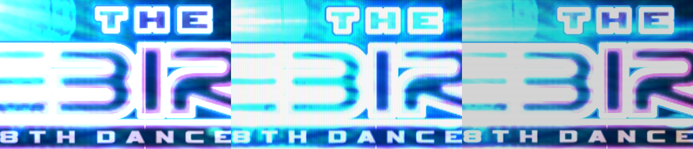
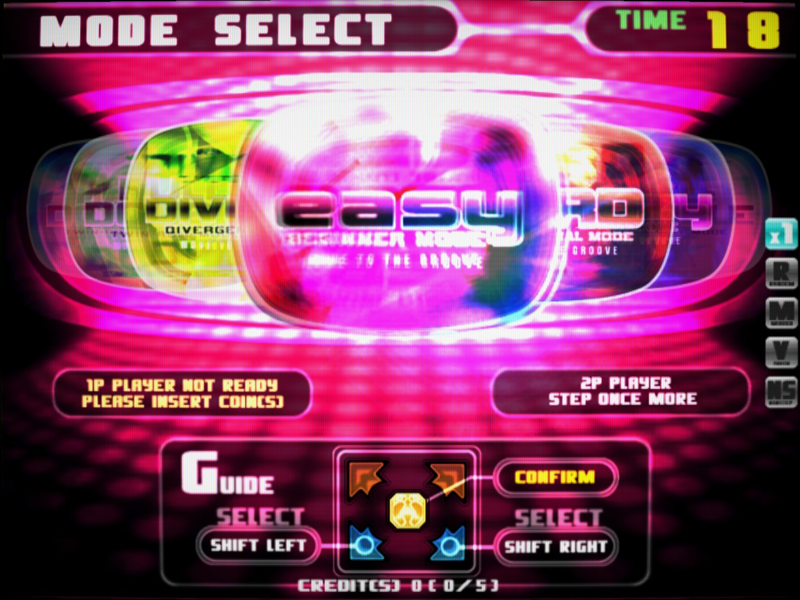
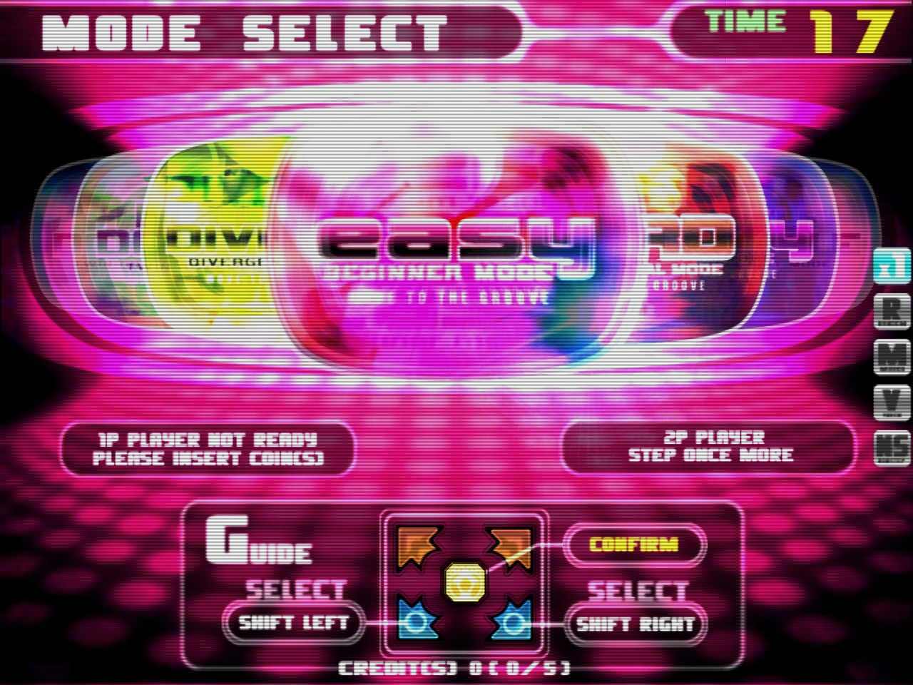
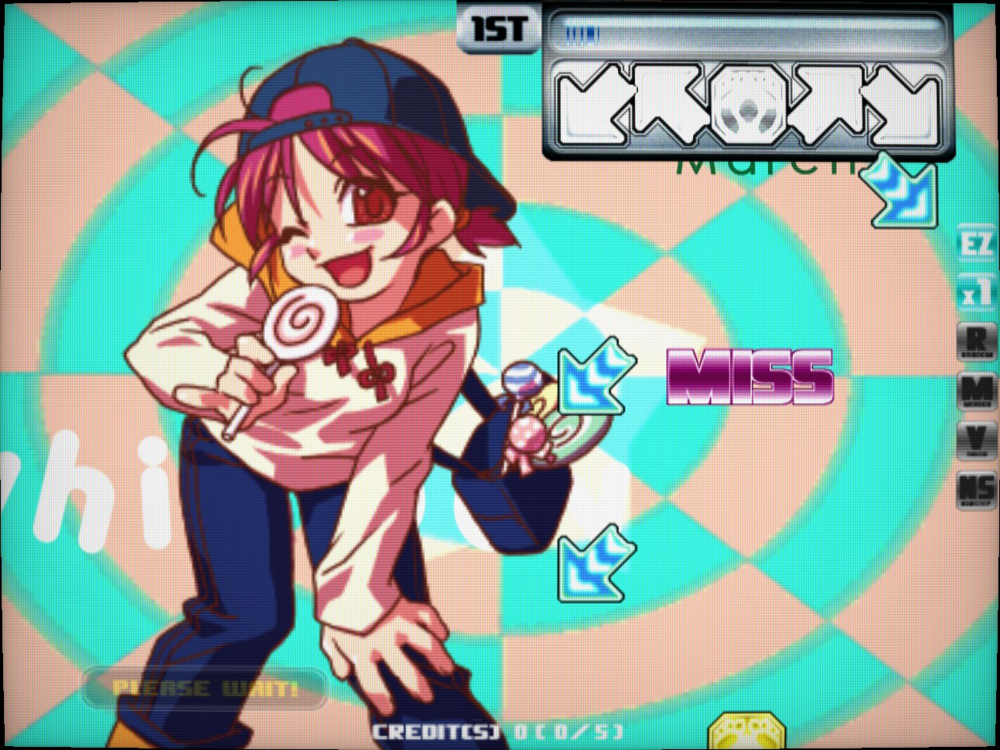
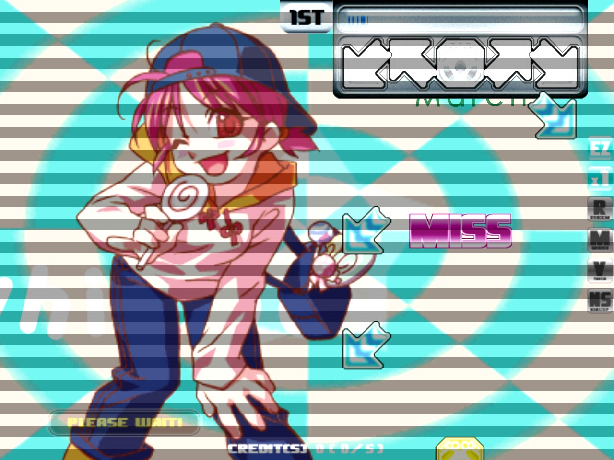
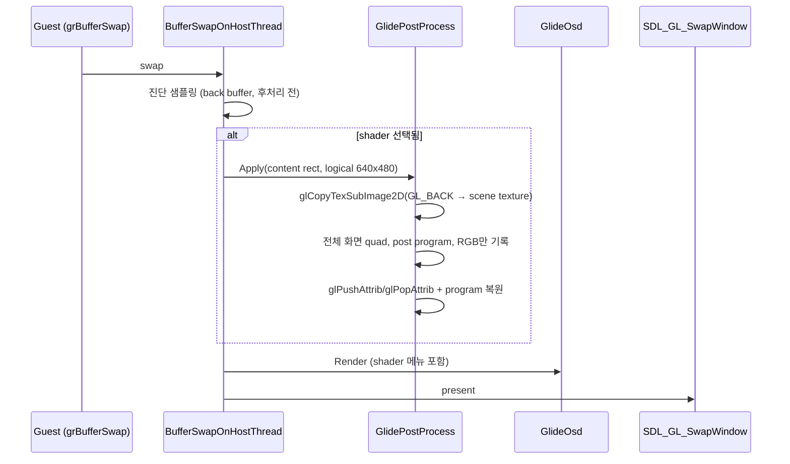
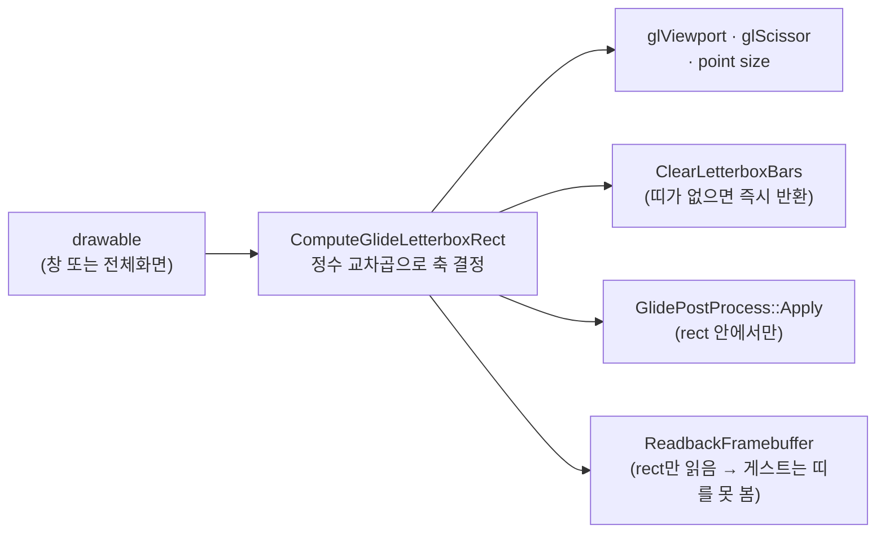
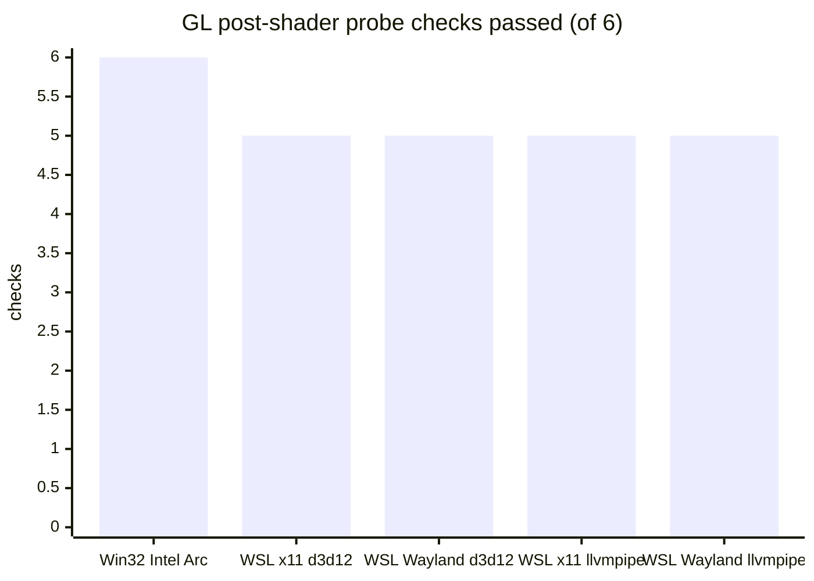
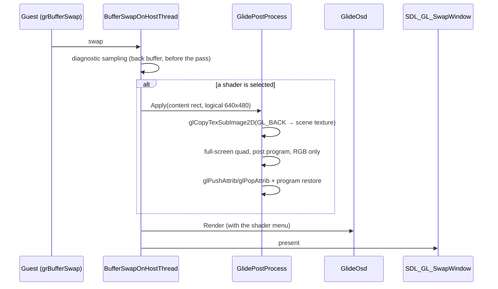
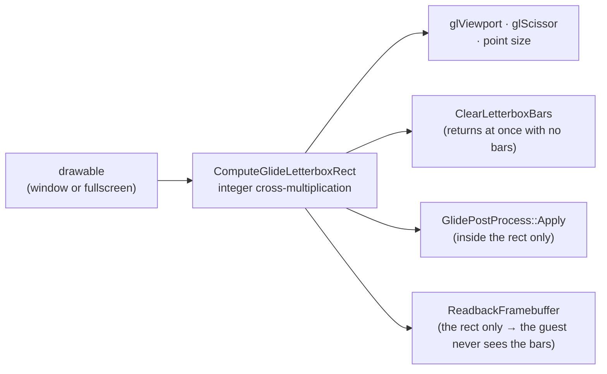

# Post-Processing Shaders: An Arcade Monitor on Top of the Glide Frame (WIP)

범위: [`v0.0.197`부터 `v0.0.200`까지](https://github.com/nworkers/rePIU/compare/v0.0.197...v0.0.200) (Tasks 768–769)

원본 PIU 기판은 640×480 화면을 아케이드 CRT 모니터로 내보냈습니다. rePIU는 그 화면을 현대 모니터의 창에 2배로
그리는데, 정확할수록 오히려 "그 시절 화면"과 멀어집니다. 이번 작업은 게임이 다 그린 프레임 위에 **표시 단계에서만**
CRT 모니터 느낌을 입히는 후처리 shader를 넣은 기록입니다. 게스트가 보는 framebuffer는 한 바이트도 바뀌지 않습니다.

## 주요 변경 사항

### 1. 화면에서 본 결과

`pumpit8`(The Rebirth)을 입력 스크립트로 같은 장면까지 몰고 가서 `none`, `crt`, `scanline`을 차례로 찍었습니다.
모두 Win32 x86 Release, RTX 4090, 2배 창(1280×960)에서 60 FPS였습니다. 주사선은 출력 픽셀 단위 무늬라 이미지를
줄이면 사라지므로 원본 크기로 두었고, 아래 띠는 같은 부분을 1:1로 잘라 나란히 놓은 것입니다(왼쪽부터 `none`,
`crt`, `scanline`).

**타이틀**



| `crt` | `scanline` |
| :---: | :---: |
|  |  |

**모드 선택**


| `crt` | `scanline` |
| :---: | :---: |
|  |  |

**플레이**


| `crt` | `scanline` |
| :---: | :---: |
|  |  |

비교용 `none` 원본은 [`docs/screenshots/shaders/`](../screenshots/shaders/)에 같은 이름(`*-none.jpg`)으로 있습니다.

* **`crt`** — 휜 화면(곡률 기본 0.01), 밝을수록 넓어지는 가우시안 빔 주사선, aperture grille 마스크, 약한 비네트.
  계산은 선형 광(linear light)에서 합니다. 매개변수 6개.
* **`scanline`** — 줄의 뒤쪽 절반을 어둡게 하는 단순한 주사선. 매개변수 2개.

### 2. 어디에 끼웠나 — swap 직전 한 곳

게임의 모든 표시는 `BufferSwapOnHostThread`의 `SDL_GL_SwapWindow` 한 곳을 지납니다. 후처리는 그 직전, 진단
샘플링 뒤와 OSD 앞에 한 번 끼웁니다.



* **복사는 GPU 안에서.** back buffer를 drawable 크기 RGBA8 텍스처로 `glCopyTexSubImage2D`합니다. CPU readback이
  없으므로 프레임당 비용은 복사 1회와 quad 1개입니다. `none`이면 분기 하나뿐이고 GL 호출은 0개입니다.
* **Glide 상태는 swap을 넘어 산다.** 그래서 `glPushAttrib(GL_ALL_ATTRIB_BITS)`와 현재 program 저장으로 앞뒤를
  감쌉니다. GL probe가 blend·viewport·program이 원래대로인지 확인합니다.
* **알파는 건드리지 않는다.** color mask를 RGB만 열어, 창 알파가 compositor로 새어 반투명 창이 되는 일을 막습니다.
* **실패는 `none`으로.** 컴파일·링크가 실패하면 그 shader를 선택하지 않은 것으로 하고 이유를 로그와 OSD에
  보입니다. 화면이 검게 되는 실패는 만들지 않습니다.

### 3. 2배 창에서 주사선이 사라지던 문제

처음 쓴 두 shader는 줄 가운데에 대칭인 밝기 곡선(`scanline`은 사인, `crt`는 줄 중심의 가우시안 빔)을 썼습니다.
그런데 기본 2배 창에서 논리 한 줄은 출력 두 행이고, 두 행의 중심은 줄 안에서 0.25와 0.75에 놓입니다. 대칭 곡선에서
두 값은 같은 밝기이므로 **기본 배율에서 주사선이 하나도 보이지 않습니다.** GL probe의 기대값을 손으로 계산하다
발견했습니다.

```text
논리 행 y        :  |------- 1줄 -------|
출력 행 (2x)     :  [   행 0   ][   행 1   ]
행 중심 (줄 안)  :      0.25        0.75
대칭 곡선 f(t)   :  f(0.25) == f(0.75)  → 두 행이 같은 밝기
```

* `scanline`: 줄의 뒤쪽 절반을 틈으로 두고 가장자리를 출력 1픽셀 폭으로 부드럽게 했습니다. 1배에서는 꺼집니다.
* `crt`: 빔 중심을 출력 반 픽셀(`0.5 / OutputSize`) 옮겨 정수 배율에서 픽셀 중심에 맞췄습니다.

고친 뒤 probe는 64×48 논리 화면을 128×96에 그려 밝은 행 48개, 어두운 행 48개(`scanline_rows=48/48/96`)를
확인합니다.

### 4. 창 모양과 상관없이 4:3 (Task 769)

후처리를 붙이면서 창을 늘리면 그림이 비율 없이 늘어나는 오래된 문제가 더 눈에 띄었습니다. 이제 viewport는
drawable 안에서 4:3을 유지하는 **content rect**이고, 남는 부분은 매 present마다 검은 띠로 지웁니다. 후처리도 이
rect 안에서만 복사하고 그리므로 띠에는 shader가 닿지 않습니다. 더블클릭이나 `Alt+Enter`는 디스플레이 모드를
바꾸지 않는 테두리 없는 전체화면을 오갑니다.



### 5. 고르는 곳 세 군데

| 방법 | 지속 | 예 |
|---|---|---|
| 런처 Options의 "Screen shader" | `cfg\repiu.ini`의 `[Video] post_shader` | `post_shader = crt` |
| 환경 변수 | 그 실행 (런처 값보다 우선) | `REPIU_POST_SHADER=scanline` |
| 게임 중 `Tab` OSD | 그 실행만 | 콤보, Reload, 매개변수 슬라이더 |

`shaders\`에 libretro 단일 pass 형식의 `.glsl`을 넣으면 목록에 함께 나오고, 게임을 켠 채 파일을 고치고 OSD의
**Reload**를 누르면 바로 다시 컴파일됩니다. 형식은 [후처리 shader 가이드](../guides/post-process-shaders.md)에
있습니다.

### 6. 실행 로그

`pumpit8`, `REPIU_POST_SHADER=crt`, 입력 스크립트 실행의 핵심 줄입니다. 환경 변수가 이겼으므로 런처 값은
게시되지 않았고(`post-shader: false`), shader는 매개변수 6개로 적용됐습니다.

```text
[loader] Launcher settings read from cfg\repiu.ini for an argument run (environment wins: swap-interval/volume file/file)
[loader] Launcher settings published swap-interval/volume/post-shader: true/false/false
[repiu-glide] GL renderer: NVIDIA GeForce RTX 4090/PCIe/SSE2
[repiu-post] shader: crt (6 parameters)
```

현재 blocker는 없습니다. 남은 것은 아래 "알려진 것"입니다.

### 7. sample test 결과

| 검사 | Win32 x86 | Linux x64 (WSL) |
|---|---|---|
| `--post-shader` (조립·매개변수·내장·목록·변수) | 5/5 | 5/5 |
| `--glide-letterbox` (같은 비율·pillarbox·letterbox·홀수·퇴화) | 5/5 | 5/5 |
| `--launcher` (shader 키 왕복·게시 우선순위 포함) | 5/5 | 5/5 |
| GL `--opengl-post-shader` (주사선·crt·none·상태 복원·letterbox·전체화면) | 6/6 | 5/6 (letterbox는 검사 쪽 문제) |
| 실제 게임 | pumpit1 15초 ×3 shader, pumpit8 80초 ×3 shader | pumpit1 30초, 전체화면 왕복 4회 |



Linux에서 빠진 하나는 letterbox readback입니다. Mesa(GLX·EGL)는 창 크기를 바꿔도 다음 swap에서야 back buffer
크기를 바꾸는데, probe가 swap 없이 곧바로 읽었습니다. swap 한 번을 넣으면 letterbox는 네 구성 모두 통과하고
x11 두 구성은 6/6입니다. 게임은 매 프레임 swap하므로 엔진 결함은 아닙니다. 다만 그 상태에서 Wayland 두 구성은
전체화면 해제가 제때 끝나지 않는 실행이 섞였습니다(아래 "알려진 것").

### 알려진 것

* WSLg Wayland에서 전체화면 해제가 느리고 일정하지 않습니다(swap 13~368번). x11과 Windows에서는 바로 풀립니다.
* 다단계 preset(`.glslp`), 이전 프레임(`PrevTexture`), LUT는 아직 지원하지 않습니다. OSD에서 바꾼 매개변수는
  저장되지 않습니다.

## 사용된 기술 스택

### libretro GLSL shader 형식

[libretro의 GLSL shader](https://docs.libretro.com/development/shader/glsl-shaders/)는 한 파일에 vertex와 fragment를
함께 두고 `#if defined(VERTEX)` / `#elif defined(FRAGMENT)`로 나눕니다. 엔진이 같은 소스를 두 번 컴파일하며 각각
`#define VERTEX`, `#define FRAGMENT`와 `#define PARAMETER_UNIFORM`을 넣습니다. 파일 첫 줄이 `#version`이면 그 줄
바로 뒤에 넣어야 컴파일됩니다.

`#pragma parameter NAME "설명" 기본 최소 최대 단계` 줄은 GLSL 컴파일러에는 무의미하지만, 프런트엔드가 읽어 uniform
float과 슬라이더로 만듭니다. rePIU도 같은 규칙으로 OSD 슬라이더를 만듭니다.

`TextureSize`와 `InputSize`는 **실제 텍스처 크기가 아니라 게임의 논리 해상도(640×480)**로 알립니다. 게임은 창 배율에
맞춰 고해상도로 그리지만, CRT 주사선은 원래 출력의 480줄을 따라야 하기 때문입니다. 표본은 고해상도 장면 텍스처에서
선형 보간으로 얻습니다. 내장 두 shader는 이 프로젝트가 새로 쓴 BSD 3-Clause 코드이며, GPL인 libretro `crt-geom`
등은 쓰지 않았습니다.

### OpenGL compatibility 컨텍스트와 상태 보존

Glide HLE는 고정 기능 파이프라인(`glBegin`, `glOrtho`)과 shader를 섞어 쓰는 compatibility 컨텍스트 위에 있습니다.
그래서 후처리 pass는 core profile의 VAO 대신 immediate mode로 quad를 보내고(`glVertexAttrib4f`, attribute 0이 정점을
발생), 링크 전에 `VertexCoord`=0, `TexCoord`=1, `COLOR`=2로 위치를 묶습니다. 상태는
[`glPushAttrib`](https://registry.khronos.org/OpenGL-Refpages/gl2.1/xhtml/glPushAttrib.xml)로 감싸고, attribute
stack이 담지 않는 현재 program은 따로 저장합니다.

### `glCopyTexSubImage2D`로 back buffer 복사

[`glCopyTexSubImage2D`](https://registry.khronos.org/OpenGL-Refpages/gl4/html/glCopyTexSubImage2D.xhtml)는 현재 read
buffer의 사각형을 텍스처로 GPU 안에서 복사합니다. FBO로 렌더 대상을 바꾸는 방법보다 기존 Glide 경로를 하나도 건드리지
않는다는 장점이 있습니다. 대가는 프레임당 복사 1회이며, `none`일 때는 이 비용도 없습니다.

### SDL3 전체화면과 창 크기 이벤트

SDL3의 [`SDL_SetWindowFullscreen`](https://wiki.libsdl.org/SDL3/SDL_SetWindowFullscreen)은 fullscreen mode를 지정하지
않은 창에서 **디스플레이 모드를 바꾸지 않는 테두리 없는 창**이 됩니다. 결과는 `SDL_EVENT_WINDOW_PIXEL_SIZE_CHANGED`로
오고, 엔진은 이 이벤트에서 content rect와 viewport를 다시 계산합니다. Wayland에서는 이 전환이 compositor의 응답을
기다리는 비동기 동작이라 `SDL_SyncWindow`가 돌아온 뒤에도 끝나지 않을 수 있습니다.

### 정수 배율에서의 표본 위치

출력 픽셀 중심은 `(i + 0.5) / OutputSize`에 있습니다. 2배율에서 논리 한 줄 안의 두 출력 행은 줄 안 위치 0.25와 0.75에
떨어지므로, 줄 가운데에 대칭인 함수는 두 행에 같은 값을 줍니다. 정수 배율 shader에서 줄 단위 무늬를 만들 때는 곡선을
비대칭으로 두거나 표본 위치를 출력 반 픽셀 옮겨야 합니다. 일반 지식으로
[kb: libretro GLSL 후처리 shader 형식](../kb/libretro-glsl-post-shaders.md) 5절에 남겼습니다.

---

# Post-Processing Shaders: An Arcade Monitor on Top of the Glide Frame (WIP)

Range: [`v0.0.197` to `v0.0.200`](https://github.com/nworkers/rePIU/compare/v0.0.197...v0.0.200) (Tasks 768–769)

The original PIU board sent its 640×480 picture to an arcade CRT monitor. rePIU draws that picture at 2x in a window
on a modern monitor, and the more exact it is, the further it gets from "the screen of the day". This post records
adding post-processing shaders that put an arcade-monitor look over the finished frame **at presentation only**; the
framebuffer the guest sees does not change by a byte.

## Major Changes

### 1. What it looks like

`pumpit8` (The Rebirth) was driven to the same scenes with an input script and captured under `none`, `crt` and
`scanline` in turn, all on the Win32 x86 Release build, an RTX 4090 and the 2x window (1280×960) at 60 FPS. The
scanlines are a per-output-pixel pattern that vanishes when an image is scaled down, so the images stay full size;
each strip below puts the same region side by side at 1:1 (`none`, `crt`, `scanline` from the left).

**Title**


| `crt` | `scanline` |
| :---: | :---: |
|  |  |

**Mode select**


| `crt` | `scanline` |
| :---: | :---: |
|  |  |

**Play**


| `crt` | `scanline` |
| :---: | :---: |
|  |  |

The `none` originals for comparison are in [`docs/screenshots/shaders/`](../screenshots/shaders/) under the same names
(`*-none.jpg`).

* **`crt`** — a curved screen (curvature 0.01 by default), Gaussian beam scanlines that widen with brightness, an
  aperture-grille mask and a light vignette, computed in linear light. Six parameters.
* **`scanline`** — plain scanlines darkening the back half of each line. Two parameters.

### 2. Where it goes — one place, just before the swap

Every presentation of the game passes `SDL_GL_SwapWindow` in `BufferSwapOnHostThread`. The pass runs once just before
it, after the diagnostic sampling and before the OSD.



* **The copy stays on the GPU.** The back buffer is copied with `glCopyTexSubImage2D` into an RGBA8 texture of the
  drawable's size; there is no CPU readback, so the cost per frame is one copy and one quad. `none` is one branch
  and zero GL calls.
* **Glide state outlives the swap.** The pass is wrapped in `glPushAttrib(GL_ALL_ATTRIB_BITS)` with the current
  program saved, and the GL probe checks that blend, viewport and program come back as they were.
* **Alpha is left alone.** Only RGB is unmasked, so window alpha never leaks to the compositor as a translucent
  window.
* **Failure means `none`.** A shader that fails to compile or link counts as not selected, with the reason in the
  log and the OSD; no failure turns the screen black.

### 3. The scanlines that vanished in the 2x window

The first two shaders used brightness profiles symmetric about a line's middle (a sine for `scanline`, a Gaussian
beam at the line's centre for `crt`). In the default 2x window one logical line is two output rows, whose centres sit
at 0.25 and 0.75 within the line; a symmetric profile gives both the same brightness, so **no scanline showed at the
default scale**. This came out of working the GL probe's expected values by hand.

```text
logical row y      :  |------- one line -------|
output rows (2x)   :  [    row 0    ][    row 1    ]
row centre in line :        0.25           0.75
symmetric f(t)     :  f(0.25) == f(0.75)  → both rows equally bright
```

* `scanline`: the back half of each line is the gap, with a soft edge one output pixel wide; it is off at 1x.
* `crt`: the beam centre moves by half an output pixel (`0.5 / OutputSize`) to land on a pixel centre at integer
  scales.

After the fix the probe draws a 64×48 logical screen into 128×96 and finds 48 bright and 48 dark rows
(`scanline_rows=48/48/96`).

### 4. 4:3 whatever the window's shape (Task 769)

With the pass in place, the old problem of a stretched window stretching the picture stood out more. The viewport is
now a **content rect** keeping 4:3 inside the drawable, and the rest is cleared to black bars at every present. The
pass copies and draws inside that rect only, so the shader never touches the bars. A double click or `Alt+Enter`
toggles a borderless fullscreen that leaves the display mode alone.



### 5. Three places to choose

| Where | Lasts | Example |
|---|---|---|
| The launcher's Options "Screen shader" | `[Video] post_shader` in `cfg\repiu.ini` | `post_shader = crt` |
| Environment variable | That run (over the launcher's value) | `REPIU_POST_SHADER=scanline` |
| The in-game `Tab` OSD | That run only | combo, Reload, parameter sliders |

A `.glsl` file in the libretro single-pass layout dropped into `shaders\` joins the list; edit it with the game
running and press **Reload** in the OSD to recompile at once. The format is in the
[post-processing shader guide](../guides/post-process-shaders.md).

### 6. Execution log

The key lines of `pumpit8` run with `REPIU_POST_SHADER=crt` and an input script. The environment variable won, so the
launcher's value was not published (`post-shader: false`), and the shader applied with six parameters.

```text
[loader] Launcher settings read from cfg\repiu.ini for an argument run (environment wins: swap-interval/volume file/file)
[loader] Launcher settings published swap-interval/volume/post-shader: true/false/false
[repiu-glide] GL renderer: NVIDIA GeForce RTX 4090/PCIe/SSE2
[repiu-post] shader: crt (6 parameters)
```

There is no blocker; what remains is under "Known" below.

### 7. Sample test results

| Check | Win32 x86 | Linux x64 (WSL) |
|---|---|---|
| `--post-shader` (assembly, parameters, built-ins, catalog, variable) | 5/5 | 5/5 |
| `--glide-letterbox` (same ratio, pillarbox, letterbox, odd, degenerate) | 5/5 | 5/5 |
| `--launcher` (with the shader key round trip and publish precedence) | 5/5 | 5/5 |
| GL `--opengl-post-shader` (scanlines, crt, none, state restore, letterbox, fullscreen) | 6/6 | 5/6 (letterbox: a problem in the check) |
| Real game | pumpit1 15 s × 3 shaders, pumpit8 80 s × 3 shaders | pumpit1 30 s, 4 fullscreen round trips |


The one missing on Linux is the letterbox readback: Mesa (GLX and EGL) resizes the back buffer only at the next swap
after a window resize, and the probe read without one. With one swap added, the letterbox check passes in all four
and both x11 configurations pass 6/6. The game swaps every frame, so this is no engine defect; in that state, though,
the two Wayland configurations had runs where leaving fullscreen did not finish in time ("Known" below).

### Known

* Leaving fullscreen on WSLg Wayland is slow and erratic (13 to 368 swaps); under x11 and on Windows it leaves at once.
* Multi-pass presets (`.glslp`), previous frames (`PrevTexture`) and LUTs are not supported yet, and parameters
  changed in the OSD are not saved.

## Technology Stack Used

### The libretro GLSL shader format

A [libretro GLSL shader](https://docs.libretro.com/development/shader/glsl-shaders/) keeps the vertex and fragment
stages in one file, split by `#if defined(VERTEX)` / `#elif defined(FRAGMENT)`. The engine compiles the same source
twice, adding `#define VERTEX` or `#define FRAGMENT` and `#define PARAMETER_UNIFORM`; when the first line is
`#version`, they must go right after it or the source does not compile.

`#pragma parameter NAME "label" default min max step` lines mean nothing to the GLSL compiler, but the frontend reads
them into uniform floats and sliders; rePIU makes its OSD sliders the same way.

`TextureSize` and `InputSize` report **the game's logical resolution (640×480), not the texture's real size**: the
game draws at a high resolution scaled to the window, but CRT scanlines must follow the original output's 480 lines.
Samples come from the high-resolution scene texture with linear filtering. Both built-in shaders are new BSD 3-Clause
code written for this project; GPL shaders such as libretro's `crt-geom` were not used.

### The OpenGL compatibility context and preserving state

The Glide HLE sits on a compatibility context that mixes the fixed-function pipeline (`glBegin`, `glOrtho`) with
shaders. The pass therefore sends its quad in immediate mode instead of through a core-profile VAO
(`glVertexAttrib4f`, attribute 0 emitting the vertex) and binds `VertexCoord`=0, `TexCoord`=1, `COLOR`=2 before
linking. State is wrapped in
[`glPushAttrib`](https://registry.khronos.org/OpenGL-Refpages/gl2.1/xhtml/glPushAttrib.xml), with the current
program, which the attribute stack does not hold, saved separately.

### Copying the back buffer with `glCopyTexSubImage2D`

[`glCopyTexSubImage2D`](https://registry.khronos.org/OpenGL-Refpages/gl4/html/glCopyTexSubImage2D.xhtml) copies a
rectangle of the current read buffer into a texture on the GPU. Compared with redirecting rendering to an FBO, it
leaves the existing Glide path untouched; the price is one copy per frame, and none at all under `none`.

### SDL3 fullscreen and window size events

SDL3's [`SDL_SetWindowFullscreen`](https://wiki.libsdl.org/SDL3/SDL_SetWindowFullscreen) on a window with no
fullscreen mode set makes it a **borderless window that leaves the display mode alone**. The result arrives as
`SDL_EVENT_WINDOW_PIXEL_SIZE_CHANGED`, on which the engine recomputes the content rect and viewport. Under Wayland the
switch is asynchronous, waiting for the compositor, and may not be done when `SDL_SyncWindow` returns.

### Sample positions at integer scales

Output pixel centres are at `(i + 0.5) / OutputSize`. At 2x the two output rows of one logical line fall at 0.25 and
0.75 within it, so any function symmetric about the line's middle gives both the same value. A per-line pattern in an
integer-scale shader needs an asymmetric profile or a sample position moved by half an output pixel. The general
lesson is in section 5 of [kb: the libretro GLSL post-processing shader format](../kb/libretro-glsl-post-shaders.md).
