# Full-Precision Textures: Undoing the 4444 Cut Inside the Game's Own Driver (WIP)

범위: [`v0.0.212`부터 `v0.0.213`까지](https://github.com/nworkers/rePIU/compare/v0.0.212...v0.0.213) ([issue #37](https://github.com/nworkers/rePIU/issues/37))

pumpitea를 돌리면 곡 선택 화면의 얼굴이나 BGA의 옷 주름이 얼룩덜룩하게 뭉개져 보입니다. 에뮬레이터의 결함처럼
보이지만, 원인은 게임 실행 파일 안에 있었습니다. PIU는 OpenGL로 그리고, 그 OpenGL을 Glide로 옮기는 **Mesa 3.x
드라이버를 실행 파일 안에 통째로 넣어** 두었습니다. 이 드라이버가 모든 컬러 텍스처를 채널당 4bit(ARGB4444)나
5/6bit(RGB565)로 잘라 하드웨어에 넘깁니다. 원래 8bit 이미지는 그 뒤에도 게임 메모리에 그대로 남아 있습니다.
이번 작업은 그 원본을 찾아, 정확히 같은 텍스처임이 확인될 때만 대신 올리는 화질 옵션을 넣은 기록입니다.

## 주요 변경 사항

### 1. 화면에서 본 결과

pumpitea를 같은 입력 스크립트로 두 번 실행해 같은 시점을 찍었습니다. 한 번은 옵션을 끄고(`=0`, 실기와 같은
화면), 한 번은 켰습니다(`=1`, 기본값). Win32 x86 Release, RTX 4090, 2배 창(1280×960)입니다. 아래 비교는 모두
**왼쪽이 끔, 오른쪽이 켬**입니다. 눈송이와 배경 애니메이션은 실행마다 위치가 달라 비교에서 무시하면 됩니다.

**곡 선택 화면 — 첫 곡 "자책"(U TWO)의 재킷**

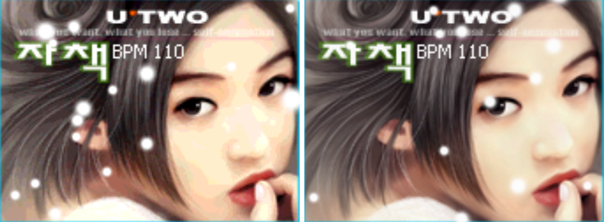

3배 확대(nearest). 4444에서는 피부가 16단계 띠로 끊겨 얼룩이 생기고, 8bit에서는 매끄럽게 이어집니다.

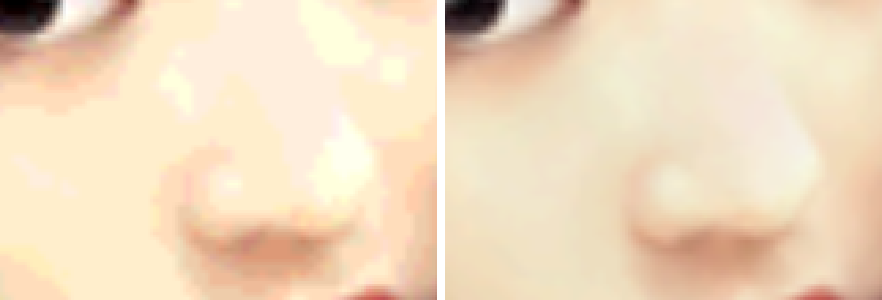

**첫 곡의 BGA**

그림이 옆으로 미끄러지는 장면이라 두 실행의 위치가 30픽셀 달라, 위치를 맞춰 잘랐습니다.

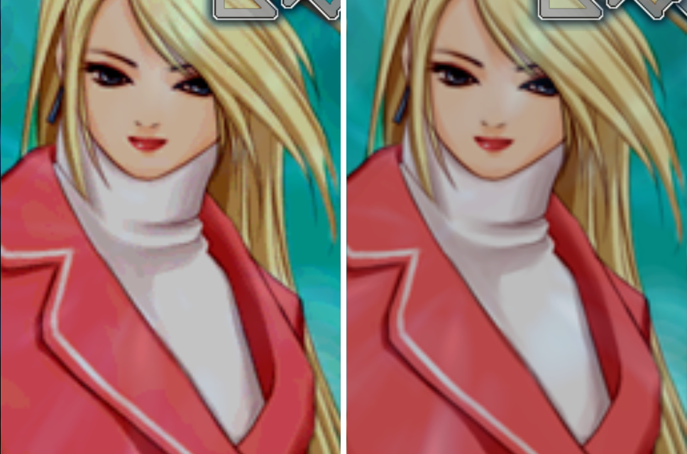

3배 확대. 흰 터틀넥의 그림자와 빨간 코트의 주름에서 차이가 가장 잘 보입니다.

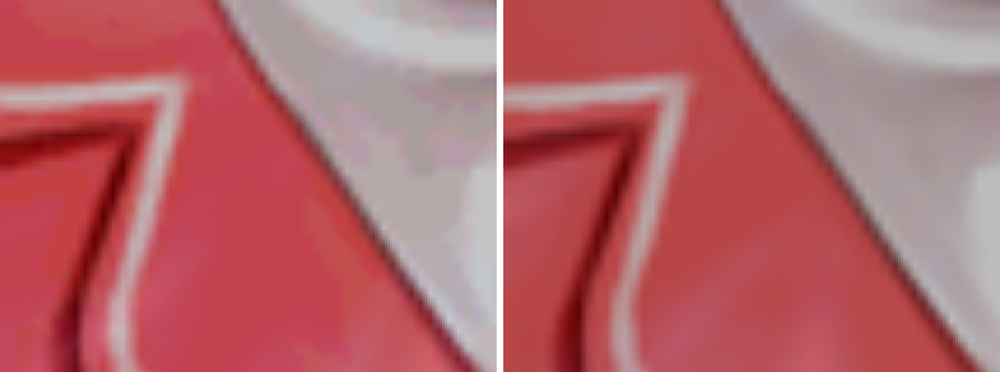

| 끔 (4444/565) | 켬 (8bit 원본) |
| :---: | :---: |
| 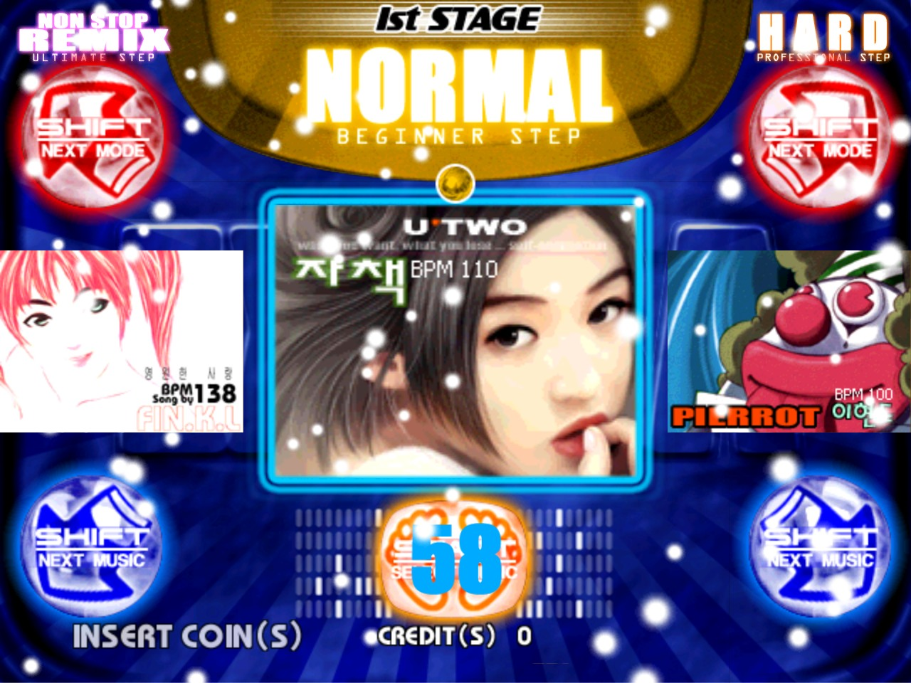 | 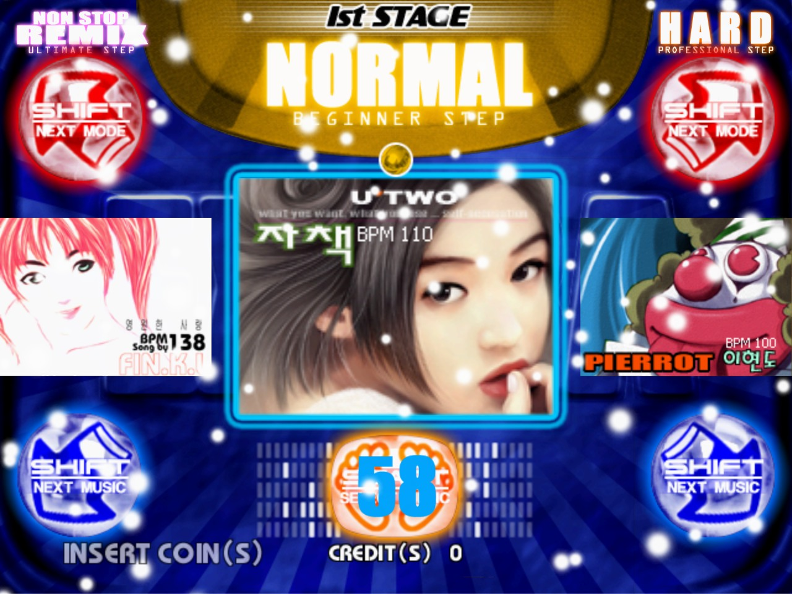 |
| 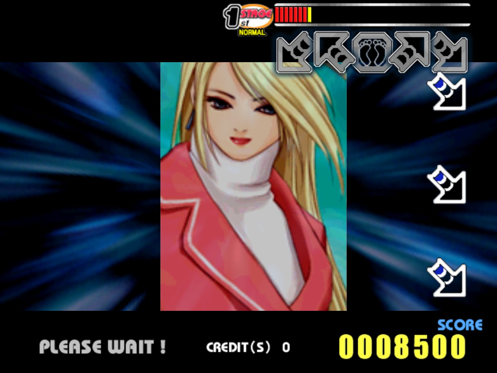 | 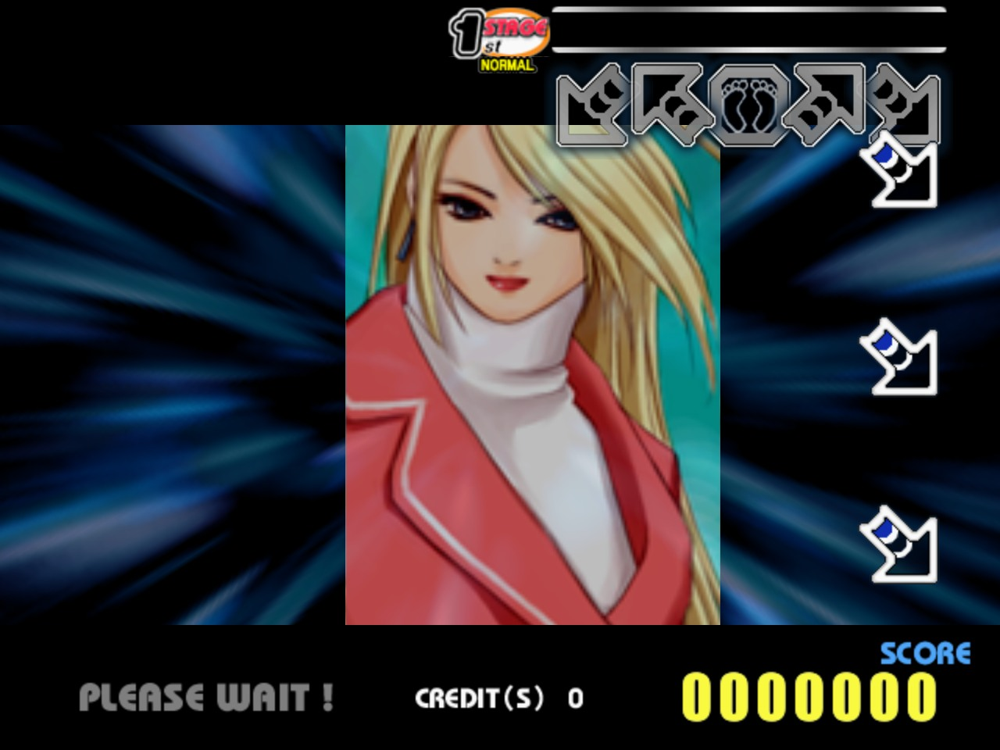 |

### 2. 화질이 떨어지던 곳 — 게임 안의 Mesa

`repiu_aot_probe`에 `--dump-image`를 더해 재배치된 실행 이미지를 파일로 뽑고, capstone으로 읽었습니다. Mesa
3.x의 3dfx 드라이버(fxMesa) 코드가 그대로 있었습니다. 예전에 Glide 크래시를 쫓다 만났던 `fxTMInit`(Task 235)도 이
드라이버의 텍스처 메모리 관리자였습니다.

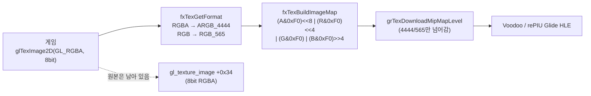

* **게임이 무엇을 요청하든 잘린다.** `fxTexGetFormat`은 `GL_RGBA`부터 `GL_RGBA16`까지 전부 ARGB4444로, RGB 계열은
  RGB565로 고릅니다. 반올림이나 디더링 없이 하위 비트를 버립니다.
* **실기도 같은 화면이었다.** 실제 Voodoo도 이 4444 데이터를 받았습니다. 그래서 이 옵션은 결함 수정이 아니라
  **원본보다 나은 화질**이고, 끄면 실기와 같은 화면입니다.
* **19개 롬셋 모두 같은 빌드.** 형식 함수 진입, 4444 패킹, 업로드 호출 꼬리라는 세 바이트 서명이 모든 롬셋에서
  한 번씩, 같은 상대 거리로 나옵니다. 롬셋마다 주소만 다릅니다.

### 3. 원본 찾기 — 레지스터와 스택에서

Glide 게이트(`grTexDownloadMipMapLevel`)는 게임 코드를 바꾸지 않고 그 순간의 게스트 레지스터와 메모리를 읽기만
합니다. Mesa 업로드 함수는 호출 직전에 `ESI`에 fx 텍스처 정보(`ti`), `EBP`에 Mesa level을 두고, 호출자가
쓰던 `EBP`(텍스처 객체 `tObj`)를 스택에 저장해 둡니다. 게이트에서 보면 그 자리가 `[ESP+0x34]`입니다.

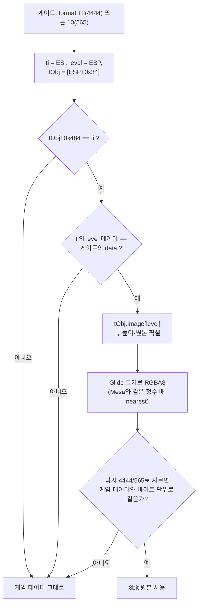

세 번째 검증이 핵심입니다. 찾은 원본을 Mesa와 똑같이 다시 잘랐을 때 게임이 넘긴 데이터와 **한 바이트도 다르지
않아야** 씁니다. 다른 호출 경로나 다른 빌드에서 엉뚱한 메모리를 읽더라도 그 텍스처는 4444로 남을 뿐, 틀린 그림이
나올 수 없습니다. 스택 오프셋은 처음에 정적 분석으로 추정했고, 실제 실행에서 업로드 전부가 세 검증을 통과해
확인됐습니다.

### 4. OSD에서 켜고 끄기

게스트는 텍스처를 한 번 올리면 다시 보내지 않습니다. 그래서 백엔드는 검증된 텍스처마다 게임 데이터(RGBA8로 푼
것)와 8bit 원본을 함께 보관하고, 옵션이 바뀌면 호스트 스레드가 다음 이벤트 처리 때 다시 올립니다.

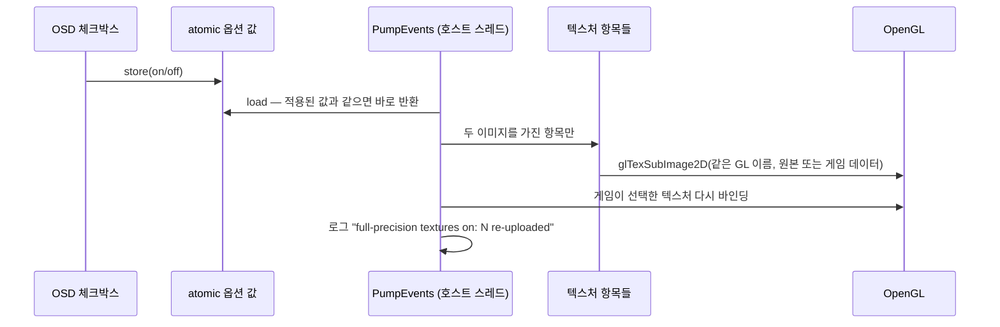

같은 GL 텍스처에 내용만 덮어쓰므로 게임이 쥔 텍스처 주소나 TMU 상태는 바뀌지 않습니다. GPU 메모리도 그대로입니다
(예전에도 RGBA8로 풀어 올렸습니다).

### 5. 고르는 곳 세 군데

| 방법 | 지속 | 예 |
|---|---|---|
| 런처 Options의 "Full-precision textures" | `cfg\repiu.ini`의 `[Video] texture_full_precision` | `texture_full_precision = 0` |
| 환경 변수 | 그 실행 (런처 값보다 우선) | `REPIU_GLIDE_TEXTURE_FULL_PRECISION=0` |
| 게임 중 `Tab` OSD | 그 실행만 | "Full-precision textures (8-bit)" 체크박스 |

기본값은 켬입니다.

### 6. 실행 로그

사용자 실행 두 번의 최종 집계 줄입니다. 업로드 전부가 원본으로 대체됐고 실패 이유별 수는 모두 0입니다.

```text
pumpitea
[loader] Glide texture full precision used/not-applicable/unreadable/link-mismatch/data-mismatch/verify-mismatch: 61/0/0/0/0/0
[repiu-glide] full-precision textures off: 18 re-uploaded
[repiu-glide] full-precision textures on: 18 re-uploaded

pumpit8 (약 65초, 토글 41회)
[loader] Glide texture census uploads/distinct/identical-repeats/changed-repeats: 130/39/2/89
[loader] Glide texture full precision used/not-applicable/unreadable/link-mismatch/data-mismatch/verify-mismatch: 130/0/0/0/0/0
[loader] Glide texture census format 10: 42
[loader] Glide texture census format 12: 88
```

현재 blocker는 없습니다.

### 7. sample test 결과

| 검사 | Win32 x86 | Linux x64 (WSL) |
|---|---|---|
| `--mesa-fx-texture-source` (4444·565·정수 배 확대·실패 경로 다섯·홀수 크기) | 5/5 | core probe 통과 |
| `--launcher` (새 키 왕복·잘못된 값 경고·게시 순서·환경 변수 우선) | 통과 | 통과 |
| 빌드 | Release 오류 0 | Release 오류 0 |
| 실제 게임 | pumpitea 61/61, pumpit8 130/130 | — |

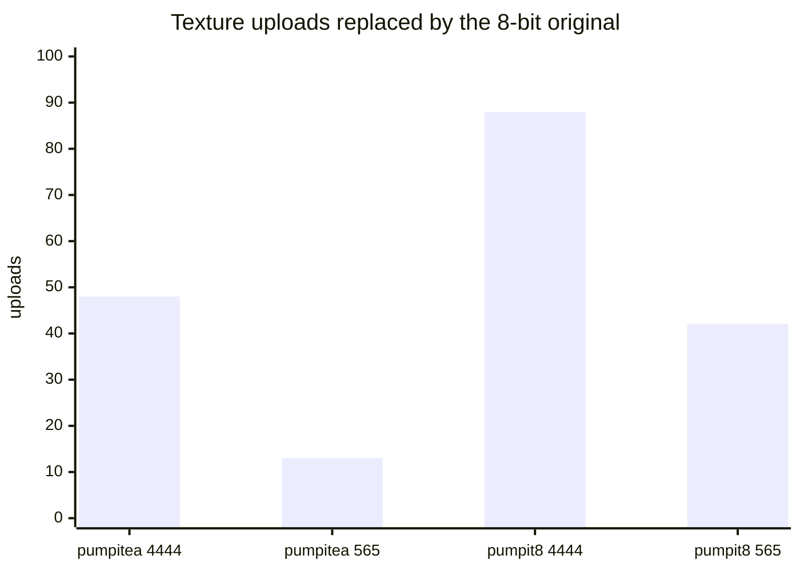

### 알려진 것

* **메모리.** 검증된 텍스처마다 RGBA8 두 벌을 호스트 메모리에 더 둡니다(상한 약 32MB). 게임 데이터 사본은 원본을
  다시 잘라 만들 수 있어 절반으로 줄일 수 있지만, 지금은 그대로 두고 후속 후보로 기록했습니다.
* pumpitea·pumpit8 외 롬셋은 실행해 보지 않았습니다(서명은 같습니다).
* 원본이 Glide 크기보다 작아 확대되는 경로가 실제로 쓰이는지는 따로 세지 않았습니다. 검증에 실패하면 4444로
  돌아갑니다.

## 사용된 기술 스택

### Mesa 3.x와 3dfx Glide 드라이버

1990년대 말 Voodoo 카드에서 OpenGL을 쓰는 흔한 방법은 [Mesa](https://docs.mesa3d.org/)의 fx 드라이버였습니다.
OpenGL 호출을 받아 [Glide](https://github.com/sezero/glide) 호출로 바꾸는 계층입니다. PIU는 이 드라이버를 정적으로
링크했기 때문에, 우리가 Glide 경계에서 보는 것은 게임의 요청이 아니라 **드라이버가 이미 변환한 결과**입니다.
Voodoo의 텍스처 메모리를 아끼려고 드라이버는 컬러 텍스처를 텍셀당 16bit 형식으로 골랐습니다.

### Glide 16bit 텍스처 형식

| 형식 | 번호 | 채널당 단계 |
|---|---|---|
| `GR_TEXFMT_ARGB_4444` | 12 | A·R·G·B 각 16단계 |
| `GR_TEXFMT_RGB_565` | 10 | R 32, G 64, B 32단계 |

부드러운 그라데이션은 16단계로 줄면 눈에 띄는 띠가 됩니다. 피부처럼 밝고 변화가 작은 면에서 특히 잘 보입니다.

### 정적 분석: 재배치 이미지와 capstone

LE/PE 실행 파일은 로드 주소에 맞춰 재배치해야 주소가 의미를 가집니다. `repiu_aot_probe --dump-image`는 로더와
같은 재배치를 거친 오브젝트를 `obj<N>_<base>.bin`으로 저장하고, [capstone](https://www.capstone-engine.org/)으로
그 주소 그대로 역어셈블했습니다. `GL_RGBA`(0x1908) 같은 상수 비교와 `and 0xF0` 패킹이 함수를 찾는 손잡이였습니다.

### 호출자가 저장한 레지스터로 객체 찾기

x86 함수는 쓸 레지스터를 진입 때 스택에 저장했다가 돌려놓습니다. Mesa 업로드 함수는 `ecx, esi, edi, ebp`를 넣고
지역 변수 0x10바이트를 잡은 뒤, `grTexDownloadMipMapLevel`의 인자 8개(0x20바이트)를 넣고 호출합니다. 그래서
게이트에서 `ESP` 위로 반환 주소(4) + 인자(0x20) + 지역 변수(0x10) = 0x34바이트를 지나면, 호출자가 `EBP`에 쥐고 있던
텍스처 객체가 나옵니다. 구조체 안에 `ti`에서 `tObj`로 돌아가는 포인터가 없어서 이 길을 썼고, `tObj->DriverData ==
ti` 검증으로 맞는 객체인지 확인합니다.

---

# Full-Precision Textures: Undoing the 4444 Cut Inside the Game's Own Driver (WIP)

Range: [`v0.0.212` to `v0.0.213`](https://github.com/nworkers/rePIU/compare/v0.0.212...v0.0.213) ([issue #37](https://github.com/nworkers/rePIU/issues/37))

Run pumpitea and the faces on the song select screen and the folds in the BGA look blotchy. It looks like an
emulator defect, but the cause is inside the game's executable. PIU draws through OpenGL and **links a whole Mesa 3.x
driver into the executable** to turn that OpenGL into Glide; that driver cuts every color texture to 4 bits
(ARGB4444) or 5/6 bits (RGB565) per channel before the hardware sees it. The original 8-bit image stays in the game's
memory afterwards. This post records finding that original and adding a quality option that uploads it instead, only
when it is verified to be exactly the same texture.

## Major Changes

### 1. What it looks like

pumpitea was run twice with the same input script and captured at the same moments, once with the option off (`=0`,
what the arcade hardware showed) and once on (`=1`, the default), on the Win32 x86 Release build, an RTX 4090 and the
2x window (1280×960). Every comparison below is **off on the left, on on the right**. Snowflakes and background
animation land differently in each run; ignore them.

**Song select — the jacket of the first song, "Jachaek" (U TWO)**


At 3x (nearest), 4444 breaks the skin into 16-step bands and blotches, while 8 bits keeps it smooth.


**The first song's BGA**

The picture slides sideways in this scene and the two runs differ by 30 pixels, so the crops are aligned.


At 3x, the shading of the white turtleneck and the folds of the red coat show the difference best.


| Off (4444/565) | On (8-bit original) |
| :---: | :---: |
|  |  |
|  |  |

### 2. Where the quality went — Mesa inside the game

`repiu_aot_probe` gained `--dump-image` to write the relocated executable image to files, which were read with
capstone. Mesa 3.x's 3dfx driver (fxMesa) is there as is; `fxTMInit`, met while chasing a Glide crash (Task 235), was
this driver's texture memory manager.

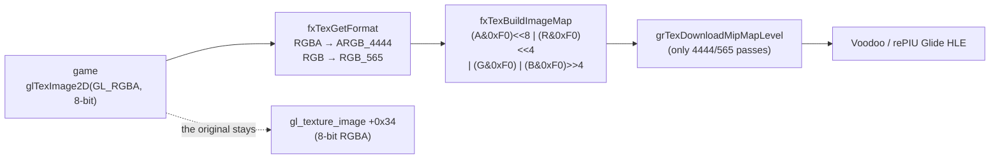

* **It is cut whatever the game asks for.** `fxTexGetFormat` maps everything from `GL_RGBA` to `GL_RGBA16` to
  ARGB4444 and the RGB formats to RGB565, dropping the low bits with no rounding or dithering.
* **The arcade showed the same.** Real Voodoo hardware got this 4444 data too, so the option is not a fix but **better
  than the original**, and turning it off gives the arcade picture.
* **The same build in all 19 ROM sets.** Three byte signatures — the format function's entry, the 4444 packing and the
  upload call tail — occur once each in every set at the same relative distance; only the addresses differ.

### 3. Finding the original — from registers and the stack

The Glide gate (`grTexDownloadMipMapLevel`) never changes game code; it only reads the guest registers and memory at
that moment. Just before the call, Mesa's upload function holds the fx texture info (`ti`) in `ESI` and the Mesa level
in `EBP`, and has saved its caller's `EBP` — the texture object `tObj` — on the stack, at `[ESP+0x34]` as seen from the
gate.

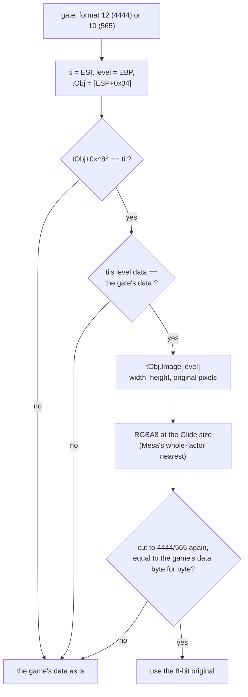

The third check is the key: the original is used only if cutting it again exactly as Mesa does yields **not one byte
different** from what the game passed. Should another call path or build lead to the wrong memory, that texture
simply stays 4444; a wrong picture cannot appear. The stack offset was first inferred by static analysis and confirmed
when every upload in real runs passed all three checks.

### 4. Switching it in the OSD

The guest uploads a texture once and never sends it again. So the backend keeps both the game's data (expanded to
RGBA8) and the 8-bit original for each verified texture, and when the option changes the host thread re-uploads them
on its next event pump.

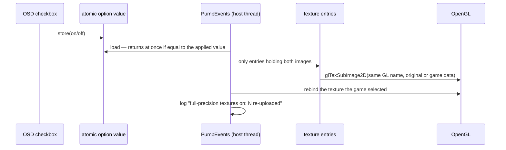

Only the contents of the same GL texture are replaced, so the texture addresses and TMU state the game holds do not
change, and neither does GPU memory (the data was already expanded to RGBA8 before).

### 5. Three places to choose

| Where | Lasts | Example |
|---|---|---|
| The launcher's Options "Full-precision textures" | `[Video] texture_full_precision` in `cfg\repiu.ini` | `texture_full_precision = 0` |
| Environment variable | That run (over the launcher's value) | `REPIU_GLIDE_TEXTURE_FULL_PRECISION=0` |
| The in-game `Tab` OSD | That run only | "Full-precision textures (8-bit)" checkbox |

It is on by default.

### 6. Execution log

The final count lines of two user runs: every upload was replaced by its original, and every failure reason counts
zero.

```text
pumpitea
[loader] Glide texture full precision used/not-applicable/unreadable/link-mismatch/data-mismatch/verify-mismatch: 61/0/0/0/0/0
[repiu-glide] full-precision textures off: 18 re-uploaded
[repiu-glide] full-precision textures on: 18 re-uploaded

pumpit8 (about 65 s, 41 toggles)
[loader] Glide texture census uploads/distinct/identical-repeats/changed-repeats: 130/39/2/89
[loader] Glide texture full precision used/not-applicable/unreadable/link-mismatch/data-mismatch/verify-mismatch: 130/0/0/0/0/0
[loader] Glide texture census format 10: 42
[loader] Glide texture census format 12: 88
```

There is no blocker.

### 7. Sample test results

| Check | Win32 x86 | Linux x64 (WSL) |
|---|---|---|
| `--mesa-fx-texture-source` (4444, 565, whole-factor upscale, five fallbacks, odd size) | 5/5 | core probe passes |
| `--launcher` (new key round trip, malformed warning, publish order, environment precedence) | pass | pass |
| Build | Release, no errors | Release, no errors |
| Real game | pumpitea 61/61, pumpit8 130/130 | — |


### Known

* **Memory.** Each verified texture keeps two extra RGBA8 copies in host memory (about 32 MB at most). The game-data
  copy can be rebuilt by cutting the original again, halving that, but it stays for now and is recorded as a
  follow-up.
* ROM sets other than pumpitea and pumpit8 have not been run (their signatures match).
* Whether the path that enlarges an original smaller than the Glide size occurs in practice was not counted; a failed
  check falls back to 4444.

## Technology Stack Used

### Mesa 3.x and the 3dfx Glide driver

In the late 1990s a common way to use OpenGL on a Voodoo card was [Mesa](https://docs.mesa3d.org/)'s fx driver, a
layer turning OpenGL calls into [Glide](https://github.com/sezero/glide) calls. PIU links that driver statically, so
what we see at the Glide boundary is not the game's request but **the driver's already converted result**. To save
Voodoo texture memory, the driver chose 16-bit-per-texel formats for color textures.

### Glide 16-bit texture formats

| Format | Number | Steps per channel |
|---|---|---|
| `GR_TEXFMT_ARGB_4444` | 12 | 16 each for A, R, G, B |
| `GR_TEXFMT_RGB_565` | 10 | R 32, G 64, B 32 |

A smooth gradient reduced to 16 steps becomes visible bands, most of all on bright, gently varying surfaces such as
skin.

### Static analysis: the relocated image and capstone

Addresses in an LE/PE executable mean something only once it is relocated to its load address.
`repiu_aot_probe --dump-image` writes each object, relocated as the loader does, as `obj<N>_<base>.bin`, which
[capstone](https://www.capstone-engine.org/) disassembled at those very addresses. Constant comparisons such as
`GL_RGBA` (0x1908) and the `and 0xF0` packing were the handles for finding the functions.

### Finding an object through a register the caller saved

An x86 function saves the registers it uses on the stack at entry and restores them on exit. Mesa's upload function
pushes `ecx, esi, edi, ebp`, reserves 0x10 bytes of locals, then pushes the eight arguments of
`grTexDownloadMipMapLevel` (0x20 bytes) and calls. From the gate, then, past the return address (4), the arguments
(0x20) and the locals (0x10) — 0x34 bytes above `ESP` — lies the texture object the caller held in `EBP`. No pointer
leads back from `ti` to `tObj`, hence this route, and the `tObj->DriverData == ti` check confirms it is the right
object.
