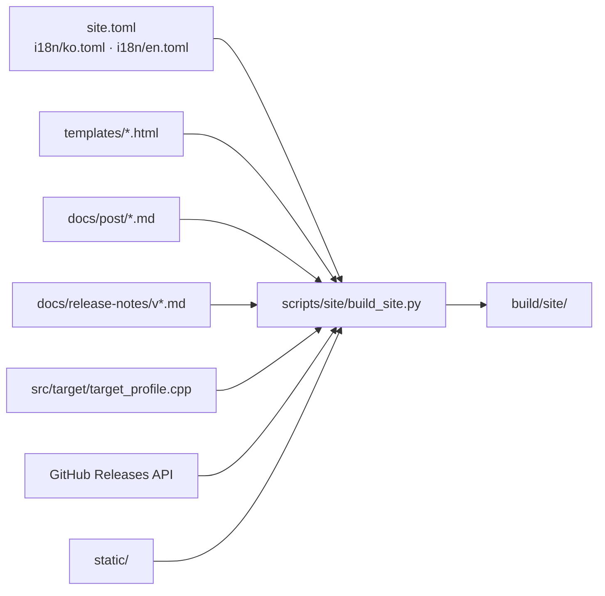

# rePIU 프로젝트 사이트

이 디렉터리는 <https://nworkers.github.io/rePIU/>의 소스입니다. 설계는
[Task 756 설계](../design/20260928-756-github-pages-site.md)에 있습니다.

## 구조



| 경로 | 내용 |
|---|---|
| `site.toml` | 저장소, 기본 URL, 언어 목록, 콘텐츠 경로, Mermaid 주소, 플랫폼 상태 |
| `i18n/ko.toml`, `i18n/en.toml` | 페이지 문구. 두 파일의 키 구조는 같아야 합니다 |
| `templates/` | Jinja2 템플릿 (`base`, `index`, `wip`, `download`, `credits`, `post`, `404`) |
| `static/` | CSS, JS, favicon, Galmuri 폰트와 라이선스 |

산출물은 한국어가 `/`, 영어가 `/en/` 아래에 같은 파일 이름으로 생깁니다.

## 콘텐츠가 갱신되는 방법

* **개발 기록:** `docs/post/`에 [작성 지침](../post/README.md)대로 글을 추가하면 main에 머지될 때 게시됩니다.
  한국어 전문 → `---` → 영어 전문 구조로 두 언어 페이지가 나뉩니다.
* **릴리스 타임라인과 다운로드:** 태그를 push해 Release 워크플로가 성공하면 Pages 워크플로가 이어서 돌며
  새 릴리스를 반영합니다. 본문은 `docs/release-notes/<tag>.md`가 있으면 그 파일을 씁니다.
* **스크린샷:** `docs/screenshots/`의 이미지를 산출물의 `screenshots/`로 복사합니다. 소개 페이지에 보일 목록과 순서는
  `site.toml`의 `[[screenshots]]`, 설명은 `i18n/*.toml`의 `[screenshots.captions]`에 둡니다(Task 770).
* **ROM 세트 목록:** `src/target/target_profile.cpp`의 내장 카탈로그에서 읽습니다.
* **플랫폼 상태와 소개 문구:** `site.toml`의 `[[platforms]]`와 `i18n/*.toml`을 직접 고칩니다.

## 로컬 빌드

Python 3.11 이상이 필요합니다.

```bash
python3 -m pip install -r scripts/site/requirements.txt
python3 scripts/site/build_site.py            # GitHub API로 릴리스 조회
python3 scripts/site/build_site.py --offline  # API 없이 노트 파일만 사용
python3 -m http.server -d build/site 8000     # http://localhost:8000/
```

`GITHUB_TOKEN` 또는 `GH_TOKEN`이 있으면 API 요청에 사용합니다. 없어도 공개 저장소는 조회됩니다(IP당
시간당 60회 제한). 빌드는 모든 페이지의 내부 링크가 산출물 안의 파일을 가리키는지 검사하고, 깨진 링크가
있으면 실패합니다.

## 배포

`.github/workflows/pages.yml`이 main의 관련 경로 변경, Release 워크플로 성공, 수동 실행 때 빌드해
배포합니다. PR에서는 빌드와 링크 검사만 합니다. 저장소 Settings → Pages → Source는 **GitHub Actions**여야
합니다. 브랜치의 `/docs` 폴더 배포로 바꾸면 `docs/`의 내부 문서가 모두 공개되므로 쓰지 않습니다.

---

# rePIU project site

This directory is the source of <https://nworkers.github.io/rePIU/>. The design is
[Task 756](../design/20260928-756-github-pages-site.md).

## Layout

See the diagram in the Korean section: `site.toml`, the `i18n/` strings, `templates/`, posts, release
notes, the ROM catalog source, the Releases API and `static/` feed `scripts/site/build_site.py`, which
writes `build/site/`.

| Path | Contents |
|---|---|
| `site.toml` | Repository, default URL, languages, content paths, Mermaid URL, platform status |
| `i18n/ko.toml`, `i18n/en.toml` | Page copy. Both files must have the same key structure |
| `templates/` | Jinja2 templates (`base`, `index`, `wip`, `download`, `credits`, `post`, `404`) |
| `static/` | CSS, JS, favicon, the Galmuri fonts and their licence |

The output has Korean at `/` and English under `/en/` with the same file names.

## How content is refreshed

* **Dev log:** add a post to `docs/post/` following the [guidelines](../post/README.md); it is published
  when it reaches main. Its full Korean → `---` → full English layout is split into the two languages.
* **Release timeline and downloads:** when a pushed tag's Release workflow succeeds, the Pages workflow runs
  next and picks up the new release. The body is `docs/release-notes/<tag>.md` when it exists.
* **Screenshots:** the images in `docs/screenshots/` are copied to `screenshots/` in the output; the list
  and order on the introduction page are `[[screenshots]]` in `site.toml`, the captions
  `[screenshots.captions]` in `i18n/*.toml` (Task 770).
* **ROM set list:** read from the built-in catalog in `src/target/target_profile.cpp`.
* **Platform status and introduction copy:** edit `[[platforms]]` in `site.toml` and `i18n/*.toml`.

## Local build

Python 3.11 or later is required.

```bash
python3 -m pip install -r scripts/site/requirements.txt
python3 scripts/site/build_site.py            # releases from the GitHub API
python3 scripts/site/build_site.py --offline  # notes files only, no API
python3 -m http.server -d build/site 8000     # http://localhost:8000/
```

`GITHUB_TOKEN` or `GH_TOKEN` is used for API requests when set; without it the public repository is still
readable (60 requests per hour per IP). The build checks that every internal link on every page points at
a file in the output and fails on a broken one.

## Deployment

`.github/workflows/pages.yml` builds and deploys on changes to the relevant paths on main, on a successful
Release workflow, and on manual runs. Pull requests only build and check links. Settings → Pages → Source
must be **GitHub Actions**. Deploying from a branch's `/docs` folder would publish every internal document
in `docs/`, so it is not used.
