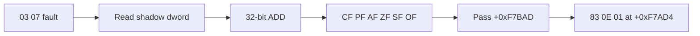

# Shadow memory `03 /r` ADD 작업 로그

## 결과

opcode `03 /r`의 no-SIB memory source가 shadow memory에 완전한 dword로 존재할 때 ADD를 HLE로 처리하도록 구현했다. ModRM reg field의 destination register를 읽고 결과를 기록하며 `CF`, `PF`, `AF`, `ZF`, `SF`, `OF`를 32-bit ADD 의미대로 갱신한다. 다른 EFLAGS는 보존한다.

실제 mapped guest memory는 CPU 직접 실행 경로에 남고, shadow miss와 지원하지 않는 addressing form은 계속 fault로 유지된다.

## 다음 관찰

반복 실행에서 relocated base + `0x000F7BAD`를 통과하고 +`0x000F7AD4`의 `83 0E 01`을 관찰했다. 명령은 `or dword ptr [esi],1`이며 `ESI`는 기존 shadow allocator metadata 주소다.

## 검증

* Win32 x86 Debug build: 성공
* `dos4gw_hello`: 정상 반환
* 전체 테스트: 성공
* 제한 시간 반복 실행: `03 07` 통과 및 `83 0E 01` 관찰

# Shadow-Memory `03 /r` ADD Work Log

Implemented HLE for opcode `03 /r` when its no-SIB memory source is a complete shadow-memory dword. The handler updates the ModRM-selected destination register and restores `CF/PF/AF/ZF/SF/OF` according to 32-bit ADD semantics while preserving unrelated EFLAGS.

Mapped guest memory remains on the direct CPU path; shadow misses and unsupported addressing forms remain visible faults. Repeated bounded execution passed relocated offset `0x000F7BAD` and observed the next blocker, `83 0E 01` at `0x000F7AD4`, targeting existing shadow allocator metadata.

The Win32 x86 build, `dos4gw_hello`, and the full regression suite passed.
