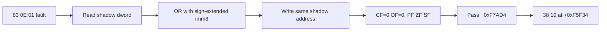

# Shadow memory `83 /1` OR 작업 로그

## 결과

opcode `83 /1`의 no-SIB dword destination이 shadow memory에 완전히 존재할 때 OR read-modify-write를 처리하도록 구현했다. imm8을 sign extension하고 결과를 같은 shadow address에 기록했으며 store diagnostic에는 `0x83`, `or-imm8`로 남긴다.

logical flags는 `CF/OF=0`, 결과 기반 `PF/ZF/SF`로 갱신했다. Intel에서 undefined인 `AF`는 기존 값을 보존했다.

## 다음 관찰

제한 시간 반복 실행에서 `0x000F7AD4`를 통과하고 allocator 호출 이후 `0x000F5F34`의 `38 10` (`cmp byte ptr [eax],dl`)을 관찰했다. `EAX`는 기존 metadata 바로 다음 shadow field 주소이고 `DL=0`이다.

## 검증

* Win32 x86 Debug build: 성공
* `dos4gw_hello`: 정상 반환
* 전체 테스트: 성공
* 제한 시간 반복 실행: OR 통과 및 `38 10` 관찰

# Shadow-Memory `83 /1` OR Work Log

Implemented a no-SIB shadow dword read-modify-write for opcode `83 /1`. The handler sign-extends imm8, writes the OR result back to the same shadow address, records the store as `0x83`/`or-imm8`, clears `CF/OF`, updates `PF/ZF/SF`, and preserves undefined `AF`.

Bounded repeated execution passed relocated offset `0x000F7AD4` and reached `38 10` at `0x000F5F34`, or `cmp byte ptr [eax], dl`, after returning from the allocator path. EAX points to the next shadow metadata field and DL is zero.

The Win32 x86 build, `dos4gw_hello`, and the full regression suite passed.
