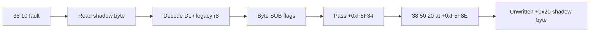

# Shadow memory `38 /r` byte CMP 작업 로그

## 결과

shadow byte read helper와 legacy `AL/CL/DL/BL/AH/CH/DH/BH` decoder를 추가했다. no-SIB `38 /r` memory source byte가 shadow memory에 존재할 때 subtraction 결과를 저장하지 않고 `CF/PF/AF/ZF/SF/OF`만 갱신한다.

## 다음 관찰

첫 `38 10`을 통과한 뒤 `0x000F5F8E`의 `38 50 20` (`cmp byte ptr [eax+0x20],dl`)까지 진행했다. offset `+0x20` byte는 compare 전에 쓰이지 않아 sparse shadow map에 없다. 다음 작업은 원본 allocator block의 zero-initialization 근거와 안전한 bounded backing 범위를 분석하는 것이다.

## 검증

* Win32 x86 Debug build: 성공
* `dos4gw_hello`: 정상 반환
* 첫 실행에서 `0x000F5F34` 통과와 `0x000F5F8E` 관찰
* 전체 테스트: 성공

# Shadow-Memory `38 /r` Byte CMP Work Log

Added a shadow-byte reader and legacy `AL/CL/DL/BL/AH/CH/DH/BH` decoder. For no-SIB `38 /r` forms whose source byte exists in shadow memory, the handler updates `CF/PF/AF/ZF/SF/OF` from byte subtraction without storing the result.

Execution passed the first `38 10` and reached `38 50 20` at relocated offset `0x000F5F8E`. The byte at block offset `+0x20` was not written before comparison and is absent from the sparse shadow map. The next task must establish original zero-initialization and a bounded backing range rather than zero-filling arbitrary misses.

The Win32 x86 build, `dos4gw_hello`, and the full regression suite passed.
