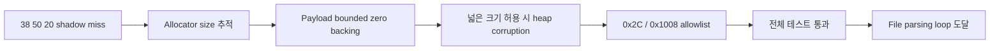

# Bounded shadow zero backing 작업 로그

## 결과

* relocated offset `0xF7A71`의 DS zero-page allocator probe에서 확인된 요청 크기 `0x2C`, `0x1008`만 기록했습니다.
* offset `0xF7AD4`의 shadow header OR가 block base를 확정하면 `[block+4, block+size-4)`를 zero-backed payload로 등록했습니다.
* byte/dword shadow read는 explicit byte를 우선하고, payload 안의 unwritten byte만 0으로 처리합니다.
* 넓은 `8..1 MiB` 크기 허용에서 발생한 Windows heap corruption `0xC0000374`를 분석해 확인된 크기 allowlist로 수정했습니다.
* `scripts/test_all.ps1` 전체 검증이 통과했습니다. PIU 실행은 `38 50 20`을 넘어 DOS interrupt 92회와 shadow read hit 5,710회를 기록한 뒤 quiet timeout에 도달했습니다.

## 다음 분석

quiet timeout의 파일 파싱 루프가 정상 진척인지 정체인지 확인하고, 여러 allocation의 zero range 보존 또는 DOS read의 shadow-aware write가 필요한지 판단합니다.

# Bounded Shadow Zero Backing Work Log

The allocator probe now accepts only the confirmed request sizes `0x2C` and `0x1008`. The header OR binds the request to a block, and only `[block+4, block+size-4)` receives zero backing with explicit shadow bytes taking precedence. A broader size policy caused Windows heap corruption `0xC0000374`; the allowlist eliminated that false capture. The complete test suite passed, and PIU progressed beyond `38 50 20` into the file parsing loop before the diagnostic quiet timeout.
