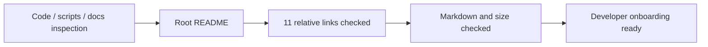

# 프로젝트 README 작업 로그

## 결과

* 프로젝트 목적, HLE 방식, 현재 실험 단계와 지원 타깃을 루트 `README.md`에 정리했습니다.
* Windows x86 요구 사항과 원본 자산 비포함 정책을 명시했습니다.
* setup, build, sample, `piu_1st`, analyzer와 regression 명령을 현재 script와 target profile에 맞춰 작성했습니다.
* Mermaid 실행 흐름, 디렉터리 표, 분석·지식 기반·아키텍처·기여 문서 링크를 추가했습니다.
* 저장소에 정식 `LICENSE`와 `CONTRIBUTING.md`, CI가 아직 없다는 현재 상태를 과장 없이 기록했습니다.

## 검증

* README 내부 상대 링크 13개가 모두 존재함을 확인했습니다.
* Markdown fence 18개가 짝수이며 `git diff --check`가 통과했습니다.
* README 크기는 10.4 KiB 미만으로 GitHub 500 KiB 제한보다 충분히 작습니다.
* 명령과 target 이름을 `CMakeLists.txt`, `src/target/target_profile.cpp`, `scripts/`와 대조했습니다.
* 문서 전용 변경이며 직전 작업에서 `scripts/test_all.ps1` 전체 검증이 통과했으므로 빌드는 다시 실행하지 않았습니다.

# Project README Work Log

Added a root README that accurately describes the preservation-first HLE approach, experimental status, supported targets, Win32/x86 prerequisites, proprietary-asset boundary, setup/build/run/test/analyzer commands, repository layout, documentation, support, maintainership, contribution workflow, and current licensing-file status. All 13 relative links resolve, Markdown fences are balanced, `git diff --check` passes, and the README is under 10.4 KiB—well below GitHub's 500 KiB rendering limit. Commands and target names were cross-checked against the current CMake configuration, target registry, and scripts.
