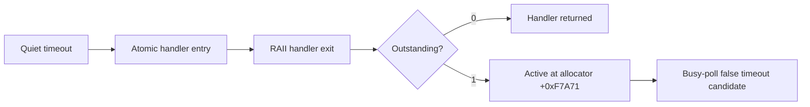

# Exception dispatch liveness 진단 작업 로그

## 변경

* vectored exception handler의 유효한 진입과 모든 정상 return을 atomic counter로 기록했습니다.
* 마지막 dispatch EIP와 entry/exit/outstanding count를 execution attempt와 loader log에 추가했습니다.
* `SuspendThread/GetThreadContext`는 과거 hang 증거에 따라 사용하지 않았습니다.
* regression이 새 진단 필드와 유효한 guest EIP를 확인하도록 갱신했습니다.

## 분석 결과

세 번의 반복 통합 실행에서 exception 종료 두 번은 entry와 exit가 정확히 같았습니다. quiet timeout 한 번은 `entry=34068`, `exit=34067`, outstanding `1`, last EIP `0x020F7A71`을 기록했습니다. 이후 전체 regression의 quiet timeout은 `entry=33946`, `exit=33946`, outstanding `0`, 같은 last EIP를 기록했습니다. 마지막 single-step EIP `0x020F4DC1`만으로 파일 파싱 loop 정체라고 판단한 기존 해석은 수정해야 합니다. handler가 영구적으로 멈춘 것도 아니며, allocator probe dispatch가 약 34,000회 반복되는 동안 기존 semantic progress 값이 변하지 않는 상태입니다.

## 검증

* `cmd /c scripts\build_win32_x86.bat`: 성공
* `powershell -ExecutionPolicy Bypass -File scripts/test_all.ps1 -SkipSetup`: 성공
* 동일 통합 실행 3회: 모두 성공, balanced dispatch 2회와 outstanding dispatch timeout 1회 관찰
* `powershell -ExecutionPolicy Bypass -File scripts/test_all.ps1`: 성공, balanced quiet timeout과 last EIP `0x020F7A71` 확인

## 다음 작업

`+0xF7A71` allocator probe의 반복 EAX/ESI와 pending allocation 상태를 bounded trace로 확인합니다. 그 반복이 정상 진척임이 확인된 뒤 polling의 wall-clock/yield 정책을 판단합니다.

# Exception Dispatch Liveness Diagnostic Work Log

Added atomic vectored-handler entry/RAII-exit counters and the last dispatch EIP without suspending or modifying the guest. Two repeated integration runs ended at allocator exceptions with balanced counts. One quiet-timeout run recorded one outstanding dispatch at `0x020F7A71`; the final full regression recorded about 34,000 balanced dispatches and the same last EIP. The previous native file-parser-stall interpretation was incomplete, but the handler is not permanently stuck either. The allocator probe is repeatedly dispatched without changing the current semantic-progress observations. The next task should trace bounded `0xF7A71` operands and pending-allocation state before changing timeout policy.
