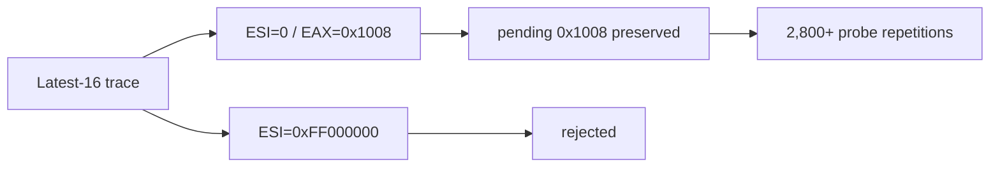

# Allocator probe bounded trace 작업 로그

## 변경

* exact relocated offset `0xF7A71` 전용 16-entry ring trace를 추가했습니다.
* EAX, ESI/source, DS, pending 전후 상태와 결과를 기록합니다.
* loader가 총 관측 수, stored count, wrap 여부와 최신 entry를 chronological order로 출력합니다.
* regression에 bounded trace summary 출력 검증을 추가했습니다.

## 분석 결과

quiet timeout 실행 두 번에서 각각 2,907회와 2,816회 probe가 관찰됐습니다. 최신 16개는 모두 `EAX=0x1008`, `ESI/source=0`, `DS=0x2C`, pending `0x1008` 전후 유지, `pending-preserved`였습니다. 첫 request가 `+0xF7AD4`에서 소비되지 않은 채 동일 probe로 되돌아옵니다.

다른 실행에서는 `ESI/source=0xFF000000`, pending 없음, `rejected` 한 건이 확인됐습니다. 이 고주소는 DOS zero page나 relocated address가 아닙니다.

## 검증

* `cmd /c scripts\build_win32_x86.bat`: 성공
* `powershell -ExecutionPolicy Bypass -File scripts/test_all.ps1 -SkipSetup`: 성공
* 반복 통합 실행 4회: timeout ring 2회, high-source rejection 1회, allocator 인접 예외 1회 관찰
* `powershell -ExecutionPolicy Bypass -File scripts/test_all.ps1`: 성공, 2,445회 관측과 최신 16개 `pending-preserved` 재확인

## 다음 작업

`+0xF7A71`부터 `+0xF7AD4` 사이의 분기와 request 완료/취소 조건을 추적합니다.

# Allocator Probe Bounded Trace Work Log

Added a diagnostic latest-16 ring for exact allocator offset `0xF7A71`, recording EAX, ESI/source, DS, pending state before/after, and result. Two timeout runs observed 2,907 and 2,816 probes; every retained entry had `EAX=0x1008`, zero source, `DS=0x2C`, and pending `0x1008` preserved. A separate `0xFF000000` source was correctly rejected with no pending request. The first request returns to the probe before the expected header OR consumes it. The next task is to trace the branch between `0xF7A71` and `0xF7AD4` and determine the allocator's request completion or cancellation condition.
