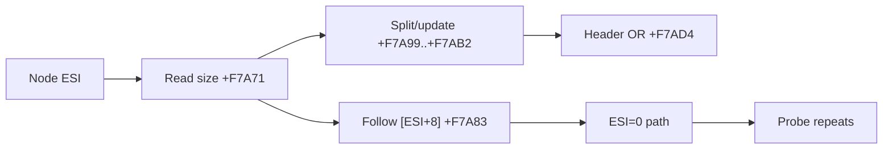

# Allocator control-flow exception trace 작업 로그

## 변경

* allocator range `[+0xF7A71,+0xF7AD5)` 전용 32-entry exception ring을 추가했습니다.
* exception code, opcode 4 bytes, EAX/EDX/ESI/EDI/EFLAGS와 pending 상태를 기록합니다.
* validated runtime EIP만 읽고 기존 dispatch와 guest context는 변경하지 않습니다.
* loader chronological 출력과 regression summary 검증을 추가했습니다.

## 분석 결과

trace는 `+0xF7A83`의 `mov esi,[esi+8]`이 free-list next link임을 확인했습니다. metadata 주소 `0x026E49C4` 경로는 `+0xF7A99..+0xF7AB2` split/update를 거쳐 `+0xF7AD4` OR까지 도달했습니다. `EAX=0x1008`과 `0x64030` 요청이 관찰됐으며 이 경로의 pending은 false였습니다.

timeout 경로는 next link가 `ESI=0`으로 끝난 뒤 pending `0x1008` 상태로 `+0xF7A71`을 반복합니다. 다음 대상은 shadow free-list의 `+8` link와 sentinel circular relation을 깨뜨린 metadata store입니다.

## 검증

* 첫 빌드: Windows `ExceptionCode` macro와 필드명 충돌 확인
* 필드를 `seh_code`로 변경 후 `cmd /c scripts\build_win32_x86.bat`: 성공
* 통합 실행에서 23-entry allocator sequence와 OR 도달 경로 확인
* `powershell -ExecutionPolicy Bypass -File scripts/test_all.ps1`: 성공, high-source `0xFF000000` 종료 경로와 4-entry allocator history 확인

# Allocator Control-Flow Exception Trace Work Log

Added a latest-32 exception ring for allocator range `[0xF7A71,0xF7AD5)`. The trace confirms that `0xF7A83` follows free-list link `[ESI+8]`; metadata-backed requests reach split/update instructions and header OR, while the timeout path reaches `ESI=0` and repeats the probe with pending `0x1008`. The next analysis target is the shadow metadata store that loses the free-list sentinel's circular next/back-link relationship.
