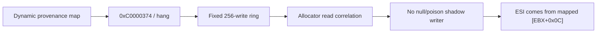

# Shadow allocator link provenance 작업 로그

## 변경

* allocator control-flow entry에 read address/value, explicit shadow, zero backing과 writer metadata를 추가했습니다.
* 최근 256개 shadow write를 고정 ring으로 보존하고 하나의 write가 dword 전체를 덮을 때만 writer로 연결합니다.
* null, poison과 root-null 전환 사건을 별도 보존하도록 했습니다.

## 안전성 수정

초기 per-byte `unordered_map` provenance는 exception handler에서 heap allocation을 발생시켜 PIU 반복 실행 중 `0xC0000374` heap corruption 두 번과 30초 hang 한 번을 재현했습니다. 해당 구현은 폐기하고 allocation-free fixed ring으로 교체했습니다.

## 분석 결과

고정 ring 실행에서 null/poison/root-null shadow transition은 모두 관찰되지 않았습니다. `ESI=0`과 `0xFF000000`은 `[ESI+8]` shadow link가 아니라 allocator 앞부분의 mapped `[EBX+0x0C]` load에서 들어옵니다. 따라서 shadow link 손상 가설은 기각됐습니다.

## 검증

기존 `build/win32_x86_debug` executable은 중단된 process PID 38696이 잠그고 있고 현재 권한으로 종료되지 않아 canonical rebuild를 수행하지 못했습니다. 동일 source와 기존 local spdlog source를 사용한 `build/win32_x86_provenance` Win32/x86 build는 성공했습니다.

* `dos4gw_hello`: `Hello, world!` 성공
* PIU 직접 실행 6회: exception 또는 bounded timeout으로 정상 종료, heap corruption/hang 없음
* 추가 PIU 실행 3회: 전환 observation 출력 확인

## 다음 결정

DPMI selector/low-memory sentinel을 구조적으로 모델링할지, exact allocator 경로에 synthetic sentinel/head를 제공할지 선택해야 합니다.

# Shadow Allocator Link Provenance Work Log

Correlated allocator reads with an allocation-free latest-256 shadow-write ring. A dynamic per-byte map prototype caused two `0xC0000374` heap corruptions and one hang and was discarded. The fixed ring showed no null, poison, or root-null shadow writer: `ESI=0` and `0xFF000000` already come from mapped allocator state `[EBX+0x0C]`. The remaining policy choice is between a faithful DPMI selector/low-memory sentinel model and a narrow synthetic allocator sentinel. An alternate Win32/x86 build and repeated sample/PIU runs passed because a leftover unkillable diagnostic process kept the canonical executable locked.
