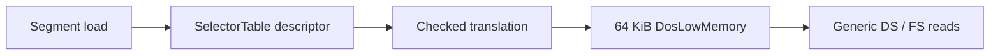

# DPMI selector와 low-memory model 작업 로그

## 변경

* 공용 `DosLowMemory` 64 KiB fixed backing과 checked little-endian read/write API를 추가했습니다.
* `SelectorTable`에 base/limit/overflow checked translation을 추가했습니다.
* Win32 `ThreadContext`가 selector table과 low-memory backing을 소유합니다.
* observed segment load는 provisional base-zero, limit `0xFFFF` descriptor를 등록합니다.
* generic DS dword와 FS word low-memory read를 descriptor translation 기반으로 교체했습니다.
* loader와 regression에 selector/low-memory summary를 추가했습니다.

## 보존한 경계

DOS environment scan은 아직 별도 synthetic view입니다. selector `0x2C`의 실제 descriptor base와 environment block 위치가 확인되지 않았으므로 offset zero low-memory backing과 합치지 않았습니다.

## 검증

PID 38696과 37604의 이전 loader가 기존 두 build executable을 잠그고 있어 `build/win32_x86_dpmi`를 새로 구성했습니다. 기존 local spdlog source를 사용해 network 없이 Win32/x86 build했습니다.

* Win32/x86 configure/build: 성공
* `dos4gw_hello`: `Hello, world!`
* PIU wrapper 실행: exit 0, bounded timeout
* selector table valid: true, descriptor count: 4
* DOS low memory valid: true, size: 65,536 bytes

# DPMI Selector and Low-Memory Model Work Log

Added shared checked selector translation and a fixed zero-initialized 64 KiB DOS low-memory backing. Observed segment loads register provisional base-zero descriptors; generic DS dword and FS word reads now require descriptor translation. The synthetic environment view remains separate because selector `0x2C` base and environment-block placement are not yet known. An alternate Win32/x86 build passed the hello sample and a bounded PIU execution with four descriptors and valid 65,536-byte low memory.
