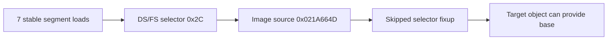

# Segment load provenance 작업 로그

## 변경

* observed segment load 최근 16개를 보존하는 allocation-free ring을 추가했습니다.
* relocated EIP, register, selector와 source를 chronological order로 출력합니다.
* regression에 trace summary 검증을 추가했습니다.

## 분석 결과

PIU 실행 4회에서 7개 sequence가 동일했습니다. DS는 `+0xF4DA2`, FS는 `+0xFC70D`에서 image source `0x021A664D`의 selector `0x2C`를 로드합니다. selector `0x24`도 별도 ES load에서 확인됐습니다.

relocation builder는 selector fixup을 적용하지 않고 원본 selector 값을 남깁니다. 따라서 해당 fixup의 target object와 relocated object region을 연결하면 descriptor base를 근거 있게 만들 수 있습니다.

## 검증

* `build/win32_x86_dpmi` Win32/x86 incremental build: 성공
* PIU wrapper 반복 4회: 동일 7-entry trace, bounded timeout
* 다섯 번째 timing variant는 wrapper가 2.5초에 종료해 orphan process를 남기지 않음

# Segment Load Provenance Work Log

Added a latest-16 segment-load ring. Four PIU runs produced the same seven events: DS and FS load selector `0x2C` from image address `0x021A664D`, and selector `0x24` appears in an ES load. Because selector fixups are currently skipped while original selector values remain, their target objects can provide evidence-based relocated descriptor bases.
