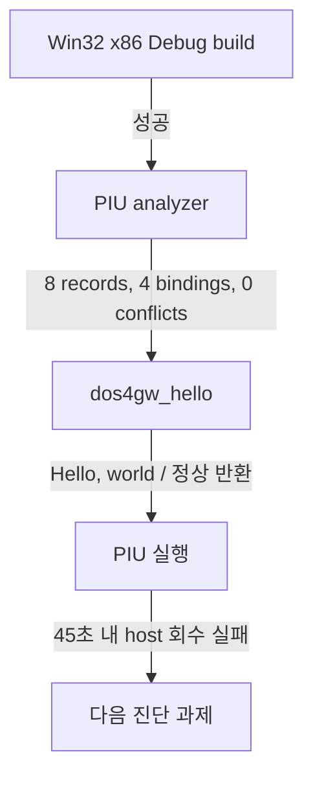

# DOS4GW LE selector binding 작업 로그

## 결과

* PIU.EXE MZ stub이 외부 `DOS4GW.EXE`를 DOS `EXEC`로 실행함을 확인했다.
* PIU 배포본 2개와 Open Watcom 도구의 DOS4GW.EXE가 크기와 SHA-256 모두 동일함을 확인했다.
* 결합 모듈 `LINEXE.EXP`의 object descriptor 루틴을 역어셈블했다.
* object마다 DPMI function `0000h`, `0007h`, `0008h`, `0009h`를 순서대로 호출함을 확인했다.
* 고정 selector 계산을 명시적인 `SelectorAllocator`로 대체했다.
* kind `0x03` 16:16 fixup에 target offset과 할당 selector를 기록했다.
* selector binding을 relocated placement와 실행 `SelectorTable`까지 전달했다.

## 검증

* `build/win32_x86_dpmi` Debug 빌드 성공
* PIU analyzer: selector binding record 8, binding 4, conflict 0, relocation failure 0
* `dos4gw_hello`: object 1=`0x1C`, object 2=`0x24`, `Hello, world!`, 정상 반환
* PIU: object 1~4가 `0x1C`, `0x24`, `0x2C`, `0x34`로 binding됨
* PIU는 실제 binding을 활성화한 뒤 45초 안에 내부 timeout 결과를 host로 반환하지 못해 외부에서 종료함

마지막 현상은 selector 배정 근거의 불확실성이 아니라, 실제 descriptor-backed read가 활성화된 이후 exception dispatch 또는 guest 진행 상태를 실행 중에 관찰할 수 없는 문제다. 다음 작업은 selector binding을 유지한 상태에서 live telemetry/watchdog를 추가해야 한다.

# DOS4GW LE Selector Binding Work Log

Confirmed that the PIU MZ stub executes external DOS4GW.EXE, and that both PIU copies are SHA-256-identical to the Open Watcom distribution binary. Reverse engineering of embedded `LINEXE.EXP` confirmed dynamic per-object DPMI descriptor allocation followed by base, limit, and access-right configuration. Replaced fixed selector arithmetic with `SelectorAllocator`, applied allocated selectors to kind-03 16:16 fixups, and carried bindings into execution.

The Win32 x86 Debug build succeeds. PIU analysis reports eight selector fixup records, four bindings, zero conflicts, and zero relocation failures. `dos4gw_hello` returns normally. PIU binds objects to `0x1C`, `0x24`, `0x2C`, and `0x34`, but does not return its internal timeout result within 45 seconds. The next task is live telemetry/watchdog instrumentation while preserving the confirmed selector model.
