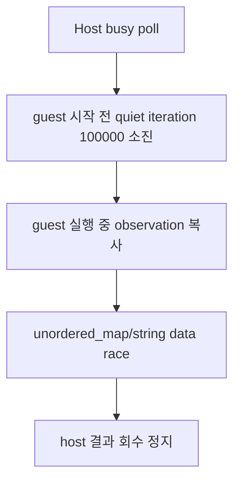

# 동일 프로세스 live execution telemetry 작업 로그

## 확인 결과

lock-free atomic heartbeat와 host poll live snapshot을 추가했다. 최초 실행에서는 poll 시작 snapshot만 출력되고 1초 snapshot은 없었다. 첫 poll iteration 전후 marker는 `GetExitCodeThread`와 atomic 판독이 모두 반환함을 증명했다.

원인은 guest 정지가 아니라 다음 timeout 처리 순서였다.

quiet 판정을 CPU 반복 횟수에서 1초의 wall-clock 정체 시간으로 변경하고 poll loop에 `Sleep(1)`을 추가했다. timeout에서는 guest thread를 종료하고 종료를 기다린 뒤 observation을 복사하도록 순서를 변경했다.

## 검증

* Win32 x86 Debug 빌드 성공
* `dos4gw_hello` 정상 반환 및 `Hello, world!` 유지
* PIU 3회 반복 실행 모두 외부 종료 없이 약 0.5초 안에 동일 결과 반환
* 세 실행 모두 exception dispatch entry/exit `28182/28182`, outstanding `0`
* 마지막 EIP 및 최종 access violation: relocated `0x020F7A71`
* 최종 register: EAX=`0x1008`, ESI=`0x0007B839`, opcode=`0x8B`

동일 프로세스 host poll과 telemetry가 정상 작동하고 data race 수정 후 결과를 안정적으로 회수하므로 별도 supervisor 프로세스로 전환할 증거는 없다.

# In-Process Live Execution Telemetry Work Log

Added lock-free heartbeat state and live host-poll snapshots. One-shot markers proved that the first `GetExitCodeThread` call and atomic reads returned normally. The apparent hang was caused by exhausting 100,000 quiet busy-loop iterations before the guest began reporting progress, followed by copying non-atomic maps and strings while the guest still modified them.

Quiet detection now uses one second of wall-clock inactivity with `Sleep(1)`. On timeout, the host terminates and joins the guest before copying observations. The Win32 x86 build and hello sample pass. Three PIU runs returned the same balanced 28,182 exception dispatches and final access violation at relocated `0x020F7A71`. In-process telemetry is sufficient; current evidence does not justify an external supervisor.
