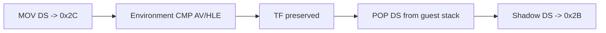

# shadow segment POP 동기화 작업 로그

정적 분석으로 `+0xF4DA2`의 `MOV DS,[far pointer]`, `+0xF4DD5`의 `POP DS` 쌍을 확인했다. 최초 POP handler만 추가했을 때 trace가 발생하지 않아 exception 흐름을 추가 분석했다.

`+0xF4DC1`의 environment CMP가 access violation HLE 경로로 처리될 때 TF가 복원되지 않아 이후 single-step이 끊기는 것이 상위 원인이었다. guest 예외 dispatch에서 single-step 모드의 TF를 보존하고, opcode `1F`를 32비트 stack 규칙으로 처리했다.

## 검증

* Win32 x86 Debug 빌드 성공
* `dos4gw_hello` 정상 반환
* segment trace #7: offset `+0xF4DD5`, DS=`0x2B`, source=`0x025D6E50`
* 기존 final fault `+0xF7A71` 경로 제거
* 새 frontier: `+0xF4E17`의 `REP STOSD`가 TF 상태에서 반복별 single-step을 발생시켜 약 121,983회의 균형 잡힌 dispatch 후 실행 timeout

# Shadow Segment POP Synchronization Work Log

Static analysis confirmed the MOV DS at `+0xF4DA2` and matching POP DS at `+0xF4DD5`. The first POP handler did not run because an environment CMP handled through the access-violation HLE path failed to restore TF, stopping subsequent single-step delivery. Preserving TF at guest exception-dispatch entry and handling observed opcode `1F` with 32-bit stack semantics restores shadow DS to `0x2B` from guest stack source `0x025D6E50`.

The previous final fault at `+0xF7A71` disappears. The next frontier is `REP STOSD` at `+0xF4E17`, which generates per-iteration single-step dispatches under TF and reaches the execution timeout after approximately 121,983 balanced dispatches.
