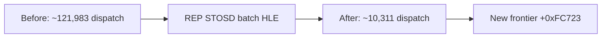

# 연속 segment load와 REP STOSD 작업 로그

segment load handler가 연속된 지원 명령을 같은 dispatch에서 처리하도록 변경했다. `+0xF4D91`의 DS=`0x2B` 다음 `+0xF4D93`의 ES=`0x2B`가 trace에 추가되어 shadow ES 복원이 확인됐다.

관찰된 `F3 AB`는 EAX=0, DF=0, 전체 destination이 guest arena에 포함될 때만 `memset`으로 일괄 처리한다. EDI는 byte count만큼 증가하고 ECX는 0, EIP는 2 증가한다.

## 검증

* Win32 x86 Debug 빌드 성공
* hello sample 정상 유지
* segment trace에 `+0xF4D93`, ES=`0x2B` 추가
* `+0xF4E17` 반복별 single-step 병목 제거
* 새 last guest single-step EIP `+0xFC723`
* 새 증거: `+0xFC717 MOV EAX,FS`가 native FS=`0x53`을 읽고 `+0xFC71F MOV ES,EAX`가 shadow ES=`0x53`으로 오염시킴

# Adjacent Segment Loads and REP STOSD Work Log

The segment-load handler now consumes adjacent supported loads in one dispatch, adding the missing ES=`0x2B` restoration at `+0xF4D93`. The observed EAX-zero, DF-clear `F3 AB` is batched with a checked guest-arena span, updating EDI, ECX, and EIP with x86 semantics. Dispatch volume drops from approximately 121,983 to 10,311 and execution reaches `+0xFC723`.

The next confirmed issue is native `MOV EAX,FS` at `+0xFC717`, which reads Win32 FS=`0x53` instead of shadow FS=`0x2C`; the following MOV ES stores the wrong selector into shadow ES.
