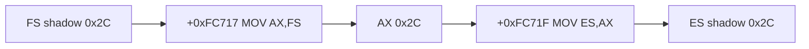

# shadow segment register store 작업 로그

opcode `8C /r`, ModR/M `mod=3` 형식을 decode하여 shadow segment selector를 목적 범용 register 하위 16비트에 기록하도록 했다.

## 검증

* Win32 x86 Debug 빌드 성공
* `+0xFC717` segment store 관찰
* segment trace #10이 ES=`0x53`에서 ES=`0x2C`로 교정됨
* 다음 frontier는 `+0xFC723`의 `26 3A 10`과 후속 `26 8A 30` ES override byte compare/load

# Shadow Segment Register Store Work Log

Added decoding for register-direct opcode-8C forms and write the shadow segment selector into the destination general register's low 16 bits. At `+0xFC717`, MOV AX,FS now produces AX=`0x2C`, and the following MOV ES,AX records ES=`0x2C` instead of leaked Win32 selector `0x53`. The next frontier is the ES-override byte compare/load sequence `26 3A 10` and `26 8A 30` at `+0xFC723`.
