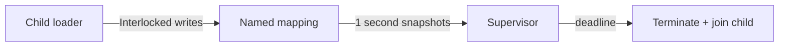

# 외부 telemetry supervisor 작업 로그

named file mapping 기반 shared telemetry와 `repiu_supervisor_win32`를 추가했다. loader는 환경 변수로 mapping을 열고 host phase, heartbeat, dispatch entry/exit, exception code, last EIP/guest EIP, guest EAX/ESP와 handler phase를 interlocked write한다.

## 검증

* Win32 x86 Debug 빌드 및 supervisor target 성공
* `repiu_supervisor_win32 dos4gw_hello 3000`: Hello World, child exit 0, terminated=false
* `repiu_supervisor_win32 piu_1st 3000`: child 정지 중에도 1초 snapshot 회수, deadline 종료 및 join 성공
* 초기 정지는 single-step이 TF 상태로 host recovery에 전달된 문제로 확인하여 unhandled capture 전에 TF를 제거함
* 이후 최종 snapshot은 exception `0xC0000374`, last guest EIP `+0x1E16A`, EAX `0x026E3578`을 확인

PIU runtime arena end는 `0x026D7000`이므로 EAX는 arena 밖 약 `0xC578`에 있다. 다음 결정은 allocator 객체를 위해 실제 arena를 확장할지, arena 밖 객체를 독립 backing으로 모델링할지다.

# External Telemetry Supervisor Work Log

Added named-file-mapping shared telemetry and `repiu_supervisor_win32`. The loader publishes host phase, heartbeat, dispatch entry/exit counts, exception code, last EIP/guest EIP, guest EAX/ESP, and handler phase using interlocked writes. The supervisor recovers one-second snapshots independently, terminates the child at its deadline, and joins it.

The hello sample exits normally without supervisor termination. PIU snapshots first exposed TF leaking into host recovery; clearing TF before unhandled capture then revealed heap corruption `0xC0000374`, last guest EIP `+0x1E16A`, and EAX=`0x026E3578`. This is about `0xC578` beyond runtime arena end `0x026D7000`. The next decision is real arena expansion versus independent backing for out-of-arena allocator objects.
