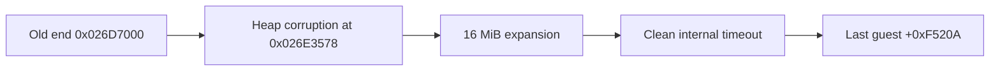

# 실제 contiguous runtime arena 확장 작업 로그

PIU runtime arena expansion slack을 1 MiB에서 16 MiB로 늘렸다. 전체 범위는 기존 placement 계약대로 실제 Win32 read/write memory로 reserve/commit되므로 원본 x86 allocator 객체가 shadow opcode 없이 직접 접근할 수 있다.

## 검증

* Win32 x86 Debug 빌드 성공
* arena reserve/placement size `0x015D7000`
* supervisor hello: child exit 0, terminated=false
* supervisor PIU: `0xC0000374` 제거, child 자체 timeout 반환, supervisor terminated=false
* exception dispatch `118438/118438`, outstanding 0
* last guest EIP `+0xF520A`는 정상 비교 함수의 종료 경로로, 새로운 fault 경계가 아니라 timeout 순간의 진행 위치

실제 contiguous backing이 allocator 경계를 해결했다. reserve/commit frontier 분리는 정확성에 필요한 다음 blocker가 아니라 메모리 사용 최적화이므로, 현재는 전체 commit을 유지한다.

# Contiguous Runtime Arena Expansion Work Log

Increased PIU runtime arena expansion from 1 MiB to 16 MiB. The full range remains real reserved/committed Win32 read/write memory, allowing original x86 allocator objects to execute without opcode-specific shadow backing. The arena size is `0x015D7000`.

The supervisor hello run exits normally. PIU no longer raises heap corruption `0xC0000374`; it returns its own bounded timeout with balanced 118,438/118,438 dispatches and no supervisor termination. Last guest EIP `+0xF520A` is a normal comparison-function exit path rather than a new fault. Separating reserve capacity from commit frontier is now an optimization, not an accuracy blocker, so full commit remains for the current stage.
