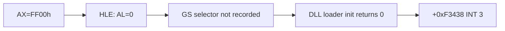

# DLL loader INT 21h AX=FF00h 역추적 작업 로그

## 결과

* arena `+0xF3438`을 object 2 `+0xE3438`로 변환하고 원본 LE bytes를 복원했다.
* 세 fatal 분기의 진단 문자열과 실행 시 `EDX`를 대조했다.
* 예외 `EDX=0x021A623C`로 `unable to initialize DLL loader` 분기를 확정했다.
* 초기화 함수가 사용하는 selector 전역을 `INT 21h AX=FF00h` 직후의 `GS` 저장 코드까지 역추적했다.
* 현재 임시 `AL=0` HLE 응답이 selector 저장을 막는 직접 원인임을 확인했다.

## 검증

* 15초 supervisor 재실행: 약 9.8초 후 동일 주소 도달.
* 예외 주소: `0x020F3438`.
* 예외 `EAX=0`, `EDX=0x021A623C`.
* supervisor: `child_exit=0`, `terminated=false`.

## 남은 결정

`AL`만 nonzero로 바꾸면 유효하지 않은 `GS:0x42`를 역참조하므로 아직 수정할 수 없다. DOS4GW private structure를 정적 역분석해 최소 모델을 만들거나, 실제 DOS4GW 실행에서 성공 반환 상태와 구조를 캡처해야 한다.

# DLL Loader INT 21h AX=FF00h Provenance Work Log

Converted arena `+0xF3438` to object 2 `+0xE3438`, recovered the original LE code, matched the three fatal messages against runtime registers, and confirmed the initialization branch through `EDX=0x021A623C`. Tracing the initializer global back to startup showed that the temporary `AX=FF00h -> AL=0` response prevents the original code from saving the DOS/4G private-environment selector from `GS`.

A repeated supervised run reached the same address with `EAX=0`, without forced termination. A fix cannot merely make `AL` nonzero because the code then dereferences a structure through `GS:0x42`. The next decision is between static recovery of the minimum private structure and capture from a real DOS4GW execution.
