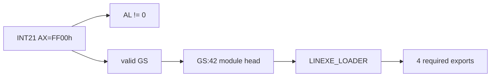

# DOS/4G private environment 분석 작업 로그

## 확인된 provider 동작

* PIU와 Open Watcom의 DOS4GW.EXE가 동일한 바이너리임을 기존 hash 근거와 다시 대조했다.
* 16-bit INT 21h router가 `AH=FFh`를 명시적으로 special dispatch에 포함한다.
* router는 `inc AH`로 `FFh`를 service index 0으로 변환한다.
* DOS4GW 안에 `DOS4G_GETENV`, `D32Int21HandlerDirect`, `DOS4G_DISPATCH` symbol 문자열이 존재한다.

## 확인된 consumer 구조

* `GS:0x42`는 첫 module record의 16:16 far pointer이다.
* module record는 next/name pointer, export count, export-table pointer를 가진다.
* export entry는 8 bytes이며 name far pointer와 dword value로 구성된다.
* PIU는 `LINEXE_LOADER` module에서 네 export 이름을 찾는다.
* 성공 계약은 consumer 기준 `AL != 0`과 valid `GS` selector를 모두 요구한다.

## 미확정과 다음 판단

결합된 DOS4GW 모듈은 여러 16-bit segment의 logical IP/file offset mapping을 사용한다. router service index 0까지는 확인했지만 provider target의 전체 반환 코드는 아직 확정하지 못했다. 따라서 정확한 nonzero `AL` 값과 synthetic `GS` selector를 구현하지 않았다.

다음 작업은 DOS4GW module directory/segment map을 먼저 복원해 service 0 target을 정확히 디스어셈블하는 것이다. 그 결과가 부족하면 실제 DOS4GW에서 `AX=FF00h` 직후 registers와 `GS:0x42` module chain을 캡처해야 한다.

# DOS/4G Private Environment Analysis Work Log

Confirmed that DOS4GW's 16-bit INT 21h router explicitly special-cases `AH=FFh` and converts it to service index zero by incrementing `AH`. The binary contains `DOS4G_GETENV`, `D32Int21HandlerDirect`, and `DOS4G_DISPATCH` symbols.

On the consumer side, `GS:0x42` is a 16:16 far pointer to a linked module record containing next/name pointers, an export count, and an export-table pointer. Eight-byte export entries contain a name far pointer and dword value. PIU locates `LINEXE_LOADER` and four required exports. The consumer proves that success requires both nonzero `AL` and a valid `GS` selector.

The combined DOS4GW image uses multiple 16-bit segment logical-IP/file mappings. The router's service-zero target is not yet fully mapped, so the exact nonzero `AL` value and synthetic `GS` selector were not implemented. The next step is to recover the module directory/segment map, falling back to an actual DOS4GW register and module-chain capture if static evidence remains insufficient.
