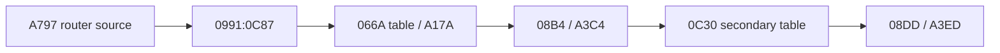

# DOS/16M loader symbolic replay 작업 로그

## 결과

* MZ load segment를 기호 `L`로 두고 relocation 78개의 `original + L` 식과 file provenance를 생성했다.
* BW selector image 16개를 file copy/BSS로 재구성하고 RSI-2 relocation 1,110개를 replay했다.
* `OPT_ROTATE`가 꺼져 selector mapping이 identity임을 확인했으며 변경 word 수는 0이다.
* 다섯 BW entry point를 모두 원본 file offset으로 연결했다.
* resident INT 21h router의 source file offset을 `0xA797`로 유일하게 찾았다.
* 가능한 2,650개 16:16 분해를 비교해 runtime `CS=L+0x0991`, `IP=0x0C87`을 유일하게 선택했다.
* `CS:0x066A` table을 file `0xA17A`, service 0 primary handler를 `0xA3C4`, secondary table index 0 handler를 `0xA3ED`로 복원했다.

## 검증

* replay report를 재생성하고 SHA-256 동일성을 확인했다.
* 두 Python 분석 도구가 syntax compile을 통과했다.
* router signature와 indirect jump가 MZ image에서 유일함을 도구가 검증한다.
* 선택된 primary table의 104개 target이 전부 resident image 내부의 유효 byte를 가리킨다.
* `git diff --check`를 통과했다.
* Win32 x86 Debug library, analyzer, loader, supervisor build가 성공했다.

## 다음 분석

runtime CS mapping 의사결정은 해소됐다. 다음에는 primary handler가 참조하는 saved frame의 offset 의미와 secondary dispatch index 생성 과정을 복원해 `AX=FF00h`, `DX=0078h` 경로의 실제 반환 `AL/EAX`, `GS`, flags를 확정해야 한다.

# DOS/16M Loader Symbolic Replay Work Log

Replayed all MZ and BW relocations with provenance, mapped all BW entries, and uniquely selected resident `CS=L+0x0991`, router `IP=0x0C87` from 2,650 candidates. The primary service table maps to file `0xA17A`, service zero to `0xA3C4`, and secondary index zero to `0xA3ED`. Report regeneration, Python syntax checks, structural invariants, diff checks, and all Win32 x86 Debug builds succeeded. The next analysis is saved-frame and return-value data flow for the exact `AX=FF00h`, `DX=0078h` path.
