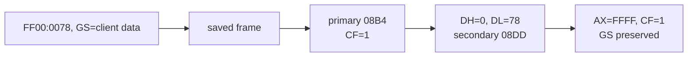

# DOS/4G service 0 frame/data-flow 작업 로그

## 결과

* wrapper `0846h`부터 router `0C9Eh`, primary `08B4h`, secondary `08DDh`, restore `0D18h`까지 연결했다.
* push/save/copy/restore 순서를 대조해 saved frame 전체 layout을 복원했다.
* 주요 field는 `BP+12h=DX`, `BP+16h=AX`, `BP+26h=EFLAGS`다.
* `AX=FF00h`, `DX=0078h`를 instruction 단위로 전파해 `AX=FFFFh`, CF=1 반환을 확정했다.
* GS는 전체 경로에서 save/write되지 않아 호출 전 DOS/4G client-data selector가 보존됨을 확인했다.
* symbolic replay report에 machine-readable frame과 identification trace를 추가했다.
* 코드에서 DOS/32A signature와 DOS4GW 원본 반환 계약을 별도 상수로 구분했다.

## 검증

* symbolic replay/trace report 재생성 SHA-256가 동일했다.
* primary handler의 carry-set opcode를 in-memory로 변경한 입력이 `primary handler no longer sets saved carry`로 거부됐다.
* `git diff --check`를 통과했다.
* Win32 x86 Debug library, analyzer, loader, supervisor가 모두 빌드됐다.

## 다음 단계

반환 register 계약은 확정됐다. 정상 경로 구현을 위해 남은 핵심은 preserved GS selector가 가리키는 client-data segment의 생성과 `GS:0x42` module chain population을 provider 측에서 역추적하는 것이다. 이 구조가 준비되기 전에는 HLE가 `AX=FFFFh`, CF=1만 반환해서는 안 된다.

# DOS/4G Service-Zero Frame/Data-Flow Work Log

Recovered the complete saved frame and traced `AX=FF00h`, `DX=0078h` through wrapper, router, primary, secondary, and restore code. Original DOS4GW returns low `AX=FFFFh`, carry set, preserves DX, and leaves the existing client-data GS untouched. The replay report now contains a machine-readable frame and call trace; handler drift is rejected, the report is reproducible, diff checks pass, and all Win32 x86 Debug targets build. The remaining prerequisite is provider-side client-data creation and `GS:0x42` module-chain population.
