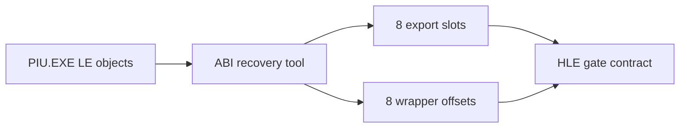

# LINEXE HLE 호출 게이트 ABI 복원 작업 로그

## 결과

PIU LE 객체를 재구성하여 LINEXE 이름/결과 슬롯 여덟 개와 대응 래퍼를 확인했습니다. 재현 도구 `tools/analysis/piu_linexe_call_gate_abi.py`는 객체 배치, 문자열, 래퍼 prologue가 예상 증거와 일치하지 않으면 실패합니다.

검증:

* 분석 도구를 원본 `PIU.EXE`에 실행하여 여덟 항목을 모두 출력했습니다.
* `git diff --check`를 통과했습니다.
* 런타임 코드는 아직 변경하지 않았으므로 빌드는 생략했습니다.

# LINEXE HLE Call-Gate ABI Recovery Work Log

Reconstructed the PIU LE objects and confirmed all eight LINEXE name/result slots and wrapper offsets. The reproducible analysis tool fails closed when the object layout, strings, or wrapper prologues differ from the verified evidence. The tool and `git diff --check` passed; no runtime code changed, so a build was not required.
