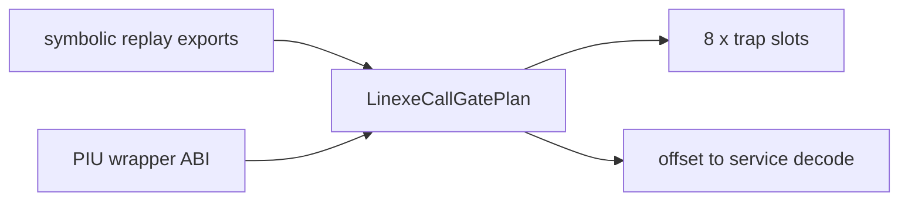

# LINEXE 합성 게이트 계획 구현 작업 로그

## 결과

플랫폼 독립적인 `LinexeCallGatePlan`을 추가했습니다. 복원된 selector 세 개와 export 여덟 개를 원자적인 계획으로 만들며, 각 합성 슬롯은 `UD2`, 서비스 태그, padding으로 구성됩니다. 원본 export offset은 DOS/16M symbolic replay 결과와 대조했습니다.

이번 변경은 아직 `AX=FF00h` 성공 응답을 활성화하지 않습니다. 실제 private data를 둘 예약 주소가 runtime arena allocator와 겹치지 않는다는 계약을 먼저 추가해야 하기 때문입니다. 불완전한 환경 노출을 방지하기 위해 계획 생성과 디코딩까지만 연결 가능한 공용 계층으로 분리했습니다.

검증은 `scripts/build_win32_x86.bat`의 Win32 x86 Debug 전체 빌드로 수행했으며 성공했습니다.

# LINEXE Synthetic Gate Plan Work Log

Added a platform-neutral atomic plan for the three recovered selectors and eight LINEXE exports. Each synthetic slot contains `UD2`, a service tag, and padding. Original export offsets were checked against symbolic replay evidence. Identification remains disabled until the runtime arena provides an explicitly owned, non-overlapping private-data reservation.

The full Win32 x86 Debug build passed via `scripts/build_win32_x86.bat`.
