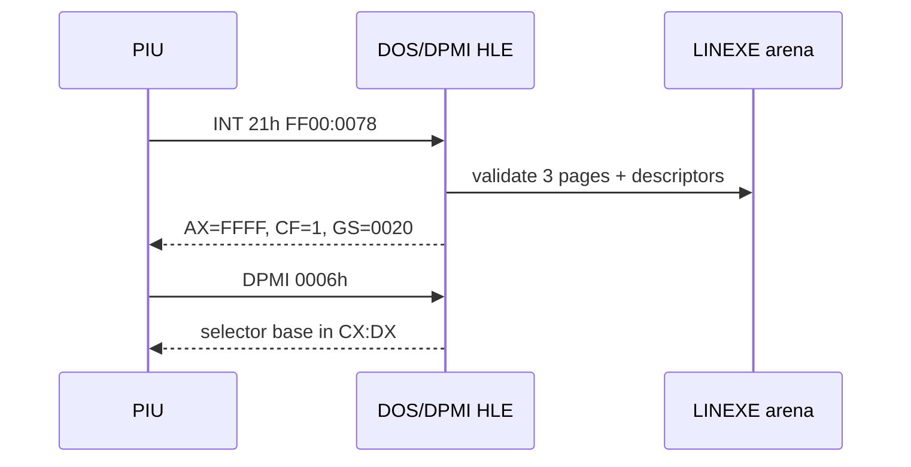

# LINEXE 전용 arena 예약 작업 로그

## 구현

* relocated HLE reserve base에서 client/private/gate 세 페이지 layout을 계산했습니다.
* `0020:0042 -> 0090:059A`, module record, 여덟 export table과 이름을 생성했습니다.
* export value를 `0080h` 합성 gate offset에 연결했습니다.
* placement를 통해 HLE base와 arena end를 실행 context에 전달했습니다.
* 세 descriptor와 페이지 보호가 모두 성공한 경우에만 DOS/4GW 식별 응답을 활성화했습니다.
* 이어서 관찰된 DPMI selector base 조회/설정 `0006h/0007h`를 구현했습니다.

## 검증

* `scripts/build_win32_x86.bat`: 성공
* `repiu_supervisor_win32.exe piu_1st 20000`: descriptor 7개 확인
* DPMI `0006h` blocker `+0xE4D10`을 통과하고 새 frontier `+0xE4DC4` 확인

# LINEXE-Owned Arena Reservation Work Log

Implemented three owned arena pages, the client root, module/export private data, synthetic gate pointers, descriptor installation, and atomic DOS/4GW identification. Added observed DPMI selector-base functions `0006h/0007h`. The Win32 x86 build passed, runtime showed seven descriptors, and execution advanced from `+0xE4D10` to the new `LODSB` frontier at `+0xE4DC4`.
